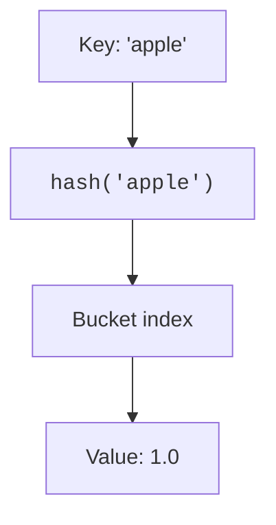

A `dict` maps **keys** to **values**. Lookups, insertions, and deletions are all average-case O(1). Dictionaries are everywhere in Python: JSON decoding produces dicts, function `**kwargs` are dicts, object `__dict__` attributes are dicts, module globals live in a dict, configuration files parse to dicts. **Dictionaries _are_ Python.** Understanding them deeply is not optional.

Every snippet on this page runs in your browser — no setup required.

## How dictionaries work

Under the hood, a dict is a **hash table**: Python computes a hash of your key, uses that to find a bucket, and stores the key-value pair there. Hash collisions are handled with open addressing. This gives O(1) average-case access.

<Callout type="info" title="Dicts are Python's superpower">
Python's dict implementation is one of the fastest in any dynamic language. The entire language runtime is built on dicts: every module's namespace, every object's attributes, every function's keyword arguments. When you write `obj.attr`, Python is doing `obj.__dict__['attr']` behind the scenes. Dicts are the engine of Python.
</Callout>

## Creating dicts

The simplest dict is written with curly braces, separating `key: value` pairs with commas.

<CodeBlock
  adapter="python"
  starterCode={`empty = {}
print(empty)
`}
/>

<CodeBlock
  adapter="python"
  starterCode={`person = {"name": "Ada", "year": 1815}
print(person)
`}
/>

The `dict()` constructor accepts keyword arguments or an iterable of `(key, value)` pairs.

<CodeBlock
  adapter="python"
  starterCode={`also_person = dict(name="Ada", year=1815)
print(also_person)
`}
/>

<CodeBlock
  adapter="python"
  starterCode={`from_pairs = dict([("a", 1), ("b", 2), ("c", 3)])
print(from_pairs)
`}
/>

## Accessing values

Use `[]` to access a value by key.

<CodeBlock
  adapter="python"
  starterCode={`person = {"name": "Ada", "year": 1815}
print(person["name"])
`}
/>

Missing keys raise a `KeyError`.

<CodeBlock
  adapter="python"
  starterCode={`person = {"name": "Ada", "year": 1815}
try:
    print(person["email"])
except KeyError as e:
    print("KeyError:", e)
`}
/>

`.get` returns `None` (or a default you provide) instead of raising.

<CodeBlock
  adapter="python"
  starterCode={`person = {"name": "Ada", "year": 1815}
print(person.get("email"))
`}
/>

<CodeBlock
  adapter="python"
  starterCode={`person = {"name": "Ada", "year": 1815}
print(person.get("email", "no email on file"))
`}
/>

<Callout type="info" title="get vs []">
Use `d[key]` when the key must exist (and you want to crash if it doesn't). Use `d.get(key, default)` when the key might be missing and you have a sensible fallback. Both are idiomatic; pick the one that matches your intent.
</Callout>

## Updating

Assign through `[]` to add or overwrite a key.

<CodeBlock
  adapter="python"
  starterCode={`person = {"name": "Ada"}
person["year"] = 1815
print(person)
`}
/>

<CodeBlock
  adapter="python"
  starterCode={`person = {"name": "Ada", "year": 1815}
person["year"] = 1816
print(person)
`}
/>

`.update` merges in another dict or iterable of pairs.

<CodeBlock
  adapter="python"
  starterCode={`person = {"name": "Ada"}
person.update({"role": "mathematician", "year": 1815})
print(person)
`}
/>

Delete a key with `del` or `.pop`.

<CodeBlock
  adapter="python"
  starterCode={`person = {"name": "Ada", "year": 1815}
del person["year"]
print(person)
`}
/>

<CodeBlock
  adapter="python"
  starterCode={`person = {"name": "Ada", "year": 1815, "role": "mathematician"}
removed = person.pop("role")
print("removed:", removed)
print("person:", person)
`}
/>

## Iterating

By default, iteration yields keys.

<CodeBlock
  adapter="python"
  starterCode={`prices = {"apple": 1.0, "banana": 0.5, "cherry": 3.0}
for fruit in prices:
    print(fruit)
`}
/>

`.items()` gives `(key, value)` pairs.

<CodeBlock
  adapter="python"
  starterCode={`prices = {"apple": 1.0, "banana": 0.5, "cherry": 3.0}
for fruit, price in prices.items():
    print(f"{fruit}: \${price:.2f}")
`}
/>

`.values()` gives just the values.

<CodeBlock
  adapter="python"
  starterCode={`prices = {"apple": 1.0, "banana": 0.5, "cherry": 3.0}
print(list(prices.values()))
`}
/>

<Callout type="info" title="Insertion order is preserved">
Since Python 3.7, dicts officially preserve insertion order. The first item you put in is the first one you see when iterating. Before 3.7, dict order was undefined (though CPython 3.6 had ordered dicts as an implementation detail). This change was a huge quality-of-life improvement.
</Callout>

<CodeBlock
  adapter="python"
  starterCode={`d = {}
for k in "python":
    d[k] = k.upper()
print(d)
`}
/>

## Keys must be hashable

Keys can be any **hashable** type: strings, numbers, booleans, tuples-of-hashables, frozensets. Lists, sets, and dicts are mutable and therefore not hashable.

<CodeBlock
  adapter="python"
  starterCode={`good = {("x", 1): "ok", 42: "also ok", "hi": "yep"}
print(good)
`}
/>

<CodeBlock
  adapter="python"
  starterCode={`try:
    bad = {[1, 2]: "nope"}
except TypeError as e:
    print("TypeError:", e)
`}
/>

<Callout type="warn">
The requirement is **hashability**, not immutability. A custom class can be mutable yet hashable if it defines `__hash__` and `__eq__` (though that is rarely a good idea). Conversely, not all immutable types are hashable (e.g., `tuple` containing a list is immutable but not hashable).
</Callout>

## Merging dicts (Python 3.9+)

The `|` operator creates a new dict; the right operand wins on conflicts.

<CodeBlock
  adapter="python"
  starterCode={`a = {"x": 1, "y": 2}
b = {"y": 99, "z": 3}
print(a | b)
`}
/>

`|=` mutates in place.

<CodeBlock
  adapter="python"
  starterCode={`a = {"x": 1, "y": 2}
b = {"y": 99, "z": 3}
a |= b
print(a)
`}
/>

Before Python 3.9, use `.update()` or `{**a, **b}`.

<CodeBlock
  adapter="python"
  starterCode={`a = {"x": 1, "y": 2}
b = {"y": 99, "z": 3}
merged = {**a, **b}
print(merged)
`}
/>

## Counting and grouping

`collections.Counter` and `collections.defaultdict` cover two of the most common dict patterns.

<CodeBlock
  adapter="python"
  starterCode={`from collections import Counter

text = "to be or not to be that is the question to be"
freq = Counter(text.split())
print(freq)
print(freq.most_common(3))
`}
/>

<CodeBlock
  adapter="python"
  starterCode={`from collections import defaultdict

words = ["apple", "ant", "banana", "berry", "cherry"]
groups = defaultdict(list)
for w in words:
    groups[w[0]].append(w)
print(dict(groups))
`}
/>

## JSON interop

Dicts and JSON objects share syntax for a reason. The `json` module converts both ways.

<CodeBlock
  adapter="python"
  starterCode={`import json

person = {"name": "Ada", "year": 1815, "skills": ["math", "logic"]}
text = json.dumps(person, indent=2)
print(text)
`}
/>

<CodeBlock
  adapter="python"
  starterCode={`import json

text = '{"name": "Ada", "year": 1815}'
restored = json.loads(text)
print(restored)
print(type(restored))
`}
/>

<Callout type="info">
Every web API you call returns JSON, which Python decodes into dicts and lists. Every config file format (JSON, YAML, TOML) parses to nested dicts. Learning dicts is learning how to work with structured data in Python.
</Callout>

## Challenges

<ChallengeCard
  adapter="python"
  title="Word frequency"
  instructions={`Define a function \`word_freq(sentence)\` that returns a dict mapping each lowercase word in \`sentence\` to its frequency. Split on whitespace and treat words case-insensitively. For example, \`word_freq("To be or not to be")\` returns \`{"to": 2, "be": 2, "or": 1, "not": 1}\`.`}
  starterCode={`def word_freq(sentence):
    # your code here
    return {}
`}
  solutionCode={`def word_freq(sentence):
    freq = {}
    for word in sentence.lower().split():
        freq[word] = freq.get(word, 0) + 1
    return freq
`}
  tests={[
    {
      id: "basic",
      name: "Counts 'to be or not to be'",
      code: `assert word_freq("To be or not to be") == {"to": 2, "be": 2, "or": 1, "not": 1}`,
    },
    {
      id: "empty",
      name: "Empty string returns empty dict",
      code: `assert word_freq("") == {}`,
    },
    {
      id: "case",
      name: "Case-insensitive",
      code: `assert word_freq("A a A") == {"a": 3}`,
    },
  ]}
/>

<ChallengeCard
  adapter="python"
  title="Invert a dict"
  instructions={`Define \`invert(d)\` that swaps keys and values of \`d\`. You may assume all values are unique and hashable. For example, \`invert({"a": 1, "b": 2})\` returns \`{1: "a", 2: "b"}\`.`}
  starterCode={`def invert(d):
    # your code here
    return {}
`}
  solutionCode={`def invert(d):
    return {v: k for k, v in d.items()}
`}
  tests={[
    {
      id: "basic",
      name: "Basic swap",
      code: `assert invert({"a": 1, "b": 2}) == {1: "a", 2: "b"}`,
    },
    {
      id: "empty",
      name: "Empty dict",
      code: `assert invert({}) == {}`,
    },
    {
      id: "preserves_pairs",
      name: "Round trip recovers original",
      code: `d = {"x": 10, "y": 20}; assert invert(invert(d)) == d`,
    },
  ]}
/>

<ChallengeCard
  adapter="python"
  title="Merge overlapping keys"
  instructions={`Define a function \`merge_sum(d1, d2)\` that returns a new dict containing all keys from \`d1\` and \`d2\`. For keys that appear in both, sum the values. For example:

\`\`\`python
merge_sum({"a": 1, "b": 2}, {"b": 3, "c": 4})
# returns {"a": 1, "b": 5, "c": 4}
\`\`\`

Assume all values are numbers.`}
  starterCode={`def merge_sum(d1, d2):
    # your code here
    return {}
`}
  solutionCode={`def merge_sum(d1, d2):
    result = d1.copy()
    for k, v in d2.items():
        result[k] = result.get(k, 0) + v
    return result
`}
  tests={[
    {
      id: "basic",
      name: "Merges and sums overlaps",
      code: `assert merge_sum({"a": 1, "b": 2}, {"b": 3, "c": 4}) == {"a": 1, "b": 5, "c": 4}`,
    },
    {
      id: "no_overlap",
      name: "No overlap is just union",
      code: `assert merge_sum({"a": 1}, {"b": 2}) == {"a": 1, "b": 2}`,
    },
    {
      id: "empty",
      name: "Empty dicts",
      code: `assert merge_sum({}, {"x": 5}) == {"x": 5}`,
    },
  ]}
/>

<MultipleChoice
  markdown={`Which of these can be used as dictionary keys?

- \`"hello"\`
  > Strings are hashable, so yes.
- \`[1, 2, 3]\`
  > Lists are mutable and not hashable, so no.
- [o] \`(1, 2, 3)\`
  > Tuples of hashables are hashable.
- \`{"a": 1}\`
  > Dicts are mutable and not hashable, so no.`}
/>

<MultipleChoice
  markdown={`What does the following code print?

\`\`\`python
d = {"a": 1, "b": 2}
d.setdefault("a", 99)
d.setdefault("c", 3)
print(d)
\`\`\`

- \`{"a": 99, "b": 2, "c": 3}\`
  > \`setdefault\` only writes when the key is missing.
- [o] \`{"a": 1, "b": 2, "c": 3}\`
  > \`a\` already exists so it is untouched; \`c\` is added.
- \`{"a": 1, "b": 2}\`
  > \`c\` is missing, so it is added.
- A \`KeyError\`
  > \`setdefault\` never raises KeyError.`}
/>

<MultipleChoice
  markdown={`What is the time complexity of \`key in d\` where \`d\` is a dict?

- [o] O(1) average case
  > Dicts use hash tables, giving O(1) average-case lookup.
- O(n)
  > That would be true for a list, not a dict.
- O(log n)
  > Dicts are not sorted; they use hashing, not binary search.
- O(n²)
  > Dict lookup is much faster than quadratic.`}
/>

<MultipleChoice
  markdown={`Since Python 3.7, what is guaranteed about dict iteration order?

- It is undefined and can change between runs.
  > That was true before 3.7, but not anymore.
- Sorted by key alphabetically.
  > Dicts preserve insertion order, not sorted order.
- [o] Insertion order is preserved.
  > The first item inserted is the first one you see when iterating.
- Sorted by value.
  > Dicts do not sort by value automatically.`}
/>

Next up: sets, the close cousin of dictionaries.
