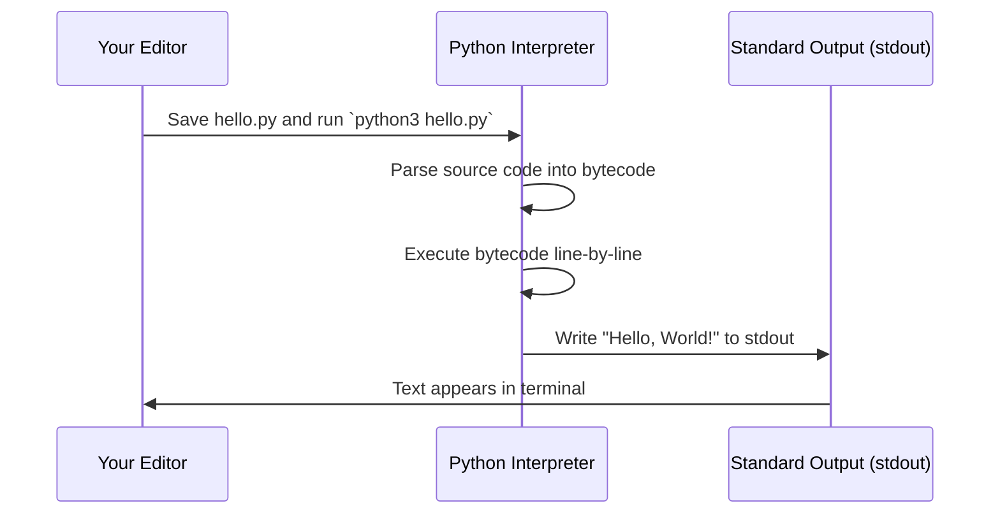

Tradition demands that the first program in any language print the
words "Hello, World!". Python makes that exactly as short as you would
hope.

<CodeBlock
  adapter="python"
  files={[
    {
      filename: "main.py",
      starterCode: `print("Hello, World!")
`,
    },
  ]}
/>

That is the entire program. No `main`, no semicolons, no header
files, no compilation step. Just one line.

## Why "Hello, World"?

The phrase dates back to Brian Kernighan's 1972 tutorial for the B
programming language, which later appeared in the classic book *The C
Programming Language* (1978). It has been the ritual first program ever
since. The choice is practical: printing output is the simplest form of
**input/output (I/O)**, and every program is fundamentally about I/O —
reading data, transforming it, and writing results. `print` is your
first taste of that loop.

## How it works: source to output

When you write a Python program and run it, here is what happens:

The Python interpreter reads your source code, compiles it to bytecode
(a lower-level representation), and executes it instruction by
instruction. When it hits `print(...)`, it writes to **standard
output** — usually your terminal.

## The `print` function

`print` is a built-in function that writes its arguments to standard
output. It is more flexible than it might look at first.

### Multiple arguments

<CodeBlock
  adapter="python"
  files={[
    {
      filename: "main.py",
      starterCode: `# Multiple arguments are joined with spaces.
print("Hello,", "World!")
`,
    },
  ]}
/>

### Changing the separator

<CodeBlock
  adapter="python"
  files={[
    {
      filename: "main.py",
      starterCode: `# 'sep' changes the separator.
print("2025", "11", "30", sep="-")
`,
    },
  ]}
/>

### Changing the ending

<CodeBlock
  adapter="python"
  files={[
    {
      filename: "main.py",
      starterCode: `# 'end' changes what is appended (default is "\\n").
print("loading", end="...")
print("done")
`,
    },
  ]}
/>

### Printing any object

You can print numbers, lists, dictionaries, and most other objects
directly. Python will call `str(obj)` on each argument:

<CodeBlock
  adapter="python"
  files={[
    {
      filename: "main.py",
      starterCode: `print(42)
print([1, 2, 3])
print({"name": "Ada", "year": 1815})
print(3.14, type(3.14))
`,
    },
  ]}
/>

## Comments

Comments start with `#` and run to the end of the line. Python has no
native multi-line comment syntax; people sometimes use triple-quoted
string literals for that, but a string is not the same as a comment.

<CodeBlock
  adapter="python"
  files={[
    {
      filename: "main.py",
      starterCode: `# This is a comment. The interpreter skips it.
x = 1 + 2  # Comments can sit at the end of a line, too.

print(x)
`,
    },
  ]}
/>

### Why not multi-line comments?

Many languages have `/* ... */` or `(* ... *)` for multi-line comments.
Python does not, by design. Guido's rationale was that long comments
should be broken into shorter lines anyway for readability, and
triple-quoted strings serve the "comment out a block" use case well
enough.

<CodeBlock
  adapter="python"
  files={[
    {
      filename: "main.py",
      starterCode: `"""
This is a string literal, not a comment.
Python does evaluate it, then immediately throws it away
because nothing keeps a reference. It is fine for short
notes at the top of a file, but '#' is the real comment.
"""

x = 10
print(x)
`,
    },
  ]}
/>

## Docstrings

A string at the very top of a module, function, or class is called a
**docstring**. Tools like `help()`, IDEs, and the `pydoc` command read
these to show documentation.

<CodeBlock
  adapter="python"
  files={[
    {
      filename: "main.py",
      starterCode: `def add(a, b):
    """Return the sum of two numbers."""
    return a + b

help(add)
`,
    },
  ]}
/>

Docstrings are a convention, not a language feature, but they are so
ubiquitous that Python treats them specially: they are stored in the
`__doc__` attribute of the object.

<Callout type="info" title="PEP 257: Docstring conventions">
[PEP 257](https://peps.python.org/pep-0257/) lays out the conventions:
use triple double-quotes `"""like this"""`, write a one-line summary
first, and add details in subsequent paragraphs. Most documentation
generators (Sphinx, MkDocs, pdoc) parse these docstrings to build API
references.
</Callout>

## Your first challenges

<ChallengeCard
  adapter="python"
  title="Greet a name"
  instructions={`Write a single \`print\` call that outputs exactly:

\`\`\`
Hello, Grace!
\`\`\`

Do not hardcode the literal string \`"Hello, Grace!"\`; instead, define a
variable \`name = "Grace"\` and use it in your \`print\` call. You can use
string concatenation, f-strings, or \`.format()\`.`}
  files={[
    {
      filename: "main.py",
      starterCode: `name = "Grace"
# your code here
`,
      solutionCode: `name = "Grace"
print(f"Hello, {name}!")
`,
    },
  ]}
  tests={[
    {
      id: "exact_output",
      name: "Prints the right greeting",
      expect: {
        stdoutLines: ["Hello, Grace!"],
        stdoutLinesExact: true,
      },
    },
  ]}
/>

<ChallengeCard
  adapter="python"
  title="Print with custom separator"
  instructions={`Use a single \`print\` call to output:

\`\`\`
apple:banana:cherry
\`\`\`

Pass three separate arguments to \`print\` (not one concatenated string) and use the \`sep\` parameter to join them with \`":"\`.`}
  files={[
    {
      filename: "main.py",
      starterCode: `# your code here
`,
      solutionCode: `print("apple", "banana", "cherry", sep=":")
`,
    },
  ]}
  tests={[
    {
      id: "separator_output",
      name: "Prints with colon separator",
      expect: {
        stdoutLines: ["apple:banana:cherry"],
        stdoutLinesExact: true,
      },
    },
  ]}
/>

## Test your knowledge

<MultipleChoice
  markdown={`What does the following snippet print?

\`\`\`python
print("a", "b", "c", sep="-", end="!")
\`\`\`

- \`a b c\`
  > The default \`sep\` is a single space, but here it has been overridden to \`"-"\`.
- \`a-b-c\\n\`
  > \`end\` was overridden too, so there is no trailing newline.
- [o] \`a-b-c!\`
  > Items are joined by \`sep\` and \`end\` is appended after them.
- \`a-b-c!\\n\`
  > The default \`end\` is \`"\\n"\`, but it was overridden to \`"!"\`.`}
/>

<MultipleChoice
  markdown={`What is a docstring?

- A comment that starts with \`#\`
  > That is a regular comment, not a docstring.
- Any triple-quoted string in the code
  > Not quite. It must be the first statement in a module, function, or class.
- [o] A string literal at the top of a module, function, or class, used for documentation
  > Docstrings are stored in \`__doc__\` and read by \`help()\` and documentation tools.
- A string that is never executed
  > All string literals are evaluated, but docstrings are retained for introspection.`}
/>

<MultipleChoice
  markdown={`Which of the following is the correct way to print "Hello" without a trailing newline?

- \`print("Hello", newline=False)\`
  > The parameter is named \`end\`, not \`newline\`.
- \`print("Hello", end="\\n")\`
  > \`end="\\n"\` is already the default, so this still prints a trailing newline.
- [o] \`print("Hello", end="")\`
  > Setting \`end=""\` removes the newline.
- \`print("Hello", sep="")\`
  > \`sep\` controls how multiple arguments are joined, not the ending.`}
/>

You have run code, written a comment, and added a docstring. Next we
will look at why those four spaces of indentation matter so much.
