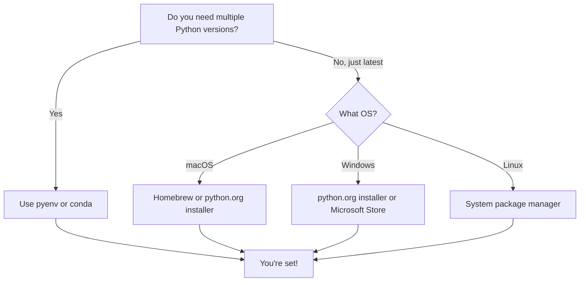

You do not strictly need to install anything to work through this
course: every code block on every page runs in your browser with no
setup required. That said, sooner or later you will want a local Python
so you can run scripts, install third-party libraries, and integrate
with your editor.

## Picking a version

Always install the **latest stable Python 3** (3.13 at the time of
writing) unless a specific project pins you to an older version.

<Callout type="warn" title="Python 2 is end-of-life">
Python 2 reached end-of-life on January 1, 2020. No security patches,
no bug fixes, and most libraries have dropped support. If you find
Python 2 still installed on your system, it is there for legacy reasons
only. **Do not use it for new projects.**
</Callout>

## Which install method should you use?



## Installing Python

Pick the option that matches your operating system.

### macOS

The Python that ships with macOS is for the system, not for you. Use
one of:

- **python.org installer.** Download from
  [python.org/downloads](https://www.python.org/downloads/) and run
  the `.pkg`. This is the simplest option for most users.
- **Homebrew.** `brew install python` installs the latest 3.x and adds
  `python3` and `pip3` to your `PATH`.
- **pyenv.** `brew install pyenv` then `pyenv install 3.13.2`. This
  lets you switch versions per project and is the gold standard for
  Python developers juggling multiple projects.

<Callout type="info" title="Why pyenv on macOS?">
macOS ships with an old Python 2.7 (or a system-managed Python 3) that
you should never modify. `pyenv` installs Python versions in your home
directory and lets you switch between them with a single command:
`pyenv global 3.13.2` or `pyenv local 3.11.4` for a specific project.
</Callout>

### Windows

- Download the installer from
  [python.org/downloads](https://www.python.org/downloads/).
- **Check "Add python.exe to PATH"** on the first screen of the
  installer. This is the single most common gotcha. Without it, the
  `python` command will not work from the terminal.
- Alternatively, install from the **Microsoft Store**, which keeps
  Python updated automatically and handles the PATH for you.

### Linux

Most distributions ship a recent Python in their package manager:

```bash
# Debian/Ubuntu
sudo apt install python3 python3-pip python3-venv

# Fedora
sudo dnf install python3 python3-pip

# Arch
sudo pacman -S python python-pip
```

For full version control, install `pyenv` and let it manage multiple
side-by-side interpreters:

```bash
# Install pyenv via its install script
curl https://pyenv.run | bash

# Add to your shell config (.bashrc, .zshrc, etc.)
export PATH="$HOME/.pyenv/bin:$PATH"
eval "$(pyenv init --path)"
eval "$(pyenv init -)"

# Install a Python version
pyenv install 3.13.2
pyenv global 3.13.2
```

## Verifying the install

Open a terminal and run:

```bash
python3 --version
pip3 --version
```

You should see something like `Python 3.13.2` and a matching `pip`
version. On Windows the commands are `python` and `pip` (without the
`3` suffix).

<Callout type="info">
If `python3` is not found, the installer may not have added it to your
PATH. On Windows, re-run the installer and check the "Add to PATH" box.
On macOS/Linux, check that the install directory is in your `$PATH`.
</Callout>

## The REPL

Running `python3` with no arguments drops you into the **REPL** (read,
eval, print, loop), an interactive interpreter:

```text
$ python3
Python 3.13.2 (main, ...) on linux
Type "help", "copyright", "credits" or "license" for more information.
>>> 2 + 2
4
>>> name = "Ada"
>>> f"Hello, {name}!"
'Hello, Ada!'
>>> exit()
```

The REPL is perfect for exploring a library or testing one-liners. For
longer experiments, save your code to a file like `script.py` and run
it with `python3 script.py`.

## Running code in the browser

Every executable block in this course runs in your browser — no setup
required. This is powered by real Python 3.13 with NumPy, Pandas,
Matplotlib, and Plotly preinstalled. Try it:

<CodeBlock
  adapter="python"
  initialCode={`import sys
print("Python version:", sys.version)
print("Platform:", sys.platform)
`}
/>

## Test your knowledge

<MultipleChoice
  markdown={`Which installation method is recommended if you need to manage multiple Python versions for different projects?

- The python.org installer
  > This installs a single global version. It works, but switching versions is manual.
- [o] pyenv
  > pyenv lets you install multiple Python versions side-by-side and switch between them per-project with \`pyenv local\`.
- The Microsoft Store app
  > This is convenient for Windows users but only installs one version at a time.
- Copying python.exe into your project folder
  > This is not a real installation method and will not work.`}
/>

<MultipleChoice
  markdown={`What is the most common mistake when installing Python on Windows?

- Downloading the 32-bit version instead of 64-bit
  > This used to be an issue but most installers default to 64-bit now.
- Installing Python 2 instead of Python 3
  > The default installer on python.org is Python 3.
- [o] Forgetting to check "Add python.exe to PATH"
  > Without this, the \`python\` command will not be found in the terminal.
- Installing to the wrong drive
  > The install location does not matter as long as the PATH is set correctly.`}
/>

<MultipleChoice
  markdown={`What does REPL stand for?

- Run, Execute, Print, Loop
  > Close, but not quite.
- Recursive Evaluation of Python Literals
  > That sounds impressive but is not a real term.
- [o] Read, Eval, Print, Loop
  > The REPL reads a line of code, evaluates it, prints the result, and loops back to read the next line.
- Rapid Experimentation and Python Learning
  > This is a nice backronym but not the actual meaning.`}
/>

Next: write your first program.
