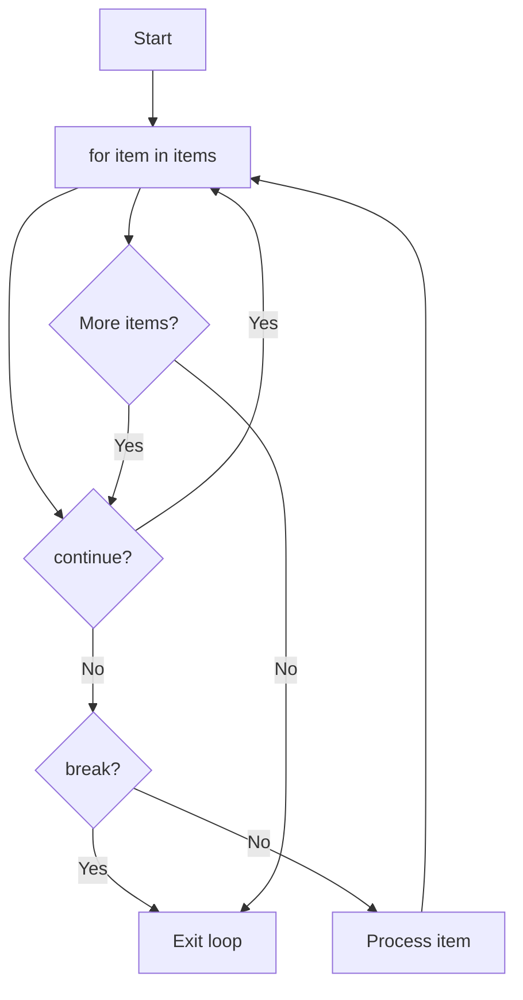

Iteration is the engine of automation. Every batch job, every data pipeline, every web scraper, every game loop, every file processor — they all loop. Python has two looping constructs: `for` iterates over any iterable; `while` repeats while a condition holds true. Mastering loops means writing efficient, readable code that processes data at scale.

Every snippet on this page runs in your browser — no setup required.

## Real-world impact

Loops are everywhere in real code. A web server loops over incoming requests. A machine learning library loops over training batches. A file processor loops over lines. A game engine loops 60 times per second. Understanding loops deeply — including when to `break`, when to `continue`, and how to avoid common pitfalls — is essential.

## The `for` loop

The simplest form: iterate over a sequence.

<CodeBlock
  adapter="python"
  initialCode={`for fruit in ["apple", "banana", "cherry"]:
    print(fruit)
`}
/>

`for` works on **any iterable**: lists, tuples, strings, sets, dicts, files, generators, and your own custom classes (covered later under *Iterators and Generators*).

<CodeBlock
  adapter="python"
  initialCode={`for char in "hello":
    print(char)
`}
/>

<CodeBlock
  adapter="python"
  initialCode={`for key in {"a": 1, "b": 2, "c": 3}:
    print(key)
`}
/>

<Callout type="info">
Iterating a dict yields **keys** by default. Use `.items()` for key-value pairs, `.values()` for just values. This is a common source of confusion for newcomers.
</Callout>

## `range`

`range(stop)`, `range(start, stop)`, and `range(start, stop, step)` produce arithmetic progressions lazily. They are the canonical way to loop "N times".

<CodeBlock
  adapter="python"
  initialCode={`for i in range(5):
    print(i, end=" ")
print()
`}
/>

<CodeBlock
  adapter="python"
  initialCode={`for i in range(1, 6):
    print(i, end=" ")
print()
`}
/>

<CodeBlock
  adapter="python"
  initialCode={`for i in range(0, 20, 5):
    print(i, end=" ")
print()
`}
/>

<CodeBlock
  adapter="python"
  initialCode={`for i in range(10, 0, -2):
    print(i, end=" ")
print()
`}
/>

<Callout type="warn">
The `stop` parameter is **exclusive**. `range(5)` yields `0, 1, 2, 3, 4` — not 5. This is Python's universal convention for ranges and slices, and it prevents off-by-one errors most of the time. But you still need to watch for them when converting between 0-indexed and 1-indexed logic.
</Callout>

## `enumerate`

If your loop needs the index, **do not write `range(len(xs))`**. Use `enumerate`.

<CodeBlock
  adapter="python"
  initialCode={`fruits = ["apple", "banana", "cherry"]
for i, fruit in enumerate(fruits):
    print(i, fruit)
`}
/>

<CodeBlock
  adapter="python"
  initialCode={`fruits = ["apple", "banana", "cherry"]
for i, fruit in enumerate(fruits, start=1):
    print(i, fruit)
`}
/>

`enumerate` is clearer, more Pythonic, and less error-prone than manual indexing.

## `zip`

`zip` iterates multiple sequences in parallel, stopping at the shortest one.

<CodeBlock
  adapter="python"
  initialCode={`fruits = ["apple", "banana", "cherry"]
prices = [1.0, 0.5, 3.0]
for fruit, price in zip(fruits, prices):
    print(f"{fruit}: \${price:.2f}")
`}
/>

<CodeBlock
  adapter="python"
  initialCode={`a = [1, 2, 3]
b = ["a", "b", "c"]
c = [10, 20, 30]
for x, y, z in zip(a, b, c):
    print(x, y, z)
`}
/>

If the sequences have different lengths, `zip` stops at the shortest.

<CodeBlock
  adapter="python"
  initialCode={`for x, y in zip([1, 2, 3], ["a", "b"]):
    print(x, y)
`}
/>

## `reversed`

Iterate a sequence backwards without mutating it.

<CodeBlock
  adapter="python"
  initialCode={`for fruit in reversed(["apple", "banana", "cherry"]):
    print(fruit)
`}
/>

## The `while` loop

`while` repeats as long as a condition is true.

<CodeBlock
  adapter="python"
  initialCode={`n = 16
steps = 0
while n != 1:
    n = n // 2 if n % 2 == 0 else 3 * n + 1
    steps += 1
print("steps:", steps)
`}
/>

Use `while True` plus `break` for "loop until something happens" code where the loop body knows when to stop.

<CodeBlock
  adapter="python"
  initialCode={`count = 0
while True:
    count += 1
    if count > 5:
        break
    print(count)
`}
/>

<Callout type="warn" title="Infinite loops">
`while True:` without a `break` is an infinite loop. This is useful for servers ("run forever") and event loops ("keep processing"), but deadly in scripts. Always ensure your `while` loop has a way to exit.
</Callout>

## `break` and `continue`

- `break` exits the *innermost* loop immediately.
- `continue` skips the rest of the current iteration and goes back to the top.

<CodeBlock
  adapter="python"
  initialCode={`for n in range(1, 11):
    if n == 7:
        print("found 7, stopping")
        break
    print(n)
`}
/>

<CodeBlock
  adapter="python"
  initialCode={`for n in range(1, 11):
    if n % 2 == 0:
        continue
    print("odd:", n)
`}
/>

<CodeBlock
  adapter="python"
  initialCode={`for n in range(1, 11):
    if n == 7:
        print("found 7, stopping")
        break
    if n % 2 == 0:
        continue
    print("odd:", n)
`}
/>

## `for ... else` (the weird one)

Both `for` and `while` accept an `else:` block, which runs **only if the loop completed normally** (no `break`). It is most useful for search loops.

<CodeBlock
  adapter="python"
  initialCode={`def first_factor(n):
    for i in range(2, n):
        if n % i == 0:
            print(f"{n} = {i} * {n // i}")
            break
    else:
        print(f"{n} is prime")

for n in [12, 13, 21, 29]:
    first_factor(n)
`}
/>

The `else` block runs **only if we never hit `break`**, which is exactly what we want for "searched but found nothing" logic.

<Callout type="warn" title="for...else is rare and confusing">
The `for...else` pattern is Pythonic, but it confuses many readers because "else" suggests "if the loop didn't run," when it actually means "if the loop ran to completion without breaking." Use it sparingly and add a comment explaining why, or rewrite with a flag variable if clarity demands it.
</Callout>

<CodeBlock
  adapter="python"
  initialCode={`# Alternative without for...else
def first_factor_alt(n):
    found = False
    for i in range(2, n):
        if n % i == 0:
            print(f"{n} = {i} * {n // i}")
            found = True
            break
    if not found:
        print(f"{n} is prime")

for n in [12, 13]:
    first_factor_alt(n)
`}
/>

## `while ... else`

The same `else` logic applies to `while` loops.

<CodeBlock
  adapter="python"
  initialCode={`count = 0
while count < 3:
    print(count)
    count += 1
else:
    print("loop finished normally")
`}
/>

<CodeBlock
  adapter="python"
  initialCode={`count = 0
while count < 5:
    if count == 3:
        break
    print(count)
    count += 1
else:
    print("this won't print because we broke")
`}
/>

## Avoiding common pitfalls

<Callout type="error" title="Modifying a list while iterating over it">
Changing a list's length during iteration invalidates the iterator and leads to skipped items or infinite loops. If you must remove items, iterate over a **copy**: `for x in xs[:]` or build a new list with a comprehension.
</Callout>

<CodeBlock
  adapter="python"
  initialCode={`xs = [1, 2, 3, 4, 5]
# Iterate over a copy so we can safely mutate the original
for x in xs[:]:
    if x % 2 == 0:
        xs.remove(x)
print(xs)
`}
/>

Better: use a list comprehension to build a new list.

<CodeBlock
  adapter="python"
  initialCode={`xs = [1, 2, 3, 4, 5]
xs = [x for x in xs if x % 2 != 0]
print(xs)
`}
/>

## Challenges

<ChallengeCard
  adapter="python"
  title="Sum of digits"
  instructions={`Define a function \`digit_sum(n)\` that takes a non-negative integer \`n\` and returns the sum of its decimal digits. Use a \`while\` loop. For example, \`digit_sum(1234)\` returns \`10\`.`}
  initialCode={`def digit_sum(n):
    # your code here
    return 0
`}
  solutionCode={`def digit_sum(n):
    total = 0
    while n > 0:
        total += n % 10
        n //= 10
    return total
`}
  tests={[
    {
      id: "basic",
      name: "1234 -> 10",
      code: `assert digit_sum(1234) == 10`,
    },
    {
      id: "zero",
      name: "0 -> 0",
      code: `assert digit_sum(0) == 0`,
    },
    {
      id: "big",
      name: "999999 -> 54",
      code: `assert digit_sum(999_999) == 54`,
    },
  ]}
/>

<ChallengeCard
  adapter="python"
  title="First prime over N"
  instructions={`Define a function \`first_prime_over(n)\` that returns the smallest prime number strictly greater than \`n\`. Use the \`for ... else\` pattern from above for the inner primality test.`}
  initialCode={`def first_prime_over(n):
    # your code here
    return 2
`}
  solutionCode={`def first_prime_over(n):
    candidate = max(n + 1, 2)
    while True:
        for i in range(2, int(candidate ** 0.5) + 1):
            if candidate % i == 0:
                break
        else:
            return candidate
        candidate += 1
`}
  tests={[
    {
      id: "after_10",
      name: "First prime > 10 is 11",
      code: `assert first_prime_over(10) == 11`,
    },
    {
      id: "after_11",
      name: "First prime > 11 is 13",
      code: `assert first_prime_over(11) == 13`,
    },
    {
      id: "after_0",
      name: "First prime > 0 is 2",
      code: `assert first_prime_over(0) == 2`,
    },
    {
      id: "after_100",
      name: "First prime > 100 is 101",
      code: `assert first_prime_over(100) == 101`,
    },
  ]}
/>

<ChallengeCard
  adapter="python"
  title="Count vowels"
  instructions={`Define a function \`count_vowels(text)\` that returns the number of vowels (\`a\`, \`e\`, \`i\`, \`o\`, \`u\`, case-insensitive) in \`text\`. Use a \`for\` loop.`}
  initialCode={`def count_vowels(text):
    # your code here
    return 0
`}
  solutionCode={`def count_vowels(text):
    count = 0
    for c in text.lower():
        if c in "aeiou":
            count += 1
    return count
`}
  tests={[
    {
      id: "basic",
      name: "Basic case",
      code: `assert count_vowels("Hello World") == 3`,
    },
    {
      id: "no_vowels",
      name: "No vowels",
      code: `assert count_vowels("rhythm") == 0`,
    },
    {
      id: "all_vowels",
      name: "All vowels",
      code: `assert count_vowels("aeiou") == 5`,
    },
    {
      id: "case",
      name: "Case-insensitive",
      code: `assert count_vowels("AEIOU") == 5`,
    },
  ]}
/>

<MultipleChoice
  markdown={`What does this code print?

\`\`\`python
for i in range(3):
    if i == 1:
        continue
    print(i)
\`\`\`

- \`0\\n1\\n2\`
  > \`continue\` skips the rest of the iteration, so 1 is never printed.
- [o] \`0\\n2\`
  > \`continue\` skips the \`print\` when \`i == 1\`, so only 0 and 2 print.
- \`0\\n1\`
  > The loop does not break; it continues to \`i == 2\`.
- \`2\`
  > The loop starts at 0, not 2.`}
/>

<MultipleChoice
  markdown={`When does a \`for ... else\` clause execute?

- Always, after the loop body finishes
  > No — it only runs if the loop **completes** without a break.
- When the loop body raises an exception
  > No — exceptions skip the else clause.
- [o] Only when the loop finishes without hitting \`break\`
  > That is what makes it useful for search loops.
- Only when the iterable is empty
  > No — it runs after a **successful** completion, not an empty iterable.`}
/>

<MultipleChoice
  markdown={`What is the output of this code?

\`\`\`python
for i in range(5):
    if i == 3:
        break
print(i)
\`\`\`

- \`0\`
  > The loop runs multiple times before breaking.
- \`3\`
  > \`i\` retains its last value after the loop exits.
- [o] \`3\`
  > The loop breaks when \`i == 3\`, and \`i\` retains that value.
- A \`NameError\`
  > \`i\` is still in scope after the loop.`}
/>

<MultipleChoice
  markdown={`What does \`enumerate(["a", "b", "c"], start=1)\` yield?

- \`(0, "a"), (1, "b"), (2, "c")\`
  > That would be the default \`start=0\`.
- [o] \`(1, "a"), (2, "b"), (3, "c")\`
  > \`start=1\` shifts the index to 1-based.
- \`("a", 1), ("b", 2), ("c", 3)\`
  > The order is (index, value), not (value, index).
- \`["a", "b", "c"]\`
  > \`enumerate\` returns tuples, not the original list.`}
/>

Loops naturally lead into a tighter syntactic form: comprehensions.
