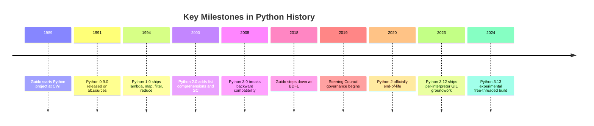

Python is a high-level, interpreted programming language created by
**Guido van Rossum** and first released in **February 1991**. Guido was
working at CWI (Centrum Wiskunde & Informatica) in the Netherlands and
started Python as a hobby project over the 1989 Christmas holidays,
aiming to create a successor to the ABC teaching language he had helped
develop.

<svg
  viewBox="0 0 640 220"
  role="img"
  aria-label="On a starry winter night one small house with a single lit window sends up a trail of dots that swells into a great glowing circle — a Christmas-holiday hobby growing into Python"
  style={{ display: "block", width: "100%", maxWidth: "640px", height: "auto", margin: "2.5rem auto" }}
>
  <g fill="currentColor" opacity="0.22">
    <circle cx="60" cy="40" r="2" />
    <circle cx="110" cy="24" r="2.5" />
    <circle cx="250" cy="30" r="2" />
    <circle cx="420" cy="28" r="2" />
    <circle cx="500" cy="48" r="2.5" />
    <circle cx="572" cy="24" r="2" />
  </g>
  <g fill="currentColor" opacity="0.15">
    <rect x="40" y="190" width="560" height="5" rx="2.5" />
    <circle cx="62" cy="180" r="2" />
    <circle cx="212" cy="182" r="2" />
  </g>
  <g style={{ color: "var(--ds-blue-500)" }} fill="currentColor">
    <rect x="90" y="150" width="70" height="40" fillOpacity="0.18" />
    <polygon points="82,150 125,120 168,150" fillOpacity="0.3" />
    <rect x="140" y="112" width="11" height="26" fillOpacity="0.25" />
    <circle cx="152" cy="102" r="3" fillOpacity="0.35" />
    <circle cx="170" cy="86" r="4" fillOpacity="0.45" />
    <circle cx="192" cy="72" r="5" fillOpacity="0.55" />
    <circle cx="218" cy="62" r="6" fillOpacity="0.7" />
    <circle cx="248" cy="57" r="7" fillOpacity="0.85" />
    <circle cx="278" cy="58" r="8" fillOpacity="0.95" />
    <circle cx="330" cy="72" r="30" />
    <circle cx="330" cy="72" r="46" fillOpacity="0.12" />
    <circle cx="330" cy="72" r="62" fillOpacity="0.06" />
  </g>
  <g style={{ color: "var(--ds-yellow-500)" }} fill="currentColor">
    <rect x="112" y="162" width="18" height="16" rx="2" fillOpacity="0.95" />
  </g>
</svg>

<Callout type="info" title="Why 'Python'?">
The name has nothing to do with snakes. Guido was reading scripts from
*Monty Python's Flying Circus* at the time and wanted a name that was
"short, unique, and slightly mysterious." The community has run with the
snake imagery ever since.
</Callout>

## A visual timeline

## Design philosophy

Python's design is deeply influenced by **ABC**, an earlier teaching
language Guido helped build at CWI. The guiding ideas are captured in
*The Zen of Python* (PEP 20), which you can read at any time by running
`import this`.

<CodeBlock
  adapter="python"
  files={[
    {
      filename: "main.py",
      starterCode: `import this
`,
    },
  ]}
/>

The Zen prizes **readability**, **explicitness**, and **one obvious
way** to do something. These values explain a lot of Python's choices,
including its most famous one: significant whitespace.

## Why indentation is part of the syntax

Most languages use braces or `begin`/`end` keywords for blocks; Python
uses indentation. Guido's reasoning was that programmers indent code
to communicate structure to humans anyway, so the compiler may as well
trust that indentation rather than ignore it. The result is that
**badly indented code simply will not run**, which keeps every Python
codebase visually consistent.

<CodeBlock
  adapter="python"
  files={[
    {
      filename: "main.py",
      starterCode: `# Try changing the indentation below and re-run.
for i in range(3):
    if i % 2 == 0:
        print(i, "is even")
    else:
        print(i, "is odd")
`,
    },
  ]}
/>

## The Python 2 to 3 transition

Python 3 was released in December 2008 and intentionally broke
backward compatibility to fix long-standing language warts. The
biggest changes were:

- `print` became a function: `print("hi")` instead of `print "hi"`.
- All strings are Unicode by default; `bytes` is a separate type.
- Integer division uses `//`; `/` always returns a float.
- `dict.keys()`, `range()`, `map()`, and friends return views/
  iterators instead of lists.

<Callout type="warn" title="The decade-long migration">
The transition took over a decade. Many libraries maintained dual
Python 2/3 codebases using the `six` compatibility library or `2to3`
converter. Python 2 was officially sunset on January 1, 2020. **In 2025
there is no reason to write new code in Python 2.** Every example in
this course assumes Python 3.
</Callout>

## From BDFL to Steering Council

Guido held the title of **BDFL** (Benevolent Dictator For Life) from
Python's inception until July 2018, when he stepped down after a
contentious debate over PEP 572 (the walrus operator `:=`). The
community then adopted a governance model with a five-person **Steering
Council**, elected annually by core developers. The council makes final
decisions on Python Enhancement Proposals (PEPs) and oversees the
direction of the language.

<Callout type="info">
You can see the current Steering Council and all past members at
[python.org/dev/steering-council](https://www.python.org/dev/steering-council/).
</Callout>

## CPython and alternative implementations

The reference implementation of Python is **CPython**, written in C.
When people say "Python", they almost always mean CPython. A few
alternative implementations exist:

- **PyPy** uses a just-in-time compiler and can be much faster on
  pure-Python workloads.
- **Jython** runs on the JVM and can call Java libraries directly.
- **IronPython** targets the .NET runtime.
- **MicroPython** is a slim implementation for microcontrollers.
- **WebAssembly builds** let CPython run directly in the browser, which
  is how the interactive code blocks on this site work — no install
  required.

## The GIL and free-threading work

Python's **Global Interpreter Lock (GIL)** prevents multiple threads
from executing Python bytecode simultaneously, which simplifies
memory management but limits multi-core parallelism. Python 3.13
introduced an experimental **free-threaded build** (compile-time flag
`--disable-gil`) that removes the GIL, allowing true parallel
execution. This is groundbreaking work led by Sam Gross and will evolve
over several releases.

## Test your knowledge

<MultipleChoice
  markdown={`Who created Python?

- Linus Torvalds
  > Linus created Linux and git, not Python.
- [o] Guido van Rossum
  > Guido started Python as a hobby project in December 1989.
- Dennis Ritchie
  > Dennis created the C programming language in the 1970s.
- James Gosling
  > James created Java in the 1990s.`}
/>

<MultipleChoice
  markdown={`What is the origin of the name "Python"?

- Named after the snake species
  > A common misconception! Guido was reading comedy scripts, not reptile books.
- Named after the Greek oracle at Delphi
  > That would be a different story entirely.
- [o] Named after *Monty Python's Flying Circus*
  > Guido was a fan of the British comedy troupe and wanted a "short, unique, and slightly mysterious" name.
- It stands for "Portable Interpreted Typed High-level Object Notation"
  > Python is not an acronym.`}
/>

<MultipleChoice
  markdown={`Which of the following is a breaking change introduced in Python 3?

- List comprehensions were added
  > List comprehensions appeared in Python 2.0 (year 2000).
- [o] \`print\` became a function instead of a statement
  > Python 2 used \`print "hi"\` while Python 3 requires \`print("hi")\`.
- The \`def\` keyword was introduced
  > \`def\` has been part of Python since version 0.9.0 in 1991.
- Indentation became significant
  > Significant indentation has been a core feature of Python from the very beginning.`}
/>

## A small Python 3 challenge

One of the defining changes in Python 3 is that division `/` always
returns a float, even when both operands are integers. In Python 2,
`5 / 2` would return `2` (integer division). Let's verify the Python 3
behavior.

<ChallengeCard
  adapter="python"
  title="Verify Python 3 division"
  instructions={`Compute \`5 / 2\` and assign the result to a variable named \`result\`. The hidden test will check that \`result\` is \`2.5\` (a float).`}
  files={[
    {
      filename: "main.py",
      starterCode: `# your code here
result = None
print("5 / 2 =", result)
`,
      solutionCode: `result = 5 / 2
print("5 / 2 =", result)
`,
    },
  ]}
  tests={[
    {
      id: "division_returns_float",
      name: "5 / 2 equals 2.5",
      description: "Python 3 division always returns a float",
      code: `assert result == 2.5, f"Expected 2.5, got {result}"`,
    },
  ]}
/>

In the next page we will look at how to install Python locally and
get a REPL up and running.
