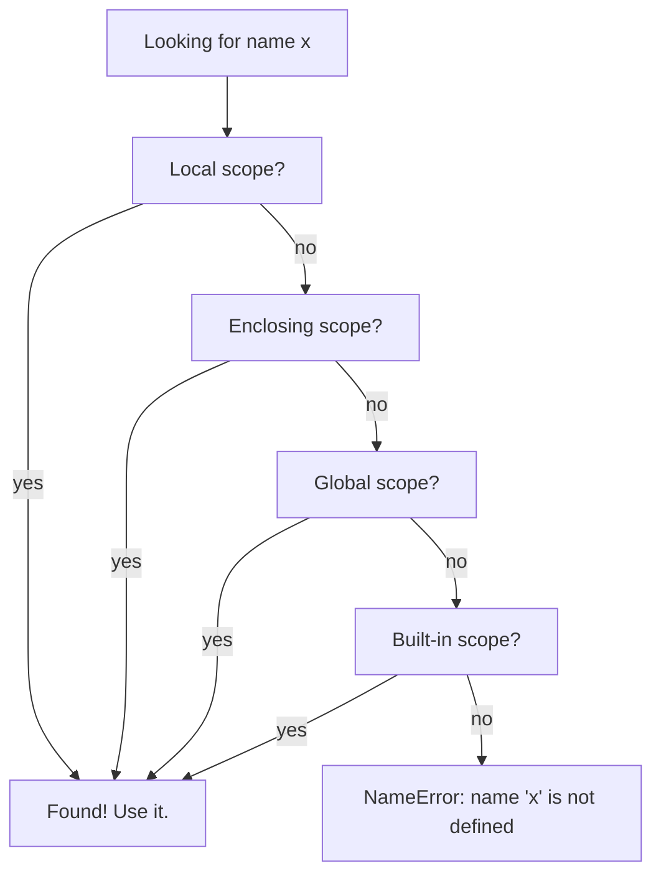

When you write `print(x)`, Python has to find the binding for `x`. It does so by walking through four nested namespaces in order, known by the acronym **LEGB**:

| Letter | Scope |
| --- | --- |
| **L** | Local (inside the current function) |
| **E** | Enclosing (any enclosing function for nested defs) |
| **G** | Global (the module level) |
| **B** | Built-in (`len`, `print`, etc.) |

The first name found wins. If nothing matches, Python raises `NameError`.

## Why scope matters: real-world impact

Understanding scope is critical because:

- **Globals are dangerous** — They make testing hard (every test must reset them), concurrency unsafe (shared mutable state), and debugging a nightmare (who changed this value?).
- **Closures are everywhere** — Every decorator, callback, or factory function uses closures. Understanding them is non-negotiable for intermediate Python.
- **Shadowing builtins breaks things** — Assigning `list = [1, 2, 3]` in one function can silently break code that calls `list()` in the same scope.

The LEGB rule is simple, but its implications are profound.



## Local, then global

<CodeBlock
  adapter="python"
  initialCode={`x = "global x"

def show():
    x = "local x"
    print("inside:", x)

show()
print("outside:", x)
`}
/>

The local `x` **shadows** the global one. Assigning to `x` inside the function created a new local binding; the global `x` was never touched.

<Callout type="info" title="Shadowing">
**Shadowing** means a local name hides a name in an outer scope. It is not an error; it is how scope works. But it can be confusing. Use distinct names when possible.
</Callout>

## Reading vs writing

This is the key gotcha: **reading** a name searches LEGB, but **assigning** a name creates a local by default.

<CodeBlock
  adapter="python"
  initialCode={`counter = 0

def bump_bad():
    counter += 1     # UnboundLocalError: assigning makes it local

try:
    bump_bad()
except UnboundLocalError as e:
    print("UnboundLocalError:", e)
`}
/>

Why? Python sees `counter +=` and decides `counter` is a local variable. Then it tries to read the current value of `counter` (for the `+= 1` part), but there is no local `counter` yet. Hence `UnboundLocalError`.

To rebind the **global** from inside a function, use the `global` keyword:

<CodeBlock
  adapter="python"
  initialCode={`counter = 0

def bump():
    global counter
    counter += 1

bump(); bump(); bump()
print("counter:", counter)
`}
/>

<Callout type="danger" title="Globals are a code smell">
In practice, **prefer returning new values** over mutating globals. It keeps functions **pure** and **testable**. A function that touches a global variable is hard to test in isolation (you have to reset the global between tests) and impossible to run in parallel.
</Callout>

## Enclosing scope and `nonlocal`

When you nest functions, the inner one can **read** names from the outer one (closure). To **rebind** one, use `nonlocal`:

<CodeBlock
  adapter="python"
  initialCode={`def make_counter():
    count = 0
    def step():
        nonlocal count
        count += 1
        return count
    return step

c = make_counter()
print(c(), c(), c())
`}
/>

Each call to `make_counter()` returns a fresh `step` with its own private `count`. This is the basis of **decorators**, **factory functions**, and many Pythonic patterns.

<Callout type="tip" title="Closures vs classes">
A closure is a lightweight alternative to a class when you need "a function with private state." For simple cases (like a counter), a closure is cleaner. For complex state with multiple methods, use a class.
</Callout>

## Built-ins

The built-in scope contains everything in the [`builtins` module](https://docs.python.org/3/library/builtins.html). It is why `print`, `len`, `range`, and friends just work everywhere.

<CodeBlock
  adapter="python"
  initialCode={`import builtins
print(len(dir(builtins)))
print([n for n in dir(builtins) if n.islower()][:10])
`}
/>

You **can** shadow a built-in by accident:

<CodeBlock
  adapter="python"
  initialCode={`list = [1, 2, 3]   # bad: list() no longer works in this scope
print(list)
try:
    print(list((4, 5, 6)))
except TypeError as e:
    print("TypeError:", e)

del list             # restore access to the built-in
print(list((4, 5, 6)))
`}
/>

A linter will warn about this; **pay attention**. Shadowing `list`, `dict`, `id`, `type`, `input`, or any other built-in is a common mistake that causes confusing errors.

<Callout type="danger" title="Never shadow builtins">
Assigning to `list`, `dict`, `str`, `max`, `sum`, etc. will break any code in that scope that expects the built-in. Always use a different name: `items`, `data`, `values`, etc.
</Callout>

## Closures: functions that remember

A **closure** is a function that remembers variables from its enclosing scope, even after that scope has finished executing.

<CodeBlock
  adapter="python"
  initialCode={`def multiplier(factor):
    def inner(x):
        return x * factor   # 'factor' comes from the enclosing scope
    return inner

double = multiplier(2)
triple = multiplier(3)
print(double(7), triple(7))
`}
/>

When `multiplier(2)` finishes, `factor=2` doesn't disappear. It is **captured** by `inner`, which continues to reference it. Each call to `multiplier` creates a new `factor` binding, so `double` and `triple` are independent.

### Why closures matter

**Decorators** are closures:

```python
def timer(func):
    def wrapper(*args, **kwargs):
        start = time.time()
        result = func(*args, **kwargs)   # 'func' is captured
        print(f"{func.__name__} took {time.time() - start:.2f}s")
        return result
    return wrapper

@timer
def slow_function():
    time.sleep(1)
```

**Callbacks** are closures:

```python
def button_click_handler(user_id):
    def on_click():
        print(f"Button clicked by user {user_id}")  # 'user_id' is captured
    return on_click
```

If you don't understand closures, you can't understand decorators. And decorators are everywhere in modern Python (Flask routes, pytest fixtures, dataclass, property, etc.).

## The late-binding closure gotcha

This is a classic interview question:

<CodeBlock
  adapter="python"
  initialCode={`def make_adders():
    adders = []
    for i in range(3):
        adders.append(lambda x: x + i)
    return adders

a, b, c = make_adders()
print(a(10), b(10), c(10))   # all print 12, not 10/11/12!
`}
/>

Why? The lambda captures **i** by **reference**, not by value. When the loop finishes, `i=2`, so all three lambdas add 2.

<Callout type="danger" title="Late-binding closure gotcha">
Closures capture variables by **reference**, not by **value**. If the variable changes after the closure is created, the closure sees the new value. This is especially tricky in loops.
</Callout>

**Fix:** capture the current value explicitly:

<CodeBlock
  adapter="python"
  initialCode={`def make_adders():
    adders = []
    for i in range(3):
        adders.append(lambda x, i=i: x + i)  # default argument captures value
    return adders

a, b, c = make_adders()
print(a(10), b(10), c(10))   # 10, 11, 12
`}
/>

## Real-world: why avoid globals

Imagine a web server with a global request counter:

```python
request_count = 0

def handle_request():
    global request_count
    request_count += 1
    # ... process request
```

Problems:

1. **Testing is hard** — Every test must reset `request_count`, or tests interfere with each other.
2. **Concurrency is broken** — Two threads calling `handle_request()` at the same time can corrupt `request_count` (race condition).
3. **Debugging is a nightmare** — Any function anywhere can modify `request_count`. Who changed it?

Better:

```python
class RequestHandler:
    def __init__(self):
        self.count = 0

    def handle(self):
        self.count += 1
        # ... process request
```

Now each `RequestHandler` instance has its own count, tests are isolated, and concurrency is easier to reason about.

## Challenges

<ChallengeCard
  adapter="python"
  title="Build a counter factory"
  instructions={`Define a function \`make_counter(start=0, step=1)\` that returns a function \`next_value\` which, each time it is called, returns the current count and then advances by \`step\`. The first call returns \`start\`.

Use a closure with \`nonlocal\`; do not use globals.`}
  initialCode={`def make_counter(start=0, step=1):
    # your code here
    def next_value():
        return 0
    return next_value
`}
  solutionCode={`def make_counter(start=0, step=1):
    current = start
    def next_value():
        nonlocal current
        value = current
        current += step
        return value
    return next_value
`}
  tests={[
    {
      id: "default",
      name: "Default 0, 1, 2",
      code: `c = make_counter()
assert [c(), c(), c()] == [0, 1, 2]`,
    },
    {
      id: "custom",
      name: "Custom start and step",
      code: `c = make_counter(start=10, step=5)
assert [c(), c(), c()] == [10, 15, 20]`,
    },
    {
      id: "independent",
      name: "Counters are independent",
      code: `a = make_counter()
b = make_counter()
a(); a(); a()
assert b() == 0`,
    },
  ]}
/>

<ChallengeCard
  adapter="python"
  title="Fix the late-binding closure bug"
  instructions={`The function below has a late-binding closure bug: all returned functions add the same value (the final loop value). Fix it by capturing the loop variable's current value in a default argument.`}
  initialCode={`def make_multipliers():
    multipliers = []
    for i in range(1, 4):
        multipliers.append(lambda x: x * i)
    return multipliers
`}
  solutionCode={`def make_multipliers():
    multipliers = []
    for i in range(1, 4):
        multipliers.append(lambda x, i=i: x * i)
    return multipliers
`}
  tests={[
    {
      id: "independent_values",
      name: "Each multiplier uses its own factor",
      code: `m1, m2, m3 = make_multipliers()
assert m1(10) == 10
assert m2(10) == 20
assert m3(10) == 30`,
    },
  ]}
/>

<ChallengeCard
  adapter="python"
  title="Build a simple closure counter"
  instructions={`Define a function \`counter()\` that returns two functions: \`increment()\` which increases an internal count by 1, and \`get()\` which returns the current count. Both should close over a shared \`count\` variable initialized to 0.

Return them as a tuple: \`(increment, get)\`.`}
  initialCode={`def counter():
    # your code here
    def increment():
        pass
    def get():
        return 0
    return increment, get
`}
  solutionCode={`def counter():
    count = 0
    def increment():
        nonlocal count
        count += 1
    def get():
        return count
    return increment, get
`}
  tests={[
    {
      id: "basic",
      name: "Increment and get",
      code: `inc, get = counter()
assert get() == 0
inc()
inc()
assert get() == 2`,
    },
    {
      id: "independent",
      name: "Multiple counters are independent",
      code: `inc1, get1 = counter()
inc2, get2 = counter()
inc1(); inc1(); inc1()
inc2()
assert get1() == 3
assert get2() == 1`,
    },
  ]}
/>

## Multiple choice questions

<MultipleChoice
  markdown={`Which order does Python use to resolve a name?

- Global, Local, Enclosing, Built-in
  > No, Python starts with the innermost scope (Local), not Global.
- Built-in, Enclosing, Local, Global
  > No, this is the reverse of the correct order.
- [o] Local, Enclosing, Global, Built-in (LEGB)
  > **Correct.** Local first, then any enclosing functions, then the module's globals, then the built-ins.
- Local, Global only
  > No, Python also checks Enclosing and Built-in scopes.`}
/>

<MultipleChoice
  markdown={`What does this print?

\`\`\`python
x = 1
def outer():
    x = 2
    def inner():
        nonlocal x
        x = 3
    inner()
    print("outer:", x)
outer()
print("module:", x)
\`\`\`

- \`outer: 2\\nmodule: 3\`
  > \`nonlocal\` binds to the **nearest enclosing** function scope, not the module scope.
- [o] \`outer: 3\\nmodule: 1\`
  > **Correct.** \`inner\` rebinds \`outer\`'s \`x\` to 3; the module-level \`x\` is untouched.
- \`outer: 3\\nmodule: 3\`
  > The module-level \`x\` is never modified. \`nonlocal\` only affects the nearest enclosing function scope.
- A \`SyntaxError\`
  > No syntax error occurs; this is valid Python.`}
/>

<MultipleChoice
  markdown={`Why does this raise \`UnboundLocalError\`?

\`\`\`python
count = 0
def increment():
    count += 1
increment()
\`\`\`

- Because \`count\` is a reserved keyword.
  > No, \`count\` is a valid variable name.
- [o] Because \`count += 1\` creates a local variable, which is read before it's assigned.
  > **Correct.** Python sees an assignment to \`count\` and makes it local. Then it tries to read \`count\` for the \`+=\`, but there's no local value yet.
- Because global variables are read-only.
  > No, you can read global variables from inside functions without any keyword. The problem is the assignment.
- Because \`+=\` is not allowed inside functions.
  > No, \`+=\` is allowed; the issue is scope.`}
/>

<MultipleChoice
  markdown={`What is a closure?

- A function that is defined inside a class.
  > No, that is a method. A closure is about variable capture, not class membership.
- [o] A function that captures variables from its enclosing scope.
  > **Correct.** A closure remembers variables from the scope in which it was created, even after that scope exits.
- A function that takes another function as an argument.
  > No, that is a higher-order function. Closures are about capturing enclosing variables.
- A function that has no return value.
  > No, the return value is unrelated to whether a function is a closure.`}
/>

<MultipleChoice
  markdown={`How do you rebind a variable from an enclosing function scope (not global)?

- Use the \`global\` keyword.
  > \`global\` is for module-level variables, not enclosing function scopes.
- [o] Use the \`nonlocal\` keyword.
  > **Correct.** \`nonlocal\` tells Python to rebind a variable in the nearest enclosing function scope.
- Use the \`enclosing\` keyword.
  > No such keyword exists in Python.
- You cannot; enclosing variables are read-only.
  > No, \`nonlocal\` allows you to modify them.`}
/>

Now that scope is clear, we can split code across files: modules.
