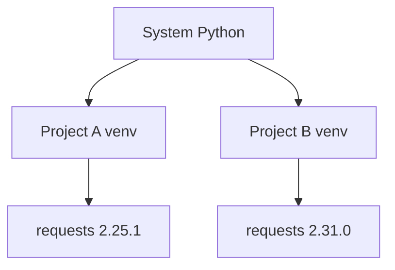

A Python install ships with a small standard library. Anything beyond that — NumPy, requests, Flask, pandas — comes from **PyPI**, the Python Package Index. You install packages with **`pip`** and you keep projects from stepping on each other's toes with **virtual environments**.

<svg
  viewBox="0 0 640 220"
  role="img"
  aria-label="Two glass bell jars each shelter their own small garden — the same blue package grown to a different size in each — and a red bar blocks the path between them: each project keeps its own isolated installs"
  style={{ display: "block", width: "100%", maxWidth: "640px", height: "auto", margin: "2.5rem auto" }}
>
  <g fill="currentColor" opacity="0.15">
    <rect x="60" y="188" width="520" height="6" rx="3" />
  </g>
  <g fill="currentColor" opacity="0.07">
    <path d="M110 190 L110 120 A85 60 0 0 1 280 120 L280 190 Z" />
    <path d="M360 190 L360 120 A85 60 0 0 1 530 120 L530 190 Z" />
  </g>
  <g fill="currentColor" opacity="0.3">
    <circle cx="195" cy="52" r="6" />
    <circle cx="445" cy="52" r="6" />
  </g>
  <g style={{ color: "var(--ds-green-500)" }} fill="currentColor">
    <rect x="191" y="128" width="6" height="58" rx="3" fillOpacity="0.6" />
    <circle cx="179" cy="136" r="7" fillOpacity="0.8" />
    <circle cx="207" cy="126" r="7" fillOpacity="0.8" />
    <circle cx="194" cy="112" r="6" fillOpacity="0.9" />
    <rect x="442" y="136" width="6" height="50" rx="3" fillOpacity="0.6" />
    <circle cx="430" cy="128" r="8" fillOpacity="0.8" />
    <circle cx="458" cy="120" r="7" fillOpacity="0.8" />
    <circle cx="495" cy="176" r="7" fillOpacity="0.7" />
  </g>
  <g style={{ color: "var(--ds-blue-500)" }} fill="currentColor">
    <circle cx="150" cy="176" r="7" fillOpacity="0.7" />
    <circle cx="400" cy="172" r="11" fillOpacity="0.7" />
  </g>
  <g style={{ color: "var(--ds-yellow-500)" }} fill="currentColor">
    <circle cx="240" cy="176" r="7" fillOpacity="0.8" />
  </g>
  <g fill="currentColor" opacity="0.3">
    <circle cx="296" cy="150" r="2.5" />
    <circle cx="310" cy="150" r="2.5" />
  </g>
  <g style={{ color: "var(--ds-red-500)" }} fill="currentColor">
    <rect x="322" y="138" width="8" height="24" rx="4" fillOpacity="0.8" />
  </g>
</svg>

<Callout type="warn" title="Never pip install into system Python">
Without a virtual environment, \`pip install\` modifies your global Python installation. Two projects that need different versions of the same package cannot coexist. Worse, you risk breaking system tools that depend on specific versions. Every Python developer uses virtual environments. No exceptions.
</Callout>

This page is reference material; the commands below are intended to be run in your terminal on your local machine, not in the interactive code blocks.

## Why virtual environments?

Imagine you have two projects:

- **Project A** needs `requests==2.25.1` (an old version for compatibility with legacy code).
- **Project B** needs `requests>=2.31.0` (the latest, for new features).

Without isolation, both projects share the same `site-packages` directory. Installing one version breaks the other. A virtual environment solves this by creating a **self-contained Python installation** for each project, with its own `site-packages`.



Each virtual environment has its own Python interpreter copy (symlinked on Unix, copied on Windows) and its own `site-packages` directory. Activating a venv puts it first on your `PATH`, so `python` and `pip` point to that isolated environment.

<Callout type="info" title="Real-world necessity">
Every Python team uses virtual environments. Whether you're building a web API, a data pipeline, a machine learning model, or a CLI tool, you will create a venv (or use a modern tool like \`uv\` or \`poetry\` that manages venvs for you). Dependency isolation is non-negotiable in professional Python work.
</Callout>

## Creating a virtual environment with `venv`

`venv` ships with Python 3. From any project directory:

```bash
# Create the environment in a folder called .venv
python3 -m venv .venv
```

This creates a `.venv/` directory containing:

- A copy (or symlink) of the Python interpreter.
- A `site-packages/` folder for installed packages.
- Activation scripts to modify your shell's `PATH`.

<Callout type="success" title="Why .venv?">
The name \`.venv\` is a convention. You can name it \`venv\`, \`env\`, or \`my-special-env\`, but \`.venv\` is standard because (1) the leading dot hides it in Unix file listings, and (2) most tools auto-detect it. Stick with \`.venv\` unless you have a reason not to.
</Callout>

## Activating the environment

Activation modifies your shell's `PATH` so `python` and `pip` point to the virtual environment:

```bash
# macOS / Linux
source .venv/bin/activate

# Windows (Command Prompt)
.venv\\Scripts\\activate.bat

# Windows (PowerShell)
.venv\\Scripts\\Activate.ps1
```

Your prompt will change to show the active environment:

```
(.venv) user@host:~/project$
```

Now `python --version` and `which python` (or `where python` on Windows) point inside `.venv/`.

## Deactivating

When you're done:

```bash
deactivate
```

Your prompt returns to normal, and `python` points back to the system installation.

## Installing packages with `pip`

Inside the activated environment:

```bash
pip install requests
pip install "numpy>=2.0,<3"
pip install -U requests              # upgrade to latest
pip uninstall requests
pip list                              # what is installed
pip show requests                     # details for one package
```

Packages are installed into `.venv/site-packages/`, isolated from the system and other venvs.

```python
# Example: after 'pip install requests' in your venv
import requests

response = requests.get("https://api.github.com")
print(response.status_code)
print(response.json()["current_user_url"])
```

## Pinning versions with `requirements.txt`

`requirements.txt` records what your project needs. Generate it from the active environment:

```bash
pip freeze > requirements.txt
```

This writes every installed package with an exact version:

```
certifi==2024.8.30
charset-normalizer==3.4.0
idna==3.10
requests==2.32.3
urllib3==2.2.3
```

To reproduce the environment later (on another machine, in CI, on a server):

```bash
python3 -m venv .venv
source .venv/bin/activate
pip install -r requirements.txt
```

<Callout type="info" title="requirements.in vs requirements.txt">
\`pip freeze\` lists **every** dependency, including transitive ones (dependencies of dependencies). Many teams maintain a shorter \`requirements.in\` with only top-level packages:

\`\`\`
requests>=2.31
flask>=3.0
\`\`\`

Then use \`pip-tools\` (\`pip-compile requirements.in\`) or \`uv pip compile requirements.in\` to generate a fully locked \`requirements.txt\`. This keeps your source file readable while ensuring reproducibility.
</Callout>

## `.gitignore` your virtual environment

**Never commit a virtual environment to version control.** Virtual environments are not portable across machines or operating systems. Commit `requirements.txt` or `pyproject.toml` instead.

Add to `.gitignore`:

```
.venv/
venv/
env/
*.pyc
__pycache__/
```

## Modern alternatives: `uv`, `poetry`, `hatch`, `pdm`

The Python packaging ecosystem is rapidly improving. As of 2026, the most popular modern tools are:

### `uv` (recommended)

**[uv](https://docs.astral.sh/uv/)** is a Rust-based tool that replaces `pip`, `pip-tools`, and `venv`. It's 10–100× faster and handles Python version management too.

```bash
# Install uv (from their docs)
curl -LsSf https://astral.sh/uv/install.sh | sh

# Create a venv with uv
uv venv

# Install packages
uv pip install requests

# Compile a lockfile
uv pip compile requirements.in -o requirements.txt

# Sync the venv to the lockfile
uv pip sync requirements.txt
```

`uv` is fast enough to make dependency resolution feel instant, even on large projects.

### `poetry`

**[poetry](https://python-poetry.org/)** combines dependency management, virtual environments, and packaging into one tool driven by `pyproject.toml`:

```bash
poetry init
poetry add requests
poetry install
poetry run python script.py
```

`poetry` auto-manages the venv and generates `poetry.lock` for reproducibility.

### `hatch` and `pdm`

**[hatch](https://hatch.pypa.io/)** and **[pdm](https://pdm.fming.dev/)** are similar `pyproject.toml`-based workflows with strong plugin ecosystems.

All of these tools speak `pyproject.toml`, the standard project metadata file defined in [PEP 621](https://peps.python.org/pep-0621/).

## `pyproject.toml` at a glance

`pyproject.toml` replaces the older `setup.py` for the vast majority of projects. It defines project metadata, dependencies, and build configuration:

```toml
[project]
name = "my-app"
version = "0.1.0"
description = "A small Python app"
requires-python = ">=3.11"
dependencies = [
    "requests>=2.31",
    "rich>=13.0",
]

[project.optional-dependencies]
dev = ["pytest", "ruff", "mypy"]

[build-system]
requires = ["hatchling"]
build-backend = "hatchling.build"
```

Most modern tools can read this file and install the listed dependencies.

## Cheat sheet

| Task | Command |
| --- | --- |
| Create venv | `python3 -m venv .venv` |
| Activate (macOS/Linux) | `source .venv/bin/activate` |
| Activate (Windows PS) | `.venv\\Scripts\\Activate.ps1` |
| Deactivate | `deactivate` |
| Install one package | `pip install requests` |
| Install from file | `pip install -r requirements.txt` |
| Freeze versions | `pip freeze > requirements.txt` |
| Upgrade pip itself | `python -m pip install -U pip` |
| List installed | `pip list` |
| Show one package | `pip show requests` |
| Uninstall | `pip uninstall requests` |

<Callout type="warn" title="Avoid --user">
You may see advice to run \`pip install --user\`. Skip it. The \`--user\` flag installs packages into your home directory's \`site-packages\`, which is still global (shared across all your projects). Always work inside a virtual environment instead — it's cleaner, more portable, and more predictable.
</Callout>

## Directory structure example

After creating and activating a venv, your project might look like:

```
my-project/
├── .venv/                  # virtual environment (in .gitignore)
│   ├── bin/                # activation scripts, python, pip
│   ├── lib/
│   │   └── python3.12/
│   │       └── site-packages/  # installed packages
│   └── pyvenv.cfg
├── src/
│   └── main.py
├── tests/
│   └── test_main.py
├── requirements.txt        # or requirements.in + requirements.txt
├── pyproject.toml          # modern projects
├── README.md
└── .gitignore              # includes .venv/
```

The `.venv/` directory is never committed. Your teammates and CI systems recreate it from `requirements.txt` or `pyproject.toml`.

## Multiple-choice questions

<MultipleChoice
  markdown={`Why should you use a virtual environment for each Python project?

- It makes \`import\` statements run faster.
  > Virtual environments do not affect import speed.
- [o] It isolates each project's dependencies so they do not conflict with each other or with the system Python.
  > Different projects can pin different versions of the same library safely.
- It is the only way to use \`pip\`.
  > You can use \`pip\` without a venv (not recommended), but venvs are the only safe way to manage dependencies.
- It compiles your code to a single executable.
  > Virtual environments do not compile or bundle code. They isolate dependencies.`}
/>

<MultipleChoice
  markdown={`What does activating a virtual environment do?

- [o] It modifies your shell's \`PATH\` so \`python\` and \`pip\` point to the venv's binaries.
  > Activation is purely a shell trick — no system-wide changes are made.
- It permanently changes the system Python installation.
  > Activation is temporary and local to the current shell session. Closing the terminal reverts it.
- It installs all packages listed in \`requirements.txt\`.
  > Activation does not install anything. You must run \`pip install -r requirements.txt\` separately.
- It compiles Python to bytecode for faster execution.
  > Activation does not affect bytecode compilation.`}
/>

<MultipleChoice
  markdown={`What should you commit to version control?

- The \`.venv/\` directory, so everyone has the same packages.
  > Virtual environments are NOT portable. Commit a lockfile instead.
- [o] \`requirements.txt\` or \`pyproject.toml\`, so teammates can recreate the environment.
  > Lockfiles and metadata files are portable; the venv itself is not.
- Nothing — each developer should figure out dependencies on their own.
  > Without a lockfile, your project is not reproducible.
- Only the Python interpreter binary.
  > You should never commit binaries. Commit dependency metadata instead.`}
/>

<MultipleChoice
  markdown={`Which tool is a modern, fast alternative to \`pip\` and \`venv\`?

- \`npm\`
  > \`npm\` is for JavaScript, not Python.
- [o] \`uv\`
  > \`uv\` is a Rust-based tool that replaces \`pip\`, \`pip-tools\`, and \`venv\` with a much faster implementation.
- \`conda\`
  > \`conda\` is a separate package manager primarily for scientific computing. It's powerful but not the same as \`pip\` + \`venv\`.
- \`virtualenv\`
  > \`virtualenv\` predates \`venv\` and still exists, but \`venv\` (built into Python) is now standard. \`uv\` is faster than both.`}
/>

You now have everything you need to start writing real Python projects. The final page surveys what to learn next.
