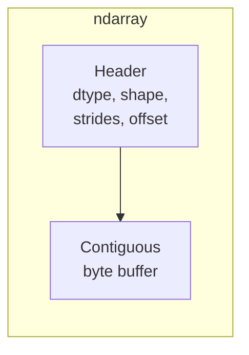

The single data structure that makes scientific Python possible is
the **NumPy `ndarray`** — a contiguous block of memory plus a tiny
header describing how to interpret it as a multidimensional grid.
This page builds your mental model of that structure and shows the
operations you will reach for over and over in the rest of the
course.

## What an ndarray actually is

A NumPy array has three pieces:

- A **dtype** — e.g. `float64`, `int32`, `complex128` — which says
  how many bytes each element takes and how to interpret them.
- A **shape** — a tuple like `(3, 4)` or `(2, 3, 5)` — which says
  how to index the buffer as a multidimensional grid.
- A **strides** tuple — how many bytes to skip in the buffer to
  step along each axis.

Most array operations — slicing, transposing, reshaping — just
change the *header*. The underlying bytes are not copied. That is
what makes NumPy so fast.

<CodeBlock
  adapter="python"
  initialCode={`import numpy as np

A = np.arange(24).reshape(2, 3, 4)
print("shape   =", A.shape)
print("dtype   =", A.dtype)
print("strides =", A.strides, "(bytes per axis step)")
print("nbytes  =", A.nbytes)

# A transposed view shares the same buffer:
B = A.transpose(2, 0, 1)
print("\\nB.shape   =", B.shape)
print("B.strides =", B.strides, "(strides are reordered)")
print("Share memory?", np.shares_memory(A, B))
`}
/>

The transpose has *different* strides but the *same* bytes. Reads
through `B` jump through memory differently — sometimes faster,
sometimes slower than reads through `A`. The numerical content is
identical.

## Creating arrays

The handful of constructors you will use 99% of the time:

<CodeBlock
  adapter="python"
  initialCode={`import numpy as np

print("zeros:\\n", np.zeros((2, 3)))
print("ones:\\n", np.ones((2, 3)))
print("eye  :\\n", np.eye(3))
print("arange:", np.arange(0, 10, 2))
print("linspace:", np.linspace(0, 1, 6))
print("logspace:", np.logspace(0, 3, 4))            # 10**0, 10**1, ..., 10**3
print("full:\\n", np.full((2, 3), fill_value=np.pi))
print("from list:", np.array([1, 2, 3]))
print("empty (uninitialized — fast, but contents are random):")
print(np.empty(4))
`}
/>

For random data, prefer the modern `default_rng()` interface (it is
reproducible and stateless):

<CodeBlock
  adapter="python"
  initialCode={`import numpy as np

rng = np.random.default_rng(0)
print("uniform:", rng.uniform(0, 1, size=4))
print("normal :", rng.standard_normal(4))
print("ints   :", rng.integers(0, 10, size=4))
print("choice :", rng.choice(["a", "b", "c"], size=4))
`}
/>

## Indexing: views, fancy, and boolean

There are three indexing modes, and they behave very differently in
terms of memory.

**Basic indexing** (slices, integers, `:`, `None`) returns a **view**.
A view shares memory with the original; modifying the view modifies
the original.

**Fancy indexing** (an array of integer indices) returns a **copy**.

**Boolean indexing** (a boolean mask of the same shape) also returns
a **copy**.

<CodeBlock
  adapter="python"
  initialCode={`import numpy as np

A = np.arange(20).reshape(4, 5)
print("A =\\n", A)

# 1. Basic — view
v = A[1:3, ::2]
v[:] = -1
print("\\nAfter writing to a basic-indexing view:")
print(A)
`}
/>

<CodeBlock
  adapter="python"
  initialCode={`import numpy as np

A = np.arange(20).reshape(4, 5)

# 2. Fancy indexing — copy
rows = np.array([0, 2, 3])
cols = np.array([1, 4, 0])
F = A[rows, cols]                  # picks (0,1), (2,4), (3,0)
print("Fancy result :", F)
F[:] = -1
print("Original unchanged:\\n", A)

# 3. Boolean — copy
mask = (A % 3 == 0)
print("\\nBoolean mask picks multiples of 3:", A[mask])
A[mask] = 0                         # boolean *assignment* writes in place
print("\\nAfter zeroing multiples of 3:\\n", A)
`}
/>

Knowing whether you have a view or a copy is the difference between
an in-place algorithm and a silent bug.

## Reshape, ravel, and the order question

`reshape` re-interprets the existing bytes; it only copies if it
cannot. `ravel` flattens to 1-D as a view when possible. `flatten`
always copies.

<CodeBlock
  adapter="python"
  initialCode={`import numpy as np

A = np.arange(12).reshape(3, 4)
print("A.reshape(2, 6) shares memory with A?",
      np.shares_memory(A, A.reshape(2, 6)))

# Reshaping a transposed (non-contiguous) array may force a copy
T = A.T
print("T.shape   =", T.shape, " contiguous?", T.flags["C_CONTIGUOUS"])
print("T.reshape(12) shares memory?",
      np.shares_memory(T, T.reshape(12)))
`}
/>

## Vector, matrix, and tensor arithmetic

All the standard arithmetic ops are *element-wise*. Matrix-style
products use `@` (or `np.matmul` / `np.dot`).

<CodeBlock
  adapter="python"
  initialCode={`import numpy as np

a = np.array([1, 2, 3])
b = np.array([4, 5, 6])

print("a + b      =", a + b)          # element-wise
print("a * b      =", a * b)          # element-wise (not dot!)
print("a @ b      =", a @ b)          # dot product (scalar)
print("a[:, None] @ b[None, :] =\\n", a[:, None] @ b[None, :])   # outer

A = np.array([[1, 2], [3, 4]])
B = np.array([[5, 6], [7, 8]])
print("\\nA @ B =\\n", A @ B)           # matrix product
print("\\nA * B =\\n", A * B)           # element-wise product (Hadamard)
`}
/>

The `*` versus `@` distinction is among the most important pieces
of vocabulary in scientific Python. **Element-wise** when you want
arithmetic; **matmul** when you want linear-algebra composition.

## Higher-rank tensors

A "tensor" in scientific computing usually means a NumPy array with
$\ge 3$ axes. They show up everywhere images (height $\times$ width
$\times$ channels), video (frames $\times$ height $\times$ width
$\times$ channels), time-series ensembles, and PDE solution states
live.

The general-purpose tool for tensor contractions is **`np.einsum`**,
which lets you write Einstein-summation notation directly.

<CodeBlock
  adapter="python"
  initialCode={`import numpy as np

# Matrix multiply written as einsum:  C[i,j] = Σ_k A[i,k] B[k,j]
A = np.array([[1, 2], [3, 4]])
B = np.array([[5, 6], [7, 8]])
C = np.einsum("ik,kj->ij", A, B)
print("A @ B via einsum:\\n", C)

# Batched matmul:  one matmul per "batch" index
T = np.random.default_rng(0).standard_normal((4, 3, 5))    # 4 matrices of 3x5
S = np.random.default_rng(1).standard_normal((4, 5, 2))    # 4 matrices of 5x2
out = np.einsum("bij,bjk->bik", T, S)
print("\\nBatched matmul shape:", out.shape)

# Trace:  Σ_i A[i, i]
print("\\nTrace of A:", np.einsum("ii->", A))
`}
/>

einsum is slower to *read* than `@` but enormously more
*expressive*: contractions, traces, outer products, transposes,
diagonal extractions all fit in the same notation.

## A multi-file linear-algebra utility

A real scientific project organizes its kernels and its drivers
into separate modules. Here is a small example: a routine that
projects a batch of vectors onto the span of a set of basis
vectors, separated into a `linalg.py` helper module and a `main.py`
driver.

<CodeBlock
  adapter="python"
  entryFilename="main.py"
  files={[
    {
      filename: "main.py",
      initialContent: `import numpy as np
from linalg import project_onto_basis

rng = np.random.default_rng(0)
basis  = np.array([[1, 0, 0],          # an orthonormal basis for the xy-plane
                   [0, 1, 0]], dtype=float)
points = rng.standard_normal((5, 3))

proj = project_onto_basis(points, basis)
print("original  z-components:", points[:, 2].round(2))
print("projected z-components:", proj[:, 2].round(2))    # all zero
print("\\nFrobenius difference :", np.linalg.norm(points - proj).round(4))
`,
    },
    {
      filename: "linalg.py",
      initialContent: `import numpy as np

def project_onto_basis(points: np.ndarray, basis: np.ndarray) -> np.ndarray:
    """Project rows of \`points\` onto the row-space of \`basis\`.

    Assumes the rows of \`basis\` are orthonormal — i.e. basis @ basis.T = I.
    For a general basis, use the QR or SVD-based projection instead.
    """
    # coords[i, k] = <points[i], basis[k]>
    coords = points @ basis.T
    # reconstruct = Σ_k coords[i, k] basis[k]
    return coords @ basis
`,
    },
  ]}
/>

Two files, twelve lines of real code, a complete projection
operator that runs at BLAS speed on millions of points.

## Practice: build a small tensor

<ChallengeCard
  adapter="python"
  title="Outer + reduce"
  instructions={`Implement \`weighted_centroid(points, weights)\` that takes:

- \`points\` of shape \`(n, d)\`: $n$ points in $\\mathbb\{R\}^d$
- \`weights\` of shape \`(n,)\`: non-negative weights

and returns the weighted centroid

$$ c = \\frac\{\\sum_i w_i \\, p_i\}\{\\sum_i w_i\} \\in \\mathbb\{R\}^d $$

as a 1-D array of shape \`(d,)\`. Do it **without any explicit
Python loops** — use broadcasting and a single reduction.`}
  initialCode={`import numpy as np

def weighted_centroid(points, weights):
    # TODO: vectorized weighted average along axis 0
    return None

# Quick check
points = np.array([[0.0, 0.0], [2.0, 0.0], [0.0, 4.0]])
weights = np.array([1.0, 1.0, 2.0])
print("centroid =", weighted_centroid(points, weights))
# Expected: (2*0 + 1*2 + 1*0)/4, (1*0 + 1*0 + 2*4)/4 = (0.5, 2.0)
`}
  solutionCode={`import numpy as np

def weighted_centroid(points, weights):
    points  = np.asarray(points, dtype=float)
    weights = np.asarray(weights, dtype=float)
    return (weights[:, None] * points).sum(axis=0) / weights.sum()
`}
  tests={[
    {
      id: "basic",
      name: "Matches hand calculation",
      code: `import numpy as np
pts = np.array([[0.0, 0.0], [2.0, 0.0], [0.0, 4.0]])
ws  = np.array([1.0, 1.0, 2.0])
c = weighted_centroid(pts, ws)
assert np.allclose(c, [0.5, 2.0]), c`,
    },
    {
      id: "uniform_weights",
      name: "Uniform weights = plain mean",
      code: `import numpy as np
rng = np.random.default_rng(0)
pts = rng.standard_normal((50, 3))
ws  = np.ones(50)
assert np.allclose(weighted_centroid(pts, ws), pts.mean(axis=0))`,
    },
    {
      id: "higher_dim",
      name: "Works in higher dimensions",
      code: `import numpy as np
pts = np.eye(5)
ws  = np.arange(1, 6, dtype=float)
expected = (ws[:, None] * pts).sum(axis=0) / ws.sum()
assert np.allclose(weighted_centroid(pts, ws), expected)`,
    },
  ]}
/>

## Check your understanding

<MultipleChoice
  markdown={`What is the shape of \`np.einsum("ijk,kl->ijl", A, B)\` if \`A\` has shape \`(2, 3, 4)\` and \`B\` has shape \`(4, 5)\`?

- \`(2, 3, 4)\`
- [o] \`(2, 3, 5)\`
  > The shared index \`k\` is summed away, and the remaining free indices are \`i\` (size 2), \`j\` (size 3), and \`l\` (size 5).
- \`(4, 5)\`
- \`(2, 5)\`

Einsum's strength is that the shape of the result is exactly what the index notation says it is.`}
/>

<MultipleChoice
  markdown={`Which of the following array operations on a 2-D NumPy array returns a **copy** (rather than a view)?

- \`A[1:5, ::2]\`
- \`A.T\`
- \`A.reshape(-1)\` on a C-contiguous array
- [o] \`A[A > 0]\` (boolean indexing)
  > Right. Boolean masks always return a copy, because the result has a new, irregular layout that cannot be described by strides into the original buffer. Slicing and transposes are views.

Knowing when you get a view versus a copy is critical for in-place algorithms and for understanding memory usage.`}
/>
