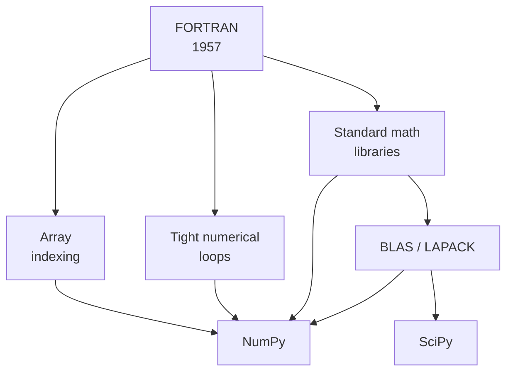
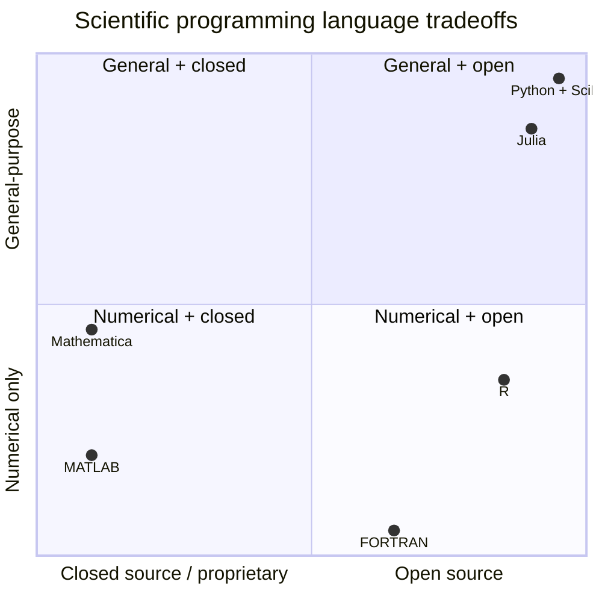

The first decade of computational science was written in *machine
code*, with each instruction painstakingly wired in by hand or
punched on cards. By the mid-1950s the volume of code being written
for scientific problems had grown beyond what could be hand-coded,
and a new idea took hold: scientists should write the formula they
*meant*, and a translator program should figure out the rest.

That translator was **FORTRAN** — the FORmula TRANslator — and it
is the single most influential programming language in scientific
history. Almost every numerical idea you will meet in this course
was first implemented in FORTRAN, and a remarkable amount of
production scientific code still is.

## FORTRAN: scientists' first compiler

John Backus's team at IBM started work on FORTRAN in 1954 and
released the first compiler in 1957 for the IBM 704. Their goal was
simple but radical: a scientist should be able to write

```text
DO 10 I = 1, N
   Y(I) = A * X(I) + B
10 CONTINUE
```

and the compiler should generate machine code as efficient as
hand-written assembly. Backus famously said that without that
efficiency goal, "no one would have used the language."

It worked. By the early 1960s, programs that previously took weeks
to hand-code in machine language could be written in an afternoon
in FORTRAN. The productivity unlock was so large that nearly every
scientific lab in the world adopted it within five years.

<Callout type="info" title="Why this matters for you">
The FORTRAN design — arrays as first-class citizens, contiguous
column-major memory, fast loops over numerical data — set the
template for *every* scientific computing system that followed,
including NumPy. When you write `A @ B` in Python and the operation
returns in a microsecond, you are almost certainly calling a
FORTRAN library under the hood: LAPACK, written in FORTRAN 90, is
linked into virtually every NumPy and SciPy install.
</Callout>

You can see this in action right now. NumPy's `@` operator
dispatches to a routine called **DGEMM** in BLAS, which is FORTRAN
code from the 1970s that has been re-tuned for every generation of
CPU since.

<CodeBlock
  adapter="python"
  starterCode={`import numpy as np
import time

n = 1500
A = np.random.default_rng(0).standard_normal((n, n))
B = np.random.default_rng(1).standard_normal((n, n))

t0 = time.perf_counter()
C = A @ B  # dispatches to BLAS DGEMM
t1 = time.perf_counter()

flops = 2 * n**3  # multiply-add count for n x n matmul
gflops = flops / (t1 - t0) / 1e9
print(f"{n}x{n} matmul: {t1 - t0:.3f}s -> {gflops:.1f} GFLOPS")
print(f"Result Frobenius norm: {np.linalg.norm(C):.2f}")
`}
/>

The number of GFLOPS your browser reports is delivered by a stack
that is roughly: NumPy (Python) → BLAS (C wrapper) → LAPACK
(FORTRAN) → CPU vector instructions. Sixty years of optimization,
hidden behind a single `@`.

## FORTRAN's lasting design ideas



Three FORTRAN ideas survive almost unchanged into modern scientific
Python:

1. **Arrays are the primary data type.** FORTRAN was the first
   language with built-in multidimensional arrays. NumPy's
   `ndarray` is a direct intellectual descendant.
2. **The numerical inner loop must be fast.** FORTRAN compilers
   were tuned to vectorize loops over arrays. Today the same job
   is done by SIMD instructions and BLAS libraries.
3. **Standard numerical libraries are shared.** BLAS (1979), LAPACK
   (1992), FFTPACK, ODEPACK, MINPACK — these FORTRAN libraries are
   still the workhorses inside SciPy. Most of the algorithms in
   `scipy.linalg`, `scipy.optimize`, and `scipy.integrate` are thin
   Python wrappers over decades-old FORTRAN.

## MATLAB: a calculator that thought in matrices

In the late 1970s, Cleve Moler was teaching a numerical analysis
course at the University of New Mexico. He wanted his students to
use LINPACK and EISPACK — the brand-new FORTRAN libraries he had
helped write — without having to *learn FORTRAN*. So he wrote a
tiny interactive program that let students type expressions like
`A * x` and `eig(A)` at a prompt. He called it **MATLAB**
("matrix laboratory").

By 1984 it had been rewritten in C, commercialized by MathWorks, and
was on its way to becoming the lingua franca of engineering
education. For nearly thirty years, "scientific computing" and
"MATLAB" were near-synonyms in most engineering departments.

MATLAB introduced several ideas that scientific Python directly
copied:

| MATLAB idea | Python equivalent |
| --- | --- |
| Everything is a matrix | NumPy `ndarray` |
| Element-wise vs matrix multiply | `*` vs `@` |
| Interactive REPL with `;`-suppressed output | Jupyter notebooks |
| Built-in plotting | Matplotlib (consciously MATLAB-like) |
| `linspace`, `zeros`, `ones`, `eye` | NumPy `linspace`, `zeros`, `ones`, `eye` |
| `.m` script files | `.py` modules |

If you have ever wondered why `matplotlib.pyplot` has functions
named `plot`, `subplot`, `title`, `xlabel`, and `ylabel` — it is
because John Hunter, Matplotlib's creator, deliberately mimicked
MATLAB so that engineers could switch with as little friction as
possible.

<CodeBlock
  adapter="python"
  starterCode={`# A direct Python translation of a typical MATLAB session.
# Almost every line has a 1:1 MATLAB counterpart.

import numpy as np
import matplotlib.pyplot as plt

t = np.linspace(0, 2 * np.pi, 200)  # MATLAB: t = linspace(0, 2*pi, 200);
y = np.sin(t) + 0.3 * np.sin(5 * t)  # MATLAB: y = sin(t) + 0.3*sin(5*t);

plt.figure(figsize=(8, 3))  # MATLAB: figure;
plt.plot(t, y)  # MATLAB: plot(t, y);
plt.title("MATLAB-style plotting")
plt.xlabel("t")
plt.ylabel("y")
plt.grid(True)
plt.show()
`}
/>

## What FORTRAN and MATLAB taught us — and what they lacked

The two languages between them established the *intellectual core*
of scientific computing:

- **Array-oriented thinking.** Write `y = A @ x + b`, not three
  nested loops.
- **Library composition.** A handful of well-tested numerical
  primitives (`solve`, `eig`, `fft`, `quad`) can express enormous
  swathes of science.
- **Interactivity.** Type, run, inspect, refine. The REPL is part
  of the workflow.

But each had serious limitations that left an opening for Python.
FORTRAN was a *compiled, batch* language with almost no support for
strings, file formats, plotting, networking, or any of the gluework
that surrounds real science. MATLAB was *interactive and friendly*
but *proprietary and expensive*, with a weak module system, no real
support for general-purpose programming, and a license cost that
locked students out the moment they graduated.



That gap — *general-purpose, open-source, with a serious numerical
stack* — is exactly the gap Python filled. That story is the next
chapter.

## Check your understanding

<MultipleChoice
  markdown={`Why is it accurate to say "every fast NumPy operation is really a FORTRAN operation in disguise"?

- Because NumPy was written by the FORTRAN community
  > NumPy was written primarily in C and Python by researchers at various institutions; the FORTRAN connection is about the underlying numerical libraries it calls, not who authored NumPy itself.
- Because Python compiles to FORTRAN at runtime
  > Python is interpreted and never compiled to FORTRAN; the connection is that NumPy's numerical inner loops call pre-compiled FORTRAN library routines at the C level.
- [o] Because NumPy's heaviest routines (matrix multiply, linear solves, eigenvalues, FFTs) dispatch to BLAS, LAPACK, and related libraries, most of which are FORTRAN code that has been hand-tuned for decades
  > NumPy is Python at the interface and FORTRAN/C at the core. Calling \`A @ B\` invokes a BLAS routine like DGEMM written in FORTRAN. This is why scientific Python is so fast despite Python itself being interpreted.
- Because FORTRAN syntax is hidden inside Python source files
  > Python source files contain only Python; there is no FORTRAN syntax inside them.

This layering — interpreted glue on top of compiled numerical kernels — is the secret to scientific Python's performance.`}
/>

<MultipleChoice
  markdown={`MATLAB shaped scientific Python in many visible ways. Which of the following is **not** a deliberate echo of MATLAB in the SciPy stack?

- The naming of \`plot\`, \`subplot\`, \`title\`, \`xlabel\` in Matplotlib
  > These function names were deliberately copied from MATLAB by Matplotlib's creator John Hunter so that engineers could switch with minimal friction — making this a direct MATLAB echo.
- The functions \`linspace\`, \`zeros\`, \`ones\`, \`eye\` in NumPy
  > These names are borrowed directly from MATLAB, where the same functions exist with identical semantics.
- The use of the \`@\` operator for matrix multiplication
  > The \`@\` operator was introduced in Python 3.5 (PEP 465) partly because MATLAB used \`*\` for matrix multiplication; the \`@\` choice is a deliberate design nod to that MATLAB convention.
- [o] The Global Interpreter Lock
  > The GIL is a CPython implementation detail that has nothing to do with MATLAB. The other three items were all deliberate design choices to make MATLAB-trained engineers feel at home in Python.

Compatibility with prior scientific tools is one of the reasons SciPy spread so quickly through engineering and physics departments.`}
/>
