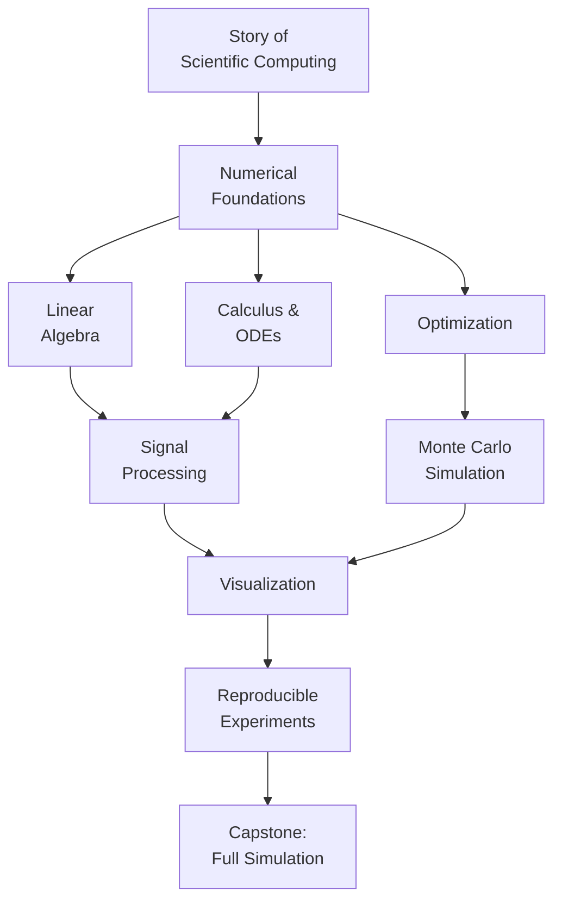

Welcome to **Scientific Computing with Python**. This course is for
learners who already know Python as a *programming language* and now
want to use it as a *mathematical instrument* — a way to model the
physical world, solve equations that have no closed-form solution,
simulate systems that are too complex to reason about by hand, and
analyze data that arrives in matrices rather than rows.

We will not teach you how to write a for-loop, how to build a Flask
app, or how to fine-tune a transformer. We will teach you how to
think about numbers when they are stored in 64 bits, how to choose a
linear solver based on the structure of a matrix, how to integrate a
differential equation that describes a planet's orbit, and how to
build experiments that other scientists can reproduce a decade from
now.

<Callout type="info" title="Prerequisites">
You should already be comfortable with Python syntax — variables,
functions, classes, list comprehensions, imports. Some exposure to
calculus and linear algebra will help, but we will revisit the math
from a computational angle. No prior experience with NumPy, SciPy,
or numerical analysis is required.
</Callout>

## Why this course exists

Most modern science is computation. A biologist sequencing genomes,
an economist forecasting GDP, a physicist colliding particles, an
engineer designing an airfoil, a climate scientist projecting sea
level rise — every one of them spends more time looking at the
output of a Python kernel than at a laboratory bench. The
*scientific method* is increasingly the *computational scientific
method*, and the lingua franca of that method is the SciPy
ecosystem.

But scientific computing has its own intellectual core. You cannot
just translate textbook equations into Python and trust the result.
A naive algorithm can be **a million times slower** than a clever
one, can lose **all of its accuracy** to a single subtraction, can
**explode** when integrating a stiff system, or can quietly
**converge to the wrong answer** because of how floating-point
arithmetic rounds. Learning to recognize and avoid these traps is
what separates a programmer who uses NumPy from a *computational
scientist*.

## What you will learn

The course has six pillars:

1. **The story.** Where scientific computing came from — from Babbage
   to FORTRAN to MATLAB to NumPy — and why the field looks the way
   it does today.
2. **Numerical foundations.** Floating point, stability, error,
   condition number, and the *vectorized* style of thinking that
   NumPy makes possible.
3. **Computational linear algebra.** Arrays as memory, matrix
   factorizations as algorithms, and why nearly every scientific
   problem becomes a linear system in disguise.
4. **Calculus and differential equations.** Numerical
   differentiation, quadrature, and integrating ODEs that describe
   physical systems.
5. **Optimization, signals, and probability.** Root finding,
   minimization, FFTs, filtering, and Monte Carlo methods.
6. **Workflows.** Scientific visualization and the discipline of
   reproducible computational experiments, ending with a capstone
   that ties everything together.

## How the interactive widgets work

Every code block runs in your browser via **Pyodide** — a full
CPython 3.13 build compiled to WebAssembly that ships NumPy, SciPy,
pandas, Matplotlib, SymPy, and Plotly. There is nothing to install.

You will see three kinds of widgets:

1. **Executable code blocks.** Edit any snippet and click *Run*. The
   output area shows `stdout`, plots, and DataFrame tables.
2. **Multi-file challenge cards.** Small computational problems with
   hidden test cases. Many use multiple files so you can practice
   organizing a numerical project the way a real scientist would.
3. **Multiple choice questions.** Quick conceptual checks at the end
   of most pages, with per-choice feedback.

<Callout type="info" title="Each block is isolated">
Variables defined in one `<CodeBlock>` are **not visible** to the
next, even on the same page. This keeps examples self-contained.
If you want a persistent, long-lived workspace to experiment in,
open the [Python Playground](/playground/python) in a new tab.
</Callout>

## A taste of what is coming

Here is a complete scientific computation you will be able to write
and *understand deeply* by the end of the course — simulating a
damped pendulum and visualizing its phase portrait.

<CodeBlock
  adapter="python"
  files={[
    {
      filename: "main.py",
      starterCode: `import numpy as np
import matplotlib.pyplot as plt
from scipy.integrate import solve_ivp

# Damped pendulum:  θ'' + (b/m) θ' + (g/L) sin θ = 0
g, L, b, m = 9.81, 1.0, 0.5, 1.0

def pendulum(t, y):
    theta, omega = y
    return [omega, -(b / m) * omega - (g / L) * np.sin(theta)]

sol = solve_ivp(
    pendulum, (0, 20), [np.pi / 2, 0], t_eval=np.linspace(0, 20, 2000), rtol=1e-8
)

fig, (ax1, ax2) = plt.subplots(1, 2, figsize=(10, 4))
ax1.plot(sol.t, sol.y[0])
ax1.set_xlabel("t")
ax1.set_ylabel("θ(t)")
ax1.set_title("Angle vs time")
ax2.plot(sol.y[0], sol.y[1])
ax2.set_xlabel("θ")
ax2.set_ylabel("ω")
ax2.set_title("Phase portrait")
plt.tight_layout()
plt.show()
`,
    },
  ]}
/>

Right now this code is probably mostly mysterious. By the end of the
course, every line — the choice of solver, the tolerance, the
phase-space plot, even the units — will feel obvious.
