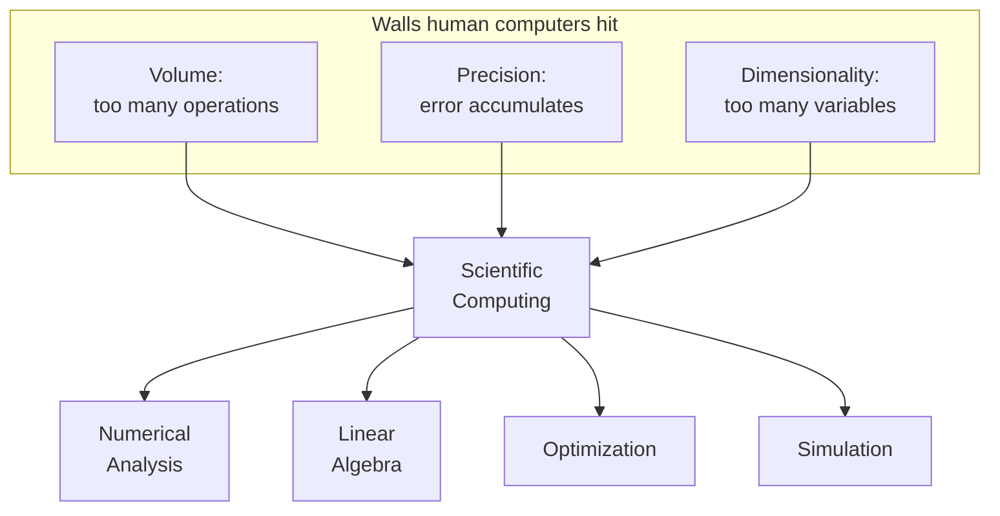

Before there were computers, there were **computers** — and they were
people. From the late seventeenth century through the Second World War,
a "computer" was someone whose job it was to perform long arithmetic
calculations by hand, often for astronomy, navigation, ballistics, or
engineering. The most famous of them — Mary Somerville, Henrietta
Swan Leavitt, the women of the Harvard Observatory, the *Computers*
of the U.S. Army's Aberdeen Proving Ground — produced the
mathematical infrastructure on which modern science was built.

This page is about the wall those human computers hit, and why every
single brick of that wall is still the focus of the field we now
call *scientific computing*.

## A tiny problem that explodes

Consider one of the oldest problems in physics: predicting where the
planets will be a thousand years from now. Newton's laws describe the
motion of any one planet around the sun perfectly — but as soon as
you add a *third* gravitating body, the equations no longer have a
closed-form solution. The only way forward is to *march* the system
in tiny time steps, evaluating the forces, updating the velocities,
updating the positions, and repeating. Billions of times.

A human computer working ten hours a day, six days a week, might
manage a few thousand arithmetic operations. Predicting Jupiter for
a century needs **billions**. The arithmetic is not hard. The volume
is impossible.

**Newton's laws → three-body problem → no closed-form solution →
iterative integration → billions of tiny steps → beyond a human's
lifetime.**

Let us simulate, in Python, exactly how fast the work piles up.

<CodeBlock
  adapter="python"
  starterCode={`# How long would a human computer take to integrate
# the Earth-Moon-Sun system for one century?

# Assume a step size of 1 hour and that a single update step
# requires ~200 arithmetic operations (forces, accelerations,
# position and velocity updates for 3 bodies in 3D).

years = 100
steps_per_year = 24 * 365
ops_per_step = 200
ops_per_second_human = 1  # one operation per second is generous

total_ops = years * steps_per_year * ops_per_step
seconds = total_ops / ops_per_second_human
human_years = seconds / (365 * 24 * 3600)

print(f"Total arithmetic operations: {total_ops:,}")
print(f"Human-years required:        {human_years:,.0f}")
`}
/>

Nearly six human-years of nonstop arithmetic for a problem your laptop
will solve in a fraction of a second. This gap — between what is
*mathematically defined* and what is *humanly computable* — is the
gap that scientific computing exists to close.

## Tables of numbers were the original "API"

For centuries the workaround was to *precompute* answers and publish
them in books. Logarithm tables, trigonometric tables, astronomical
ephemerides, ballistics tables — these were the high-bandwidth
interfaces between mathematicians who could derive functions and
practitioners who needed values.

<Callout type="info" title="The Nautical Almanac">
The British *Nautical Almanac*, first published in 1767, listed the
position of the sun, moon, and planets at six-hour intervals for an
entire year. Hundreds of human computers worked for months to
produce each annual edition. A navigator at sea would then
*interpolate* between the tabulated values to find the celestial
position they needed — interpolation, by hand, in a rocking ship.
</Callout>

We still use this idea today, but the *table* lives in memory and
the *interpolation* runs in microseconds. Try it.

<CodeBlock
  adapter="python"
  initCode={`import numpy as np
from scipy.interpolate import CubicSpline

# A sparse "table" of sine values at 10-degree intervals
degrees = np.arange(0, 361, 10)
table = np.sin(np.deg2rad(degrees))
spline = CubicSpline(degrees, table)`}
  starterCode={`# Look up sin(37.4°) by interpolating between table entries
true_value = float(np.sin(np.deg2rad(37.4)))
interpolated = float(spline(37.4))

print(f"True   sin(37.4°) = {true_value:.8f}")
print(f"Table  sin(37.4°) = {interpolated:.8f}")
print(f"Error              = {abs(true_value - interpolated):.2e}")
`}
/>

The cubic spline error is on the order of $10^{-6}$ — better than any
printed table ever managed, computed in microseconds, with no humans
involved.

## The three walls

Every problem human computers ran into can be sorted into one of
three categories. Each one is still a chapter of computational
science.

### 1. The wall of volume

Some problems simply require more arithmetic than a human can ever
perform. Numerical weather prediction is the canonical example —
Lewis Fry Richardson famously spent six weeks in 1916 doing by hand
what we now consider a six-hour forecast for a single grid cell, and
his answer was wildly wrong because his time step was too large.

### 2. The wall of precision

Long calculations *accumulate error*. When a human computer carries
seven decimal digits through ten thousand operations, the last
digits become noise. We will see in the next chapter that even
modern computers, with 16 digits of precision, can lose every
single one to a poorly written formula.

### 3. The wall of dimensionality

Many problems are not just long but *high-dimensional*. Optimizing a
function of two variables can be done with paper and pencil.
Optimizing a function of two thousand variables — say, training the
weights of a neural network — requires an entirely different toolbox
of gradient methods, sparse representations, and stochastic
sampling.

## A small taste of why precision matters

Here is a calculation that a careful human computer would have
performed accurately, but that a naive computer program gets
catastrophically wrong. The math is identical; only the *form* of
the expression differs.

<CodeBlock
  adapter="python"
  starterCode={`import math

# Compute  f(x) = (1 - cos(x)) / x**2  for very small x.
# Mathematically this approaches 1/2 as x -> 0.

for k in range(1, 12):
    x = 10 ** (-k)
    naive = (1 - math.cos(x)) / x**2
    rewritten = 2 * math.sin(x / 2) ** 2 / x**2  # algebraically identical
    print(f"x=1e-{k:>2}  naive={naive:.10f}  rewritten={rewritten:.10f}")
`}
/>

The "naive" column drifts and then collapses to zero. The
"rewritten" column stays accurate. The math has not changed; only
the *numerical method* has. This is the entire reason numerical
analysis is a discipline rather than a footnote.

## The seed of an idea

By the 1930s, scientists had reached a point where the questions
they wanted to ask — *how do shock waves form? how do neutrons
diffuse? how do galaxies cluster?* — could be **stated** in a few
lines of mathematics, but **answered** only by tens of millions of
arithmetic operations. The pressure to build a machine that could do
this work was enormous. The Second World War turned that pressure
into funding, and computational science was born.

That is the story of the next chapter.

## Check your understanding

<MultipleChoice
  markdown={`Which of the following was **not** a category of "wall" that human computers ran into and that modern scientific computing was created to overcome?

- Volume — sheer number of arithmetic operations required
  > Volume is explicitly identified as the first wall: the page explains how planetary simulation alone requires billions of operations that a human computer could never complete.
- Precision — accumulated round-off in long calculations
  > Precision is explicitly the second wall: the page describes how carrying only seven decimal digits through thousands of operations leaves only noise in the later digits.
- Dimensionality — problems with thousands of variables
  > Dimensionality is explicitly the third wall: the page describes optimizing a function of two thousand variables as requiring an entirely different toolbox.
- [o] Syntax — the absence of structured programming constructs
  > "Syntax" is a software engineering concern, not a fundamental obstacle to scientific calculation. Human computers worked with mathematical notation, not programming languages. Volume, precision, and dimensionality are the three classical walls.

The three walls — volume, precision, and dimensionality — map directly onto the three main pillars of numerical analysis: efficient algorithms, stable numerical methods, and tractable high-dimensional optimization.`}
/>

<MultipleChoice
  markdown={`In the page's "1 − cos(x) / x²" example, both expressions are mathematically identical. Why does the naive version collapse to zero for tiny $x$?

- Python's \`math.cos\` is buggy for small arguments
  > \`math.cos\` is correctly implemented and accurate for small arguments; the problem is in the expression that subtracts \`cos(x)\` from \`1\`, not in \`cos\` itself.
- The CPU is rounding $x^2$ to zero
  > For tiny but non-zero $x$ (e.g. $10^{-6}$), $x^2 = 10^{-12}$ is well within the range of double precision and is not rounded to zero; the issue is cancellation in $1 - \\cos(x)$, not underflow of $x^2$.
- [o] $1 - \\cos(x)$ subtracts two nearly equal numbers and loses almost all of its significant digits — a phenomenon called *catastrophic cancellation*
  > For tiny $x$, $\\cos(x) \\approx 1$, so $1 - \\cos(x)$ is the difference of two floating-point numbers that agree in almost every digit. Subtracting them keeps only the few digits where they *disagree*, which is mostly round-off noise. The rewritten form $2\\sin^2(x/2)$ avoids the subtraction entirely.
- The cubic spline interpolation introduced rounding error
  > Cubic spline interpolation is used in a separate example (the sine table lookup); the collapsing-to-zero in the \`(1 - cos(x)) / x²\` example has nothing to do with splines.

This is one of the most important lessons in numerical computing: **two algebraically identical expressions can produce wildly different numerical answers**. We will return to this idea many times.`}
/>
