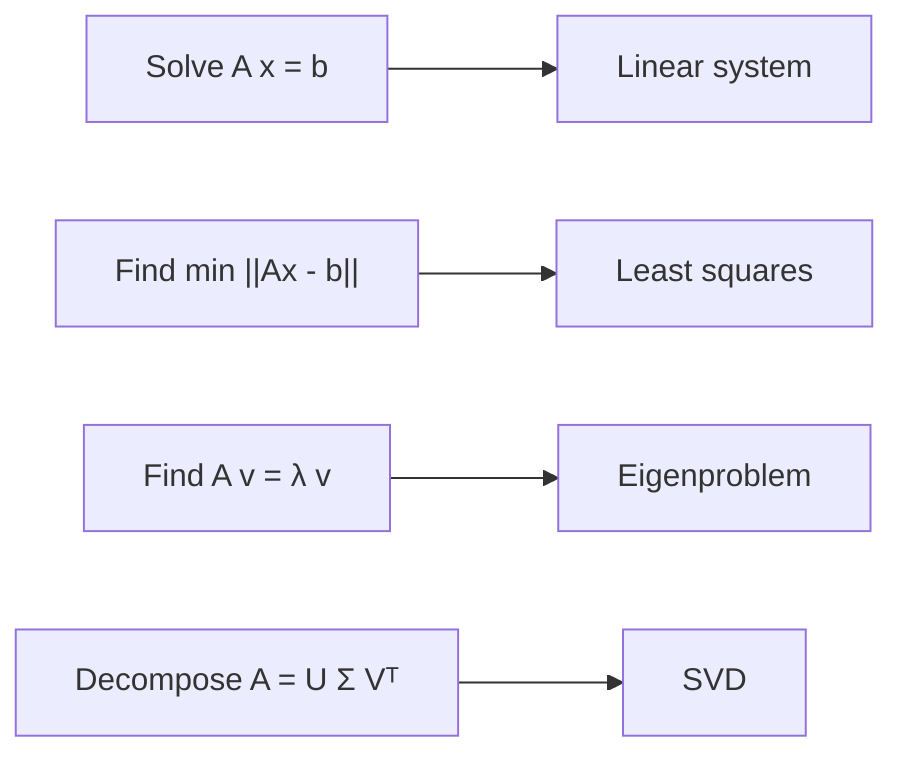

If numerical computing has a *secret*, it is this: **almost every
scientific problem reduces to a linear algebra problem**. A
nonlinear least squares fit? A sequence of linear systems. A PDE
discretization? A sparse linear system. A neural network training
step? A chain of matrix multiplies and a linear solve. Eigenvalue
problems? They are everywhere — vibration modes, principal
component analysis, page ranking, quantum mechanics.

This page is the working tour of the linear algebra primitives in
NumPy and SciPy. It assumes you know what a matrix and a vector
are. It does **not** assume you remember how to find an
eigenvalue by hand.

## The four problem types

Most of scientific computing falls into one of these four buckets.
The next chapter will cover the factorizations behind each. This
chapter is about *using* them.

## Solving linear systems

The single most-used routine in scientific Python is
`numpy.linalg.solve(A, b)`. It solves $A x = b$ where $A$ is square
and (numerically) non-singular. It calls LAPACK's `dgesv`, which
uses LU factorization with partial pivoting — the backward-stable
algorithm we mentioned in the stability chapter.

<CodeBlock
  adapter="python"
  initialCode={`import numpy as np

A = np.array([[4.0, 1.0, 2.0],
              [1.0, 3.0, 0.0],
              [2.0, 0.0, 5.0]])
b = np.array([7.0, 4.0, 9.0])

x = np.linalg.solve(A, b)
print("x =", x)
print("residual ||A x - b|| =", np.linalg.norm(A @ x - b))
`}
/>

The residual is at machine epsilon — that is the right answer to
seven sig figs. **Never compute `np.linalg.inv(A) @ b`** as a
substitute. It is slower, less stable, and rarely what you want.

## Special structure: trust SciPy

A general `solve` works on any non-singular matrix. But many real
problems have structure — symmetric, positive-definite, banded,
triangular, sparse — and dedicated solvers can be ten or a hundred
times faster. **Use them.**

| Structure | NumPy / SciPy call | Speedup vs general |
| --- | --- | --- |
| Triangular | `scipy.linalg.solve_triangular` | ~$3\\times$ |
| Symmetric positive definite | `scipy.linalg.cho_solve` (Cholesky) | ~$2\\times$ |
| Tridiagonal | `scipy.linalg.solve_banded` | ~$100\\times$ on large $n$ |
| Sparse | `scipy.sparse.linalg.spsolve` | $\\propto$ sparsity |

<CodeBlock
  adapter="python"
  initialCode={`import numpy as np
from scipy.linalg import cho_factor, cho_solve, solve
import time

# Build a 1500×1500 symmetric positive-definite matrix
rng = np.random.default_rng(0)
M = rng.standard_normal((1500, 1500))
A = M @ M.T + 0.1 * np.eye(1500)        # SPD by construction
b = rng.standard_normal(1500)

t0 = time.perf_counter(); x1 = solve(A, b); t1 = time.perf_counter()
c, low = cho_factor(A);  t2 = time.perf_counter()
x2 = cho_solve((c, low), b);              t3 = time.perf_counter()

print(f"General solve : {t1 - t0:.3f} s")
print(f"Cholesky      : {(t3 - t2) + (t2 - t1):.3f} s   (factor + solve)")
print(f"Same answer?  : {np.allclose(x1, x2)}")
`}
/>

When you know your matrix is SPD, choosing Cholesky over LU buys
you a factor of $\sim 2$ in time and a factor of $\sim 2$ in
*stability*. Cholesky requires *no pivoting*.

## Eigenvalues and eigenvectors

An **eigenvector** of $A$ is a vector $v$ that $A$ stretches but
does not rotate: $A v = \lambda v$. The scalar $\lambda$ is the
**eigenvalue**.

Eigenvalues are how we diagnose the *structure* of a linear
transformation. They tell us:

- Whether a dynamical system is stable (all eigenvalues in the
  left half plane $\Leftrightarrow$ exponential decay)
- Which directions a dataset varies the most along (PCA $\Leftrightarrow$
  top eigenvectors of the covariance)
- The natural frequencies of a vibrating system
- The convergence rate of an iterative solver

<CodeBlock
  adapter="python"
  initialCode={`import numpy as np

A = np.array([[2.0, 1.0],
              [1.0, 3.0]])

# Symmetric -> use eigh, which is faster and returns real eigenvalues
vals, vecs = np.linalg.eigh(A)
print("Eigenvalues  :", vals)
print("Eigenvectors:\\n", vecs)

# Verify: A v = λ v
for i in range(2):
    print(f"\\nA v_{i} = {A @ vecs[:, i]}")
    print(f"λ v_{i} = {vals[i] * vecs[:, i]}")
`}
/>

A small classic application: principal component analysis (PCA),
which finds the directions of largest variance in a dataset.

<CodeBlock
  adapter="python"
  initialCode={`import numpy as np
import matplotlib.pyplot as plt

rng = np.random.default_rng(0)
n = 300

# A dataset that is mostly stretched along the direction (1, 2)/sqrt(5)
true_axis = np.array([1.0, 2.0]) / np.sqrt(5)
core = rng.standard_normal(n) * 3.0
noise = rng.standard_normal((n, 2)) * 0.4
X = core[:, None] * true_axis + noise

# PCA via the symmetric eigen-decomposition of the covariance matrix
X_centered = X - X.mean(axis=0)
cov = (X_centered.T @ X_centered) / (n - 1)
vals, vecs = np.linalg.eigh(cov)
# eigh returns sorted ascending; reverse to "largest first"
vals, vecs = vals[::-1], vecs[:, ::-1]

print("Principal axis (recovered):", vecs[:, 0])
print("Principal axis (true)     :", true_axis)
print("Variance explained ratio  :", vals / vals.sum())

plt.figure(figsize=(5, 5))
plt.scatter(X[:, 0], X[:, 1], s=8, alpha=0.5)
for k in range(2):
    plt.arrow(0, 0, 3*np.sqrt(vals[k])*vecs[0,k], 3*np.sqrt(vals[k])*vecs[1,k],
              width=0.05, color="red")
plt.axis("equal"); plt.title("Principal directions"); plt.show()
`}
/>

Two arrows, two eigenvalues, one of the most-used data-analysis
methods in science.

## Norms, ranks, and condition numbers

Norms quantify "size" of a vector or matrix; ranks count the number
of independent directions; the condition number we met before is
the ratio of largest to smallest singular value.

<CodeBlock
  adapter="python"
  initialCode={`import numpy as np

v = np.array([3.0, 4.0])
print("||v||_2 =", np.linalg.norm(v))            # 5
print("||v||_1 =", np.linalg.norm(v, 1))         # 7
print("||v||_∞ =", np.linalg.norm(v, np.inf))    # 4

A = np.array([[1.0, 2.0, 3.0],
              [4.0, 5.0, 6.0],
              [7.0, 8.0, 9.0]])
print("\\n||A||_F =", np.linalg.norm(A, "fro"))   # Frobenius
print("rank(A) =", np.linalg.matrix_rank(A))     # 2  (rows are linearly dependent)
print("κ(A)    =", np.linalg.cond(A))            # huge — A is nearly singular
`}
/>

When `cond(A)` is large and your inputs only have a few correct
digits, no algorithm can recover a high-precision answer for
$x = A^\{-1\} b$.

## Least squares

When $A$ is *not* square — say it has more rows than columns —
$A x = b$ generally has no exact solution. The **least-squares
solution** minimizes $\|A x - b\|^2$. This is how you fit any
linear model to data.

<CodeBlock
  adapter="python"
  initialCode={`import numpy as np
import matplotlib.pyplot as plt

rng = np.random.default_rng(0)
n = 30
x = np.linspace(0, 10, n)
y = 2.3 * x - 1.0 + rng.standard_normal(n)        # y = m x + b + noise

# Design matrix:  one column for slope, one column of 1s for intercept
A = np.column_stack([x, np.ones_like(x)])
(m_hat, b_hat), *_ = np.linalg.lstsq(A, y, rcond=None)
print(f"Recovered model:  y = {m_hat:.3f} x + ({b_hat:+.3f})")

plt.scatter(x, y, label="data")
plt.plot(x, m_hat*x + b_hat, "r", label="fit")
plt.legend(); plt.show()
`}
/>

The same call generalizes effortlessly: polynomial fits, multi-
feature regressions, even non-linear-in-parameters fits via a
nonlinear least squares routine in `scipy.optimize` we will meet
later.

## Sparse matrices

Many scientific problems produce matrices that are *mostly zero*: a
1-D heat equation matrix has three non-zeros per row, an image-
processing matrix is block-tridiagonal, etc. Storing all those
zeros is wasteful and slow. SciPy's `sparse` module provides
**CSR**, **CSC**, **COO**, and **LIL** formats and dedicated
solvers.

<CodeBlock
  adapter="python"
  initialCode={`import numpy as np
from scipy.sparse import diags
from scipy.sparse.linalg import spsolve

# 1-D second-derivative matrix:  tridiagonal with [1, -2, 1] on the diagonals
n = 1000
A = diags([1, -2, 1], offsets=[-1, 0, 1], shape=(n, n), format="csr")

# Solve  A u = f  with f a Gaussian pulse
x = np.linspace(0, 1, n)
f = np.exp(-((x - 0.5) ** 2) / 0.01)

u = spsolve(A, f)
print("Solved a 1000x1000 system in CSR format.")
print(f"NNZ in A: {A.nnz}  (vs {n*n} for a dense matrix)")
`}
/>

Sparse solvers let you handle systems with millions of unknowns on
a laptop. PDE discretizations, graph Laplacians, and finite-
element matrices are almost always sparse.

## Practice: a tiny linear-algebra package

<ChallengeCard
  adapter="python"
  title="Solve a tridiagonal system from scratch"
  instructions={`Implement the **Thomas algorithm** for solving a tridiagonal system $T x = d$ where $T$ has subdiagonal \`a\` (length $n-1$), diagonal \`b\` (length $n$), and superdiagonal \`c\` (length $n-1$).

The algorithm is two passes — a forward elimination and a back
substitution — and runs in $O(n)$ time, vs $O(n^3)$ for a dense
\`solve\`. It is the basis of every implicit 1-D PDE solver.

Return the solution \`x\` as a NumPy array of length $n$. Do not
build the dense matrix.`}
  initialCode={`import numpy as np

def thomas(a, b, c, d):
    # a, c have length n-1; b, d have length n
    # TODO: forward elimination, then back substitution
    return None

# Quick check against numpy
a = np.array([1.0, 1.0, 1.0])
b = np.array([-2.0, -2.0, -2.0, -2.0])
c = np.array([1.0, 1.0, 1.0])
d = np.array([1.0, 0.0, 0.0, 1.0])

n = len(b)
T = np.diag(a, -1) + np.diag(b, 0) + np.diag(c, 1)
print("numpy solve:", np.linalg.solve(T, d))
print("thomas    :", thomas(a.copy(), b.copy(), c.copy(), d.copy()))
`}
  solutionCode={`import numpy as np

def thomas(a, b, c, d):
    n = len(b)
    cc, dd = c.copy().astype(float), d.copy().astype(float)
    bb = b.copy().astype(float)
    # Forward sweep
    for i in range(1, n):
        m = a[i-1] / bb[i-1]
        bb[i] -= m * cc[i-1]
        dd[i] -= m * dd[i-1]
    # Back substitution
    x = np.empty(n)
    x[-1] = dd[-1] / bb[-1]
    for i in range(n-2, -1, -1):
        x[i] = (dd[i] - cc[i] * x[i+1]) / bb[i]
    return x
`}
  tests={[
    {
      id: "tridiag_small",
      name: "Matches numpy on the test system",
      code: `import numpy as np
a = np.array([1.0, 1.0, 1.0])
b = np.array([-2.0, -2.0, -2.0, -2.0])
c = np.array([1.0, 1.0, 1.0])
d = np.array([1.0, 0.0, 0.0, 1.0])
T = np.diag(a, -1) + np.diag(b, 0) + np.diag(c, 1)
expected = np.linalg.solve(T, d)
got = thomas(a.copy(), b.copy(), c.copy(), d.copy())
assert np.allclose(got, expected), f"got {got}, expected {expected}"`,
    },
    {
      id: "tridiag_large",
      name: "Matches numpy on a random 50x50 tridiag",
      code: `import numpy as np
rng = np.random.default_rng(7)
n = 50
a = rng.uniform(-1, 1, n-1)
c = rng.uniform(-1, 1, n-1)
b = rng.uniform(2, 4, n)        # diagonally dominant
d = rng.standard_normal(n)
T = np.diag(a, -1) + np.diag(b, 0) + np.diag(c, 1)
expected = np.linalg.solve(T, d)
got = thomas(a.copy(), b.copy(), c.copy(), d.copy())
assert np.allclose(got, expected, atol=1e-9), "thomas disagrees with numpy"`,
    },
  ]}
/>

## Check your understanding

<MultipleChoice
  markdown={`When you call \`np.linalg.solve(A, b)\` for a $1000 \\times 1000$ general matrix, what numerical algorithm is being executed under the hood?

- Cramer's rule
- Direct matrix inversion
- [o] LU factorization with partial pivoting, then forward and back substitution
  > Right. NumPy's \`solve\` dispatches to LAPACK's \`dgesv\`, which factors $A = PLU$ with partial pivoting and then solves the two triangular systems. This is the standard backward-stable algorithm for general dense linear systems.
- A neural-network-based estimator

Knowing what your library is actually doing lets you predict its runtime and stability.`}
/>

<MultipleChoice
  markdown={`A symmetric positive-definite matrix admits a **Cholesky factorization** $A = L L^T$. Why is Cholesky preferred over general LU when applicable?

- It is the only factorization that exists for SPD matrices
- [o] It requires roughly half the operations of LU, needs no pivoting (because it is unconditionally stable for SPD inputs), and uses half the storage
  > SPD structure unlocks a factorization that is both faster and more stable. Any time you can prove your matrix is SPD — covariance matrices, mass matrices, Laplacians — switch to Cholesky.
- It allows complex eigenvalues
- It is required to compute inverses

This is a recurring theme: **let structure dictate the algorithm**.`}
/>
