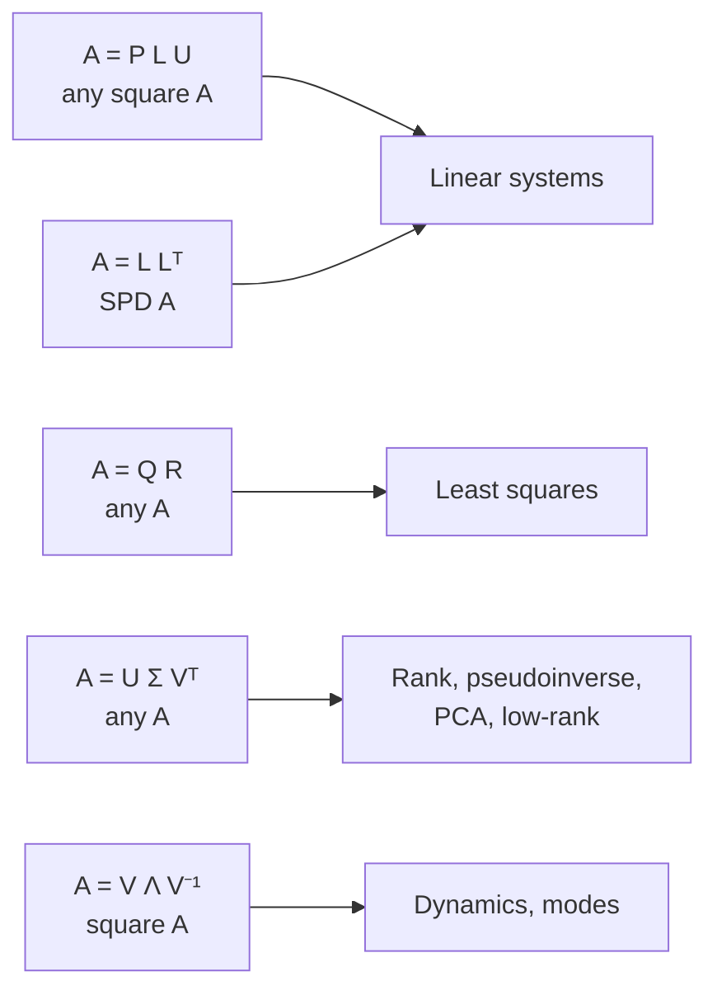
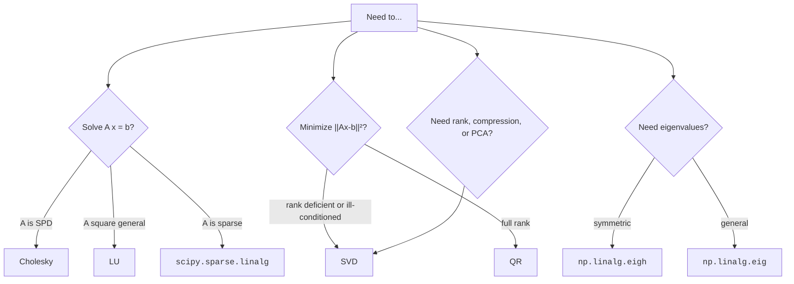

When you call `solve`, `lstsq`, `eig`, or `inv`, you are not running
a black-box routine. You are running a *factorization*: a way of
writing $A$ as a product of structured matrices for which the
target problem is easy. Choosing the right factorization is choosing
the right way to *understand* a matrix.

This page tours the five factorizations that cover essentially all
of dense numerical linear algebra: **LU**, **Cholesky**, **QR**,
**SVD**, and the **eigendecomposition**. We will use each one and
look at what it tells us.

## The five factorizations at a glance

| Factorization | Cost (n×n) | Best for |
| --- | --- | --- |
| **LU** with pivoting | $\tfrac{2}{3} n^3$ | General linear systems |
| **Cholesky** | $\tfrac{1}{3} n^3$ | SPD systems, covariances |
| **QR** | $\tfrac{4}{3} n^3$ | Least squares, orthonormalization |
| **SVD** | $\sim 4 n^3$ | Rank, pseudoinverse, low-rank |
| **Eigendecomposition** | $\sim 10 n^3$ (general), $\sim \tfrac{4}{3} n^3$ (symmetric) | Dynamics, vibration modes |

Constants matter: SVD is roughly 6× the cost of LU. Reach for the
cheapest factorization that solves your problem.

## LU decomposition

LU factors $A$ into a lower-triangular $L$ and upper-triangular $U$
(with a row-permutation matrix $P$ if pivoting is used). Once you
have $PA = LU$, every linear solve is two triangular sweeps —
$O(n^2)$ instead of $O(n^3)$. This is why you should **factor
once, solve many times**.

<CodeBlock
  adapter="python"
  starterCode={`import numpy as np
from scipy.linalg import lu, lu_factor, lu_solve
import time

A = np.random.default_rng(0).standard_normal((1000, 1000))
n_rhs = 50
B = np.random.default_rng(1).standard_normal((1000, n_rhs))

# WRONG: factor once per right-hand side
t0 = time.perf_counter()
X1 = np.column_stack([np.linalg.solve(A, B[:, k]) for k in range(n_rhs)])
t1 = time.perf_counter()

# RIGHT: factor once, solve many times
t2 = time.perf_counter()
piv = lu_factor(A)
X2 = np.column_stack([lu_solve(piv, B[:, k]) for k in range(n_rhs)])
t3 = time.perf_counter()

print(f"Refactor-each-time : {t1 - t0:.3f} s")
print(f"Factor-once        : {t3 - t2:.3f} s   ({(t1 - t0) / (t3 - t2):.1f}x faster)")
print(f"Same answer?       : {np.allclose(X1, X2)}")
`}
/>

## Cholesky decomposition

If $A$ is symmetric positive-definite, $A = L L^T$ with $L$ lower-
triangular. The factorization needs no pivoting, runs at half the
cost of LU, and is unconditionally backward stable.

It is also a **certificate of positive-definiteness**: if a
Cholesky attempt fails, the matrix is not SPD.

<CodeBlock
  adapter="python"
  starterCode={`import numpy as np
from scipy.linalg import cholesky

# Build a covariance-like SPD matrix
rng = np.random.default_rng(0)
M = rng.standard_normal((4, 4))
S = M @ M.T + 0.1 * np.eye(4)

L = cholesky(S, lower=True)
print("L =\\n", L.round(3))
print("\\nL @ L.T =\\n", (L @ L.T).round(3))
print("\\nS       =\\n", S.round(3))
`}
/>

A great use of Cholesky: **sampling from a multivariate Gaussian**.
To draw $x \sim \mathcal{N}(0, \Sigma)$, compute $\Sigma = L L^T$
and set $x = L z$ where $z \sim \mathcal{N}(0, I)$.

<CodeBlock
  adapter="python"
  starterCode={`import numpy as np
from scipy.linalg import cholesky

# Target covariance
Sigma = np.array([[1.0, 0.8], [0.8, 1.0]])

rng = np.random.default_rng(0)
L = cholesky(Sigma, lower=True)
z = rng.standard_normal((2, 5000))
x = L @ z

est_cov = np.cov(x)
print("Target covariance:\\n", Sigma)
print("\\nEmpirical covariance from 5000 samples:\\n", est_cov.round(3))
`}
/>

## QR decomposition

QR writes $A = Q R$ with $Q$ having orthonormal columns
($Q^T Q = I$) and $R$ upper-triangular. It is the canonical
factorization for **least squares** problems: minimizing
$\|A x - b\|^2$ becomes solving the much-easier triangular system
$R x = Q^T b$.

It is also how **Gram–Schmidt orthogonalization** is done in
practice — modified Gram–Schmidt is unstable, but Householder QR
(what NumPy uses) is rock solid.

<CodeBlock
  adapter="python"
  starterCode={`import numpy as np

# Fit a degree-3 polynomial to noisy data using QR
rng = np.random.default_rng(0)
x = np.linspace(-1, 1, 100)
y = 1 - 2 * x + 0.5 * x**3 + 0.2 * rng.standard_normal(x.size)

A = np.vander(x, N=4, increasing=True)  # design matrix [1, x, x², x³]
Q, R = np.linalg.qr(A)
coeffs = np.linalg.solve_triangular if False else np.linalg.solve
beta = np.linalg.solve(R, Q.T @ y)  # back substitution

print("Fitted coefficients:", beta.round(3))
print("True coefficients : [1.000, -2.000, 0.000, 0.500]")
`}
/>

NumPy's `np.linalg.lstsq` does exactly this dance for you — but
seeing it explicitly makes it obvious that least squares is *just*
QR plus a triangular solve.

## Singular value decomposition (SVD)

SVD writes *any* $m \times n$ matrix as $A = U \Sigma V^T$ where
$U$ ($m \times m$) and $V$ ($n \times n$) are orthogonal and
$\Sigma$ is a non-negative diagonal of **singular values**. This
is the most informative factorization in numerical analysis.

The singular values $\sigma_1 \ge \sigma_2 \ge \cdots$ tell you:

- **Rank** — the number of nonzero singular values (numerically:
  those above some tolerance)
- **Condition number** — $\sigma_1 / \sigma_n$
- **Best low-rank approximation** — truncate to the top $k$
  singular values for the closest rank-$k$ approximation in
  Frobenius and 2-norm (Eckart–Young theorem)

<CodeBlock
  adapter="python"
  starterCode={`import numpy as np
import matplotlib.pyplot as plt

rng = np.random.default_rng(0)

# Create a 50x50 matrix that is approximately rank 5
U_true = rng.standard_normal((50, 5))
V_true = rng.standard_normal((5, 50))
A = U_true @ V_true + 0.05 * rng.standard_normal((50, 50))

U, s, Vt = np.linalg.svd(A, full_matrices=False)

plt.figure(figsize=(6, 3))
plt.semilogy(s, "o-")
plt.axvline(5 - 0.5, color="r", linestyle="--", label="true rank")
plt.xlabel("singular-value index")
plt.ylabel("σ_k")
plt.title("Singular-value spectrum (log scale)")
plt.legend()
plt.show()

print("Numerical rank (σ > 1e-6 * σ_max):", int((s > 1e-6 * s[0]).sum()))
`}
/>

The first five singular values are huge, the rest are noise.
Reading the *gap* tells you the data has a 5-dimensional intrinsic
structure.

## Eckart–Young: best low-rank approximation

Throwing away small singular values gives the optimal low-rank
approximation. This is the math behind image compression, latent-
semantic analysis, recommender systems, and modern transformer
low-rank adapters (LoRA).

<CodeBlock
  adapter="python"
  starterCode={`import numpy as np
import matplotlib.pyplot as plt

# Construct a clean low-rank "image"
xs = np.linspace(-1, 1, 80)
img = np.outer(np.exp(-(xs**2)), np.cos(3 * xs)) + 0.3 * np.outer(np.sin(2 * xs), xs)

U, s, Vt = np.linalg.svd(img, full_matrices=False)
fig, axes = plt.subplots(1, 4, figsize=(10, 3))
axes[0].imshow(img, cmap="gray")
axes[0].set_title("original")
for ax, k in zip(axes[1:], [1, 3, 8]):
    approx = U[:, :k] @ np.diag(s[:k]) @ Vt[:k, :]
    ax.imshow(approx, cmap="gray")
    err = np.linalg.norm(img - approx) / np.linalg.norm(img)
    ax.set_title(f"rank {k}\\nrel err = {err:.2e}")
plt.tight_layout()
plt.show()
`}
/>

Notice how few singular values are needed to reproduce the image.
Three of them gets you to 1% relative error.

## Eigendecomposition

For a diagonalizable square $A$, $A = V \Lambda V^{-1}$. The
columns of $V$ are eigenvectors, $\Lambda$ is a diagonal of
eigenvalues. Symmetric matrices admit an *orthogonal*
diagonalization $A = V \Lambda V^T$ (use `eigh`, not `eig`).

A beautiful application: **matrix exponentiation** for solving a
linear system of ODEs. If $\dot x = A x$, then $x(t) = e^{tA} x_0$
and the matrix exponential of a diagonalizable $A$ is just
$V e^{t\Lambda} V^{-1}$.

<CodeBlock
  adapter="python"
  starterCode={`import numpy as np
from scipy.linalg import expm

A = np.array([[0.0, 1.0], [-2.0, -1.0]])  # a damped oscillator in state-space

# Via eigendecomposition
vals, V = np.linalg.eig(A)
t = 1.5
exp_via_eig = V @ np.diag(np.exp(vals * t)) @ np.linalg.inv(V)

# Via SciPy's robust matrix exponential
exp_direct = expm(A * t)

print("expm(A*1.5) via eig:\\n", exp_via_eig.real.round(4))
print("\\nexpm(A*1.5) via scipy:\\n", exp_direct.round(4))
print("\\nAgree?", np.allclose(exp_via_eig, exp_direct))
`}
/>

In practice **always prefer `scipy.linalg.expm`** — it uses scaling-
and-squaring with a Padé approximant, which is far more robust than
diagonalization (and works for non-diagonalizable matrices too).

## A multi-file decomposition mini-library

<CodeBlock
  adapter="python"
  entryFilename="main.py"
  files={[
    {
      filename: "main.py",
      initialContent: `import numpy as np
from decompose import pca_via_svd

rng = np.random.default_rng(0)
n, d, k_true = 300, 6, 2
# Data with intrinsic rank 2 embedded in 6-D + Gaussian noise
latent = rng.standard_normal((n, k_true))
basis = rng.standard_normal((k_true, d))
data = latent @ basis + 0.1 * rng.standard_normal((n, d))

scores, components, explained = pca_via_svd(data, n_components=3)
print("Variance explained:", explained.round(4))
print("First 5 scores rows:\\n", scores[:5].round(3))
print(
    "\\nReconstruction error (rank 2):",
    np.linalg.norm(data - scores[:, :2] @ components[:2]) / np.linalg.norm(data),
)
`,
    },
    {
      filename: "decompose.py",
      initialContent: `import numpy as np

def pca_via_svd(X, n_components):
    """Principal Component Analysis using the SVD.

    Returns
    -------
    scores      : (n_samples, n_components)
    components  : (n_components, n_features)
    explained   : variance explained ratio for each component
    """
    X = np.asarray(X, dtype=float)
    Xc = X - X.mean(axis=0)
    U, s, Vt = np.linalg.svd(Xc, full_matrices=False)
    scores = U[:, :n_components] * s[:n_components]
    components = Vt[:n_components]
    var = (s**2) / (X.shape[0] - 1)
    return scores, components, var[:n_components] / var.sum()
`,
    },
  ]}
/>

Twenty lines, a fully working PCA implementation that scales to
the limit of NumPy's SVD. Notice that there are no eigenvalue
computations — SVD on the centered data is the preferred numerical
route.

## Decision tree: which factorization?

If you remember only one rule from this chapter, remember this:
**SVD when in doubt, QR for least squares, Cholesky for SPD, LU
for general systems, eigendecomposition only when you really need
eigenvectors.**

## Check your understanding

<MultipleChoice
  markdown={`You need to solve $A x = b$ for the same 5000×5000 matrix $A$ but with 200 different right-hand sides $b$. Which strategy is fastest?

- Call \`np.linalg.solve(A, b_k)\` 200 times
  > Each call to \`np.linalg.solve\` performs the full $O(n^3)$ LU factorization; repeating it 200 times throws away the factorization after each use, wasting the dominant cost.
- [o] Call \`scipy.linalg.lu_factor(A)\` **once** and then \`lu_solve\` 200 times
  > \`lu_factor\` does the $O(n^3)$ work *once*; each \`lu_solve\` is then $O(n^2)$. With 200 right-hand sides this is roughly 100× faster than re-factoring each time.
- Compute \`np.linalg.inv(A)\` once and multiply
  > Computing the inverse costs the same $O(n^3)$ as LU factorization, is less numerically stable than the factorize-then-solve approach, and the resulting dense inverse matrix itself requires $O(n^2)$ storage per solve multiply.
- Use the SVD because it generalizes
  > SVD costs roughly $4n^3$ — about 6× more than LU — so reaching for it when a standard LU solve suffices wastes significant compute time.

"Factor once, solve many times" is the most common performance win in numerical linear algebra.`}
/>

<MultipleChoice
  markdown={`Why is the SVD the right tool to compute the *numerical* rank of a matrix that is theoretically rank-deficient but has been perturbed by tiny floating-point noise?

- It runs faster than Gaussian elimination
  > The SVD costs roughly $4n^3$ — several times more than Gaussian elimination — so speed is not the motivation; stability and the ability to threshold small singular values is.
- [o] The singular values reveal exactly how much "signal" exists in each direction; you can set a tolerance (e.g. $\\sigma_k < \\epsilon \\, \\sigma_1$) and count the singular values above it
  > Algebraic rank from row reduction is binary and unstable. The SVD turns rank into a continuous measurement — singular values — which you can threshold sensibly to get a robust numerical rank.
- The SVD always returns integer singular values
  > Singular values are real non-negative numbers; for a noisy or near-rank-deficient matrix they are almost never integers.
- The QR decomposition gives the same answer faster
  > QR can reveal rank through the diagonal of $R$, but those diagonal entries depend on column ordering and pivoting strategy and are far less reliable than the singular values for numerical rank determination.

Numerical rank decisions almost always go through the SVD.`}
/>
