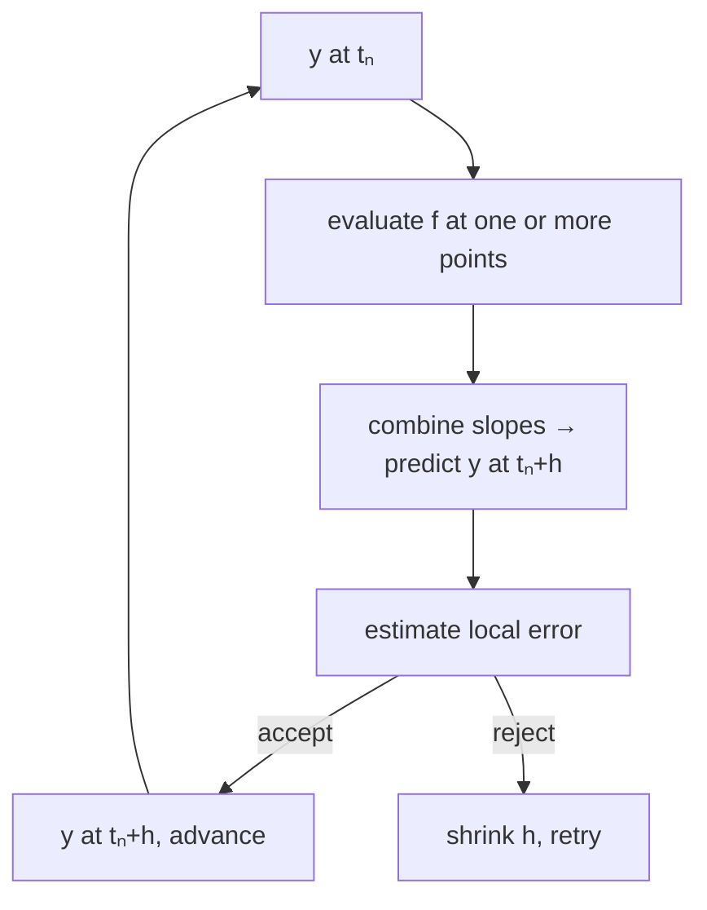

Most laws of nature are written as differential equations. A
pendulum, a chemical reaction, a satellite orbit, a virus
spreading through a population — all of them say "the *rate of
change* depends on the current state". A solver turns those local
laws into a *trajectory* you can plot, analyze, and reason about.

This chapter takes you from the simplest ODE solver you can write
by hand to the production-grade adaptive solvers in SciPy, and
shows you how to recognize when a problem is **stiff**.

## The initial-value problem

$$
\frac{dy}{dt} = f(t, y), \qquad y(t_0) = y_0
$$

Given the law $f$ and a starting state $y_0$, find $y(t)$ for
$t > t_0$. Every solver does the same dance: it takes a step from
$t_n$ to $t_{n+1} = t_n + h$, predicting $y_{n+1}$ from $y_n$. The
differences are *how* the prediction is made and *how* the step
size $h$ is chosen.

## Euler's method — the simplest possible solver

Pretend the slope is constant over the step:
$y_{n+1} = y_n + h \, f(t_n, y_n)$. One function evaluation per
step, easy to code, and almost always wrong.

<CodeBlock
  adapter="python"
  starterCode={`import numpy as np
import matplotlib.pyplot as plt

# dy/dt = -2 y,  y(0) = 1.   Exact solution: y = exp(-2 t)
def f(t, y):
    return -2.0 * y

def euler(f, t0, y0, t_end, h):
    ts, ys = [t0], [y0]
    t, y = t0, y0
    while t < t_end:
        y = y + h * f(t, y)
        t += h
        ts.append(t)
        ys.append(y)
    return np.array(ts), np.array(ys)

for h in [0.5, 0.2, 0.05]:
    t, y = euler(f, 0, 1.0, 3.0, h)
    plt.plot(t, y, "o-", label=f"Euler h={h}")
tt = np.linspace(0, 3, 200)
plt.plot(tt, np.exp(-2 * tt), "k--", label="exact")
plt.xlabel("t")
plt.ylabel("y")
plt.legend()
plt.show()
`}
/>

With $h = 0.5$ Euler is wildly off — it can even oscillate. Halve
$h$ and the error halves (first-order accuracy). To get one extra
correct digit, you need *ten times* as many steps. Unacceptable
for serious work.

## Runge–Kutta 4 (RK4)

Probe the slope at four cleverly-chosen points within the step and
combine them with the right weights:

$$
\begin{aligned}
k_1 &= f(t_n, y_n) \\
k_2 &= f(t_n + h/2,\, y_n + h k_1/2) \\
k_3 &= f(t_n + h/2,\, y_n + h k_2/2) \\
k_4 &= f(t_n + h,\, y_n + h k_3) \\
y_{n+1} &= y_n + \tfrac{h}{6}(k_1 + 2 k_2 + 2 k_3 + k_4)
\end{aligned}
$$

Cost: four evaluations per step. Reward: fourth-order accuracy —
halving $h$ shrinks the error by **sixteen**.

<CodeBlock
  adapter="python"
  starterCode={`import numpy as np

def rk4_step(f, t, y, h):
    k1 = f(t, y)
    k2 = f(t + h / 2, y + h * k1 / 2)
    k3 = f(t + h / 2, y + h * k2 / 2)
    k4 = f(t + h, y + h * k3)
    return y + h * (k1 + 2 * k2 + 2 * k3 + k4) / 6

# Same test problem
def f(t, y):
    return -2.0 * y

t, y = 0.0, 1.0
for _ in range(10):
    y = rk4_step(f, t, y, 0.3)
    t += 0.3
print(f"RK4   y(3) = {y:.10f}")
print(f"exact y(3) = {np.exp(-6):.10f}")
print(f"error      = {abs(y - np.exp(-6)):.2e}")
`}
/>

With ten steps of size 0.3, RK4 nails the answer to seven decimals.
Euler with the same step size would have produced garbage.

## `scipy.integrate.solve_ivp` — what you should actually use

In production, never hand-roll RK4. SciPy gives you
**adaptive-step** solvers that monitor their own error and adjust
$h$ on the fly. The default is `RK45` (Dormand–Prince), which is
RK4 with a built-in error estimator.

<CodeBlock
  adapter="python"
  starterCode={`import numpy as np
import matplotlib.pyplot as plt
from scipy.integrate import solve_ivp

# Damped pendulum:  theta'' + 0.3 theta' + sin(theta) = 0
def pendulum(t, y):
    theta, omega = y
    return [omega, -0.3 * omega - np.sin(theta)]

sol = solve_ivp(
    pendulum, [0, 30], y0=[2.0, 0.0], dense_output=True, rtol=1e-8, atol=1e-10
)

t = np.linspace(0, 30, 500)
theta, omega = sol.sol(t)

fig, ax = plt.subplots(1, 2, figsize=(10, 3))
ax[0].plot(t, theta)
ax[0].set_xlabel("t")
ax[0].set_ylabel("θ(t)")
ax[1].plot(theta, omega)
ax[1].set_xlabel("θ")
ax[1].set_ylabel("ω")
ax[1].set_title("phase portrait spiraling in")
plt.tight_layout()
plt.show()
print(f"solver took {sol.t.size} steps, {sol.nfev} function evaluations")
`}
/>

Key arguments:

- `rtol`, `atol` — relative and absolute error tolerances per step
- `method` — `RK45` (default), `RK23` (cheaper), `DOP853` (very
  high accuracy), `Radau`/`BDF`/`LSODA` (stiff)
- `dense_output=True` — returns a callable `sol.sol(t)` you can
  query at *any* time, not just at the solver's internal steps
- `events` — detect zero-crossings of arbitrary functions

## Event detection

Often you do not want the trajectory; you want to know *when*
something happens. `events` lets you catch those moments exactly.

<CodeBlock
  adapter="python"
  starterCode={`import numpy as np
from scipy.integrate import solve_ivp

# A ball thrown upward in gravity, with the ground at y = 0
def ball(t, s):  # s = [position, velocity]
    return [s[1], -9.81]

def hit_ground(t, s):
    return s[0]

hit_ground.terminal = True  # stop integrating when triggered
hit_ground.direction = -1  # only catch downward crossings

sol = solve_ivp(ball, [0, 100], [0, 20], events=hit_ground, dense_output=True)
print(f"Ball hit the ground at t = {sol.t_events[0][0]:.6f} s")
print(f"Expected (closed form)  : t = {2 * 20 / 9.81:.6f} s")
`}
/>

`solve_ivp` solves the equation $g(t, y) = 0$ to root-finding
precision, *not* just to the nearest time step. The reported event
time is essentially exact.

## Systems of equations

ODE systems are written as a vector field. The solver doesn't care
how big the state is.

<CodeBlock
  adapter="python"
  starterCode={`import numpy as np
import matplotlib.pyplot as plt
from scipy.integrate import solve_ivp

# Lotka-Volterra predator-prey
def lv(t, z, alpha=1.1, beta=0.4, delta=0.1, gamma=0.4):
    x, y = z  # x = prey, y = predator
    return [alpha * x - beta * x * y, delta * x * y - gamma * y]

sol = solve_ivp(lv, [0, 50], [10, 5], dense_output=True, rtol=1e-8)
t = np.linspace(0, 50, 500)
x, y = sol.sol(t)
plt.plot(t, x, label="prey")
plt.plot(t, y, label="predator")
plt.xlabel("time")
plt.legend()
plt.show()
`}
/>

You should see the classic oscillatory boom-bust cycle: prey grow,
predators boom on the abundant food, prey crash, predators starve,
prey recover, and the cycle repeats.

## Stiff equations — when explicit methods fail

A **stiff** ODE has time scales that differ by many orders of
magnitude. Explicit methods like RK4 are forced to take absurdly
tiny steps for *stability* even though the solution is changing
slowly. The classic example is the chemical kinetics problem
**Robertson's system**.

<CodeBlock
  adapter="python"
  starterCode={`import numpy as np
from scipy.integrate import solve_ivp
import time

def robertson(t, y):
    a, b, c = y
    return [-0.04 * a + 1e4 * b * c, 0.04 * a - 1e4 * b * c - 3e7 * b * b, 3e7 * b * b]

y0 = [1.0, 0.0, 0.0]
t_span = [0, 1e5]

for method in ["RK45", "BDF", "LSODA"]:
    t0 = time.perf_counter()
    try:
        sol = solve_ivp(robertson, t_span, y0, method=method, rtol=1e-6, atol=1e-10)
        dt = time.perf_counter() - t0
        print(
            f"{method:7s}: {sol.nfev:>6d} fevals, "
            f"{sol.t.size:>5d} steps, {dt * 1000:.1f} ms, "
            f"final = {sol.y[:, -1].round(6)}"
        )
    except Exception as e:
        print(f"{method:7s}: FAILED  ({e})")
`}
/>

`RK45` either fails or takes thousands of evaluations. `BDF` and
`LSODA` — *implicit* methods designed for stiff problems — handle
it in tens of steps.

**Rule of thumb:** if `RK45` gets unbearably slow or refuses to
converge, switch to `BDF` or `LSODA`.

## A multi-file simulation: the Lorenz attractor

<CodeBlock
  adapter="python"
  entryFilename="main.py"
  files={[
    {
      filename: "main.py",
      initialContent: `import numpy as np
import matplotlib.pyplot as plt
from scipy.integrate import solve_ivp
from lorenz import lorenz_rhs

sol = solve_ivp(
    lorenz_rhs,
    [0, 40],
    [1.0, 1.0, 1.0],
    args=(10.0, 28.0, 8 / 3),
    dense_output=True,
    rtol=1e-9,
    atol=1e-12,
)

t = np.linspace(0, 40, 8000)
x, y, z = sol.sol(t)

fig = plt.figure(figsize=(7, 5))
ax = fig.add_subplot(111, projection="3d")
ax.plot(x, y, z, lw=0.4)
ax.set_title("Lorenz attractor")
plt.show()
`,
    },
    {
      filename: "lorenz.py",
      initialContent: `def lorenz_rhs(t, state, sigma, rho, beta):
    """Classic Lorenz 1963 system."""
    x, y, z = state
    return [sigma * (y - x), x * (rho - z) - y, x * y - beta * z]
`,
    },
  ]}
/>

That butterfly-shaped curve is the visual signature of
*deterministic chaos*. Two trajectories starting $10^{-9}$ apart
diverge to completely different parts of the attractor within a
few time units — yet the system is fully deterministic.

## Challenge: detect the apex of a projectile

<ChallengeCard
  adapter="python"
  title="Find when a projectile reaches its peak"
  instructions={`A projectile in 1-D obeys $\\ddot y = -g$, with $g = 9.81$. Starting at $y(0) = 0$ with initial upward velocity $v_0$, integrate with \`solve_ivp\` and use an **event** to detect the moment the velocity crosses zero (the apex).

Implement \`time_to_apex(v0)\` that returns the apex time as a float.

Verify against the closed-form answer $t^* = v_0 / g$.`}
  starterCode={`import numpy as np
from scipy.integrate import solve_ivp

def time_to_apex(v0):
    # TODO: integrate, use an event on velocity == 0, return event time
    return 0.0
`}
  solutionCode={`import numpy as np
from scipy.integrate import solve_ivp

def time_to_apex(v0):
    def rhs(t, s):
        return [s[1], -9.81]

    def vel_zero(t, s):
        return s[1]

    vel_zero.terminal = True
    vel_zero.direction = -1
    sol = solve_ivp(rhs, [0, 1000], [0.0, v0], events=vel_zero, rtol=1e-10, atol=1e-12)
    return float(sol.t_events[0][0])
`}
  tests={[
    {
      id: "v20",
      name: "v0 = 20 → t* ≈ 20/9.81",
      code: "import math\nassert math.isclose(time_to_apex(20.0), 20.0/9.81, rel_tol=1e-6)",
    },
    {
      id: "v5",
      name: "v0 = 5",
      code: "import math\nassert math.isclose(time_to_apex(5.0), 5.0/9.81, rel_tol=1e-6)",
    },
  ]}
/>

## Check your understanding

<MultipleChoice
  markdown={`You halve the step size $h$ in your explicit RK4 integrator. By roughly what factor does the global error shrink?

- 2
  > A factor of 2 reduction is what first-order Euler's method gives; RK4 is fourth-order, so halving $h$ shrinks the error by $2^4 = 16$, not $2^1 = 2$.
- 4
  > A factor of 4 corresponds to a second-order method; RK4's fourth-order accuracy means the error scales as $h^4$, giving a $2^4 = 16$ reduction when $h$ is halved.
- 8
  > A factor of 8 would correspond to a third-order method; RK4 is fourth-order, so the reduction is $2^4 = 16$.
- [o] 16
  > RK4 is fourth-order accurate, so the error scales as $h^4$. Halving $h$ shrinks the error by $2^4 = 16$. This favorable scaling is exactly why RK4 dominated explicit ODE solving for decades.

This is also why high-order methods can deliver far more accuracy *per function evaluation* than low-order ones for smooth problems.`}
/>

<MultipleChoice
  markdown={`Your reaction-network ODE has fast equilibria on timescales of $10^\{-6\}$ seconds and slow dynamics on timescales of $10^\{3\}$ seconds. \`solve_ivp\` with the default \`RK45\` method either crawls or returns "step size too small". What's the right next step?

- Lower the absolute tolerance
  > Lowering the absolute tolerance makes the solver demand higher accuracy, which forces even smaller steps — the opposite of what is needed when stiffness is already causing the step size to collapse.
- [o] Switch to an implicit stiff solver such as \`BDF\` or \`LSODA\`
  > Wildly separated timescales are the textbook definition of stiffness. Explicit RK methods are forced to use tiny steps for *stability* — not accuracy. Implicit BDF/LSODA solvers handle stiff systems in dozens of steps where RK45 needs millions.
- Switch to \`DOP853\` for higher order
  > DOP853 is an explicit 8th-order method; using a higher-order explicit method does not solve stiffness, because explicit methods of any order are still constrained by the CFL-like stability condition.
- Add a perturbation to break the symmetry
  > Stiffness is a property of the ODE's eigenvalue spectrum, not of any symmetry; adding a perturbation does not change the timescale separation that causes stiffness.

The symptom "any step size is too small" almost always means stiffness.`}
/>
