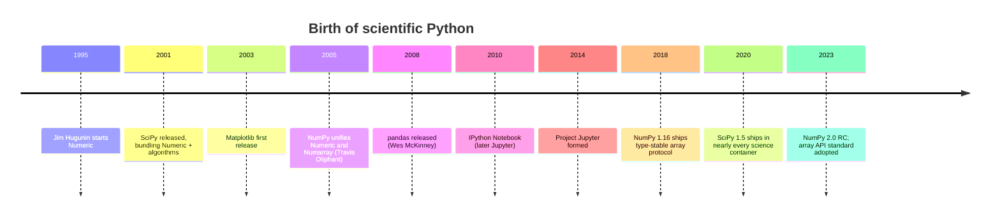
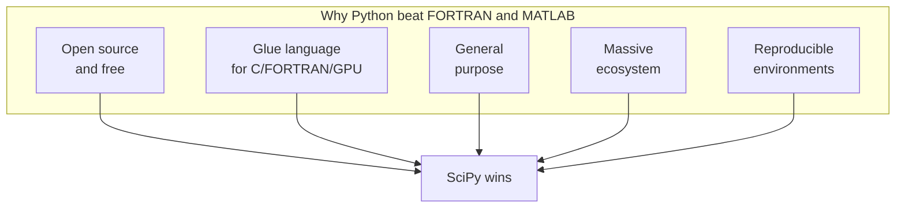

In 1995, scientific Python did not exist. By 2015 it was the most
widely used language in computational research. This page tells the
story of that twenty-year transformation, and explains why the
**SciPy ecosystem** turned out to be the right way to build a
scientific platform.

## A scripting language that ate science

Guido van Rossum released Python 1.0 in 1994. It was a *general-
purpose, dynamically typed, indentation-sensitive* scripting
language. Nothing about its early design suggested it would
displace FORTRAN. It had no built-in arrays, no matrix operators,
no plotting library, and a reputation for being slow.

What it did have was a culture of *making other tools accessible*.
Python's C API made it easy to wrap a fast library and call it from
a friendly REPL. Within a few years, three projects had each done
exactly that — and together they became the seed of scientific
Python.

### NumPy (and its ancestors)

In 1995, Jim Hugunin wrote **Numeric** — Python's first array
package. It was good enough to attract a community but limited in
several ways. A competing project called **Numarray** appeared in
2001 with better support for large arrays and missing data.
Maintaining two incompatible arrays was painful, and in 2005 Travis
Oliphant wrote **NumPy**, which merged the best of both and became
the canonical Python array type. Every other library on this page
depends on it.

### SciPy

**SciPy** appeared in 2001, bundling Numeric (and later NumPy) with
the FORTRAN libraries we met in the previous chapter: BLAS,
LAPACK, ODEPACK, MINPACK, QUADPACK, FFTPACK. Pearu Peterson, Eric
Jones, and Travis Oliphant assembled it specifically so that
scientists who had been writing MATLAB could find familiar
functions: `solve`, `eig`, `fft`, `quad`, `minimize`. The package
layout you use today — `scipy.linalg`, `scipy.optimize`,
`scipy.integrate`, `scipy.signal`, `scipy.stats` — was largely
fixed by 2003.

### Matplotlib

John Hunter, a neuroscientist working on epilepsy data, released
**Matplotlib** in 2003. He had been using MATLAB for plotting at
work and wanted something he could use freely on his own data
without a license server. He deliberately copied MATLAB's plotting
API so that colleagues could switch with zero friction.

### Jupyter

In 2001, Fernando Pérez began work on **IPython** — a better
interactive Python shell. The browser-based notebook arrived in
2010 and quickly became the standard way to write a scientific
computation alongside the explanation of what it does. Renamed
Project Jupyter in 2014 (Julia + Python + R), the notebook is now
the dominant interactive medium for science.

## Why this stack won

Several forces converged.

**Open source removed the license wall.** A graduate student in
Nairobi or São Paulo could run the exact same software a professor
at MIT used, with no purchase order. MATLAB and Mathematica could
not match this.

**Python could glue.** A scientist with a fast FORTRAN solver, a C
data reader, and a CUDA kernel could call all three from one
notebook. FORTRAN was a poor glue language; MATLAB was a closed
world.

**Python was already general-purpose.** The same language that ran
your simulation could parse log files, scrape JSON from an API,
serve a Flask page, and email you when the job finished. Adding
*one* language to a workflow is much easier than adding one for
numerics, one for scripting, and one for the web.

**The ecosystem compounded.** Once NumPy existed, every new
scientific tool used NumPy arrays — pandas (2008), scikit-learn
(2010), scikit-image (2009), AstroPy (2011), Biopython (since the
late 1990s, ported to NumPy). Each new library made the platform
more valuable, which attracted more libraries, which attracted more
users. A textbook network effect.

**Reproducibility tools improved.** Conda (2012), pip wheels (2014),
Docker (2013), and `pip-compile`/`uv` (2024) gradually made it
practical to pin a numerical stack so a paper from 2018 could be
re-run in 2026.

## A guided tour of the SciPy ecosystem

Here are the libraries that will appear repeatedly in this course.
Each runs in your browser, right now.

<CodeBlock
  adapter="python"
  initialCode={`import numpy as np
import scipy
import matplotlib
import pandas as pd

print("NumPy      :", np.__version__)
print("SciPy      :", scipy.__version__)
print("Matplotlib :", matplotlib.__version__)
print("pandas     :", pd.__version__)
`}
/>

The packages each take a slice of the scientific stack:

| Package | What it does | Where it shines |
| --- | --- | --- |
| **NumPy** | N-dimensional arrays, broadcasting, basic linear algebra | The bedrock; almost every other library is built on it |
| **SciPy** | Algorithms: optimization, integration, signal processing, statistics | When NumPy gives you arithmetic, SciPy gives you methods |
| **Matplotlib** | 2-D / 3-D static plotting | Publication-quality figures |
| **pandas** | Labeled tabular data and time series | When your data has *meaningful* row and column labels |
| **SymPy** | Symbolic mathematics | Algebraic manipulation, derivations, exact arithmetic |
| **scikit-image** | Image processing | When your data is pixels |
| **scikit-learn** | Classical machine learning | Out of scope for this course, but worth knowing it exists |
| **Plotly** | Interactive plots | When you want to zoom and hover |
| **Numba / Cython** | Just-in-time / ahead-of-time compilation for hot loops | When a single Python loop is the bottleneck |

A complete SciPy program often touches several of these:

<CodeBlock
  adapter="python"
  initCode={`import numpy as np
import pandas as pd
from scipy import signal
import matplotlib.pyplot as plt`}
  initialCode={`# Generate a noisy signal: a 2 Hz sine plus 20 Hz noise
rng = np.random.default_rng(7)
t = np.linspace(0, 5, 2000)
clean = np.sin(2 * np.pi * 2 * t)
noisy = clean + 0.5 * np.sin(2 * np.pi * 20 * t) + 0.4 * rng.standard_normal(t.size)

# Low-pass Butterworth filter
sos = signal.butter(N=4, Wn=5, btype="low", fs=400, output="sos")
filtered = signal.sosfiltfilt(sos, noisy)

# pandas to compare signal-to-noise ratios
def snr(x, ref):
    return 10 * np.log10(np.var(ref) / np.var(x - ref))

print(pd.Series({
    "noisy_SNR_dB":    snr(noisy,    clean),
    "filtered_SNR_dB": snr(filtered, clean),
}).round(2))

fig, ax = plt.subplots(figsize=(9, 3))
ax.plot(t, noisy, alpha=0.4, label="noisy")
ax.plot(t, filtered, label="filtered")
ax.plot(t, clean, "--", label="clean")
ax.set_xlabel("time (s)"); ax.legend()
plt.show()
`}
/>

Six imports, twenty lines, one complete signal-processing experiment
with a quantitative quality metric and a publishable plot.

## Reproducibility, the new pillar

Scientific software is only useful if other scientists — and your
future self — can re-run it. The Python ecosystem now has several
overlapping conventions for *pinning* the exact stack:

- `requirements.txt` and `pip-compile` (lock file)
- `conda` / `mamba` `environment.yml`
- `pyproject.toml` plus `uv lock` (modern)
- Containers (Docker, Apptainer/Singularity)
- Notebook + lock file checked into Git

A typical reproducible setup looks like this `pyproject.toml`
fragment:

<CodeBlock
  adapter="python"
  initialCode={`# Example pyproject.toml metadata (for illustration; not executed)
example = """
[project]
name = "neutron-diffusion-2026"
version = "0.1.0"
requires-python = ">=3.11"
dependencies = [
    "numpy==2.0.1",
    "scipy==1.14.0",
    "matplotlib==3.9.0",
]
"""
print(example)
print("Pinned versions = a paper that still runs in 5 years.")
`}
/>

We dedicate an entire chapter to reproducible experiments later in
the course.

## Who uses scientific Python today

Almost everyone. NumPy and SciPy alone are downloaded over
**100 million times per month** from PyPI, and the academic
literature now refers to "the scientific Python stack" as a single
named entity, the way it once referred to "the Unix toolchain."

Fields that have made Python their primary tool include:

- **Astrophysics** — AstroPy is in the core toolchain of most
  observatories.
- **Climate science** — xarray + Dask is how you slice NetCDF.
- **Bioinformatics** — Biopython, scanpy, scverse for genomics.
- **High-energy physics** — uproot/awkward replaced ROOT for many
  analyses.
- **Economics and finance** — pandas was originally written for
  hedge-fund time series.
- **Machine learning research** — PyTorch and JAX are NumPy-shaped
  by design.

What unites them is not the *libraries* but the *style*: arrays
first, vectorized math second, interactive notebooks third, and a
deep willingness to call out to C, FORTRAN, or GPU code when speed
matters.

## Check your understanding

<MultipleChoice
  markdown={`Which of the following is the *best* explanation of why Python — a slow, interpreted, dynamically typed language — became the platform of choice for fast scientific computation?

- Python's interpreter is secretly very fast
- The Python community rewrote FORTRAN in pure Python
- [o] Python is an excellent *glue language*: heavy numerical work happens in compiled BLAS/LAPACK/C/FORTRAN code, while Python provides a friendly interactive interface, a general-purpose programming environment, and a massive ecosystem on top
  > Exactly. Python's value to science is its ability to combine fast numerical kernels (written in C and FORTRAN), an interactive REPL/Jupyter workflow, and a general-purpose language that handles file I/O, scripting, plotting, and web APIs.
- The Python language was redesigned in 2005 to add fast arrays

The slowness of the interpreter is irrelevant when 99% of compute time is spent inside a BLAS call.`}
/>

<MultipleChoice
  markdown={`The SciPy ecosystem is layered. Which of these correctly describes the layering?

- pandas → NumPy → Matplotlib → SciPy
- SciPy → NumPy → BLAS/LAPACK
- [o] Almost every other scientific package is built on top of NumPy; SciPy adds higher-level algorithms (optimize, integrate, signal, stats) and itself depends on NumPy and on FORTRAN libraries like BLAS/LAPACK/MINPACK
  > Correct. NumPy is the foundation: it defines the array type and the broadcasting rules. SciPy sits on top of NumPy and provides algorithms; under the hood many of those algorithms are FORTRAN. pandas, scikit-learn, scikit-image, PyTorch, xarray, AstroPy all assume NumPy arrays.
- All four packages are siblings with no dependency relationships

Understanding this layering helps you debug performance problems and pick the right library for a given task.`}
/>
