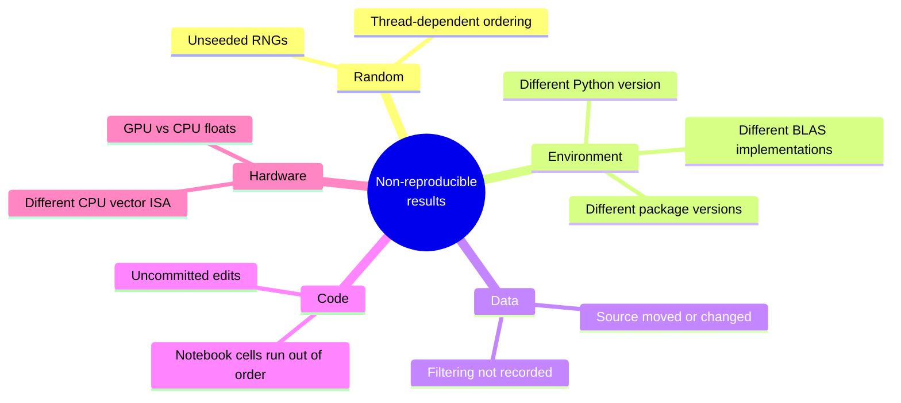

A scientific result you cannot reproduce six months later is not
science — it is folklore. **Reproducibility** is the discipline of
making your computational experiments behave the same way every
time, on every machine, for every collaborator, forever.

This chapter is unusual: it has fewer equations and more
*hygiene*. The payoff is that everything you build will still
work after you forget how it works.

## What can go wrong



Any one of these can make a number change in the third decimal —
or change a *conclusion* entirely.

## The four pillars

1. **Pin the environment.** Lock package versions in a manifest.
2. **Seed the randomness.** Make every stochastic step deterministic.
3. **Record inputs and outputs.** Know what data went in and what
   came out.
4. **Version everything.** Code, configs, and small data go in git;
   large data goes in content-addressed storage.

## Pillar 1: Pin the environment

The minimum acceptable manifest is a `requirements.txt` produced
by `pip freeze`. Even better, use a lockfile tool that captures
*transitive* dependencies exactly — `pip-tools`, `poetry`,
`uv`, or `conda-lock`.

A typical `pyproject.toml` snippet for a scientific project:

<CodeBlock
  adapter="python"
  starterCode={`# Example pyproject.toml (display only)
TOML = """
[project]
name = "thermal-simulation"
version = "0.1.0"
requires-python = ">=3.11,<3.13"
dependencies = [
    "numpy==2.1.3",
    "scipy==1.14.1",
    "matplotlib==3.9.2",
    "pandas==2.2.3",
]

[tool.uv]
package = false
"""
print(TOML)
`}
/>

Three lessons:

- **Exact pins** (`==`) for everything you actually use, not just
  ranges
- A **lockfile** that pins transitive dependencies too
- The **Python version** itself, including the patch

## Pillar 2: Seed everything stochastic

NumPy's `default_rng` makes this clean: create one generator at
the top of the experiment, thread it through everywhere.

<CodeBlock
  adapter="python"
  starterCode={`import numpy as np

def run_experiment(seed):
    rng = np.random.default_rng(seed)
    # Pass rng everywhere instead of using np.random.* globally
    samples = rng.normal(size=10_000)
    perturbations = rng.uniform(-0.1, 0.1, size=10_000)
    return (samples + perturbations).mean()

a = run_experiment(seed=42)
b = run_experiment(seed=42)
c = run_experiment(seed=43)

print(f"seed 42 (1st run): {a:.10f}")
print(f"seed 42 (2nd run): {b:.10f}")
print(f"seed 43         : {c:.10f}")
print(f"same seed reproduces? {a == b}")
`}
/>

Two anti-patterns to avoid:

- **Never use the global `np.random.*` functions** in research
  code. They share hidden state and make ordering matter in
  invisible ways.
- **Never seed with `time.time()`.** That is the opposite of
  reproducibility.

When using multiple parallel workers, derive child seeds with
`SeedSequence` so each worker has a *deterministic* stream:

<CodeBlock
  adapter="python"
  starterCode={`import numpy as np

ss = np.random.SeedSequence(entropy=12345)
child_seeds = ss.spawn(4)
rngs = [np.random.default_rng(s) for s in child_seeds]

for i, rng in enumerate(rngs):
    print(f"worker {i}: first draws =", rng.standard_normal(3).round(4))
`}
/>

Every worker is reproducible, every workflow is reproducible, and
re-ordering workers doesn't change the answer.

## Pillar 3: Record inputs and outputs

A reproducible experiment carries a **manifest** — a small text
file that says exactly what was run with what parameters and what
came out. Hash large inputs so you'd notice if they changed.

<CodeBlock
  adapter="python"
  starterCode={`import hashlib, json, platform, sys, time
from pathlib import Path

def hash_file(path, algo="sha256"):
    h = hashlib.new(algo)
    with open(path, "rb") as f:
        for chunk in iter(lambda: f.read(65536), b""):
            h.update(chunk)
    return h.hexdigest()

# Create a fake input file
inp = Path("/tmp/input.csv")
inp.write_text("a,b\\n1,2\\n3,4\\n")

manifest = {
    "experiment": "demo-001",
    "started_at": time.strftime("%Y-%m-%dT%H:%M:%SZ", time.gmtime()),
    "python": sys.version.split()[0],
    "platform": platform.platform(),
    "params": {"seed": 42, "n_iters": 1000},
    "inputs": [{"path": str(inp), "sha256": hash_file(inp)}],
}

print(json.dumps(manifest, indent=2))
`}
/>

Drop this `manifest.json` alongside every result. Years later,
you can verify that the inputs were the ones you think they were
and re-run with the same parameters.

## Pillar 4: Version your code

Use git. Tag the commit that produced every published result:

```bash
git commit -am "fig-3 simulation, ran with config v2"
git tag fig-3-v2
```

Record the commit hash in the manifest. This pairs the *exact*
code with the *exact* outputs forever.

## Parameter sweeps the disciplined way

Most experimental work is a parameter sweep: vary one or two
inputs, record the outputs, plot. Resist the temptation to do this
with copy-paste cells in a notebook. Instead, separate
**configuration** from **code**, and let a small driver loop over
configs.

<CodeBlock
  adapter="python"
  entryFilename="main.py"
  files={[
    {
      filename: "main.py",
      initialContent: `import itertools, json
import numpy as np
from sim import simulate

# Reproducible sweep over a 2-D parameter grid
SEED_BASE = 2026
configs = []
for damping, omega in itertools.product([0.1, 0.3, 0.5], [1.0, 2.0, 3.0]):
    configs.append({"damping": damping, "omega": omega})

results = []
for i, cfg in enumerate(configs):
    seed = SEED_BASE + i             # deterministic per-config seed
    final = simulate(**cfg, seed=seed)
    results.append({**cfg, "seed": seed, "final_energy": final})

for r in results:
    print(json.dumps(r))
`,
    },
    {
      filename: "sim.py",
      initialContent: `import numpy as np
from scipy.integrate import solve_ivp

def simulate(damping=0.1, omega=1.0, seed=0, t_end=20.0):
    """Damped oscillator with stochastic kick; returns final energy."""
    rng = np.random.default_rng(seed)
    kick_times = np.sort(rng.uniform(0, t_end, size=8))
    kick_index = [0]

    def rhs(t, y):
        x, v = y
        return [v, -damping*v - omega*omega*x]

    state = np.array([1.0, 0.0])
    t = 0.0
    for tk in kick_times:
        sol = solve_ivp(rhs, [t, tk], state, rtol=1e-9)
        state = sol.y[:, -1].copy()
        state[1] += 0.5 * rng.standard_normal()    # random velocity kick
        t = tk
    sol = solve_ivp(rhs, [t, t_end], state, rtol=1e-9)
    state = sol.y[:, -1]
    return 0.5 * state[1]**2 + 0.5 * omega**2 * state[0]**2
`,
    },
  ]}
/>

This pattern scales: change `configs` to a list of YAML files,
swap the loop for `joblib.Parallel`, and you have a
production-grade sweep that still gives identical results to the
single-threaded version.

## Notebooks vs scripts

Notebooks are wonderful for *exploration* and terrible for
*reproducibility*: cell order is implicit, hidden state lurks
everywhere, and the JSON format is murder to diff in git.

A practical rule:

- **Notebook** for figuring out *what* to compute and looking at
  results
- **Module** for computing it, with one entry point per experiment
- **Notebook** at the end imports the module and displays the
  results

The "library + thin notebook" pattern keeps the reproducible parts
of your work in plain `.py` files you can test, version, and reuse.

## A reproducibility scorecard

Rate your project on these axes — every project should aim for at
least 4/5:

- [ ] Anyone can clone the repo and run `python run_experiment.py`
      with no manual steps
- [ ] Dependency versions are pinned in a lockfile
- [ ] Every random source is seeded
- [ ] Inputs are either committed or hashed in the manifest
- [ ] Every result file links back to a git commit

If you can tick all five, your work will reproduce in 2030 on a
machine that does not yet exist.

## Check your understanding

<MultipleChoice
  markdown={`Your colleague ships you a script that calls \`np.random.normal(...)\` directly. You run it twice in a row and get different results. What is the cleanest fix?

- Set \`np.random.seed(...)\` once at the top of the script
- [o] Refactor the script to create a single \`rng = np.random.default_rng(seed)\` at the top and pass it to every function that needs randomness
  > Right. The modern, recommended approach is the local \`Generator\` returned by \`default_rng\`. It avoids hidden global state, makes the data flow explicit (any function that takes randomness must accept \`rng\` as an argument), and prevents interference with libraries that also touch \`np.random.*\`. \`np.random.seed\` still works but is global and discouraged.
- Run the script in a fresh Python interpreter each time
- Catch the difference and average it away

\`default_rng\` is the modern, recommended approach and should be used in all new code.`}
/>

<MultipleChoice
  markdown={`You publish a paper whose key figure was produced by a notebook with 47 cells. Six months later a referee asks for a small variation. What is the most reproducibility-friendly response?

- Email the notebook and ask the referee to figure it out
- [o] Maintain the figure's computation in a versioned \`.py\` module with a single entry function, parametrized by the variation; re-run with the new parameter, regenerate the figure, and tag the commit
  > Yes. The library-plus-thin-notebook discipline pays off precisely in this scenario. The notebook documents *what you saw*, the module encapsulates *how it was produced*, and git captures *which version*. Variations become a parameter change rather than a 47-cell archaeology dig.
- Re-run all 47 cells and hope they still work
- Ask the referee to install your old laptop

Reproducibility is about future-you, not just other people.`}
/>
