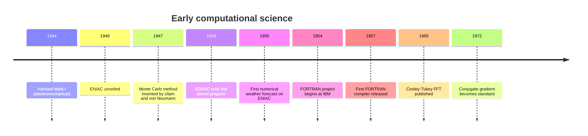
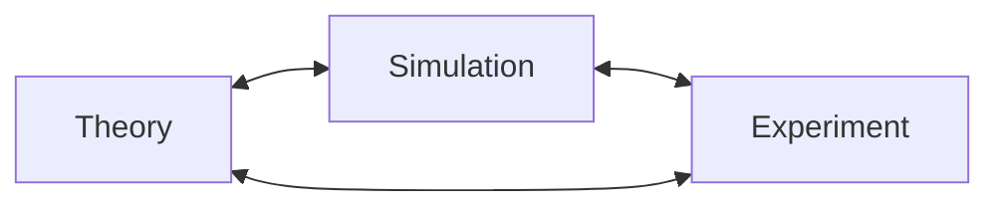

When the first electronic computers came online in the 1940s, they
did not merely speed up existing science. They invented an entirely
new way of doing science. Where theory and experiment had been the
two pillars of the scientific method since Galileo, a *third*
pillar appeared: **simulation**.

This page tells the story of how that pillar was raised, and
introduces vocabulary you will see throughout the rest of the
course — *time stepping*, *discretization*, *Monte Carlo*, *stiff
systems* — all of which were invented in the first decade of
computational science.

<svg
  viewBox="0 0 640 220"
  role="img"
  aria-label="Two faint classical pillars stand finished while a third pillar is being assembled from blue blocks, its capital still hovering above — simulation rising as the third pillar of science"
  style={{ display: "block", width: "100%", maxWidth: "640px", height: "auto", margin: "2.5rem auto" }}
>
  <g fill="currentColor">
    <rect x="60" y="190" width="520" height="6" rx="3" opacity="0.15" />
    <rect x="110" y="56" width="60" height="14" rx="7" opacity="0.25" />
    <rect x="120" y="70" width="40" height="120" rx="8" opacity="0.18" />
    <rect x="290" y="56" width="60" height="14" rx="7" opacity="0.25" />
    <rect x="300" y="70" width="40" height="120" rx="8" opacity="0.18" />
  </g>
  <g style={{ color: "var(--ds-blue-500)" }} fill="currentColor">
    <rect x="480" y="162" width="40" height="24" rx="6" />
    <rect x="480" y="134" width="40" height="24" rx="6" fillOpacity="0.8" />
    <rect x="480" y="106" width="40" height="24" rx="6" fillOpacity="0.6" />
    <rect x="480" y="78" width="40" height="24" rx="6" fillOpacity="0.4" />
    <rect x="470" y="42" width="60" height="14" rx="7" fillOpacity="0.3" />
    <circle cx="500" cy="66" r="3" fillOpacity="0.35" />
  </g>
</svg>

## ENIAC and the Manhattan Project

The Electronic Numerical Integrator and Computer (**ENIAC**),
unveiled at the University of Pennsylvania in 1946, could perform
about **5,000 additions per second** — roughly as many in one
second as a human computer would do in a month. It was built to
compute ballistics tables for the U.S. Army, but its first major
problem was different: a thermonuclear weapons calculation for
Los Alamos.

That calculation, performed in late 1945 by Stan Frankel, Nick
Metropolis, and Anthony Turkevich, ran for **six weeks** and
produced **a million** numerical results. The methods invented to
run it — punch-card input, batched arithmetic, deck-shuffling for
parallelism — are still recognizable in modern HPC pipelines.

## The Monte Carlo revolution

In 1946, while recovering from an illness, Stanislaw Ulam was
playing solitaire and wondering what fraction of randomly dealt
hands could be won. The combinatorics were intractable. Instead, he
realized, he could just *deal a lot of hands and count*.

He mentioned the idea to John von Neumann, who immediately saw it
could be applied to neutron diffusion — a problem Los Alamos was
struggling with. Within weeks they had a name (**Monte Carlo**,
after the casino), an algorithm, and ENIAC running the first
production code.

Monte Carlo is shockingly easy to demonstrate. Here is a five-line
program that estimates $\pi$ by throwing random darts at a square
and counting how many land inside the inscribed circle.

<CodeBlock
  adapter="python"
  files={[
    {
      filename: "main.py",
      starterCode: `import numpy as np

rng = np.random.default_rng(42)
n = 1_000_000
x, y = rng.uniform(-1, 1, n), rng.uniform(-1, 1, n)
inside = (x**2 + y**2) <= 1
pi_estimate = 4 * inside.mean()
print(f"Estimate of π from {n:,} samples: {pi_estimate:.6f}")
print(f"True value:                      {np.pi:.6f}")
`,
    },
  ]}
/>

The remarkable property is that this works for *any* integral, in
*any* number of dimensions, with an error that shrinks as
$1/\sqrt{N}$ regardless of dimension. We will return to Monte Carlo
in its own chapter near the end of the course.

## Numerical weather forecasting

In 1950, a small team led by John von Neumann and Jule Charney used
ENIAC to produce the first computer weather forecast. They
discretized the atmosphere over North America into a grid of about
**270 cells**, used a simplified set of equations called the
barotropic vorticity equation, and ran a 24-hour forecast.

It took **24 hours** to compute — a real-time forecast that finished
just in time to be irrelevant. But it was *qualitatively correct*,
and it kicked off a research program that, six decades later,
underlies every weather app on your phone.

Discretizing a continuous problem into a grid and stepping through
time is still the dominant pattern in computational science. Here
is the simplest possible version: the **1-D heat equation** showing
heat diffusing along a metal rod.

<CodeBlock
  adapter="python"
  files={[
    {
      filename: "main.py",
      starterCode: `import numpy as np
import matplotlib.pyplot as plt

# 1-D heat equation: ∂u/∂t = α ∂²u/∂x²
# Discretize on a grid of N cells, step forward in time with FTCS.

N = 100
L = 1.0  # rod length
alpha = 0.01  # thermal diffusivity
dx = L / N
dt = 0.4 * dx**2 / alpha  # stability requires dt <= dx²/(2α)
steps = 2000

u = np.zeros(N)
u[N // 2 - 5 : N // 2 + 5] = 1.0  # initial heat pulse in the middle

snapshots = [u.copy()]
for step in range(steps):
    u_new = u.copy()
    u_new[1:-1] = u[1:-1] + alpha * dt / dx**2 * (u[2:] - 2 * u[1:-1] + u[:-2])
    u = u_new
    if step % 400 == 0:
        snapshots.append(u.copy())

x = np.linspace(0, L, N)
for i, snap in enumerate(snapshots):
    plt.plot(x, snap, label=f"step {i * 400}")
plt.xlabel("position")
plt.ylabel("temperature")
plt.legend()
plt.title("Heat diffusion along a 1-D rod")
plt.show()
`,
    },
  ]}
/>

Notice the comment on the time-step `dt`. Pick a `dt` that is too
large and the simulation **explodes** — the numbers grow without
bound after a few steps even though the physics says the heat
should just smoothly diffuse. Try editing `0.4` to `0.6` and
re-running. This is your first encounter with a **stability
condition**, a concept invented in the late 1940s and now central to
every PDE solver in existence.

## A new scientific method

By the late 1950s the three-pillar picture was widely accepted. A
theorist could write down equations; a computational scientist
could simulate them at scales experiments could not reach; and an
experimentalist could test the predictions. The interplay between
the three is now so tight that fields like **computational
chemistry** and **computational fluid dynamics** are research
disciplines in their own right, with Nobel Prizes attached.

<Callout type="info" title="A Nobel Prize for simulation">
The 2013 Nobel Prize in Chemistry was awarded to Karplus, Levitt,
and Warshel "for the development of multiscale models for complex
chemical systems." The award was not for a new chemical discovery —
it was for the *numerical methods* that let chemists simulate
enzymes on a computer.
</Callout>

## The hardware ladder

Computational science is uniquely sensitive to hardware. Every time
processors got faster or memory got cheaper, a new class of problem
became tractable. The ladder, roughly:

| Era | Machine | Peak speed | New problems unlocked |
| --- | --- | --- | --- |
| 1946 | ENIAC | $5\times10^3$ ops/s | Ballistics, fission |
| 1954 | IBM 704 | $4\times10^4$ ops/s | Weather, FORTRAN |
| 1964 | CDC 6600 | $3\times10^6$ ops/s | Quantum chemistry |
| 1976 | Cray-1 | $1.6\times10^8$ ops/s | 3-D CFD |
| 1997 | ASCI Red | $1.3\times10^{12}$ ops/s | Full weapon simulation |
| 2008 | Roadrunner | $1.0\times10^{15}$ ops/s | Climate ensembles |
| 2022 | Frontier | $1.1\times10^{18}$ ops/s | Whole-cell biology, quantum-chemical AI |

Each rung is about a thousand times faster than the one before it,
and each one unlocked a research program that ran for a decade or
two.

## What the early years left us

The first decade of computational science gave us a remarkably
durable toolkit:

- **Time stepping** — march a system forward through small
  increments of time.
- **Discretization** — replace continuous fields with grids.
- **Iteration** — solve nonlinear problems by repeatedly applying
  cheaper linear ones.
- **Monte Carlo** — use random sampling to estimate integrals and
  rare events.
- **Stability analysis** — understand when a method amplifies error
  and when it doesn't.

Every one of these will appear in this course. None of them
requires a supercomputer to learn — they all run beautifully in the
Pyodide kernel powering this page.

## Check your understanding

<MultipleChoice
  markdown={`The first 24-hour numerical weather forecast in 1950 took 24 hours of compute time. What does the page identify as the *deepest* lesson from that experiment?

- That computers were too slow to be useful for weather
  > The page explicitly says the opposite: the forecast was qualitatively correct and kicked off the research program that underlies every modern weather app; it proved the method was viable, even if the hardware needed decades to catch up.
- [o] That discretizing a continuous physical problem onto a grid and stepping it forward in time was a viable scientific method
  > Even though the forecast was useless operationally, it proved the *pattern* — discretize + step + iterate — that now underlies every weather, climate, ocean, and atmospheric model.
- That the barotropic vorticity equation was not a useful approximation
  > The forecast was qualitatively correct, showing the barotropic vorticity equation was a useful approximation; the lesson was about the viability of discretisation-and-stepping, not a failure of the physics model.
- That FORTRAN was necessary for weather modeling
  > The 1950 forecast ran on ENIAC before FORTRAN existed (the first FORTRAN compiler was released in 1957); FORTRAN was not part of this experiment.

The pattern outlasted ENIAC and outlasted FORTRAN — it is still how a 2026 supercomputer thinks about the atmosphere.`}
/>

<MultipleChoice
  markdown={`In the 1-D heat equation example, why does the simulation explode when \`dt\` is set too large?

- The grid spacing becomes too coarse
  > Increasing \`dt\` does not change \`dx\` (the grid spacing); the explosion is a time-stepping stability issue, not a spatial resolution issue.
- [o] The numerical scheme violates the CFL stability condition: each step amplifies, rather than damps, the high-frequency error modes
  > The forward-time, centered-space (FTCS) scheme is *conditionally stable*. When $\\alpha \\, dt / dx^2 > 1/2$, the discrete update is no longer a contraction and any small round-off error grows exponentially.
- Python runs out of memory
  > The simulation array size does not change when \`dt\` increases; no additional memory is allocated, so memory exhaustion is not the cause.
- Matplotlib cannot plot the values
  > Matplotlib can plot any finite floating-point value; the explosion produces values so large they overflow to \`inf\` or \`nan\`, which is a numerical stability failure, not a plotting limitation.

Understanding *why* a scheme is stable or unstable is one of the most important parts of designing any time-marching simulation.`}
/>
