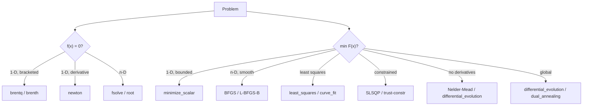

A staggering fraction of scientific work reduces to one of two
questions:

- **Root finding:** for what $x$ does $f(x) = 0$?
- **Optimization:** what $x$ makes $F(x)$ as small as possible?

They are deeply related: a minimum of smooth $F$ is a root of
$\nabla F$. SciPy bundles both behind `scipy.optimize`, and this
chapter gives you a tour of the right tool for each shape of
problem.

## A landscape of methods

## Root finding in one dimension

For 1-D problems where you can find an interval $[a, b]$ with
$f(a)\, f(b) < 0$, **always** use `brentq`. It guarantees
convergence, never escapes the bracket, and converges
super-linearly.

<CodeBlock
  adapter="python"
  starterCode={`import numpy as np
from scipy.optimize import brentq, newton

# Find where cos(x) = x  (a classic transcendental equation)
f = lambda x: np.cos(x) - x

root_b = brentq(f, 0, 1, xtol=1e-12)
print(f"brentq  : x = {root_b:.12f}   f(x) = {f(root_b):.2e}")

# Newton's method needs derivative and a good initial guess
fprime = lambda x: -np.sin(x) - 1
root_n = newton(f, x0=0.5, fprime=fprime, tol=1e-12)
print(f"newton  : x = {root_n:.12f}   f(x) = {f(root_n):.2e}")
`}
/>

Newton is fast when it works (*quadratic* convergence: digits
double each step) but can spectacularly diverge from a bad starting
point. `brentq` is the safe default; reach for Newton only when
speed matters *and* you have a reliable guess.

## Root finding in many dimensions

For systems of nonlinear equations, use `fsolve` (legacy) or
`scipy.optimize.root` (modern). Both default to a hybrid Powell
method — secant-based, derivative-free, generally robust.

<CodeBlock
  adapter="python"
  starterCode={`import numpy as np
from scipy.optimize import root

# Solve   x² + y² = 4,   x - y = 1
def F(v):
    x, y = v
    return [x*x + y*y - 4,
            x - y - 1]

sol = root(F, x0=[1.0, 0.0])
print(f"converged: {sol.success}")
print(f"root: {sol.x.round(8)}")
print(f"residual: {np.array(F(sol.x))}")
`}
/>

Like all gradient-driven solvers, `root` finds *a* solution near
your initial guess — there is another solution near $(-0.82,
-1.82)$ that requires a different start.

## Unconstrained minimization

The workhorse is `scipy.optimize.minimize`. For smooth problems
prefer the quasi-Newton methods **BFGS** (stores a dense Hessian
approximation, fine up to a few hundred variables) or **L-BFGS-B**
(limited memory, scales to millions of variables).

<CodeBlock
  adapter="python"
  starterCode={`import numpy as np
from scipy.optimize import minimize

# Rosenbrock's "banana" function — the standard optimization test bed
def rosen(x):
    return sum(100.0 * (x[1:] - x[:-1]**2)**2 + (1 - x[:-1])**2)

x0 = np.zeros(5)
res = minimize(rosen, x0, method="BFGS", tol=1e-10)
print("converged:", res.success, "  in", res.nit, "iterations")
print("minimum at:", res.x.round(6))
print("f(min) =", res.fun)
`}
/>

The Rosenbrock minimum is at $x^* = (1, 1, \dots, 1)$ with
$F(x^*) = 0$. BFGS finds it in a few dozen iterations from the
zero starting point.

### Supply gradients when you can

Finite-difference gradient estimation costs $O(n)$ function
evaluations per gradient. For any nontrivial problem, providing an
analytic gradient is the single largest performance win available.

<CodeBlock
  adapter="python"
  starterCode={`import numpy as np
from scipy.optimize import minimize

def rosen(x):
    return sum(100.0 * (x[1:] - x[:-1]**2)**2 + (1 - x[:-1])**2)

def rosen_grad(x):
    g = np.zeros_like(x)
    g[:-1] = -400*x[:-1]*(x[1:] - x[:-1]**2) - 2*(1 - x[:-1])
    g[1:] += 200*(x[1:] - x[:-1]**2)
    return g

x0 = np.zeros(20)
r1 = minimize(rosen, x0, method="BFGS")
r2 = minimize(rosen, x0, jac=rosen_grad, method="BFGS")
print(f"no jac:  {r1.nfev:>4d} f-evals, {r1.njev:>4d} jac-evals")
print(f"with jac:{r2.nfev:>4d} f-evals, {r2.njev:>4d} jac-evals")
`}
/>

## Bounded and constrained optimization

Real engineering problems have constraints. Variables live in
intervals; sums must equal one; physical quantities must be
non-negative. `minimize` supports both **box bounds** (per-variable
lower/upper) and **constraints** (equality or inequality
functions).

<CodeBlock
  adapter="python"
  starterCode={`import numpy as np
from scipy.optimize import minimize, NonlinearConstraint

# Minimize  (x-1)² + (y-2.5)² subject to  x + y ≥ 3,  x ≥ 0, y ≥ 0
def F(v): return (v[0] - 1)**2 + (v[1] - 2.5)**2

cons = NonlinearConstraint(lambda v: v[0] + v[1] - 3, lb=0, ub=np.inf)
bounds = [(0, None), (0, None)]

res = minimize(F, x0=[0.0, 0.0], method="trust-constr",
               bounds=bounds, constraints=cons)
print("solution:", res.x.round(6))
print("F at sol:", res.fun)
print("constraint value (≥ 0):", (res.x[0] + res.x[1] - 3).round(6))
`}
/>

## Nonlinear least squares and curve fitting

Fitting a model $\hat y_i = m(x_i;\theta)$ to data by minimizing
$\sum_i (y_i - \hat y_i)^2$ is the most common optimization in
science. Don't use generic `minimize` for it — use
`scipy.optimize.curve_fit` or `least_squares`, which exploit the
sum-of-squares structure for faster, more reliable convergence.

<CodeBlock
  adapter="python"
  starterCode={`import numpy as np
import matplotlib.pyplot as plt
from scipy.optimize import curve_fit

# Synthetic decaying-cosine data
rng = np.random.default_rng(0)
t  = np.linspace(0, 4, 80)
A_true, k_true, omega_true, phi_true = 2.0, 0.7, 5.0, 0.3
y  = A_true * np.exp(-k_true * t) * np.cos(omega_true * t + phi_true)
y += 0.1 * rng.standard_normal(t.size)

def model(t, A, k, omega, phi):
    return A * np.exp(-k * t) * np.cos(omega * t + phi)

popt, pcov = curve_fit(model, t, y, p0=[1, 1, 4, 0])
perr = np.sqrt(np.diag(pcov))

print("parameter   estimate ± 1σ")
for name, est, sig in zip(["A", "k", "omega", "phi"], popt, perr):
    print(f"  {name:5s}    {est:8.4f} ± {sig:.4f}")

plt.plot(t, y, "o", ms=4, label="data")
plt.plot(t, model(t, *popt), "-", label="fit")
plt.legend(); plt.show()
`}
/>

The covariance matrix `pcov` gives you parameter uncertainties for
free — invaluable for reporting confidence intervals.

## Global optimization

Local solvers like BFGS find the *nearest* minimum. When your
landscape has many local minima, use **global** methods:
`differential_evolution`, `dual_annealing`, `basinhopping`,
`shgo`.

<CodeBlock
  adapter="python"
  starterCode={`import numpy as np
from scipy.optimize import differential_evolution, minimize

# Rastrigin: highly multimodal, global minimum at the origin
def rastrigin(x, A=10):
    return A*len(x) + sum(xi*xi - A*np.cos(2*np.pi*xi) for xi in x)

bounds = [(-5.12, 5.12)] * 4
res_local = minimize(rastrigin, x0=[3, -2, 4, -1])
res_global = differential_evolution(rastrigin, bounds, seed=0, tol=1e-10)

print(f"local (BFGS):       f = {res_local.fun:.4f}  x ≈ {res_local.x.round(2)}")
print(f"global (diff-evol): f = {res_global.fun:.4f}  x ≈ {res_global.x.round(2)}")
`}
/>

BFGS gets stuck in some random local hole; differential evolution
finds the true minimum at the origin.

## A multi-file fitting workflow

<CodeBlock
  adapter="python"
  entryFilename="main.py"
  files={[
    {
      filename: "main.py",
      initialContent: `import numpy as np
import matplotlib.pyplot as plt
from fit import fit_gaussian, gaussian

rng = np.random.default_rng(0)
x  = np.linspace(-3, 6, 200)
y  = gaussian(x, amp=3.0, mu=1.5, sigma=0.8) + 0.1*rng.standard_normal(x.size)

params, errors = fit_gaussian(x, y)
print("estimated parameters (amp, mu, sigma):", params.round(3))
print("1-σ uncertainties                    :", errors.round(3))

plt.plot(x, y, "o", ms=3, label="data")
plt.plot(x, gaussian(x, *params), "r-", lw=2, label="fit")
plt.legend(); plt.show()
`,
    },
    {
      filename: "fit.py",
      initialContent: `import numpy as np
from scipy.optimize import curve_fit

def gaussian(x, amp, mu, sigma):
    return amp * np.exp(-((x - mu) / sigma) ** 2 / 2)

def fit_gaussian(x, y):
    """Fit a Gaussian peak; return (params, 1-sigma errors)."""
    # Sensible initial guesses from the data
    p0 = [y.max() - y.min(),
          x[np.argmax(y)],
          (x.max() - x.min()) / 6]
    popt, pcov = curve_fit(gaussian, x, y, p0=p0)
    perr = np.sqrt(np.diag(pcov))
    return popt, perr
`,
    },
  ]}
/>

The `p0` heuristic — peak height, peak location, width — is the
kind of *domain knowledge* that makes the difference between a fit
that converges and one that wanders off into nonsense.

## Challenge: implement Newton's method

<ChallengeCard
  adapter="python"
  title="Newton's method for scalar roots"
  instructions={`Implement \`newton_root(f, fprime, x0, tol=1e-10, max_iter=100)\` that returns the root of $f$ found by Newton's iteration

$$x_\{n+1\} = x_n - f(x_n)/f'(x_n)$$

starting from \`x0\`. Stop when $|f(x_n)| < \\text\{tol\}$ or when \`max_iter\` is exceeded (raise \`RuntimeError\` in that case).

Test cases use $f(x) = x^2 - 2$ and $f(x) = \\cos x - x$, both with known good initial guesses.`}
  starterCode={`def newton_root(f, fprime, x0, tol=1e-10, max_iter=100):
    # TODO: implement
    return 0.0
`}
  solutionCode={`def newton_root(f, fprime, x0, tol=1e-10, max_iter=100):
    x = float(x0)
    for _ in range(max_iter):
        fx = f(x)
        if abs(fx) < tol:
            return x
        x = x - fx / fprime(x)
    raise RuntimeError("Newton did not converge")
`}
  tests={[
    {
      id: "sqrt2",
      name: "√2 from x0 = 1.5",
      code: "import math\nf = lambda x: x*x - 2\nfp = lambda x: 2*x\nassert math.isclose(newton_root(f, fp, 1.5), math.sqrt(2), abs_tol=1e-9)",
    },
    {
      id: "cos_x",
      name: "cos(x) = x from x0 = 0.5",
      code: "import math\nf = lambda x: math.cos(x) - x\nfp = lambda x: -math.sin(x) - 1\nassert math.isclose(newton_root(f, fp, 0.5), 0.7390851332151607, abs_tol=1e-8)",
    },
    {
      id: "raises",
      name: "Raises when not converging",
      code: "import pytest\nwith pytest.raises(RuntimeError):\n    newton_root(lambda x: x*x + 1, lambda x: 2*x, 1.0, max_iter=20)",
    },
  ]}
/>

## Check your understanding

<MultipleChoice
  markdown={`You want to find the unique root of a continuous 1-D function in $[0, 5]$. You know $f(0) > 0$ and $f(5) < 0$. Which solver should you reach for?

- \`scipy.optimize.newton\` because it converges quadratically
- [o] \`scipy.optimize.brentq\` because the sign change guarantees a bracketed root and Brent's method is unconditionally convergent
  > Yes. With a guaranteed sign change you should always prefer a bracketing solver. Brent's method never leaves the bracket, doesn't need a derivative, and converges super-linearly. Newton needs a derivative and can wander off.
- \`scipy.optimize.differential_evolution\`
- \`scipy.optimize.minimize\` on $f^2$

When a bracket exists, bracketing methods are virtually always the right choice.`}
/>

<MultipleChoice
  markdown={`You have a least-squares fitting problem: minimize $\\sum_i (y_i - m(x_i;\\theta))^2$. Why is \`scipy.optimize.curve_fit\` (or \`least_squares\`) a better default than passing the sum-of-squares objective into generic \`minimize\`?

- It uses less memory
- [o] It exploits the sum-of-squares structure (Jacobian of residuals via the Levenberg–Marquardt algorithm) for faster, more reliable convergence, and returns parameter covariances for free
  > Right. The residual Jacobian is far more informative than the gradient of the squared loss; LM combines Gauss–Newton with trust-region damping to get robust quadratic-ish convergence. Plus \`curve_fit\` returns the covariance matrix you need for uncertainty bars — which generic \`minimize\` would not give you.
- It always finds the global minimum
- It only works for linear models

Match the algorithm to the *structure* of the problem — least squares is special enough to deserve its own solver.`}
/>
