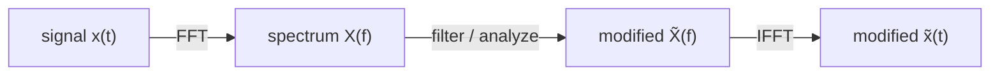

Any signal — an audio waveform, a stock price, an EEG trace, a
radar return — can be decomposed into the building blocks it is
made of. **Signal processing** is the toolkit for doing that
decomposition, removing what you don't want, and extracting what
you do.

The technique that ties it all together is the **Fourier
transform**: a way to look at a signal not as a function of *time*
but as a function of *frequency*.

## The big idea: time vs frequency

A pure sine wave at 5 Hz looks like a peak at exactly 5 in
frequency space. A square wave looks like a comb of odd harmonics.
Noise looks like a flat spectrum. Music looks like a moving cloud
of peaks. Once you can see a signal in frequency space, filtering
and analysis become almost trivial.

## The Discrete Fourier Transform (and FFT)

For a sampled signal $x_0, x_1, \dots, x_\{N-1\}$, the DFT is

$$
X_k = \sum_\{n=0\}^\{N-1\} x_n \, e^\{-2\pi i k n / N\}, \quad k = 0, \dots, N-1.
$$

A naive evaluation costs $O(N^2)$ multiplications. The **Fast
Fourier Transform** computes the same result in $O(N \log N)$ — a
speed-up that turned spectral analysis from a research project
into a routine operation.

<CodeBlock
  adapter="python"
  initialCode={`import numpy as np
import matplotlib.pyplot as plt

fs = 1000           # sample rate, Hz
T  = 2.0            # duration, seconds
t  = np.arange(0, T, 1/fs)

# Signal: 50 Hz + 120 Hz + noise
rng = np.random.default_rng(0)
x = (0.6 * np.sin(2*np.pi*50*t)
   + 0.4 * np.sin(2*np.pi*120*t)
   + 0.3 * rng.standard_normal(t.size))

X = np.fft.rfft(x)                   # real-input FFT (only positive freqs)
f = np.fft.rfftfreq(t.size, 1/fs)
mag = np.abs(X) / t.size * 2         # convert to physical amplitude

fig, ax = plt.subplots(1, 2, figsize=(10, 3))
ax[0].plot(t[:200], x[:200]); ax[0].set_xlabel("time (s)")
ax[0].set_title("first 200 ms of noisy signal")
ax[1].plot(f, mag); ax[1].set_xlim(0, 200); ax[1].set_xlabel("frequency (Hz)")
ax[1].set_title("FFT magnitude spectrum")
plt.tight_layout(); plt.show()
`}
/>

The noisy time-domain plot looks like garbage; the spectrum reveals
two clean peaks exactly at 50 and 120 Hz, with a roughly flat noise
floor. This is the power of the FFT in one image.

## Three things that bite beginners

- **Aliasing.** A signal sampled at $f_s$ can only represent
  frequencies below $f_s / 2$ (the **Nyquist** limit). Anything
  faster appears as a ghost at a lower frequency.
- **Spectral leakage.** Truncating a signal to a finite window
  smears each spectral line into a sinc. Multiply by a tapered
  *window* (Hann, Hamming, Blackman) to control the smear.
- **Units.** `np.fft.rfftfreq(N, d)` returns frequencies in Hz when
  `d` is the sample spacing in seconds. Always pass the sample
  spacing.

<CodeBlock
  adapter="python"
  initialCode={`import numpy as np
import matplotlib.pyplot as plt
from scipy.signal import get_window

fs, T = 1000, 1.0
t = np.arange(0, T, 1/fs)
x = np.sin(2*np.pi*50.5*t)         # NOT a whole number of cycles

X_rect = np.abs(np.fft.rfft(x))
X_hann = np.abs(np.fft.rfft(x * get_window("hann", t.size)))
f = np.fft.rfftfreq(t.size, 1/fs)

plt.semilogy(f, X_rect, label="rectangular window")
plt.semilogy(f, X_hann, label="Hann window")
plt.xlim(0, 200); plt.xlabel("Hz"); plt.legend()
plt.title("Windowing tames spectral leakage")
plt.show()
`}
/>

The rectangular window's spectrum is a wide sinc that leaks energy
into nearby bins. The Hann window concentrates the energy into a
much narrower peak. Always window non-periodic signals.

## Designing a digital filter

When you want to *remove* unwanted frequencies, you design a
filter. The most useful workhorse is the **Butterworth IIR
filter**, applied with `sosfiltfilt` for zero-phase response.

<CodeBlock
  adapter="python"
  initialCode={`import numpy as np
import matplotlib.pyplot as plt
from scipy.signal import butter, sosfiltfilt

fs = 1000
t  = np.arange(0, 2, 1/fs)
rng = np.random.default_rng(0)
clean = np.sin(2*np.pi*5*t)                          # the signal we want
noise = 0.5*np.sin(2*np.pi*120*t) + 0.3*rng.standard_normal(t.size)
x = clean + noise

# 4th-order low-pass at 20 Hz, expressed in second-order sections
sos = butter(N=4, Wn=20, btype="low", fs=fs, output="sos")
y = sosfiltfilt(sos, x)

fig, ax = plt.subplots(2, 1, figsize=(9, 4), sharex=True)
ax[0].plot(t, x);     ax[0].set_title("noisy")
ax[1].plot(t, y);     ax[1].set_title("after Butterworth low-pass")
plt.xlabel("time (s)"); plt.tight_layout(); plt.show()
`}
/>

Why **`sosfiltfilt`** instead of `lfilter`?

- It runs the filter *forward then backward*, canceling the phase
  delay (zero-phase response).
- The "sos" (second-order sections) form is numerically stable for
  higher orders; the equivalent transfer-function (b, a) form
  often blows up past order 6 or so.

## Time-frequency analysis: the spectrogram

Real signals change over time. A single FFT averages the whole
duration; a **spectrogram** slides a windowed FFT along the signal
to show how its frequency content evolves.

<CodeBlock
  adapter="python"
  initialCode={`import numpy as np
import matplotlib.pyplot as plt
from scipy.signal import spectrogram

fs = 4000
t = np.arange(0, 4, 1/fs)
# A linear chirp from 100 Hz to 800 Hz
x = np.sin(2*np.pi * (100*t + (700/2/4)*t**2))

f, tt, Sxx = spectrogram(x, fs=fs, nperseg=512, noverlap=384)
plt.pcolormesh(tt, f, 10*np.log10(Sxx + 1e-12), shading="auto")
plt.ylim(0, 1000)
plt.xlabel("time (s)"); plt.ylabel("frequency (Hz)")
plt.title("chirp spectrogram"); plt.colorbar(label="dB")
plt.show()
`}
/>

The bright diagonal stripe traces the instantaneous frequency
rising linearly from 100 to 800 Hz — exactly the chirp law we
wrote down. The spectrogram is how everything from speech
recognition to gravitational-wave analysis visualizes
non-stationary signals.

## Convolution

Convolution $y[n] = \sum_k x[k]\, h[n-k]$ is the most fundamental
operation in linear systems theory. It is also the basis of every
finite-impulse-response (FIR) filter and every convolutional
layer in a neural network.

<CodeBlock
  adapter="python"
  initialCode={`import numpy as np
import matplotlib.pyplot as plt
from scipy.signal import convolve

# Smooth a noisy signal by convolving with a moving-average kernel
t = np.linspace(0, 2*np.pi, 400)
rng = np.random.default_rng(0)
x = np.sin(t) + 0.4*rng.standard_normal(t.size)

K = 20
kernel = np.ones(K) / K          # moving-average filter
y = convolve(x, kernel, mode="same")

plt.plot(t, x, alpha=0.5, label="raw")
plt.plot(t, y, lw=2, label=f"{K}-pt moving average")
plt.legend(); plt.show()
`}
/>

For large signals or large kernels, use `scipy.signal.fftconvolve`,
which exploits the **convolution theorem** ($\,x*h \leftrightarrow
X \cdot H$ in the frequency domain) to run in $O(N \log N)$ instead
of $O(N \cdot K)$.

## A multi-file denoising pipeline

<CodeBlock
  adapter="python"
  entryFilename="main.py"
  files={[
    {
      filename: "main.py",
      initialContent: `import numpy as np
import matplotlib.pyplot as plt
from pipeline import generate_signal, denoise

fs = 2000
t, clean, noisy = generate_signal(fs=fs, T=2.0, seed=0)
recovered = denoise(noisy, fs=fs, cutoff=30.0, order=6)

fig, ax = plt.subplots(3, 1, figsize=(9, 5), sharex=True)
ax[0].plot(t, clean);     ax[0].set_title("clean signal")
ax[1].plot(t, noisy);     ax[1].set_title("noisy measurement")
ax[2].plot(t, recovered); ax[2].set_title("low-pass recovered")
plt.xlabel("time (s)"); plt.tight_layout(); plt.show()

rmse = np.sqrt(np.mean((recovered - clean) ** 2))
print(f"RMSE after denoising: {rmse:.4f}")
`,
    },
    {
      filename: "pipeline.py",
      initialContent: `import numpy as np
from scipy.signal import butter, sosfiltfilt

def generate_signal(fs=2000, T=2.0, seed=0):
    rng = np.random.default_rng(seed)
    t = np.arange(0, T, 1/fs)
    clean = np.sin(2*np.pi*4*t) + 0.5*np.sin(2*np.pi*9*t)
    noise = 0.6*np.sin(2*np.pi*180*t) + 0.4*rng.standard_normal(t.size)
    return t, clean, clean + noise

def denoise(x, fs, cutoff=30.0, order=6):
    """Zero-phase Butterworth low-pass."""
    sos = butter(order, cutoff, btype="low", fs=fs, output="sos")
    return sosfiltfilt(sos, x)
`,
    },
  ]}
/>

This pattern — generate → measure → filter → quantify — is the
template for almost every signal-processing experiment.

## Check your understanding

<MultipleChoice
  markdown={`You sample a signal at $f_s = 1000$ Hz and want to detect a tone at $700$ Hz. What happens?

- The FFT shows a peak at 700 Hz
- [o] The 700 Hz tone is *aliased* to $|700 - 1000| = 300$ Hz because it lies above the Nyquist limit $f_s/2 = 500$ Hz
  > Yes. The Nyquist–Shannon theorem says you can only faithfully represent frequencies below $f_s/2$. A 700 Hz sinusoid sampled at 1000 Hz is indistinguishable from a 300 Hz sinusoid — they alias. To detect 700 Hz, raise the sample rate above 1400 Hz.
- The FFT shows two peaks: one at 700 Hz and one at 300 Hz
- The FFT returns NaN

Aliasing is irreversible once you've sampled. Anti-alias filter *before* the ADC, not after.`}
/>

<MultipleChoice
  markdown={`Why is \`scipy.signal.sosfiltfilt\` typically preferred over \`scipy.signal.lfilter\` for offline filtering?

- It runs on the GPU
- [o] It performs a forward-then-backward pass for zero phase distortion *and* uses the numerically stable second-order-sections form for higher-order filters
  > Right. \`lfilter\` is causal and introduces a frequency-dependent delay that smears features; \`filtfilt\` cancels that delay. The \`sos\` form avoids the catastrophic ill-conditioning of high-order transfer functions. Combined, \`sosfiltfilt\` is the safe default for offline analysis.
- It always returns integer results
- It uses less memory

For real-time / causal applications you do need \`lfilter\` (or \`sosfilt\`), but for offline analysis, \`sosfiltfilt\` should be your default.`}
/>
