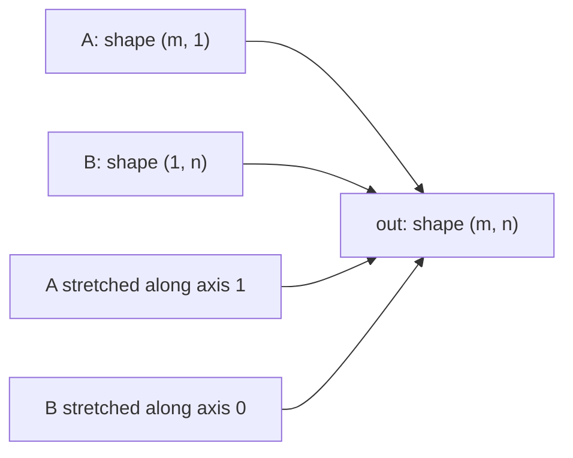

There is one habit that separates a programmer using NumPy from a
*scientist* using NumPy: **vectorization**. A vectorized expression
describes what should happen to *every* element of an array in one
algebraic statement, rather than walking through the elements with a
Python loop.

Vectorization matters for three reasons:

1. **Speed.** A vectorized operation runs in compiled C/FORTRAN at
   memory-bandwidth speed; a Python loop runs in the interpreter at
   roughly $1000\times$ slower.
2. **Clarity.** A formula reads like the mathematics it implements.
3. **Composability.** Vectorized pieces can be combined, sliced,
   reduced, and broadcast without rewriting.

This page is the bridge between the *foundations* you have just
learned and the rest of the course. After this page, every example
will assume you think in arrays.

## The single most important benchmark

<CodeBlock
  adapter="python"
  initialCode={`import numpy as np
import time

N = 1_000_000
xs = np.linspace(0, 2*np.pi, N)

# Python loop
t0 = time.perf_counter()
out_loop = [0.0]*N
for i in range(N):
    out_loop[i] = np.sin(xs[i]) ** 2
t1 = time.perf_counter()

# Vectorized NumPy
t2 = time.perf_counter()
out_vec = np.sin(xs) ** 2
t3 = time.perf_counter()

print(f"Python loop : {t1 - t0:.3f} s")
print(f"NumPy vector: {t3 - t2:.3f} s")
print(f"Speedup     : {(t1 - t0) / (t3 - t2):.0f}x")
`}
/>

The speedup is usually 100–1000$\times$. The loop version is doing
exactly the same arithmetic, but each iteration also pays for a
Python bytecode dispatch, an attribute lookup on `np`, a function
call, and the wrapping of a `float` into a `numpy.float64` and back.

## How NumPy actually runs

Every NumPy *universal function* (ufunc) — `np.sin`, `np.add`,
`np.exp`, `np.minimum`, ... — is a compiled C loop that processes
contiguous blocks of memory using the CPU's vector instructions
(SSE, AVX, NEON). You get the speed of FORTRAN because the inner
loop *is* the FORTRAN-equivalent inner loop.

The full hierarchy of "things that go fast":

| Layer | What it does | Cost per element |
| --- | --- | --- |
| Python `for` over a list | Interpreted bytecode | ~$10^{-6}$ s |
| Python `for` over an ndarray | Same, plus boxing/unboxing | ~$10^{-6}$ s |
| `np.vectorize` | Cosmetic wrapper around a Python function — *not* fast | ~$10^{-6}$ s |
| NumPy ufunc / arithmetic | Compiled SIMD loop | ~$10^{-9}$ s |
| BLAS routine (matmul, etc.) | Heavily tuned blocked algorithm | ~$10^{-10}$ s |
| GPU | Massively parallel | ~$10^{-11}$ s |

**Almost every speedup in scientific Python comes from moving one
layer down this table.**

## Broadcasting: the killer feature

Broadcasting lets arrays of different shapes interact as if they
were the same shape, by *virtually* stretching the smaller one along
its size-1 dimensions. It is the rule that turns NumPy from
"FORTRAN with batteries" into "tensor algebra with notation."

The rules: line up shapes from the right; each pair of dimensions
must either match or one must be $1$.

The classic example: an outer product written as broadcasting.

<CodeBlock
  adapter="python"
  initialCode={`import numpy as np

x = np.arange(1, 6)          # shape (5,)
y = np.arange(1, 4)          # shape (3,)

# Reshape so the trailing dims line up:
#   x[:, None] has shape (5, 1)
#   y[None, :] has shape (1, 3)
# Broadcasting gives a (5, 3) outer product:
M = x[:, None] * y[None, :]
print(M)
print("shape =", M.shape)
`}
/>

You will see `x[:, None]` and `y[None, :]` everywhere in scientific
Python. It is the idiom for "promote this 1-D vector to a 2-D
column" or "row." Once you internalize it, multi-dimensional
operations become as easy to write as one-dimensional ones.

## A non-trivial vectorization

Suppose you have a cloud of $N$ points in 2-D and you want the
**pairwise distance matrix**: $D_{ij} = \\|p_i - p_j\\|$. The
explicit Python is two nested loops. The vectorized version is two
lines.

<CodeBlock
  adapter="python"
  initialCode={`import numpy as np

rng = np.random.default_rng(0)
pts = rng.uniform(0, 10, size=(8, 2))      # 8 points in 2-D

# pts[:, None, :] has shape (8, 1, 2)  — column of point pairs
# pts[None, :, :] has shape (1, 8, 2)  — row of point pairs
# Their difference broadcasts to shape (8, 8, 2)
diff = pts[:, None, :] - pts[None, :, :]
D = np.sqrt((diff ** 2).sum(axis=-1))      # collapse the coord axis

print(D.round(2))
print("symmetric?", np.allclose(D, D.T))
`}
/>

The same trick generalizes to $D$-dimensional point clouds, signed
differences, weighted distances, etc. No loops are ever written.

## Reductions and axes

Most NumPy aggregation functions accept an `axis=` argument. Picking
the right axis is sometimes the entire numerical content of an
operation.

<CodeBlock
  adapter="python"
  initialCode={`import numpy as np

# A small dataset: 6 patients × 4 measurements
X = np.array([
    [120, 80, 70,  98],   # systolic, diastolic, heart rate, oxygen
    [135, 85, 75,  97],
    [110, 70, 65,  99],
    [150, 95, 80,  96],
    [125, 82, 72,  98],
    [140, 90, 78,  97],
])

print("X.shape =", X.shape)
print("mean per measurement (axis=0):", X.mean(axis=0))   # one value per column
print("mean per patient    (axis=1):", X.mean(axis=1))   # one value per row
print("grand mean          (no axis):", X.mean())         # one number
`}
/>

Forgetting which axis is which is the source of about half of all
scientific Python bugs. A useful mnemonic: **`axis=k` means "collapse
the $k$-th axis"**. Whatever axis you name disappears from the shape
of the result.

## When *not* to vectorize

Vectorization is wonderful but not magical. A few situations call
for something else.

- **The algorithm is fundamentally sequential.** Iterating a
  recurrence one element at a time (`x_{n+1} = f(x_n)`) cannot be
  vectorized without changing the math.
- **Memory is the bottleneck.** A vectorized expression that
  allocates an enormous temporary array can be slower than a loop
  that touches one element at a time. Use `numexpr` or write a
  Numba/Cython loop.
- **The inner step is complicated.** When the per-element work is a
  full sub-algorithm, JIT compilation (Numba) or explicit
  parallelism (Dask, multiprocessing) wins.

A multi-file example: a Numba-style numerical kernel separated from
its driver. We will mimic Numba with a plain function since Numba
is not preinstalled, but the *structure* is identical to a
production setup.

<CodeBlock
  adapter="python"
  entryFilename="main.py"
  files={[
    {
      filename: "main.py",
      initialContent: `import numpy as np
from kernels import logistic_map_trajectory

r, x0, n = 3.8, 0.2, 50
traj = logistic_map_trajectory(r, x0, n)
print("First 10 iterates:", np.round(traj[:10], 4))
print("Long-run mean    :", traj[1000:].mean() if n > 1000 else traj.mean())
`,
    },
    {
      filename: "kernels.py",
      initialContent: `import numpy as np

def logistic_map_trajectory(r: float, x0: float, n: int) -> np.ndarray:
    """Iterate x_{t+1} = r * x_t * (1 - x_t).

    The recurrence is sequential and therefore *not* vectorizable
    along time. Vectorization shines for *ensemble* runs over many r
    or x0 in parallel — see the second example.
    """
    x = np.empty(n)
    x[0] = x0
    for t in range(n - 1):
        x[t+1] = r * x[t] * (1.0 - x[t])
    return x
`,
    },
  ]}
/>

But the *parameter sweep* over many `r` values *is* embarrassingly
parallel, and that part vectorizes beautifully — every $r$
trajectory runs independently:

<CodeBlock
  adapter="python"
  initialCode={`import numpy as np
import matplotlib.pyplot as plt

# Bifurcation diagram of the logistic map
n_r, n_iter, n_keep = 1000, 1000, 200
r = np.linspace(2.5, 4.0, n_r)        # shape (n_r,)
x = 0.5 * np.ones_like(r)              # shape (n_r,)
xs = np.empty((n_keep, n_r))

for t in range(n_iter):
    x = r * x * (1 - x)
    if t >= n_iter - n_keep:
        xs[t - (n_iter - n_keep)] = x

plt.figure(figsize=(8, 4))
plt.plot(np.broadcast_to(r, xs.shape).ravel(),
         xs.ravel(), ",k", alpha=0.25)
plt.xlabel("r"); plt.ylabel("x*")
plt.title("Logistic-map bifurcation diagram (vectorized over r)")
plt.show()
`}
/>

We ran 1000 independent trajectories simultaneously, with no
explicit parallelism — broadcasting did it for us.

## Memory layout matters

NumPy arrays are *contiguous* by default and laid out in **C order**
(row-major): the last axis varies fastest in memory. FORTRAN-order
arrays (column-major) exist for compatibility with old libraries.

The order matters because accessing memory in the order it is laid
out is roughly $10\times$ faster than jumping around — CPU caches
work best on contiguous reads.

<CodeBlock
  adapter="python"
  initialCode={`import numpy as np
import time

n = 10_000
A = np.random.default_rng(0).standard_normal((n, n))

t0 = time.perf_counter()
sum_rows = A.sum(axis=1)       # walks each row contiguously
t1 = time.perf_counter()

t2 = time.perf_counter()
sum_cols = A.sum(axis=0)       # walks each column with stride n
t3 = time.perf_counter()

print(f"sum(axis=1) [contiguous] : {t1 - t0:.3f} s")
print(f"sum(axis=0) [strided]    : {t3 - t2:.3f} s")
`}
/>

The difference is usually 2–5$\times$. For deeply nested
reductions, restructuring an array to make the hot axis the last
one can be a free speedup.

## Vectorization checklist

When you sit down to translate a formula into NumPy, ask:

1. **What is the natural shape of the inputs?** Make them arrays of
   that shape.
2. **What dimensions need to broadcast?** Insert `None` or call
   `np.newaxis`/`reshape` to align them.
3. **Which axis am I reducing?** Pass it explicitly as `axis=`.
4. **Is there an existing ufunc?** Reach for `np.where`, `np.clip`,
   `np.minimum`, `np.einsum`, before you start writing a loop.
5. **Did I accidentally fall back to Python?** Look for `for`
   loops, `map`, list comprehensions, or `np.vectorize` — if you
   see them, ask whether they can be lifted into a ufunc.

## Check your understanding

<MultipleChoice
  markdown={`What does \`x[:, None]\` produce, given a 1-D array \`x\` of shape \`(n,)\`?

- A scalar
- An array of shape \`(1, n)\`
- [o] An array of shape \`(n, 1)\` — a "column vector" view of \`x\`
  > Right. \`None\` (a synonym for \`np.newaxis\`) inserts a length-1 axis at that position. Combined with \`y[None, :]\`, this is the standard idiom for outer-product-style broadcasting.
- A copy of \`x\` with no change in shape

This idiom is one of the most common ways to set up a broadcast.`}
/>

<MultipleChoice
  markdown={`A colleague's NumPy code uses \`np.vectorize\` to call a complicated Python function over an array of shape \`(10**6,)\`. They report it is "as fast as native NumPy." What is most likely going on?

- They are correct — \`np.vectorize\` is a compiled inner loop
- [o] They are mistaken — \`np.vectorize\` is a cosmetic wrapper around a Python loop and runs at Python speed. It looks like NumPy but is not vectorized in the compiled sense
  > Yes. \`np.vectorize\` exists to give a "ufunc-shaped" API to a Python function, not to speed it up. The docs explicitly warn it is "provided primarily for convenience, not for performance."
- They are benchmarking the wrong array
- \`np.vectorize\` JIT-compiles to C on first call

When you really need a fast custom ufunc, use Numba, Cython, or rewrite the operation as a composition of existing NumPy primitives.`}
/>
