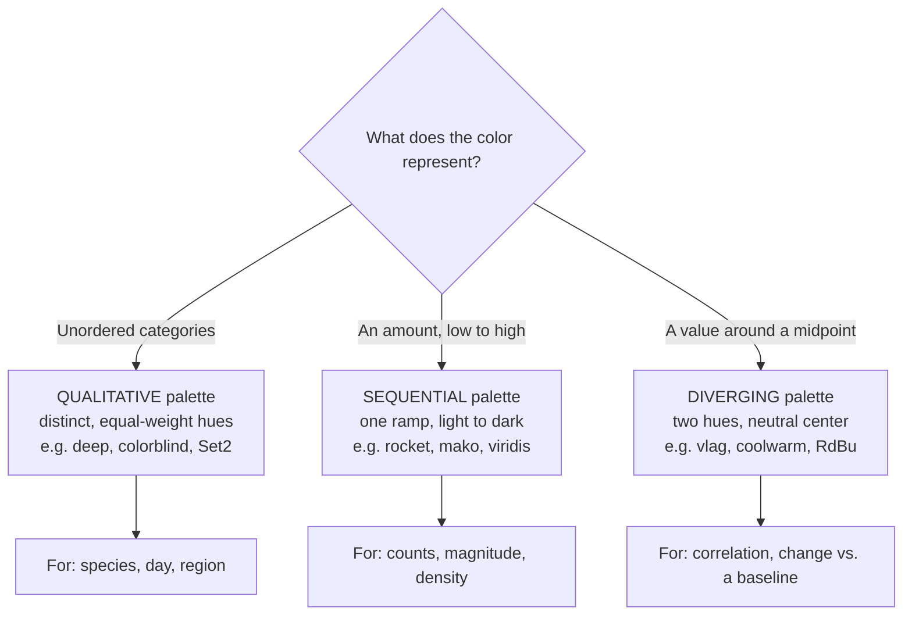

Color is one of the most powerful channels in a chart — and one of the
easiest to misuse. The single most important idea is this: **the *kind* of
palette you choose must match the *kind* of data it represents.** Get that
wrong and the colors will quietly tell a story the data never said.

Seaborn gives you three families of palettes for three kinds of data.

## Three palette types for three kinds of data

- **Qualitative** palettes use distinct hues of roughly equal visual weight.
  They're for **unordered categories** (species, day, region), where no color
  should look "more" than another.
- **Sequential** palettes ramp a single hue from light to dark. They're for
  an **ordered amount** that runs low → high (counts, magnitude, density).
- **Diverging** palettes put two contrasting hues at the ends and a neutral
  color in the middle. They're for values with a **meaningful midpoint**
  (correlation around 0, change above/below a baseline).

The mismatch is the danger: a sequential ramp on unordered categories
invents a ranking; a single-hue sequential map on signed data hides which
side of zero you're on. Match the palette to the data and the color does
honest work.

## Qualitative: distinct colors for categories

When `hue` is a categorical column, Seaborn uses a qualitative palette. Pick
one with `palette=`:

<CodeBlock
  adapter="python"
  starterCode={`import seaborn as sns

sns.set_theme(style="whitegrid")
penguins = sns.load_dataset("penguins")

# 'deep' is Seaborn's default qualitative palette: distinct, balanced hues.
sns.relplot(
    data=penguins, x="bill_length_mm", y="bill_depth_mm",
    hue="species", palette="deep",
    height=4,
)
`}
/>

No species should look bigger or more important than another, and a
qualitative palette respects that — every hue carries equal weight.

<Callout type="warn" title="Don't use a gradient for unordered groups">
Coloring unordered categories with a *sequential* palette (a light-to-dark
ramp) implies an order that isn't there — the reader will assume the dark
category is "more" than the light one. Keep gradients for genuine amounts.
</Callout>

## Sequential: a ramp for amounts

When `hue` is a continuous amount, a sequential palette maps small → light
and large → dark. Seaborn's `rocket`, `mako`, `flare`, and `crest`, plus
matplotlib's `viridis`, are all good choices:

<CodeBlock
  adapter="python"
  starterCode={`import seaborn as sns

sns.set_theme(style="whitegrid")
penguins = sns.load_dataset("penguins")

# body_mass_g is an amount -> a sequential ramp + a colorbar.
sns.relplot(
    data=penguins, x="bill_length_mm", y="bill_depth_mm",
    hue="body_mass_g", palette="viridis",
    height=4,
)
`}
/>

<Callout type="info" title="Why viridis and rocket, not jet/rainbow">
Good sequential palettes are **perceptually uniform**: equal steps in the
data look like equal steps in color, and lightness increases steadily so the
order is unmistakable (even in grayscale). The old `jet`/rainbow maps are
*not* — they have bright bands that read as ridges where the data is flat,
inventing structure. Prefer `rocket`, `mako`, `viridis`, `magma`.
</Callout>

## Diverging: two directions from a center

When values spread out from a meaningful middle, a diverging palette gives
each direction its own hue and marks the center as neutral. The classic case
is a correlation matrix (centered at 0), which you met in the heatmaps
chapter:

<CodeBlock
  adapter="python"
  starterCode={`import seaborn as sns

sns.set_theme(style="white")
penguins = sns.load_dataset("penguins")

corr = penguins.corr(numeric_only=True)

# 'vlag' is diverging; center=0 puts the neutral color at zero correlation.
sns.heatmap(corr, annot=True, cmap="vlag", center=0, vmin=-1, vmax=1)
`}
/>

Strong positive correlations glow one color, strong negatives the other, and
near-zero cells fade to neutral — the sign is readable at a glance precisely
because the palette has a center.

## Seeing the three side by side

`sns.color_palette` builds a palette and `sns.palplot` displays it, which
makes the three types easy to compare:

<CodeBlock
  adapter="python"
  starterCode={`import seaborn as sns

sns.set_theme()

print("Qualitative (deep):")
sns.palplot(sns.color_palette("deep", 8))

print("Sequential (rocket):")
sns.palplot(sns.color_palette("rocket", 8))

print("Diverging (vlag):")
sns.palplot(sns.color_palette("vlag", 8))
`}
/>

Notice the structure of each strip: the qualitative one jumps between
unrelated hues; the sequential one marches steadily darker; the diverging one
runs from one hue through a pale middle to another.

<MultipleChoice
  markdown={`You're shading a heatmap of **temperature anomalies** (degrees above or
below the long-run average, so the meaningful midpoint is 0). Which palette
type fits?

- Qualitative.
  > Qualitative palettes are for unordered categories; an anomaly is an ordered, signed quantity, not a category.
- Sequential.
  > A single light-to-dark ramp would hide the all-important distinction between "above" and "below" the baseline.
- [o] Diverging, centered at 0.
  > Anomalies fan out from a meaningful midpoint in two directions, so a diverging palette with the neutral color at 0 makes "warmer" and "cooler" instantly readable.
- It doesn't matter; any palette works.
  > The palette type carries meaning here — the wrong one would misrepresent the sign of the anomaly.

Data with a meaningful center (anomalies, correlations, change vs. baseline)
calls for a diverging palette centered on that midpoint.`}
/>

## Designing your own and applying them

A few practical tools:

- `sns.color_palette("name", n)` returns a list of `n` colors you can reuse.
- `sns.set_theme(palette="colorblind")` sets the default palette for the
  whole session.
- `sns.light_palette("seagreen")`, `sns.dark_palette(...)`, and
  `sns.diverging_palette(220, 20)` build custom sequential/diverging ramps.
- For heatmaps, pass a colormap name to `cmap=` (or `as_cmap=True` when
  building a palette object).

## Accessibility: don't rely on color alone

Roughly 1 in 12 men has some form of color-vision deficiency, most commonly
trouble distinguishing red from green. Two habits keep your charts readable
for everyone:

1. **Use a colorblind-safe palette** — Seaborn ships one named `colorblind`.
2. **Never let color be the *only* cue.** Back it up with `style` (marker
   shape), direct labels, or facets, so the message survives in grayscale or
   for a colorblind reader.

<CodeBlock
  adapter="python"
  starterCode={`import seaborn as sns

sns.set_theme(style="whitegrid")
penguins = sns.load_dataset("penguins")

# Colorblind-safe palette, with marker shape ALSO encoding species,
# so color isn't the only thing carrying the group.
sns.relplot(
    data=penguins, x="bill_length_mm", y="bill_depth_mm",
    hue="species", style="species", palette="colorblind",
    height=4,
)
`}
/>

## When color stops working

- **Too many categories.** Beyond ~8–10 distinct hues, qualitative colors
  become hard to tell apart and impossible to match to a legend. Group rare
  categories, or facet instead of coloring.
- **A rainbow map on continuous data.** As noted, it manufactures false
  structure — use a perceptually uniform sequential map.
- **A sequential map on signed data.** It hides the sign — use diverging.

<Callout type="tip" title="One question picks the palette">
Before choosing colors, ask: *is this color showing unordered groups, an
amount, or a value around a center?* The answer points straight at
qualitative, sequential, or diverging — and rules the other two out.
</Callout>

## Your turn

<ChallengeCard
  adapter="python"
  title="Color categories accessibly"
  instructions={`Using \`penguins\`, draw a scatter of \`bill_length_mm\` (x) vs
\`bill_depth_mm\` (y) with \`sns.relplot\`, colored by \`species\` using the
**colorblind-safe** qualitative palette:

- \`hue="species"\`,
- \`palette="colorblind"\`.

Assign the result to \`g\`. (Species is an unordered category, so a
qualitative palette is the right type — and the colorblind one keeps it
readable for everyone.)`}
  starterCode={`import seaborn as sns

sns.set_theme(style="whitegrid")
penguins = sns.load_dataset("penguins")

# Build the scatter with a colorblind-safe palette and assign it to g:
g = None
`}
  solutionCode={`import seaborn as sns

sns.set_theme(style="whitegrid")
penguins = sns.load_dataset("penguins")

g = sns.relplot(
    data=penguins, x="bill_length_mm", y="bill_depth_mm",
    hue="species", palette="colorblind",
    height=4,
)
`}
  tests={[
    {
      id: "is_grid",
      name: "Uses relplot",
      description: "g is a FacetGrid",
      code: "import seaborn as sns\nassert isinstance(g, sns.axisgrid.FacetGrid), 'Assign the result of sns.relplot(...) to g'",
    },
    {
      id: "hue_species",
      name: "Colored by species",
      description: "A species legend is present",
      code: "leg = g._legend\nassert leg is not None, 'Map hue=\"species\" so points are colored by species'\nlabels = [t.get_text() for t in leg.get_texts()]\nassert 'Gentoo' in labels, f'Legend should list species; got {labels}'",
    },
  ]}
/>

## Check your understanding

<MultipleChoice
  markdown={`Which kind of palette is appropriate for an **unordered categorical**
variable like \`region\` (North, South, East, West)?

- Sequential.
  > A light-to-dark ramp implies an ordering, but the regions have none — readers would wrongly infer a ranking.
- [o] Qualitative.
  > Qualitative palettes give each category a distinct hue of equal weight, which is exactly right when there's no order among the groups.
- Diverging.
  > Diverging palettes encode distance from a midpoint, which is meaningless for unordered labels.
- Any of them, since the data is categorical.
  > Only a qualitative palette avoids implying an order; the other two would mislead.

Unordered categories → qualitative; the other types imply order or a center
that the data doesn't have.`}
/>

<MultipleChoice
  markdown={`Why are palettes like \`viridis\`, \`rocket\`, and \`mako\` preferred over the
old \`jet\`/rainbow colormap for continuous data?

- They use fewer colors, so they render faster.
  > Speed isn't the issue; the concern is faithful perception of the values.
- [o] They are perceptually uniform — equal data steps look like equal color steps, and lightness increases steadily, so they don't invent false structure.
  > Rainbow maps have bright bands that read as features where the data is flat; perceptually uniform maps avoid that and stay readable even in grayscale.
- They are the only palettes Seaborn supports.
  > Seaborn supports many palettes; these are recommended on perceptual grounds, not by exclusivity.
- They work only for categorical data.
  > These are sequential maps for continuous amounts, the opposite of categorical use.

Perceptually uniform sequential maps represent magnitude honestly; rainbow
maps distort it.`}
/>

<MultipleChoice
  markdown={`Beyond picking a colorblind-friendly palette, what's the most robust way to
keep a grouped chart readable for someone with color-vision deficiency?

- Increase the figure's resolution.
  > Resolution doesn't help distinguish colors that look alike to a colorblind reader.
- [o] Encode the group with a second channel too — e.g. marker \`style\` (shape), direct labels, or facets — so color isn't the only cue.
  > Redundant encoding means the grouping survives even if the colors are indistinguishable, which is the core accessibility principle.
- Use a darker background.
  > Background tone doesn't solve the underlying problem of relying on color alone.
- Add more colors so there's more variety.
  > More hues make groups *harder* to tell apart, not easier, and worsen the problem.

Never rely on color alone — add shape, labels, or facets so the message holds
up without it.`}
/>

<MultipleChoice
  markdown={`You color a scatter's \`hue\` by a category that has **25 distinct values**.
What's the likely problem?

- Seaborn will refuse to draw more than 10 colors.
  > It will draw them, but many hues will be near-duplicates.
- [o] The hues become too similar to tell apart and to match against the legend, so the color encoding stops working.
  > Human color discrimination tops out at a handful of categorical hues; with 25 groups, colors blur together and the legend becomes unusable.
- The colors will automatically become a gradient.
  > Seaborn keeps a categorical mapping; it doesn't silently switch to a gradient.
- Nothing — 25 categories color cleanly.
  > Far too many for distinct qualitative colors; readability collapses.

Qualitative color works for ~8–10 groups at most; beyond that, group the
categories or facet instead of coloring.`}
/>

Color now works *for* you instead of against you. You've reached the end of
the aesthetics tools — next we put everything together into the craft of
telling a clear story with data.
