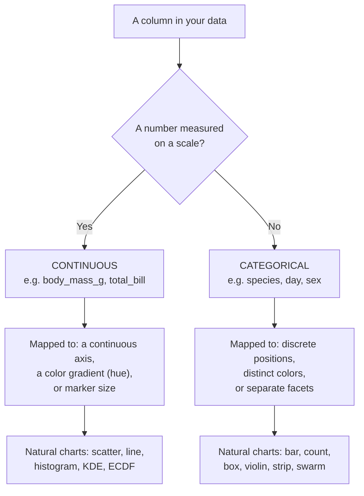

Almost every decision you make in this course — which chart, which axis,
whether color means a *gradient* or a *group* — comes down to one question
about each column:

> **Is this variable a number measured on a scale, or a label that names a
> group?**

Get that right and Seaborn's behavior stops feeling mysterious. This page
is foundational, so we'll go slowly and check understanding often.

## The two kinds of variables

**Continuous** (also called *quantitative* or *numeric*) variables are
measured on a scale where the spacing between values is meaningful and there
are, in principle, infinitely many possible values in between.

- `body_mass_g` (a penguin can weigh 3801 g or 3802 g)
- `total_bill` (a restaurant bill of $18.43)
- `flipper_length_mm`, `horsepower`, `sepal_length`

For these, *arithmetic* makes sense: a 4000 g penguin is twice the mass of a
2000 g one, and the average mass is a meaningful number.

**Categorical** variables name a finite set of groups. The value is a
*label*, not a quantity.

- `species` — Adelie, Chinstrap, Gentoo
- `day` — Thur, Fri, Sat, Sun
- `sex`, `smoker`, `island`

Averaging a categorical column is nonsense — there is no "mean species."
Instead you *count* them or *split* the data by them.

<Callout type="info" title="Nominal vs. ordinal — a useful sub-distinction">
Categorical variables come in two flavors:

- **Nominal** — no inherent order (`species`, `island`). Any ordering you
  give them is arbitrary.
- **Ordinal** — a natural order, but unequal or unmeasured spacing
  (`size` = small &lt; medium &lt; large; `day` = Mon &lt; Tue &lt; ...).

The order matters for how you *arrange* a chart, even though you still can't
do arithmetic on the labels.
</Callout>

## How Seaborn maps each kind

This is the crux. The *type* of a variable decides how Seaborn turns it into
something you can see:

| If the variable is... | Seaborn gives it... | Reach for... |
| --------------------- | ------------------- | ------------ |
| **Continuous**        | a continuous axis; a color *gradient* for `hue`; marker *size* | `relplot`, `displot` (scatter, line, histogram, KDE) |
| **Categorical**       | evenly spaced discrete slots; *distinct* colors for `hue`; one *facet* per level | `catplot` (bar, count, box, violin, strip, swarm) |

The clearest place to *feel* this is the `hue` parameter, which behaves in
two completely different ways depending on the column you give it.

### `hue` on a categorical column → distinct colors

<CodeBlock
  adapter="python"
  starterCode={`import seaborn as sns

sns.set_theme(style="whitegrid")
penguins = sns.load_dataset("penguins")

# species is categorical → three distinct colors + a category legend.
sns.relplot(
    data=penguins,
    x="bill_length_mm",
    y="bill_depth_mm",
    hue="species",
    height=4,
)
`}
/>

### `hue` on a continuous column → a color gradient

<CodeBlock
  adapter="python"
  starterCode={`import seaborn as sns

sns.set_theme(style="whitegrid")
penguins = sns.load_dataset("penguins")

# body_mass_g is continuous → a smooth gradient + a colorbar.
sns.relplot(
    data=penguins,
    x="bill_length_mm",
    y="bill_depth_mm",
    hue="body_mass_g",
    height=4,
)
`}
/>

Same parameter, same dataset — but Seaborn read the column's *type* and
chose distinct colors for the groups versus a smooth gradient for the
measurement. You did not ask for either; the data's nature decided.

<MultipleChoice
  markdown={`You map \`hue\` to a column and Seaborn draws a continuous **colorbar**
instead of a discrete legend with separate swatches. What does that tell you
about the column?

- It is an ordinal categorical variable.
  > Ordinal categories are still categories — Seaborn would give them distinct, ordered swatches, not a smooth colorbar.
- [o] Seaborn is treating it as a continuous (numeric) variable.
  > A colorbar is Seaborn's signal that it read the column as a number on a scale and mapped it to a smooth gradient rather than to distinct groups.
- The column contains missing values.
  > Missing values don't switch Seaborn between a legend and a colorbar; the variable's type does.
- You forgot to call \`set_theme\`.
  > The theme controls styling, not whether a variable is treated as continuous or categorical.

A colorbar means "continuous gradient"; a set of discrete swatches means
"categorical groups."`}
/>

## The gotcha: numbers that are really categories

Seaborn infers a column's type from its **pandas dtype**, not from what it
*means*. So a column stored as numbers gets treated as continuous — even
when it's really a category in disguise.

A classic example is party `size` in the `tips` dataset: it's stored as an
integer (1–6), but it behaves like an ordered category. Watch what happens
when we treat it each way.

<CodeBlock
  adapter="python"
  starterCode={`import seaborn as sns

sns.set_theme(style="whitegrid")
tips = sns.load_dataset("tips")

print(tips["size"].dtype)  # int64 — Seaborn sees a number
print(sorted(tips["size"].unique()))  # but it's really 6 groups: 1..6
`}
/>

Hand `size` to a **categorical** plot and Seaborn gives each party size its
own discrete slot — exactly what we want:

<CodeBlock
  adapter="python"
  starterCode={`import seaborn as sns

sns.set_theme(style="whitegrid")
tips = sns.load_dataset("tips")

# catplot treats x as categorical: one box per party size.
sns.catplot(
    data=tips,
    x="size",
    y="total_bill",
    kind="box",
    height=4,
    aspect=1.3,
)
`}
/>

<Callout type="warn" title="When a numeric code is secretly a category">
Columns like `month` (1–12), `year`, `pclass` (1/2/3), or a `size` code are
*numbers* to pandas but *categories* to you. If a plot treats one as a
continuous axis when you wanted discrete groups, either use a categorical
plot (`catplot`), pass an explicit `order=`, or convert the column with
`df["col"] = df["col"].astype("category")`. The fix is to tell Seaborn the
*meaning*, since it can only see the dtype.
</Callout>

## Why this distinction runs the whole course

Every chapter ahead is organized around this split:

- **Relational** plots (scatter, line) expect **two continuous** variables.
- **Distribution** plots (histogram, KDE, ECDF) describe **one continuous**
  variable.
- **Categorical** plots (bar, count, box, violin, strip, swarm) put a
  **categorical** variable against (usually) a continuous one.

So before choosing a chart, label each variable in your head: *continuous or
categorical?* That one word per column tells you which family to open.

## Your turn

<ChallengeCard
  adapter="python"
  title="Treat a number as a category"
  instructions={`In \`tips\`, the party \`size\` column is stored as an integer but is
really an ordered category. Draw a **box plot** with \`sns.catplot\` that
shows the distribution of \`total_bill\` for each party \`size\`:

- \`x="size"\`, \`y="total_bill"\`, \`kind="box"\`.

Assign the result to \`g\`. Because \`catplot\` treats \`x\` as categorical,
you'll get one box per party size.`}
  starterCode={`import seaborn as sns

sns.set_theme(style="whitegrid")
tips = sns.load_dataset("tips")

# Build the catplot and assign it to g:
g = None
`}
  solutionCode={`import seaborn as sns

sns.set_theme(style="whitegrid")
tips = sns.load_dataset("tips")

g = sns.catplot(
    data=tips,
    x="size",
    y="total_bill",
    kind="box",
    height=4,
    aspect=1.3,
)
`}
  tests={[
    {
      id: "is_grid",
      name: "Uses catplot",
      description: "g is a Seaborn FacetGrid",
      code: "import seaborn as sns\nassert isinstance(g, sns.axisgrid.FacetGrid), 'Assign the result of sns.catplot(...) to g'",
    },
    {
      id: "x_is_size",
      name: "Party size on the x-axis",
      description: "x maps to the size column",
      code: "assert g.ax.get_xlabel() == 'size', f'x-axis should be size, got {g.ax.get_xlabel()!r}'",
    },
    {
      id: "y_is_bill",
      name: "Total bill on the y-axis",
      code: "assert g.ax.get_ylabel() == 'total_bill', f'y-axis should be total_bill, got {g.ax.get_ylabel()!r}'",
    },
  ]}
/>

## Check your understanding

<MultipleChoice
  markdown={`Which list contains **only continuous** variables?

- \`species\`, \`island\`, \`sex\`
  > These are all categorical labels (groups), not measured quantities.
- [o] \`body_mass_g\`, \`flipper_length_mm\`, \`bill_length_mm\`
  > Each is a physical measurement on a scale where spacing and averages are meaningful — the definition of continuous.
- \`day\`, \`time\`, \`smoker\`
  > These name groups; \`day\` and \`time\` are even ordinal categories, but none is a measured quantity.
- \`species\`, \`body_mass_g\`, \`day\`
  > This mixes a category (\`species\`), a continuous variable (\`body_mass_g\`), and another category (\`day\`).

Continuous variables are measurements on a scale; you can meaningfully
average them.`}
/>

<MultipleChoice
  markdown={`Why can't you take the **mean** of a nominal categorical variable like
\`species\`?

- Because pandas stores it as text, which is slow to average.
  > Storage format isn't the reason — even if it were numeric codes, averaging the *labels* would be meaningless.
- [o] Because its values are labels for groups, not quantities, so arithmetic on them has no meaning.
  > A "mean species" is undefined: the categories name groups, and there's no scale on which to add or divide them. You count or split by them instead.
- Because Seaborn forbids it.
  > This is a property of the data, not a Seaborn restriction.
- Because it has fewer than ten unique values.
  > The number of unique values doesn't determine whether averaging is meaningful — the variable's *type* does.

For categorical variables you count occurrences or group the data; you don't
average the labels.`}
/>

<MultipleChoice
  markdown={`Your DataFrame has a \`month\` column stored as integers 1–12. You make a
plot and Seaborn spreads it along a smooth continuous axis, but you wanted
twelve discrete month slots. What's the cleanest fix?

- Re-download the data in a different format.
  > The data is fine; the issue is only how its *type* is interpreted.
- Map \`month\` to \`hue\` instead of \`x\`.
  > That changes what the chart shows and, since \`month\` is numeric, would give a gradient — not the discrete months you want.
- [o] Use a categorical plot (\`catplot\`), pass an explicit \`order=\`, or convert the column with \`astype("category")\`.
  > Each of these tells Seaborn to treat \`month\` as discrete groups rather than a continuous measurement, which is the meaning you intended.
- Sort the DataFrame by \`month\`.
  > Sorting changes row order, not whether \`month\` is treated as continuous or categorical.

Seaborn reads the dtype, so when a numeric code is really a category you have
to signal that — via \`catplot\`, \`order=\`, or \`astype("category")\`.`}
/>

<MultipleChoice
  markdown={`You give \`hue\` a column with three text labels (\`"low"\`, \`"med"\`,
\`"high"\`). How will Seaborn encode it?

- As a continuous gradient with a colorbar.
  > Gradients and colorbars are for continuous numeric columns; text labels are categorical.
- [o] As three distinct colors with a category legend.
  > Text labels are categorical, so Seaborn assigns each group its own color and builds a discrete legend.
- It will raise an error because \`hue\` requires numbers.
  > \`hue\` accepts categorical columns happily — that's one of its main uses.
- It will average the three groups into one color.
  > Seaborn keeps the groups distinct; it never averages categories into a single color.

Categorical \`hue\` → distinct colors + legend; continuous \`hue\` → gradient +
colorbar.`}
/>

With the continuous/categorical lens in hand, you're ready to actually load
data and start drawing. Next we'll meet Seaborn's built-in datasets and set
a theme — then learn the one structural idea behind its whole API: the split
between figure-level and axes-level functions.
