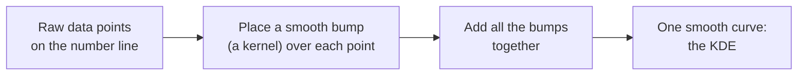

A histogram answers "how is this variable distributed?" with bars. A
**Kernel Density Estimate** (KDE) answers the same question with a smooth
curve. KDEs are everywhere in Seaborn — as `displot(kind="kde")`, as the
`kde=True` overlay on a histogram, and as the smooth diagonals of a pair
plot — so it's worth understanding *exactly* what that curve is and how it
can fool you.

This is a foundational page, with extra questions to lock in the intuition.

## From bars to a curve

A histogram makes one hard choice for every data point: which **bin** does
it fall into? Points near a bin edge get sorted into one bar or the other,
and the result can look jagged or wobble as you nudge the edges.

A KDE makes a softer choice. Instead of dropping each point into a bin, it
places a small smooth **bump** — called a *kernel* (usually a tiny Gaussian)
— centered on each data point. Then it **adds all the bumps together**. Where
points cluster, the bumps pile up into a tall region; where points are
sparse, the curve sags. The sum is one smooth **density** curve.

That's the whole idea: **a KDE is the sum of one little bump per data
point**. A histogram is a *count* in bins; a KDE is a *smoothed* version of
that same shape.

<Callout type="info" title="The y-axis is density, not count">
Because a KDE estimates a probability *density*, the area under the whole
curve is **1**, and the y-axis reads "density," not "number of rows." So you
can't read "12 penguins" off a KDE the way you can off a histogram bar — a
KDE tells you about *relative* concentration, not raw counts.
</Callout>

## Drawing one

`displot` with `kind="kde"` gives the figure-level version:

<CodeBlock
  adapter="python"
  starterCode={`import seaborn as sns

sns.set_theme(style="whitegrid")
penguins = sns.load_dataset("penguins")

sns.displot(data=penguins, x="flipper_length_mm", kind="kde", height=4, aspect=1.3)
`}
/>

The two humps are the headline: flipper length is **bimodal**, hinting at
distinct groups (it's species). A KDE makes modes like this easy to see.

It's often most useful laid over a histogram, so you get the honest bars
*and* the smooth shape together — that's the `kde=True` overlay:

<CodeBlock
  adapter="python"
  starterCode={`import seaborn as sns

sns.set_theme(style="whitegrid")
penguins = sns.load_dataset("penguins")

# A histogram with the KDE curve drawn on top.
sns.displot(
    data=penguins, x="flipper_length_mm", kde=True, bins=20, height=4, aspect=1.3
)
`}
/>

## Bandwidth: the KDE's "bin width"

The histogram's most important knob is bin width. The KDE's equivalent is
**bandwidth** — how *wide* each bump is. Seaborn exposes it as `bw_adjust`
(a multiplier on the automatic bandwidth):

- **Small bandwidth** → narrow bumps → a *wiggly* curve that chases every
  little cluster (and invents peaks from noise).
- **Large bandwidth** → wide bumps → an *oversmoothed* blob that can merge
  real modes into one.

<CodeBlock
  adapter="python"
  starterCode={`import seaborn as sns

sns.set_theme(style="whitegrid")
penguins = sns.load_dataset("penguins")

# Three bandwidths on the same data. Watch the two modes appear and vanish.
sns.displot(
    data=penguins,
    x="flipper_length_mm",
    kind="kde",
    bw_adjust=0.3,  # try 0.3 (wiggly), 1.0 (default), 2.0 (oversmoothed)
    height=4,
    aspect=1.3,
)
`}
/>

Edit `bw_adjust` to `1.0` and then `2.0`. At `0.3` the curve is jittery; at
`2.0` the two flipper-length modes melt into a single hump that hides the
species structure. **The bandwidth is a choice, and it changes the story** —
exactly like bin width.

<MultipleChoice
  markdown={`You set \`bw_adjust\` very small (say \`0.2\`) and the KDE becomes a spiky
curve with many little bumps. What's the right interpretation?

- The data genuinely has that many modes.
  > A very small bandwidth makes the curve chase random noise, so the extra bumps are likely artifacts of under-smoothing, not real modes.
- [o] The curve is *under-smoothed* — narrow kernels are tracking noise, so those bumps may not be real.
  > A small bandwidth gives each point a narrow spike, so sampling noise turns into spurious wiggles; you usually widen the bandwidth until only stable features remain.
- The y-axis switched from density to count.
  > Bandwidth changes smoothness, not what the y-axis measures; a KDE's y-axis is always density.
- Seaborn failed to converge.
  > There's no convergence step that failed; you simply chose a bandwidth that under-smooths.

A tiny bandwidth over-fits the sample; a huge one washes out real structure.
The right value shows stable features without chasing noise.`}
/>

## Comparing groups

Like the ECDF, KDEs shine for comparing groups, because smooth curves
overlap more legibly than stacked bars. Map a categorical column to `hue`:

<CodeBlock
  adapter="python"
  starterCode={`import seaborn as sns

sns.set_theme(style="whitegrid")
penguins = sns.load_dataset("penguins")

sns.displot(
    data=penguins,
    x="flipper_length_mm",
    hue="species",
    kind="kde",
    fill=True,  # fill=True shades under each curve
    height=4,
    aspect=1.4,
)
`}
/>

Now the "two humps" mystery resolves: each species has its own curve, and
they sit at different flipper lengths. `fill=True` shades under each curve;
with several overlapping groups, set a low `alpha` or drop the fill so they
don't obscure each other.

## Bivariate KDE: density in 2-D

Give `kdeplot` both an `x` and a `y` and the bumps become 2-D — the result
is a contour map of where points concentrate, like a topographic map of the
data cloud. It's a clean way to show density when a scatter would overplot:

<CodeBlock
  adapter="python"
  starterCode={`import seaborn as sns

sns.set_theme(style="whitegrid")
penguins = sns.load_dataset("penguins")

sns.displot(
    data=penguins,
    x="bill_length_mm",
    y="bill_depth_mm",
    hue="species",
    kind="kde",
    height=4.5,
    aspect=1.2,
)
`}
/>

## Where KDEs mislead

A KDE's smoothness is its gift and its trap. Three distortions to watch:

- **It spills past the data's limits.** Because each kernel is a bump with
  tails, a KDE can place density *below zero* for a strictly-positive
  variable (like price, age, or a bill amount) — implying impossible values.
- **The bandwidth can manufacture or erase modes.** As you saw, the same
  data can look unimodal or bimodal depending on `bw_adjust`.
- **It implies a smooth, continuous population** even when you have only a
  handful of points. With small samples, a KDE can look confident about a
  shape it can't really support.

<CodeBlock
  adapter="python"
  starterCode={`import seaborn as sns

sns.set_theme(style="whitegrid")
tips = sns.load_dataset("tips")

# total_bill is strictly positive, yet the KDE's left tail leaks below 0.
sns.displot(data=tips, x="total_bill", kind="kde", height=4, aspect=1.3)
`}
/>

Look at the left tail: it drifts past 0, even though no bill is negative.
That's the kernel's tails leaking past the data's natural boundary.

<Callout type="warn" title="When a boundary is real, defend it">
For bounded variables, a raw KDE can lie at the edges. Options: show a
**histogram** (which never invents values outside the data), clip the KDE
with the `clip=(low, high)` argument, or transform the variable (e.g. plot
`log` of a positive quantity). When in doubt, trust the bars.
</Callout>

## KDE vs. histogram — which to reach for

| You want to... | Prefer |
| --- | --- |
| See honest counts and exact bins | Histogram |
| Compare several groups' shapes on one axis | KDE (or ECDF) |
| Avoid choosing a smoothing parameter | Histogram / ECDF |
| Show a smooth 2-D density instead of an overplotted scatter | Bivariate KDE |
| Respect a hard boundary (no negatives, etc.) | Histogram |

A pragmatic default: **histogram with `kde=True`** — you get the trustworthy
bars and the smooth summary side by side, and any boundary leak is obvious
against the bars.

## Your turn

<ChallengeCard
  adapter="python"
  title="Compare group densities with a KDE"
  instructions={`Using \`penguins\`, draw a **KDE** with \`sns.displot\` that compares the
distribution of \`body_mass_g\` across the three species:

- \`x="body_mass_g"\`,
- \`hue="species"\`,
- \`kind="kde"\`,
- \`fill=True\`.

Assign the result to \`g\`.`}
  starterCode={`import seaborn as sns

sns.set_theme(style="whitegrid")
penguins = sns.load_dataset("penguins")

# Build the grouped KDE and assign it to g:
g = None
`}
  solutionCode={`import seaborn as sns

sns.set_theme(style="whitegrid")
penguins = sns.load_dataset("penguins")

g = sns.displot(
    data=penguins,
    x="body_mass_g",
    hue="species",
    kind="kde",
    fill=True,
    height=4,
    aspect=1.4,
)
`}
  tests={[
    {
      id: "is_grid",
      name: "Uses displot",
      description: "g is a FacetGrid",
      code: "import seaborn as sns\nassert isinstance(g, sns.axisgrid.FacetGrid), 'Assign the result of sns.displot(...) to g'",
    },
    {
      id: "x_var",
      name: "Plots body_mass_g",
      code: "assert g.ax.get_xlabel() == 'body_mass_g', f'x-axis should be body_mass_g, got {g.ax.get_xlabel()!r}'",
    },
    {
      id: "grouped",
      name: "Colored by species",
      description: "A species legend is present",
      code: "leg = g._legend\nassert leg is not None, 'Map hue=\"species\" to compare the three species'",
    },
  ]}
/>

## Check your understanding

<MultipleChoice
  markdown={`In one sentence, how is a KDE curve constructed from the data?

- By connecting the tops of the histogram bars with straight lines.
  > That describes a frequency polygon, not a KDE; a KDE doesn't depend on bins at all.
- [o] By placing a small smooth "bump" (kernel) on each data point and summing them into one curve.
  > Summing one kernel per observation is exactly how a KDE is built, which is why it's smooth and bin-free.
- By fitting a normal distribution to the data's mean and standard deviation.
  > That would force a single bell shape; a KDE is nonparametric and can capture multiple modes.
- By sorting the data and plotting the cumulative proportion.
  > That's an ECDF. A KDE shows density, not a running cumulative total.

A KDE is the sum of one kernel per data point — no bins, no assumed shape.`}
/>

<MultipleChoice
  markdown={`What is the KDE's **bandwidth** the rough analogue of, in a histogram?

- The number of data points.
  > Sample size affects both plots but isn't what bandwidth controls.
- [o] The bin width — both control how much the picture is smoothed.
  > Bandwidth sets how wide each kernel is, just as bin width sets how coarse the bars are; both trade detail against noise.
- The y-axis units.
  > Bandwidth changes the curve's smoothness, not whether the axis shows density or counts.
- The color palette.
  > Palette is purely cosmetic and unrelated to smoothing.

Bin width (histogram) and bandwidth (KDE) are the same knob in different
clothes: the amount of smoothing.`}
/>

<MultipleChoice
  markdown={`You plot a KDE of \`total_bill\` (which is always positive) and the curve
extends a little below 0. What's going on?

- The dataset contains negative bills.
  > The data is strictly positive; the curve, not the data, crosses zero.
- [o] The kernels have tails that spill past the data's natural boundary, so the KDE shows density where no data exists.
  > Each kernel is a bump with tails, and near a hard boundary those tails leak past it — a known KDE distortion for bounded variables.
- The y-axis is mislabeled.
  > The axis is fine; the issue is the curve placing density beyond the real range of the data.
- You must increase \`bw_adjust\` to fix it.
  > A larger bandwidth would spread the leak further, not remove it; clipping, a histogram, or a transform is the fix.

Near a real boundary, a raw KDE can imply impossible values; reach for a
histogram, \`clip=\`, or a transform.`}
/>

<MultipleChoice
  markdown={`Why does the y-axis of a KDE read "Density" rather than a count of rows?

- Seaborn hides counts to save space.
  > It's not a display choice; a KDE genuinely estimates a density, not counts.
- [o] A KDE estimates a probability density, scaled so the total area under the curve is 1.
  > Density normalizes the curve so areas (not heights) represent proportions, which is why you can't read a raw row count off it.
- Because density is always larger than a count.
  > Density values are often small fractions, not larger numbers; the label reflects what's measured, not its size.
- Because the data was standardized first.
  > No standardization is required; the density interpretation comes from how the KDE is normalized.

A KDE's area integrates to 1, so its vertical axis is a density and encodes
*relative* concentration, not raw counts.`}
/>

You can now read a smooth density and, more importantly, distrust it in the
right places. Next we meet the distribution view that hides *nothing* and
needs no smoothing at all: the ECDF (and its companion, the rug).
