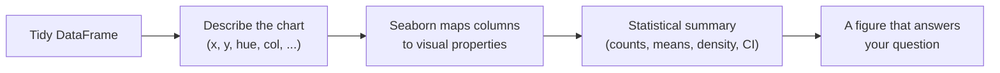

Welcome to **Seaborn Foundations: Visualizing Statistical Data**.

You already know some Python. You can wrangle a `DataFrame` with pandas —
filter rows, group by a column, compute a mean. You know what an x-axis
and a y-axis are. What you want now is to turn columns of numbers into
**pictures that reveal what the data is actually doing** — and to know
*which* picture to reach for, and *why*.

That is exactly what this course is about.

## Why Seaborn?

You could draw every chart in this course with raw matplotlib. But you
would spend most of your energy on plumbing — looping over groups,
positioning bars, building legends by hand — instead of on *seeing*.

Seaborn flips that around. You hand it a **tidy table** and describe your
chart in the vocabulary of statistics:

> "Put `total_bill` on x, `tip` on y, color by `time`, and split into one
> panel per `day`."

Seaborn does the grouping, the aggregation, the color mapping, the legend,
and sensible defaults — so the code you write looks like the *question you
are asking*.

This is the mental shift the course is built around: **you describe
*what* you want to see; Seaborn figures out *how* to draw it.**

<Callout type="info" title="Who this course is for">
- Analysts and data-curious folks who are comfortable with **basic
  pandas** (DataFrames, Series, filtering, `groupby`) and **basic stats**
  (mean, median, standard deviation).
- People who can already make *a* chart but freeze when deciding *which*
  chart — or why their chart looks misleading.
- Anyone who wants visualization to feel like **reasoning about data**,
  not memorizing function signatures.
</Callout>

## What this course focuses on

This is a **statistical visualization** course. We care about building
*intuition*: what each chart reveals, what it hides, and when it breaks.

This course **is** about:

- The principles of statistical data visualization and **exploratory data
  analysis (EDA)**
- **Tidy data** — the table shape Seaborn is built for
- **Relational** plots (scatter, line), **distribution** plots (histogram,
  KDE, ECDF, rug), and **categorical** plots (bar, count, box, violin,
  boxen, strip, swarm)
- **Regression and trend** visualization, **correlation heatmaps**, and
  **multi-panel grids** (facets, pair plots, joint plots)
- **Aesthetics that aid communication** — themes, contexts, and color
  palettes — and the judgment to tell a clear visual story

This course is **not** about:

- Low-level matplotlib scripting (we use it only for light touch-ups)
- Machine-learning diagnostic plots (ROC curves, partial dependence, ...)
- Interactive web charting (Plotly, Bokeh, Dash) or BI dashboards
- Geographic / GIS maps, 3-D plots, or real-time streaming charts
- Graphic-design theory beyond what a working analyst needs

We borrow ideas from those worlds only when they sharpen our intuition
about Seaborn.

## How the interactive pages work

Every code block on these pages **runs right here in your browser** —
there is nothing to install, and Seaborn, pandas, and the example
datasets are already available. Edit any snippet, run it, break it, and
fix it. That is how the intuition sticks.

You will meet three kinds of widgets:

1. **Executable code blocks.** Change a parameter — `hue`, `bins`,
   `kind` — and watch the chart respond.
2. **Challenge cards.** Small, checked tasks where *you* write the code.
   Hidden tests tell you the moment you have it right.
3. **Multiple-choice questions.** Quick concept checks. The more
   foundational a page is, the more of these you will find — getting the
   mental model right early saves hours later.

<Callout type="info" title="Each block starts fresh">
Variables defined in one code block are **not** visible in the next, even
on the same page. So every example is self-contained — it imports Seaborn
and loads its data at the top. That repetition is intentional: you can run
any block in isolation. For a longer-lived workspace, open the
[Python Playground](/playground/python) in a new tab.
</Callout>

## A taste of where we are going

Here is a complete, multi-panel Seaborn figure. Do not worry about the
details yet — by the end of this course every line will feel *obvious*,
and you will be able to say what each one is *for*.

<CodeBlock
  adapter="python"
  starterCode={`import seaborn as sns

# A clean, modern look in one line.
sns.set_theme(style="whitegrid")

# A small, famous dataset that ships with Seaborn: 344 penguins.
penguins = sns.load_dataset("penguins")

# "Flipper length vs. body mass, colored by species,
#  split into one panel per sex."
sns.relplot(
    data=penguins,
    x="flipper_length_mm",
    y="body_mass_g",
    hue="species",
    col="sex",
    height=4,
    aspect=0.9,
)
`}
/>

Notice what you did *not* have to do: no loop over species, no manual
color assignment, no legend code, no two-subplot scaffolding. You named
the columns and the *roles* they should play — `x`, `y`, `hue`, `col` —
and Seaborn did the rest. That is the whole game.

<Callout type="tip" title="The one habit to build">
As you go, keep asking three questions of every chart: **What does it
reveal? What does it hide? When would it break?** A great analyst is not
the one who knows the most chart types — it is the one who knows which
chart *fits the data and the question*.
</Callout>

Ready? Let's start with the most important question of all: *why* bother
turning data into pictures at all.
