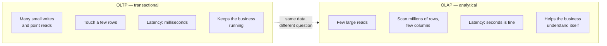
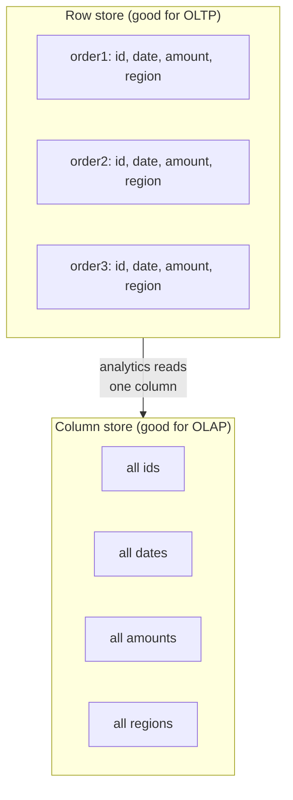

The difference you met on the last page has a formal name. The "needle"
work applications do is called **OLTP** — *Online Transaction
Processing*. The "net" work analysts do is **OLAP** — *Online Analytical
Processing*. You do not need to memorize the acronyms, but understanding
what each workload *demands* explains why analytical databases like
DuckDB are built so differently from the database behind a typical app.

## A transaction vs. an analysis

A **transaction** is a small, complete unit of business activity: place
an order, transfer money, update an address. It touches a few rows, must
be fast, and must be safe even if thousands happen at once.

An **analysis** is the opposite in almost every dimension: it reads a
huge slice of history and condenses it into understanding.

A simple way to remember it: **OLTP records what happened; OLAP explains
what it means.** Every order an OLTP system saves becomes a row that, much
later, an OLAP query sweeps up to find a trend.

## Why the *physical* shape differs: rows vs. columns

Here is the idea that ties everything together — and the reason DuckDB
feels fast for analysis. Databases can store a table in two ways.

- **Row storage** keeps all of a row's values together. Perfect for
  OLTP: "give me everything about order #4821" reads one contiguous
  chunk.
- **Column storage** keeps all values of *one column* together. Perfect
  for OLAP: "average `amount` over 10 million orders" reads just the
  `amount` column and skips everything else.

When an analytical query only needs `amount`, a **column store** reads
*only* the amounts — not the ids, dates, or regions sitting beside them.
On a wide table that can mean reading 5% of the data instead of 100%.
That single design choice is why purpose-built analytical engines crush
row-oriented databases on summary queries. DuckDB is column-oriented,
which is a big part of *why DuckDB exists* (more on that soon).

## You write SQL the same way either way

Reassuringly, **you do not change your SQL** to get these benefits. You
write the same `SELECT ... GROUP BY` you already know; the engine's
storage layout does the rest. The lesson is not "write different SQL for
OLAP" — it is "the *questions* you ask, and the *engine* you ask them on,
are tuned for analysis."

The query below is a perfectly ordinary `GROUP BY`. What makes it
"analytical" is the intent — summarizing a column across many rows — not
any special syntax.

<SqlCodeBlock
  dialect="duckdb"
  title="A column-shaped question"
  initSql={`CREATE TABLE orders AS
SELECT
  i                                   AS id,
  DATE '2024-01-01' + (i % 90)        AS order_date,
  (i * 37) % 500 + 10                 AS amount,
  ['West','East','North','South'][(i % 4) + 1] AS region
FROM range(1, 5001) t(i);`}
  starterCode={`-- Reads only the columns it needs (region, amount)
-- across 5,000 rows, and returns just 4 summary rows.
SELECT
  region,
  COUNT(*) AS orders,
  SUM(amount) AS revenue,
  ROUND(AVG(amount), 1) AS avg_amount
FROM
  orders
GROUP BY
  region
ORDER BY
  revenue DESC;`}
/>

Five thousand rows in, four rows out. The query never needed `id` or
`order_date`, so a column store would never read them.

## A side-by-side summary

| Dimension | OLTP (transactional) | OLAP (analytical) |
| --- | --- | --- |
| Typical operation | Insert / update / point read | Large aggregating read |
| Rows touched per query | A few | Thousands to billions |
| Columns touched | Most of the row | A few of many |
| Best storage layout | Row-oriented | Column-oriented |
| Acceptable latency | Milliseconds | Seconds |
| Concurrency | Many users at once | Few analysts at once |
| Goal | Run the business | Understand the business |

This course lives entirely on the OLAP side of that table.

## Check your understanding

<MultipleChoice
  markdown={`What does **OLAP** stand for, and what is it for?

- Online Transaction Processing — recording day-to-day business events.
  > That describes OLTP. OLAP is the analytical counterpart.
- [o] Online Analytical Processing — summarizing large amounts of data to understand it.
  > OLAP workloads scan many rows to produce summaries and insight, which is exactly what this course teaches.
- Offline Logical Archive Processing — backing up old data.
  > OLAP is about live analysis, not archival; this expansion is invented.
- Open Ledger Accounting Protocol — a finance standard.
  > OLAP is a database workload category, not an accounting protocol.

OLAP = analysis (summaries over many rows); OLTP = transactions (small,
fast reads and writes).`}
/>

<MultipleChoice
  markdown={`Why does a **column-oriented** store make analytical queries faster?

- It compresses rows so transactions commit faster.
  > Faster commits help OLTP writes, not the analytical reads in question; this also misstates how column stores help.
- [o] A query that needs only a few columns can read just those columns and skip the rest of each row.
  > Storing each column together lets the engine read \`amount\` alone instead of every value in every row — a huge saving on wide tables.
- It guarantees every query touches every column.
  > That is the opposite of the benefit; column stores let queries *avoid* unneeded columns.
- It removes the need to write \`GROUP BY\`.
  > Storage layout does not change the SQL you write; you still use \`GROUP BY\`.

Column stores shine when a query reads a few columns across many rows —
the typical analytical pattern.`}
/>

<MultipleChoice
  markdown={`A query that **scans five million orders to report monthly revenue** is best described as:

- An OLTP transaction, because it touches the orders table.
  > Touching the orders table does not make it transactional; this query summarizes millions of rows, which is analytical.
- [o] An OLAP analytical workload, because it reads many rows to produce a small summary.
  > Many rows in, a few monthly numbers out — the defining shape of OLAP.
- Invalid, because analytical queries cannot read order data.
  > Analytical queries routinely read operational data like orders; there is nothing invalid about it.
- A backup operation.
  > Producing a revenue report is analysis, not a backup.

"Scan many rows, return a small summary" is the signature of an
analytical (OLAP) workload.`}
/>

Next: how analysts actually *reason* about a dataset they have never seen
before — the mental moves behind exploratory analysis.
