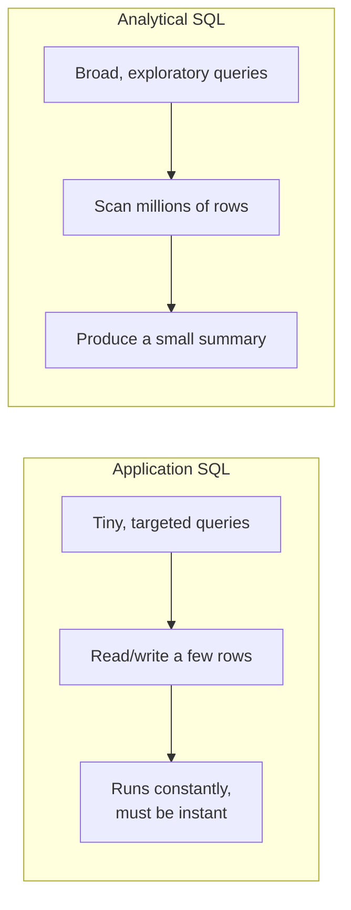

Most people meet SQL inside an **application**: a website saves a user's
order, then reads it back on the "My Orders" page. That is real, useful
SQL — but it is a *different job* from what an analyst does, even though
both use the word `SELECT`. This page makes that difference explicit,
because almost every habit you build in this course flows from it.

## Two jobs, one language

Think of a busy online store.

- The **application** asks tiny, sharply targeted questions, millions of
  times a day: *"What is in cart #84213?"*, *"Save this new order."*,
  *"Mark order #91 as shipped."* Each touches a handful of rows and must
  return in milliseconds.
- The **analyst** asks broad, exploratory questions, a few times a day:
  *"Which product categories grew fastest last quarter?"*, *"Do
  first-time buyers spend less than returning ones?"* Each sweeps across
  *millions* of rows to produce a *small* summary.

Same keywords. Opposite shape. An application query is a **needle**: find
this one row, fast. An analytical query is a **net**: drag it across the
whole ocean and weigh the catch.

## What the analyst is really doing

When you write SQL for analysis, you are not maintaining the data — you
are **interrogating** it. A typical analytical query:

- **Reads** data but rarely changes it. Inserts, updates, and deletes are
  the application's concern; the analyst mostly observes.
- **Touches many rows to produce few.** A thousand orders become one
  average; a year of traffic becomes twelve monthly numbers.
- **Cares about columns, not rows.** "Average `amount`" reads one column
  across every row. Applications usually want a whole row at once; analysts
  usually want one column across the whole table.
- **Is exploratory.** You rarely know the final query in advance. You run
  one, look at the result, and let it suggest the next question.

That last point matters most. Application SQL is *written once and run
forever*. Analytical SQL is *written, read, rewritten, and thrown away* —
a conversation with the data, not a fixed feature.

## Why this changes how you write SQL

Because the goals differ, the *good habits* differ too. Throughout this
course you will see analytical instincts that would look unusual in
application code:

| Application instinct | Analytical instinct |
| --- | --- |
| Fetch a specific row by its key | Scan and summarize a whole column |
| Return full rows to display | Return computed numbers and groups |
| Optimize for many fast writes | Optimize for one big read |
| Query is fixed in the codebase | Query is rewritten every few minutes |
| "Did it save correctly?" | "What does this *tell* me?" |

Neither column is "better" SQL — they are tuned for different questions.
This course lives entirely in the right-hand column.

A quick taste: this query does something deeply analytical — it reads
*every* row but returns just **one summarizing line per category**. No
single order is the answer; the *pattern across orders* is.

<SqlCodeBlock
  dialect="duckdb"
  title="A net, not a needle"
  initSql={`CREATE TABLE orders (
  id        INTEGER,
  category  TEXT,
  amount    DECIMAL(10, 2)
);
INSERT INTO orders VALUES
  (1, 'Books',       12.00),
  (2, 'Electronics', 240.00),
  (3, 'Books',        9.50),
  (4, 'Electronics', 180.00),
  (5, 'Home',         45.00),
  (6, 'Books',       22.00),
  (7, 'Home',        30.00);`}
  initialCode={`SELECT
  category,
  COUNT(*)               AS num_orders,
  ROUND(AVG(amount), 2)  AS avg_order,
  SUM(amount)            AS revenue
FROM orders
GROUP BY category
ORDER BY revenue DESC;`}
/>

Notice there is no "find order #5" here. We deliberately *forgot* about
individual orders to see the shape of the whole.

## Check your understanding

<MultipleChoice
  markdown={`Which question is **analytical** rather than application-oriented?

- Save a new order to the database.
  > Writing a single new record is classic application (transactional) work, not analysis.
- Show the details of order #4821 on a confirmation page.
  > Fetching one specific row to display is an application read, not an analytical summary.
- [o] Compare average order value between first-time and returning customers across the last year.
  > This scans many rows to produce a small comparison — the essence of analytical SQL.
- Update the shipping status of order #91 to "shipped".
  > Updating one row's state is transactional application work.

Analytical questions sweep across many rows to produce a summary or
comparison; application questions read or change a few specific rows.`}
/>

<MultipleChoice
  markdown={`An analyst's query usually...

- Returns one full row matched by its primary key.
  > That is a targeted application lookup. Analytical queries typically read many rows to compute a few results.
- [o] Reads many rows but returns only a small summary.
  > Analytical queries are "nets": they scan broadly and condense the result into a compact answer.
- Inserts or updates rows as its main purpose.
  > Writing data is the application's job; analysts mostly read and summarize.
- Must complete in single-digit milliseconds to keep a web page responsive.
  > Sub-millisecond latency is an application concern. Analytical queries trade a little time for a lot of insight.

The defining shape of analytical SQL is "many rows in, few numbers out".`}
/>

<MultipleChoice
  markdown={`Why does analytical SQL tend to focus on **columns** more than whole rows?

- Because SQL cannot return more than one column at a time.
  > SQL can return any number of columns; the point is what analysts *care about*, not a limitation.
- [o] Because analytical questions usually summarize one attribute across many rows (e.g. the average of one column).
  > Summaries like \`AVG(amount)\` or \`SUM(revenue)\` read a single column down the whole table, so columns are the natural unit of analysis.
- Because applications are not allowed to read columns.
  > Applications read columns too; this is about typical analytical *questions*, not permissions.
- Because rows do not exist in analytical databases.
  > Rows certainly exist; analysts simply tend to aggregate *down* columns rather than fetch individual rows.

"Average this column", "sum that column", "count distinct values in this
column" — analysis is naturally column-shaped.`}
/>

Next, we will see how this read-heavy, summarize-everything pattern has a
name — **OLAP** — and how it differs from the **OLTP** work applications
do.
