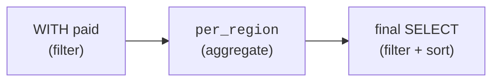

Analytical questions get complicated fast: filter, then aggregate, then
rank, then compare. Cramming all of that into one nested query is how SQL
earns its reputation for being unreadable. **Common Table Expressions
(CTEs)** — the `WITH` clause — are the cure. They let you build a query as
a sequence of named, readable steps, like a recipe. This is arguably the
most important *style* skill in analytical SQL, so it gets a page of its
own.

<svg
  viewBox="0 0 640 235"
  role="img"
  aria-label="Scaffolding rises in three named levels, each platform standing on posts planted in the one below, with a yellow flag flying from the top — a CTE pipeline that builds the final query step by step instead of nesting it inside out"
  style={{ display: "block", width: "100%", maxWidth: "600px", height: "auto", margin: "2.5rem auto" }}
>
  <g fill="currentColor" opacity="0.2">
    <rect x="80" y="208" width="480" height="6" rx="3" />
  </g>
  <g fill="currentColor" opacity="0.16">
    <rect x="158" y="166" width="9" height="42" rx="4" />
    <rect x="473" y="166" width="9" height="42" rx="4" />
    <rect x="198" y="114" width="9" height="44" rx="4" />
    <rect x="433" y="114" width="9" height="44" rx="4" />
    <rect x="238" y="62" width="9" height="44" rx="4" />
    <rect x="393" y="62" width="9" height="44" rx="4" />
  </g>
  <g fill="currentColor" opacity="0.25">
    <rect x="140" y="158" width="360" height="9" rx="4.5" />
    <rect x="180" y="106" width="280" height="9" rx="4.5" />
    <rect x="220" y="54" width="200" height="9" rx="4.5" />
  </g>
  <g style={{ color: "var(--ds-blue-500)" }} fill="currentColor">
    <rect x="226" y="130" width="96" height="20" rx="10" fillOpacity="0.85" />
  </g>
  <g style={{ color: "var(--ds-green-500)" }} fill="currentColor">
    <rect x="266" y="78" width="96" height="20" rx="10" fillOpacity="0.85" />
  </g>
  <g fill="currentColor" opacity="0.25">
    <circle cx="356" cy="124" r="2.5" />
    <circle cx="366" cy="113" r="2.5" />
    <circle cx="396" cy="72" r="2.5" />
    <circle cx="406" cy="61" r="2.5" />
    <circle cx="316" cy="176" r="2.5" />
    <circle cx="326" cy="165" r="2.5" />
  </g>
  <g fill="currentColor" opacity="0.3">
    <rect x="318" y="16" width="5" height="38" rx="2.5" />
  </g>
  <g style={{ color: "var(--ds-yellow-500)" }} fill="currentColor">
    <path d="M 323 18 L 368 28 L 323 38 Z" />
  </g>
</svg>

## The problem: queries that nest inward

Without CTEs, a multi-step analysis nests subqueries inside subqueries.
You have to read it *inside-out*, and the logic is buried:

```sql
-- Hard to read: logic nested inside out
SELECT region, avg_order
FROM (
  SELECT region, AVG(amount) AS avg_order
  FROM (
    SELECT * FROM orders WHERE status = 'paid'
  )
  GROUP BY region
)
WHERE avg_order > 100;
```

The actual steps — *keep paid orders, average per region, keep big
averages* — are scrambled. A reader has to mentally unwrap it.

## The fix: a pipeline of named steps

A CTE pulls each step out, names it, and stacks the steps **top to
bottom** in the order you think about them. The same logic becomes a
readable pipeline:

<SqlCodeBlock
  dialect="duckdb"
  title="The same analysis as a readable pipeline"
  initSql={`CREATE TABLE orders (
  id INTEGER,
  region TEXT,
  status TEXT,
  amount DECIMAL(8, 2)
);

INSERT INTO
  orders
VALUES
  (1, 'West', 'paid', 120),
  (2, 'West', 'refunded', 45),
  (3, 'East', 'paid', 200),
  (4, 'East', 'paid', 50),
  (5, 'North', 'paid', 60),
  (6, 'West', 'paid', 95),
  (7, 'East', 'paid', 150),
  (8, 'North', 'refunded', 30);`}
  starterCode={`WITH
  paid AS (
    SELECT
      *
    FROM
      orders
    WHERE
      status = 'paid'
  ),
  per_region AS (
    SELECT
      region,
      AVG(amount) AS avg_order
    FROM
      paid
    GROUP BY
      region
  )
SELECT
  region,
  ROUND(avg_order, 2) AS avg_order
FROM
  per_region
WHERE
  avg_order > 100
ORDER BY
  avg_order DESC;`}
/>

Read it straight down: *define `paid`, then `per_region` built on `paid`,
then the final query built on `per_region`.* Each step has a name that
says what it is. This is how analysts write queries they can revisit a
month later and still understand.



## Why CTEs matter for analysis specifically

CTEs are not just cosmetic. For exploratory analytical work they are a
genuine accelerator:

- **Readability.** Named steps document the logic; the query *is* its own
  explanation.
- **Iteration.** You can run a CTE pipeline and inspect any step by
  temporarily selecting from it — perfect for the question-query-look loop.
- **Reuse within a query.** A CTE can be referenced multiple times below
  its definition, so you compute something once and use it twice.
- **Composability.** Complex analyses become a stack of simple
  transformations, each easy to verify on its own.

## Reusing a CTE: compute once, compare twice

A classic pattern: compute a summary, then compare each row to that
summary. With a CTE you compute the summary once and join or cross-reference
it. Here, each region's revenue is compared to the company-wide average.

<SqlCodeBlock
  dialect="duckdb"
  title="Compare each region to the overall average"
  initSql={`CREATE TABLE orders (id INTEGER, region TEXT, amount DECIMAL(8, 2));

INSERT INTO
  orders
VALUES
  (1, 'West', 120),
  (2, 'East', 80),
  (3, 'West', 45),
  (4, 'East', 200),
  (5, 'North', 60),
  (6, 'West', 95),
  (7, 'East', 150),
  (8, 'North', 100);`}
  starterCode={`WITH
  region_rev AS (
    SELECT
      region,
      SUM(amount) AS revenue
    FROM
      orders
    GROUP BY
      region
  ),
  overall AS (
    SELECT
      AVG(revenue) AS avg_region_revenue
    FROM
      region_rev
  )
SELECT
  r.region,
  r.revenue,
  ROUND(o.avg_region_revenue, 1) AS avg_region_revenue,
  ROUND(r.revenue - o.avg_region_revenue, 1) AS vs_average
FROM
  region_rev r
  CROSS JOIN overall o
ORDER BY
  r.revenue DESC;`}
/>

The `region_rev` step is computed once and reused; `overall` summarizes
it; the final query compares them. Three small, verifiable steps replace
one inscrutable nest.

<svg
  viewBox="0 0 640 165"
  role="img"
  aria-label="One solid green step sends copies of itself along two dotted trails into two waiting sockets downstream — a CTE is computed once and referenced as many times as the query needs"
  style={{ display: "block", width: "100%", maxWidth: "500px", height: "auto", margin: "2.5rem auto" }}
>
  <g style={{ color: "var(--ds-green-500)" }} fill="currentColor">
    <rect x="64" y="66" width="110" height="32" rx="16" />
  </g>
  <g fill="currentColor" opacity="0.25">
    <circle cx="206" cy="68" r="2.5" />
    <circle cx="234" cy="54" r="2.5" />
    <circle cx="264" cy="44" r="2.5" />
    <circle cx="296" cy="40" r="2.5" />
    <circle cx="206" cy="96" r="2.5" />
    <circle cx="234" cy="110" r="2.5" />
    <circle cx="264" cy="120" r="2.5" />
    <circle cx="296" cy="124" r="2.5" />
  </g>
  <g fill="currentColor" opacity="0.08">
    <rect x="330" y="16" width="240" height="52" rx="12" />
    <rect x="330" y="98" width="240" height="52" rx="12" />
  </g>
  <g style={{ color: "var(--ds-green-500)" }} fill="currentColor">
    <rect x="348" y="30" width="74" height="24" rx="12" fillOpacity="0.45" />
    <rect x="348" y="112" width="74" height="24" rx="12" fillOpacity="0.45" />
  </g>
  <g fill="currentColor" opacity="0.22">
    <rect x="436" y="36" width="56" height="12" rx="6" />
    <rect x="500" y="36" width="40" height="12" rx="6" />
    <rect x="436" y="118" width="42" height="12" rx="6" />
    <rect x="486" y="118" width="62" height="12" rx="6" />
  </g>
</svg>

## A note on recursive CTEs

CTEs can also be **recursive** (`WITH RECURSIVE`), which lets a query
reference itself to walk hierarchies — org charts, category trees, graph
paths. It is a powerful corner of SQL, but it leans toward data
*structure* rather than the summarizing analytics this course focuses on,
so we only flag it here. When you meet a "find all descendants" problem,
remember recursive CTEs exist.

## Check your understanding

<MultipleChoice
  markdown={`What is the main benefit of rewriting a deeply nested query using CTEs?

- CTEs always make queries run faster.
  > CTEs are primarily about readability and structure; they do not guarantee a speed change.
- [o] They turn inside-out nesting into a top-to-bottom pipeline of named steps that is far easier to read and verify.
  > Each \`WITH\` step is named and built on the previous one, so the logic reads in the order you think about it.
- They remove the need for \`GROUP BY\`.
  > CTEs organize steps; you still use \`GROUP BY\` inside them as needed.
- They convert the query into multiple permanent tables.
  > A CTE is a temporary, query-scoped name, not a stored table.

CTEs restructure a query into readable, named, sequential steps.`}
/>

<MultipleChoice
  markdown={`In a \`WITH a AS (...), b AS (...) SELECT ...\` query, what can \`b\` reference?

- Only the original tables, never \`a\`.
  > A later CTE can build on an earlier one; that chaining is the whole point.
- [o] The CTE \`a\` defined above it, as well as base tables — CTEs can build on earlier CTEs.
  > Each CTE may reference any CTE defined before it, forming a pipeline.
- Only \`b\` itself.
  > A non-recursive CTE does not reference itself; it can reference earlier CTEs.
- The final \`SELECT\`'s result.
  > The final \`SELECT\` is downstream; a CTE cannot reference something defined after it.

Later CTEs can reference earlier ones, which is how a pipeline is built.`}
/>

<MultipleChoice
  markdown={`Why are CTEs especially useful during **exploratory** analysis?

- They prevent you from ever changing the query.
  > Exploration is about changing queries constantly; CTEs *support* iteration rather than preventing it.
- [o] You can inspect any named step by temporarily selecting from it, making the question-query-look loop fast.
  > Because each step is named, you can run and examine intermediate results, which suits iterative exploration.
- They hide the intermediate results so you only see the final answer.
  > CTEs make intermediate steps *accessible*, not hidden, which is exactly what helps exploration.
- They automatically visualize the data.
  > CTEs structure SQL; they do not produce visualizations.

Named steps let analysts inspect and iterate on each stage of a pipeline.`}
/>

CTEs are the *named* way to build sub-results. SQL also has unnamed,
inline ones — **subqueries** — each with its own best use. That contrast
is the next page.
