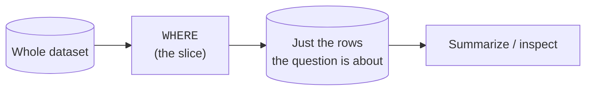
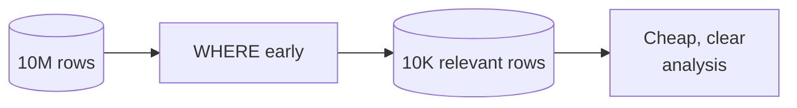

Profiling tells you what the whole dataset looks like. Most questions,
though, are about a **part** of it: this region, this month, these
categories. Carving out that part is **slicing**, and the tool is the
`WHERE` clause you already know — used with an analyst's intent. This page
sharpens your filtering vocabulary and explains *why* analysts filter as
early as possible.

<svg
  viewBox="0 0 640 215"
  role="img"
  aria-label="A translucent yellow cutting plane passes through a faint isometric slab of data, and the carved slice slides out to the right in solid blue carrying its green rows — WHERE lifts out exactly the part the question is about"
  style={{ display: "block", width: "100%", maxWidth: "640px", height: "auto", margin: "2.5rem auto" }}
>
  <g fill="currentColor">
    <path d="M 100 78 L 250 78 L 304 112 L 154 112 Z" opacity="0.16" />
    <path d="M 154 112 L 304 112 L 304 178 L 154 178 Z" opacity="0.09" />
    <path d="M 100 78 L 154 112 L 154 178 L 100 144 Z" opacity="0.2" />
  </g>
  <g style={{ color: "var(--ds-yellow-500)" }} fill="currentColor">
    <path d="M 312 56 L 334 70 L 334 186 L 312 172 Z" fillOpacity="0.45" />
  </g>
  <g fill="currentColor" opacity="0.25">
    <circle cx="362" cy="118" r="3" />
    <circle cx="384" cy="118" r="3" />
    <circle cx="406" cy="118" r="3" />
  </g>
  <g style={{ color: "var(--ds-blue-500)" }} fill="currentColor">
    <path d="M 438 70 L 482 70 L 536 104 L 492 104 Z" fillOpacity="0.6" />
    <path d="M 492 104 L 536 104 L 536 170 L 492 170 Z" fillOpacity="0.35" />
    <path d="M 438 70 L 492 104 L 492 170 L 438 136 Z" fillOpacity="0.8" />
  </g>
  <g style={{ color: "var(--ds-green-500)" }} fill="currentColor">
    <circle cx="514" cy="124" r="5" />
    <circle cx="514" cy="146" r="5" />
    <circle cx="465" cy="112" r="5" />
  </g>
  <g fill="currentColor" opacity="0.2">
    <circle cx="80" cy="40" r="3" />
    <circle cx="580" cy="50" r="3" />
    <circle cx="600" cy="190" r="3" />
  </g>
</svg>

## A slice is a question in disguise

Every business question hides a filter. "How are sales in the West?" means
`WHERE region = 'West'`. "What happened in Q1?" means a date range.
Learning to *hear* the filter inside a question is half of analytical SQL.

## Ranges with `BETWEEN`

Numeric and date ranges come up constantly — a price band, a date window,
an age bracket. `BETWEEN` reads naturally and is **inclusive** on both
ends.

<SqlCodeBlock
  dialect="duckdb"
  title="Orders in a price band and a date window"
  initSql={`CREATE TABLE orders AS
SELECT
  i AS id,
  DATE '2024-01-01' + (i % 120) AS order_date,
  (i * 13) % 300 + 10 AS amount
FROM
  range(1, 401) t (i);`}
  starterCode={`SELECT
  id,
  order_date,
  amount
FROM
  orders
WHERE
  amount BETWEEN 100 AND 200
  AND order_date BETWEEN DATE '2024-02-01' AND DATE  '2024-02-29'
ORDER BY
  amount DESC;`}
/>

<Callout type="info" title="BETWEEN includes both endpoints">
`amount BETWEEN 100 AND 200` keeps rows where `amount` is 100, 200, and
everything in between. If you need to exclude an endpoint, use explicit
`>=` / `<` comparisons instead.
</Callout>

## Membership with `IN`

When a column must match one of several values, `IN` is cleaner than a
chain of `OR`s.

<SqlCodeBlock
  dialect="duckdb"
  title="Just the categories we care about"
  initSql={`CREATE TABLE products (
  id INTEGER,
  name TEXT,
  category TEXT,
  price DECIMAL(7, 2)
);

INSERT INTO
  products
VALUES
  (1, 'Pen', 'Office', 1.50),
  (2, 'Laptop', 'Electronics', 999.00),
  (3, 'Notebook', 'Office', 3.25),
  (4, 'Phone', 'Electronics', 699.00),
  (5, 'Mug', 'Kitchen', 8.00),
  (6, 'Desk', 'Furniture', 150.00);`}
  starterCode={`SELECT
  name,
  category,
  price
FROM
  products
WHERE
  category IN ('Office', 'Electronics')
ORDER BY
  price DESC;`}
/>

`category IN ('Office', 'Electronics')` is exactly `category = 'Office' OR
category = 'Electronics'`, but it scales gracefully to a long list.

## Text patterns with `LIKE` and `ILIKE`

Analysts often filter text by *shape* rather than exact value: names
starting with "A", emails at a domain, codes containing a substring.
`LIKE` uses `%` (any run of characters) and `_` (one character). DuckDB's
`ILIKE` is the case-insensitive version.

<SqlCodeBlock
  dialect="duckdb"
  title="Pattern matching on text"
  initSql={`CREATE TABLE people (id INTEGER, name TEXT, email TEXT);

INSERT INTO
  people
VALUES
  (1, 'Ada Lovelace', 'ada@math.org'),
  (2, 'Alan Turing', 'alan@compute.io'),
  (3, 'Grace Hopper', 'grace@navy.mil'),
  (4, 'Annie Easley', 'annie@nasa.gov');`}
  starterCode={`SELECT
  name,
  email
FROM
  people
WHERE
  name ILIKE 'a%' -- name starts with A or a
  AND email LIKE '%.gov';

-- email ends in .gov`}
/>

## Combining conditions — and the danger of `AND`/`OR`

Real slices combine conditions. Be careful mixing `AND` and `OR`: `AND`
binds tighter than `OR`, so without parentheses the query may not mean
what you intended. Make your grouping explicit.

<SqlCodeBlock
  dialect="duckdb"
  title="Parentheses make the intent unambiguous"
  initSql={`CREATE TABLE orders (id INTEGER, region TEXT, amount DECIMAL(7, 2));

INSERT INTO
  orders
VALUES
  (1, 'West', 250),
  (2, 'East', 50),
  (3, 'West', 30),
  (4, 'East', 300),
  (5, 'North', 120),
  (6, 'West', 400);`}
  starterCode={`-- "Big orders, but only from West or East."
SELECT
  id,
  region,
  amount
FROM
  orders
WHERE
  amount > 100
  AND (
    region = 'West'
    OR region = 'East'
  )
ORDER BY
  amount DESC;`}
/>

Without the parentheses, `amount > 100 AND region = 'West' OR region =
'East'` would also return *every* East order regardless of amount — a
classic, silent analytical bug.

<svg
  viewBox="0 0 640 170"
  role="img"
  aria-label="Dots flow along a lane toward a yellow filter gate, but a dotted bypass arc carries red dots up and over the gate back into the output — an ungrouped OR quietly lets rows skip the filter"
  style={{ display: "block", width: "100%", maxWidth: "560px", height: "auto", margin: "2.5rem auto" }}
>
  <g fill="currentColor" opacity="0.08">
    <rect x="40" y="98" width="560" height="30" rx="15" />
  </g>
  <g fill="currentColor" opacity="0.35">
    <circle cx="80" cy="113" r="6" />
    <circle cx="124" cy="113" r="6" />
    <circle cx="168" cy="113" r="6" />
    <circle cx="212" cy="113" r="6" />
  </g>
  <g style={{ color: "var(--ds-yellow-500)" }} fill="currentColor">
    <rect x="296" y="78" width="14" height="30" rx="5" />
    <rect x="296" y="118" width="14" height="30" rx="5" />
  </g>
  <g style={{ color: "var(--ds-green-500)" }} fill="currentColor">
    <circle cx="372" cy="113" r="6" />
    <circle cx="420" cy="113" r="6" />
  </g>
  <g style={{ color: "var(--ds-red-500)" }} fill="currentColor">
    <circle cx="248" cy="92" r="4" fillOpacity="0.5" />
    <circle cx="268" cy="64" r="4" fillOpacity="0.65" />
    <circle cx="298" cy="44" r="4" fillOpacity="0.8" />
    <circle cx="334" cy="50" r="4" fillOpacity="0.9" />
    <circle cx="362" cy="72" r="4" />
    <circle cx="382" cy="96" r="4" />
    <circle cx="468" cy="113" r="6" />
    <circle cx="516" cy="113" r="6" />
  </g>
</svg>

## Why analysts filter *early*

Filtering early is both a performance habit and a clarity habit:

- **Less data to process.** A slice of 10,000 rows summarizes faster than
  a table of 10 million. On a column store, a tight `WHERE` lets the engine
  skip whole chunks.
- **Clearer reasoning.** Once the data is reduced to "the rows this
  question is about," every later step — grouping, joining, averaging — is
  easier to think about.

The rule of thumb: **slice down to what the question is about as soon as
you can.**

## Check your understanding

<MultipleChoice
  markdown={`Which rows does \`amount BETWEEN 100 AND 200\` keep?

- Rows where \`amount\` is strictly between 100 and 200, excluding both.
  > \`BETWEEN\` is inclusive, so 100 and 200 are kept, not excluded.
- [o] Rows where \`amount\` is 100, 200, or anything in between (both endpoints included).
  > \`BETWEEN\` includes both bounds; use explicit \`>\`/\`<\` if you need to exclude an endpoint.
- Only rows where \`amount\` equals exactly 100 or exactly 200.
  > \`BETWEEN\` keeps the whole range, not just the endpoints.
- No rows, because \`BETWEEN\` needs three values.
  > \`BETWEEN low AND high\` is the correct two-bound form and returns the matching range.

\`BETWEEN\` is inclusive of both endpoints.`}
/>

<MultipleChoice
  markdown={`Why is \`region IN ('West', 'East')\` preferred over \`region = 'West' OR region = 'East'\` for longer lists?

- Because \`IN\` checks ranges while \`OR\` checks equality.
  > \`IN\` checks membership (equality against a set), not ranges; the advantage is readability, not different semantics.
- [o] They are equivalent, but \`IN\` is more readable and scales cleanly as the list of values grows.
  > \`IN\` expresses "matches any of these" compactly, avoiding a long, error-prone chain of \`OR\`s.
- \`IN\` is faster because it ignores NULLs differently and returns more rows.
  > The benefit is clarity; \`IN\` does not return more rows, and that NULL claim is not why analysts prefer it.
- \`OR\` cannot be used with text columns.
  > \`OR\` works fine with text; the preference for \`IN\` is about readability at scale.

\`IN\` is a concise, readable membership test equivalent to a chain of \`OR\`s.`}
/>

<MultipleChoice
  markdown={`A query has \`WHERE amount > 100 AND region = 'West' OR region = 'East'\` with no parentheses. Why is this risky?

- It is a syntax error and will not run.
  > It runs fine; the danger is that it runs and returns the *wrong* rows.
- [o] \`AND\` binds tighter than \`OR\`, so it returns big West orders **plus every East order**, which is probably not intended.
  > Without parentheses the engine reads it as \`(amount > 100 AND region = 'West') OR region = 'East'\`, pulling in all East rows regardless of amount.
- It always returns zero rows.
  > It returns rows; the problem is that it returns too many, not none.
- \`OR\` is not allowed in a \`WHERE\` clause.
  > \`OR\` is perfectly valid; the issue is operator precedence without parentheses.

Because \`AND\` binds tighter than \`OR\`, mixing them without parentheses
silently changes the meaning — always group explicitly.`}
/>

You can now carve any slice you need. Often the next move is to **sort** a
slice and look at its top or bottom — the subject of the next page.
