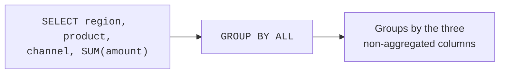
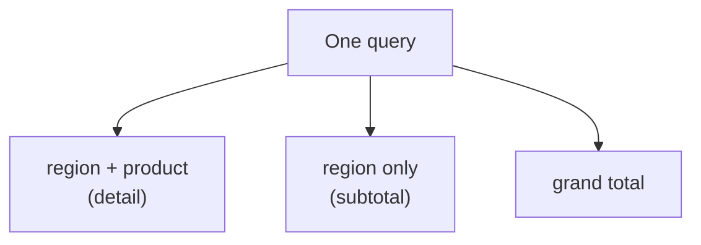

The last page covered `GROUP BY` as you would write it in any database.
DuckDB adds a few conveniences that remove ceremony and unlock
multi-level summaries in a single query. This page covers `GROUP BY ALL`
(a daily time-saver) and grouping sets (`ROLLUP`, `CUBE`, `GROUPING
SETS`) for subtotals — the kind of thing you would otherwise stitch
together with several queries.

<svg
  viewBox="0 0 640 215"
  role="img"
  aria-label="Six blue detail chips merge upward into two green subtotal chips and one yellow grand total, all inside a single soft outline — one rolled-up query returning every level of summary at once"
  style={{ display: "block", width: "100%", maxWidth: "560px", height: "auto", margin: "2.5rem auto" }}
>
  <g fill="currentColor" opacity="0.05">
    <rect x="64" y="18" width="512" height="184" rx="28" />
  </g>
  <g style={{ color: "var(--ds-blue-500)" }} fill="currentColor">
    <rect x="96" y="164" width="58" height="16" rx="8" fillOpacity="0.6" />
    <rect x="166" y="164" width="58" height="16" rx="8" fillOpacity="0.6" />
    <rect x="236" y="164" width="58" height="16" rx="8" fillOpacity="0.6" />
    <rect x="330" y="164" width="58" height="16" rx="8" fillOpacity="0.6" />
    <rect x="400" y="164" width="58" height="16" rx="8" fillOpacity="0.6" />
    <rect x="470" y="164" width="58" height="16" rx="8" fillOpacity="0.6" />
  </g>
  <g fill="currentColor" opacity="0.22">
    <circle cx="160" cy="142" r="2.5" />
    <circle cx="195" cy="134" r="2.5" />
    <circle cx="230" cy="142" r="2.5" />
    <circle cx="394" cy="142" r="2.5" />
    <circle cx="429" cy="134" r="2.5" />
    <circle cx="464" cy="142" r="2.5" />
  </g>
  <g style={{ color: "var(--ds-green-500)" }} fill="currentColor">
    <rect x="130" y="102" width="130" height="18" rx="9" fillOpacity="0.75" />
    <rect x="364" y="102" width="130" height="18" rx="9" fillOpacity="0.75" />
  </g>
  <g fill="currentColor" opacity="0.22">
    <circle cx="240" cy="82" r="2.5" />
    <circle cx="285" cy="72" r="2.5" />
    <circle cx="384" cy="82" r="2.5" />
    <circle cx="339" cy="72" r="2.5" />
  </g>
  <g style={{ color: "var(--ds-yellow-500)" }} fill="currentColor">
    <rect x="222" y="40" width="180" height="20" rx="10" />
  </g>
</svg>

## `GROUP BY ALL` — stop repeating yourself

A normal grouped query forces you to list the grouping columns *twice*:
once in `SELECT`, once in `GROUP BY`. On a wide query that is tedious and
error-prone — add a dimension to `SELECT` and forget to add it to `GROUP
BY`, and you get an error (or worse, a wrong result in databases that
allow it).

`GROUP BY ALL` tells DuckDB: *group by every selected column that is not
inside an aggregate.* You write the dimensions once.

<SqlCodeBlock
  dialect="duckdb"
  title="GROUP BY ALL infers the grouping columns"
  initSql={`CREATE TABLE sales (
  region TEXT,
  product TEXT,
  channel TEXT,
  amount DECIMAL(8, 2)
);

INSERT INTO
  sales
VALUES
  ('West', 'Widget', 'online', 120),
  ('West', 'Gadget', 'store', 80),
  ('East', 'Widget', 'online', 200),
  ('East', 'Gadget', 'online', 50),
  ('North', 'Widget', 'store', 75),
  ('West', 'Widget', 'online', 60);`}
  starterCode={`SELECT
  region,
  product,
  channel,
  COUNT(*) AS orders,
  SUM(amount) AS revenue
FROM
  sales
GROUP BY ALL -- = GROUP BY region, product, channel
ORDER BY
  revenue DESC;`}
/>

The result is identical to writing `GROUP BY region, product, channel`,
but the intent is clearer and the query is harder to get wrong. This is
one of the small ergonomics that make DuckDB pleasant for fast analysis.

<Callout type="info" title="GROUP BY ALL is the non-aggregated columns">
DuckDB inspects your `SELECT` list and groups by exactly the columns that
are *not* wrapped in an aggregate. Aggregated columns (`SUM`, `COUNT`,
etc.) are summarized; everything else becomes a grouping key.
</Callout>

## The subtotal problem

Suppose you have revenue per `(region, product)` and you *also* want the
revenue per region overall, and the grand total — all in one result.
Plain `GROUP BY` gives only the finest level. Running three separate
queries works but is clumsy and hard to combine. **Grouping sets** solve
this in one pass.

## `ROLLUP` — hierarchical subtotals

`ROLLUP(region, product)` produces the detailed rows **plus** a subtotal
per region **plus** a grand total. It is perfect for hierarchies where
each level rolls up into the one above (product → region → everything).

<SqlCodeBlock
  dialect="duckdb"
  title="Subtotals per region and a grand total with ROLLUP"
  initSql={`CREATE TABLE sales (region TEXT, product TEXT, amount DECIMAL(8, 2));

INSERT INTO
  sales
VALUES
  ('West', 'Widget', 120),
  ('West', 'Gadget', 80),
  ('East', 'Widget', 200),
  ('East', 'Gadget', 50),
  ('North', 'Widget', 75);`}
  starterCode={`SELECT
  region,
  product,
  SUM(amount) AS revenue
FROM
  sales
GROUP BY
  ROLLUP (region, product)
ORDER BY
  region NULLS LAST,
  product NULLS LAST;`}
/>

Notice the rows where `product` is `NULL`: those are the **region
subtotals**. The row where *both* are `NULL` is the **grand total**. The
`NULL`s are SQL's way of saying "this column is not part of this subtotal
level."

## `CUBE` — every combination of subtotals

Where `ROLLUP` follows one hierarchy, `CUBE(region, product)` produces
subtotals for **every** combination: per region, per product, *and* the
grand total. Use it when no single hierarchy dominates and you want all
the marginal totals.

<SqlCodeBlock
  dialect="duckdb"
  title="All marginal subtotals with CUBE"
  initSql={`CREATE TABLE sales (region TEXT, product TEXT, amount DECIMAL(8, 2));

INSERT INTO
  sales
VALUES
  ('West', 'Widget', 120),
  ('West', 'Gadget', 80),
  ('East', 'Widget', 200),
  ('East', 'Gadget', 50);`}
  starterCode={`SELECT
  region,
  product,
  SUM(amount) AS revenue
FROM
  sales
GROUP BY
  CUBE (region, product)
ORDER BY
  region NULLS LAST,
  product NULLS LAST;`}
/>

You now have per-region subtotals, per-product subtotals, the detail, and
the grand total — the full cross-tabulation, in one query.

<svg
  viewBox="0 0 640 200"
  role="img"
  aria-label="A two-by-two grid of blue detail cells grows a green margin column, a yellow margin row, and a red corner total — CUBE computing the detail and every marginal subtotal in a single pass"
  style={{ display: "block", width: "100%", maxWidth: "440px", height: "auto", margin: "2.5rem auto" }}
>
  <g style={{ color: "var(--ds-blue-500)" }} fill="currentColor">
    <rect x="160" y="30" width="92" height="44" rx="9" fillOpacity="0.55" />
    <rect x="262" y="30" width="92" height="44" rx="9" fillOpacity="0.4" />
    <rect x="160" y="84" width="92" height="44" rx="9" fillOpacity="0.35" />
    <rect x="262" y="84" width="92" height="44" rx="9" fillOpacity="0.6" />
  </g>
  <g style={{ color: "var(--ds-green-500)" }} fill="currentColor">
    <rect x="382" y="30" width="60" height="44" rx="9" fillOpacity="0.8" />
    <rect x="382" y="84" width="60" height="44" rx="9" fillOpacity="0.8" />
  </g>
  <g style={{ color: "var(--ds-yellow-500)" }} fill="currentColor">
    <rect x="160" y="146" width="92" height="28" rx="9" fillOpacity="0.85" />
    <rect x="262" y="146" width="92" height="28" rx="9" fillOpacity="0.85" />
  </g>
  <g style={{ color: "var(--ds-red-500)" }} fill="currentColor">
    <rect x="382" y="146" width="60" height="28" rx="9" fillOpacity="0.8" />
  </g>
  <g fill="currentColor" opacity="0.25">
    <circle cx="368" cy="52" r="2.5" />
    <circle cx="368" cy="106" r="2.5" />
    <circle cx="206" cy="138" r="2.5" />
    <circle cx="308" cy="138" r="2.5" />
  </g>
</svg>

## Distinguishing real NULLs from subtotal NULLs

There is a subtlety: a subtotal row uses `NULL` to mark "all values," but
your data might *also* contain genuine `NULL`s. The `GROUPING()` function
returns 1 for a "subtotal" NULL and 0 for a real value, letting you label
rows unambiguously.

<SqlCodeBlock
  dialect="duckdb"
  title="Label subtotal rows with GROUPING()"
  initSql={`CREATE TABLE sales (region TEXT, amount DECIMAL(8, 2));

INSERT INTO
  sales
VALUES
  ('West', 120),
  ('West', 80),
  ('East', 200),
  ('East', 50);`}
  starterCode={`SELECT
  CASE
    WHEN GROUPING (region) = 1 THEN 'ALL REGIONS'
    ELSE region
  END AS region,
  SUM(amount) AS revenue
FROM
  sales
GROUP BY
  ROLLUP (region)
ORDER BY
  GROUPING (region),
  region;`}
/>

## Check your understanding

<MultipleChoice
  markdown={`What does \`GROUP BY ALL\` do in DuckDB?

- Groups by literally every column in the table, even ones not selected.
  > It considers the \`SELECT\` list, not the whole table, and only the non-aggregated selected columns.
- [o] Groups by every column in the \`SELECT\` list that is not inside an aggregate function.
  > It infers the grouping keys from your selected, non-aggregated columns, so you do not repeat them.
- Removes grouping and returns one grand total.
  > That would be a query with no \`GROUP BY\`; \`GROUP BY ALL\` still groups by the dimension columns.
- Is a synonym for \`SELECT DISTINCT\`.
  > It performs aggregation per group, which is different from de-duplicating rows.

\`GROUP BY ALL\` groups by exactly the non-aggregated columns in your
\`SELECT\`, saving you from listing them twice.`}
/>

<MultipleChoice
  markdown={`In a \`GROUP BY ROLLUP (region, product)\` result, a row has \`region = 'West'\` and \`product = NULL\`. What is it?

- A data error where the product was lost.
  > The NULL here is generated by ROLLUP to mark a subtotal level, not a lost value.
- [o] The subtotal of revenue for all products in the West region.
  > A NULL in the rolled-up column marks "all values," so this row totals every product within West.
- The grand total across all regions.
  > The grand total has NULL in *both* columns; this row still pins \`region = 'West'\`.
- A duplicate of a detail row.
  > Subtotal rows are distinct aggregates, not duplicates of detail rows.

ROLLUP uses NULL in a column to indicate a subtotal across all of that
column's values.`}
/>

<MultipleChoice
  markdown={`When would you choose \`CUBE(region, product)\` over \`ROLLUP(region, product)\`?

- When you only want the finest-grained detail rows.
  > Plain \`GROUP BY\` gives just the detail; both CUBE and ROLLUP add subtotals.
- [o] When you want subtotals for **every** combination — per region, per product, and the grand total — not just one hierarchy.
  > CUBE generates all marginal subtotals, whereas ROLLUP follows a single hierarchy (product within region within all).
- When you want fewer rows than \`ROLLUP\`.
  > CUBE generally produces *more* subtotal rows than ROLLUP, not fewer.
- When the columns contain NULLs.
  > The presence of NULLs is unrelated to the CUBE-vs-ROLLUP choice.

CUBE gives all combinations of subtotals; ROLLUP gives one nested
hierarchy of them.`}
/>

You can now summarize at multiple levels in a single query. But what if
you want to filter *based on a group's summary* — "only regions with
revenue over \$1000"? That needs `HAVING`, which is next.
