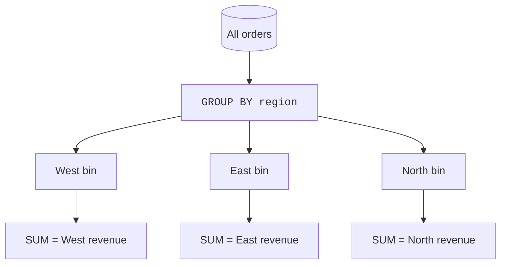
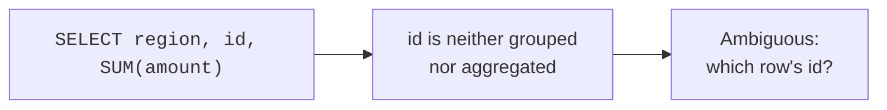
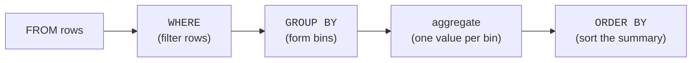

A grand total answers "how much, overall?" But analysts almost always
want more: "how much *per region*?", "average rating *per product*?",
"orders *per day*?". That per-something breakdown is **`GROUP BY`**, and
it is arguably the most-used construct in all of analytical SQL. This page
builds a solid mental model of what grouping really does.

<svg
  viewBox="0 0 640 235"
  role="img"
  aria-label="One mixed stream of colored dots falls from a spout and sorts itself into three jars by color, and each jar condenses into a single solid bar sized to its contents — GROUP BY bins the rows, then summarizes every bin once"
  style={{ display: "block", width: "100%", maxWidth: "640px", height: "auto", margin: "2.5rem auto" }}
>
  <g fill="currentColor" opacity="0.12">
    <rect x="284" y="14" width="72" height="16" rx="8" />
  </g>
  <g style={{ color: "var(--ds-blue-500)" }} fill="currentColor">
    <circle cx="302" cy="40" r="5" />
    <circle cx="268" cy="58" r="4" fillOpacity="0.7" />
    <circle cx="226" cy="76" r="4" fillOpacity="0.5" />
    <circle cx="188" cy="98" r="4" fillOpacity="0.4" />
  </g>
  <g style={{ color: "var(--ds-green-500)" }} fill="currentColor">
    <circle cx="320" cy="52" r="5" />
    <circle cx="320" cy="78" r="4" fillOpacity="0.6" />
    <circle cx="320" cy="102" r="4" fillOpacity="0.4" />
  </g>
  <g style={{ color: "var(--ds-yellow-500)" }} fill="currentColor">
    <circle cx="338" cy="40" r="5" />
    <circle cx="372" cy="58" r="4" fillOpacity="0.7" />
    <circle cx="414" cy="76" r="4" fillOpacity="0.5" />
    <circle cx="452" cy="98" r="4" fillOpacity="0.4" />
  </g>
  <g fill="currentColor" opacity="0.07">
    <rect x="102" y="118" width="96" height="84" rx="12" />
    <rect x="272" y="118" width="96" height="84" rx="12" />
    <rect x="442" y="118" width="96" height="84" rx="12" />
  </g>
  <g style={{ color: "var(--ds-blue-500)" }} fill="currentColor">
    <circle cx="128" cy="180" r="7" />
    <circle cx="150" cy="184" r="7" />
    <circle cx="172" cy="178" r="7" />
    <circle cx="140" cy="160" r="7" />
    <rect x="130" y="216" width="40" height="9" rx="4.5" />
  </g>
  <g style={{ color: "var(--ds-green-500)" }} fill="currentColor">
    <circle cx="304" cy="182" r="7" />
    <circle cx="328" cy="180" r="7" />
    <circle cx="316" cy="160" r="7" />
    <rect x="305" y="216" width="30" height="9" rx="4.5" />
  </g>
  <g style={{ color: "var(--ds-yellow-500)" }} fill="currentColor">
    <circle cx="466" cy="182" r="7" />
    <circle cx="488" cy="178" r="7" />
    <circle cx="510" cy="184" r="7" />
    <circle cx="478" cy="160" r="7" />
    <circle cx="500" cy="162" r="7" />
    <rect x="465" y="216" width="50" height="9" rx="4.5" />
  </g>
</svg>

## From one summary to many

Without `GROUP BY`, an aggregate collapses the *whole* table to one row.
`GROUP BY` first **sorts the rows into bins** by some key, then computes
the aggregate **once per bin**. One total becomes one total *per group*.

The result has **one row per group**, with the grouping column(s) plus
whatever you aggregated.

<SqlCodeBlock
  dialect="duckdb"
  title="Revenue per region"
  initSql={`CREATE TABLE orders (id INTEGER, region TEXT, amount DECIMAL(8, 2));

INSERT INTO
  orders
VALUES
  (1, 'West', 120),
  (2, 'East', 80),
  (3, 'West', 45),
  (4, 'East', 200),
  (5, 'North', 60),
  (6, 'West', 95),
  (7, 'East', 30);`}
  starterCode={`SELECT
  region,
  COUNT(*) AS orders,
  SUM(amount) AS revenue,
  ROUND(AVG(amount), 2) AS avg_order
FROM
  orders
GROUP BY
  region
ORDER BY
  revenue DESC;`}
/>

Read the result as a small report: each line is one region, summarized.

## The golden rule of `GROUP BY`

Every column in the `SELECT` list must be either **in the `GROUP BY`** or
**inside an aggregate function**. This rule trips up everyone once, so it
is worth understanding *why*, not just memorizing it.

When you group by `region`, each result row stands for a *whole group* of
orders. Asking for a bare `id` makes no sense — *which* order's id, when
the row represents twenty orders? There is no single answer, so SQL
refuses. The column must either *define* the group (`region`) or be
*summarized* across it (`SUM(amount)`).

<SqlCodeBlock
  dialect="duckdb"
  title="The rule in action — every column is grouped or aggregated"
  initSql={`CREATE TABLE sales (region TEXT, product TEXT, amount DECIMAL(8, 2));

INSERT INTO
  sales
VALUES
  ('West', 'Widget', 120),
  ('West', 'Gadget', 80),
  ('East', 'Widget', 200),
  ('East', 'Gadget', 50),
  ('North', 'Widget', 75),
  ('West', 'Widget', 60);`}
  starterCode={`SELECT
  region, -- grouped
  product, -- grouped
  COUNT(*) AS n, -- aggregated
  SUM(amount) AS revenue -- aggregated
FROM
  sales
GROUP BY
  region,
  product -- group by BOTH dimensions
ORDER BY
  region,
  revenue DESC;`}
/>

## Grouping by multiple columns

Grouping by two columns creates one row per **combination** that actually
appears. Above, you get one row per `(region, product)` pair — a small
matrix of the business. Adding a grouping column is exactly the
**drill-down** move from earlier: more dimensions, finer detail.

<svg
  viewBox="0 0 640 175"
  role="img"
  aria-label="Six pill tiles arranged as a small quilt, each holding one of three region colors paired with either a solid or a hollow product mark — grouping by two columns yields one summary row per combination that appears"
  style={{ display: "block", width: "100%", maxWidth: "440px", height: "auto", margin: "2.5rem auto" }}
>
  <g fill="currentColor" opacity="0.07">
    <rect x="116" y="28" width="190" height="36" rx="18" />
    <rect x="334" y="28" width="190" height="36" rx="18" />
    <rect x="116" y="78" width="190" height="36" rx="18" />
    <rect x="334" y="78" width="190" height="36" rx="18" />
    <rect x="116" y="128" width="190" height="36" rx="18" />
    <rect x="334" y="128" width="190" height="36" rx="18" />
  </g>
  <g style={{ color: "var(--ds-blue-500)" }} fill="currentColor">
    <circle cx="148" cy="46" r="9" />
    <circle cx="366" cy="46" r="9" />
  </g>
  <g style={{ color: "var(--ds-green-500)" }} fill="currentColor">
    <circle cx="148" cy="96" r="9" />
    <circle cx="366" cy="96" r="9" />
  </g>
  <g style={{ color: "var(--ds-yellow-500)" }} fill="currentColor">
    <circle cx="148" cy="146" r="9" />
    <circle cx="366" cy="146" r="9" />
  </g>
  <g fill="currentColor" opacity="0.55">
    <circle cx="272" cy="46" r="7" />
    <circle cx="272" cy="96" r="7" />
    <circle cx="272" cy="146" r="7" />
    <path d="M 490 46 m -7 0 a 7 7 0 1 0 14 0 a 7 7 0 1 0 -14 0 M 490 46 m -3.5 0 a 3.5 3.5 0 1 1 7 0 a 3.5 3.5 0 1 1 -7 0" fillRule="evenodd" />
    <path d="M 490 96 m -7 0 a 7 7 0 1 0 14 0 a 7 7 0 1 0 -14 0 M 490 96 m -3.5 0 a 3.5 3.5 0 1 1 7 0 a 3.5 3.5 0 1 1 -7 0" fillRule="evenodd" />
    <path d="M 490 146 m -7 0 a 7 7 0 1 0 14 0 a 7 7 0 1 0 -14 0 M 490 146 m -3.5 0 a 3.5 3.5 0 1 1 7 0 a 3.5 3.5 0 1 1 -7 0" fillRule="evenodd" />
  </g>
</svg>

## Grouping by an expression

You can group by something computed, not just a stored column — by month
extracted from a date, by a price bucket, by the first letter of a name.
This is where grouping becomes genuinely creative.

<SqlCodeBlock
  dialect="duckdb"
  title="Group by a derived bucket"
  initSql={`CREATE TABLE orders (id INTEGER, amount DECIMAL(8, 2));

INSERT INTO
  orders
VALUES
  (1, 15),
  (2, 120),
  (3, 45),
  (4, 250),
  (5, 8),
  (6, 95),
  (7, 500),
  (8, 60);`}
  starterCode={`SELECT
  CASE
    WHEN amount < 50 THEN 'small'
    WHEN amount < 200 THEN 'medium'
    ELSE 'large'
  END AS size_bucket,
  COUNT(*) AS orders,
  SUM(amount) AS revenue
FROM
  orders
GROUP BY
  size_bucket -- group by the computed bucket
ORDER BY
  revenue DESC;`}
/>

You invented a *dimension* (`size_bucket`) that does not exist in the
table, then summarized by it. That is a remarkably powerful idea: grouping
keys can be anything you can compute.

## How a grouped query is processed

It helps to picture the order of operations: filter, then group, then
aggregate, then sort.

`WHERE` filters *individual rows* before grouping — it cannot see group
totals. Filtering on a group total needs `HAVING`, which is two pages
away.

## Check your understanding

<MultipleChoice
  markdown={`What does \`GROUP BY region\` do to a table of orders?

- It deletes all but one row per region.
  > Grouping does not delete data; it organizes rows into bins to summarize, leaving the table unchanged.
- [o] It forms one bin per region and computes the aggregates once per bin, yielding one result row per region.
  > \`GROUP BY\` partitions rows by the key and produces a single summarized row for each distinct group.
- It sorts the orders by region without summarizing.
  > Sorting alone is \`ORDER BY\`; \`GROUP BY\` exists to aggregate per group.
- It returns every order with the region repeated.
  > That is ungrouped selection; grouping collapses each region's orders into one summary row.

\`GROUP BY\` produces one summarized row per distinct group key.`}
/>

<MultipleChoice
  markdown={`In \`SELECT region, id, SUM(amount) FROM orders GROUP BY region\`, why is \`id\` a problem?

- \`id\` is a reserved word.
  > \`id\` is a normal column name; the issue is grouping semantics, not reserved words.
- [o] Each result row represents a whole group of orders, so a single \`id\` is ambiguous — it is neither grouped nor aggregated.
  > Every selected column must be in the \`GROUP BY\` or inside an aggregate; a bare \`id\` has no single value per group.
- \`SUM(amount)\` is invalid when other columns are present.
  > \`SUM(amount)\` is fine; the problem is specifically the unaggregated, ungrouped \`id\`.
- You can never select more than two columns with \`GROUP BY\`.
  > You can select many columns, as long as each is grouped or aggregated.

The golden rule: every selected column must be grouped or aggregated.`}
/>

<MultipleChoice
  markdown={`What does grouping by \`region, product\` (two columns) produce?

- One row per region only, ignoring product.
  > Adding \`product\` makes the groups finer; the result is per combination, not per region alone.
- [o] One row per distinct \`(region, product)\` combination that appears in the data.
  > Multi-column grouping bins rows by the combination of values, giving a finer breakdown.
- One row per product only, ignoring region.
  > Both columns participate; neither is ignored.
- A syntax error, because \`GROUP BY\` allows only one column.
  > \`GROUP BY\` accepts multiple columns; combining them is a normal drill-down.

Grouping by multiple columns yields one summary row per combination of
their values.`}
/>

`GROUP BY` is so central that DuckDB adds conveniences to make it terser
and more powerful — `GROUP BY ALL` and grouping sets. That is the next
page.
