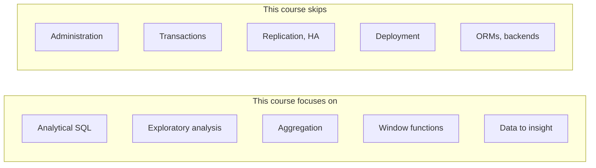
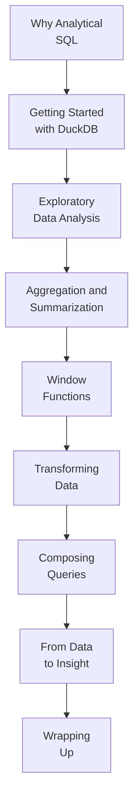

Welcome to **SQL for Data Analysis with DuckDB**. You already know the
basics — `SELECT`, `WHERE`, `JOIN`, maybe `GROUP BY` — and you can read a
simple query without flinching. This course is about the *next* leap:
using SQL not to power an application, but to **think with data**.

That shift is bigger than it sounds. The same `SELECT` keyword that
fetches one user's profile in an app can, with a different mindset,
summarize ten million sales into a single trend line. Learning *how
analysts wield SQL* — and *why* analytical queries are shaped the way
they are — is the whole point of what follows.

<Callout type="info" title="Nothing to install">
Every SQL example on every page runs **inside your browser** on a real
DuckDB engine (DuckDB compiled to WebAssembly). There is no server, no
signup, and nothing to install. Edit the query, click *Run*, and the
results appear right below the editor.
</Callout>

## Who this course is for

You will feel at home here if any of these describe you:

- You can write basic `SELECT` queries and understand tables, rows, and
  joins — but you have never used SQL to *analyze* anything.
- You have heard terms like *OLAP*, *window function*, *aggregation*, or
  *exploratory data analysis* and want to know what they really mean.
- You use spreadsheets or a BI tool for analysis and suspect SQL would
  let you go faster and further.
- You keep hearing about **DuckDB** and want to understand why analysts
  are so excited about it.

You do **not** need:

- Any experience with data analysis, statistics, or BI tools.
- Any experience with DuckDB specifically.
- Anything installed on your computer.

What you **do** need is comfort with basic SQL: `SELECT`, `FROM`,
`WHERE`, `ORDER BY`, and a rough idea of what a `JOIN` does. If those
feel shaky, our
[Introduction to SQL and Relational Databases](/learn/intro-sql-postgres)
course builds them from scratch.

## What you will be able to do

By the end of the course you will be able to:

- Explain how **analytical** (OLAP) work differs from **transactional**
  (OLTP) application work — and why that difference shapes every query.
- **Explore an unfamiliar dataset** quickly: profile it, slice it, and
  find what is interesting.
- **Aggregate and summarize** millions of rows into the handful of
  numbers a decision actually needs.
- Use **window functions** to rank, compute running totals, and compare
  each row to its neighbors.
- **Transform and reshape** data — conditional logic, dates, and pivots.
- **Compose** large analytical queries from small, readable building
  blocks with CTEs and subqueries.
- Turn raw rows into **business metrics** and build **reproducible**
  analytical workflows.

## What this course is *not*

This is an **analytics** course. It deliberately spends **little or no
time** on database administration topics — production deployment, high
availability, replication, security hardening, transactions, multi-user
concurrency, ORMs, query-planner internals, or cloud infrastructure.
Those matter for *running* a database in production, but they are not
what an analyst reaches for when asking questions of data.

## How the course is organized

We start with **mindset, not syntax**. The first section explains how
analytical thinking differs from the application-development SQL you may
have seen, and why a tool like DuckDB exists. Only then do we start
querying — and from that point on, every new technique answers a *real
analytical question* you already care about.

## The three kinds of interactive widgets

You will meet three kinds of interactive elements:

1. **Runnable SQL blocks.** A live DuckDB editor. Some blocks pre-load
   sample data for you; edit the query, click *Run*, and inspect the
   result table.
2. **Challenge cards.** Small problems with hidden tests — write a query,
   run the tests, and see which ones pass.
3. **Multiple-choice questions.** Quick conceptual checks, with an
   explanation for every choice, so you can confirm an idea has landed
   before moving on.

<Callout type="info" title="Each SQL block is independent">
Tables you create in one runnable block are **not** visible to the next
block, even on the same page — every block that needs data sets it up
itself. If you want a single long-lived workspace to experiment in, open
the [DuckDB Playground](/playground/duckdb) in a new tab.
</Callout>

## A first taste

You do not need to understand this yet. Just click *Run* and notice how
few lines it takes to turn a pile of individual sales into a ranked,
per-region summary — the essence of analytical SQL.

<SqlCodeBlock
  dialect="duckdb"
  title="From raw sales to a ranked summary"
  initSql={`CREATE TABLE sales (region TEXT, product TEXT, amount DECIMAL(10, 2));

INSERT INTO
  sales
VALUES
  ('West', 'Widget', 120.00),
  ('West', 'Gadget', 80.50),
  ('East', 'Widget', 200.00),
  ('East', 'Gadget', 50.00),
  ('North', 'Widget', 75.25),
  ('West', 'Widget', 60.00),
  ('East', 'Widget', 90.00);`}
  starterCode={`SELECT
  region,
  COUNT(*) AS orders,
  SUM(amount) AS revenue,
  ROUND(AVG(amount), 2) AS avg_order
FROM
  sales
GROUP BY
  region
ORDER BY
  revenue DESC;`}
/>

That query says, in almost plain English: *"For each region, how many
orders were placed, how much money came in, and how big was the typical
order — and show me the biggest regions first."* Reading the raw rows,
you could not answer that in your head. The query does it instantly, and
would do it just as instantly over ten million rows.
