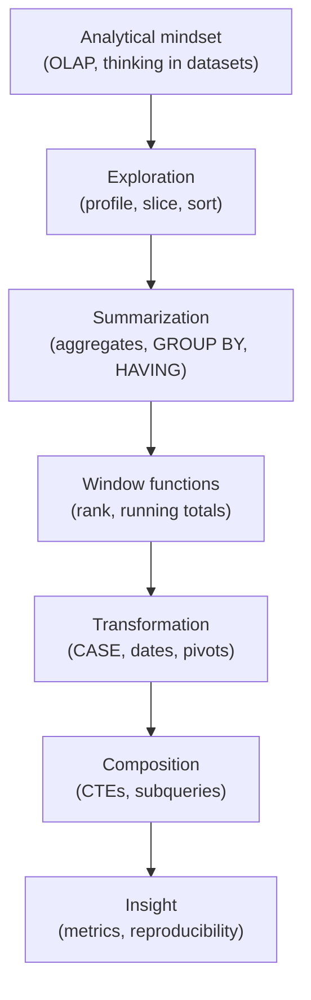

You began this course knowing basic SQL but unsure how analysts actually
*use* it. Now you can profile an unfamiliar dataset, summarize millions of
rows, rank and accumulate with window functions, reshape data, compose
readable pipelines, and turn raw rows into trustworthy business metrics.
More importantly, you understand **why** each technique exists — which is
the part that outlasts any one tool.

## What you built up

The course moved deliberately from *mindset* to *technique* to *insight*:

Each layer rested on the one before it. Window functions only made sense
once aggregation did; metrics only made sense once you could compose
queries; reproducibility tied the whole craft together.

## The big ideas worth keeping

If you remember only a handful of things, make it these:

- **Analytics is "many rows in, few numbers out."** The whole discipline
  is condensing data you cannot read into knowledge you can act on.
- **Aggregation summarizes *instead of* rows; window functions summarize
  *alongside* them.** Knowing which you need is half of analytical SQL.
- **Explore in a loop.** Ask, query, look, and let each result sharpen the
  next question.
- **A metric is a definition first, SQL second.** State it in a sentence,
  then translate it literally — and say which denominator you used.
- **Compose for humans.** CTEs, honest names, and stable ordering make
  analysis readable, reproducible, and trustworthy.

<Callout type="success" title="You can now read real analytical queries">
Pick almost any analytical query in the wild and you can decode it: spot
the slice in `WHERE`, the summary in `GROUP BY`, the per-row context in
`OVER`, and the pipeline in the `WITH` steps. That literacy is exactly
what this course set out to give you.
</Callout>

## One last query — the whole course in one screen

This query uses a CTE pipeline, conditional aggregation, a window
function, safe division, and a stable ordering — nearly every idea from
the course, working together. Read it top to bottom and predict the result
before running it.

<SqlCodeBlock
  dialect="duckdb"
  title="Monthly paid revenue, share of total, and growth"
  initSql={`CREATE TABLE orders AS
SELECT
  DATE '2024-01-01' + (i * 6) AS order_date,
  CASE
    WHEN i % 5 = 0 THEN 'refunded'
    ELSE 'paid'
  END AS status,
  (i * 19) % 200 + 40 AS amount
FROM
  range(0, 60) t (i);`}
  starterCode={`WITH
  monthly AS (
    SELECT
      date_trunc('month', order_date) AS month,
      SUM(amount) FILTER(
        WHERE
          status = 'paid'
      ) AS revenue
    FROM
      orders
    GROUP BY
      month
  )
SELECT
  month,
  revenue,
  ROUND(100.0 * revenue / SUM(revenue) OVER (), 1) AS pct_of_total,
  ROUND(
    100.0 * (
      revenue - LAG (revenue) OVER (
        ORDER BY
          month
      )
    ) / NULLIF(
      LAG (revenue) OVER (
        ORDER BY
          month
      ),
      0
    ),
    1
  ) AS mom_growth_pct
FROM
  monthly
ORDER BY
  month;`}
/>

If you can read that and explain each column — the filtered sum, the
share-of-total window, the month-over-month `LAG`, the divide-by-zero
guard — you have genuinely learned to think analytically in SQL.

## Try it yourself

A final challenge that exercises the core loop: aggregate, rank within
groups, and keep the top of each.

<SqlChallengeCard
  dialect="duckdb"
  title="Top product per category by revenue"
  instructions={`A table \`sales\` is pre-loaded with columns \`category\`, \`product\`, and \`amount\`. Return one row per category containing the \`category\`, the \`product\` with the highest total revenue in that category, and that \`revenue\`. Columns: \`category\`, \`product\`, \`revenue\`. Sort by \`revenue\` descending.`}
  initSql={`CREATE TABLE sales AS
SELECT
  ['Books', 'Electronics', 'Home'] [(i % 3) + 1] AS category,
  ['A', 'B', 'C', 'D'] [(i % 4) + 1] AS product,
  (i * 17) % 100 + 10 AS amount
FROM
  range(1, 61) t (i);`}
  starterCode={`-- Hint: total revenue per (category, product), then keep the
-- top product within each category.
SELECT
  category,
  product,
  SUM(amount) AS revenue
FROM
  sales
GROUP BY
  category,
  product
  -- your ranking/filtering here
ORDER BY
  revenue DESC;`}
  solutionSql={`WITH
  totals AS (
    SELECT
      category,
      product,
      SUM(amount) AS revenue
    FROM
      sales
    GROUP BY
      category,
      product
  )
SELECT
  category,
  product,
  revenue
FROM
  totals
QUALIFY
  ROW_NUMBER() OVER (
    PARTITION BY
      category
    ORDER BY
      revenue DESC
  ) = 1
ORDER BY
  revenue DESC;`}
  tests={[
    {
      id: "row_count",
      name: "One row per category",
      description: "Three categories → three rows",
      expectedRowCount: 3,
    },
    {
      id: "columns",
      name: "Has required columns",
      description: "category, product, revenue",
      expectedColumnsInclude: ["category", "product", "revenue"],
    },
    {
      id: "matches",
      name: "Matches the reference solution",
      description: "Top product per category by revenue",
      matchesSolution: true,
      ordered: true,
    },
  ]}
/>

## Where to go from here

This was an **analytical SQL** course. Natural next steps include:

- **Joins for analysis in depth** — combining fact and dimension tables,
  semi/anti joins, and `ASOF` joins for time-aligned data.
- **Statistical functions** — percentiles, `MEDIAN`, correlation, and
  approximate aggregates for very large data.
- **Reading real files** — pointing DuckDB at CSV and Parquet, and
  querying data straight from cloud storage.
- **From query to chart** — feeding your summaries into a visualization or
  notebook to communicate the story.
- **dbt and analytics engineering** — turning ad-hoc queries into tested,
  documented, reproducible data models.

But there is no rush. The analytical way of thinking you built here — *many
rows in, few numbers out; explore in a loop; define before you compute* —
is the foundation everything else stands on. Keep asking questions of
data, keep writing queries, and the rest will follow.

Welcome to data analysis with SQL.
