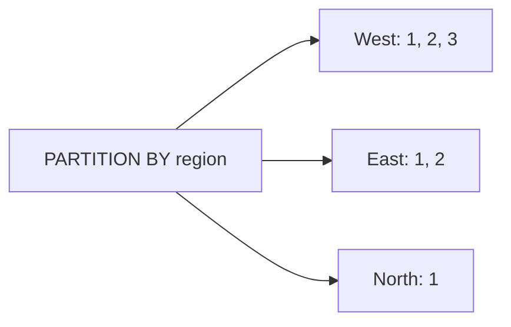
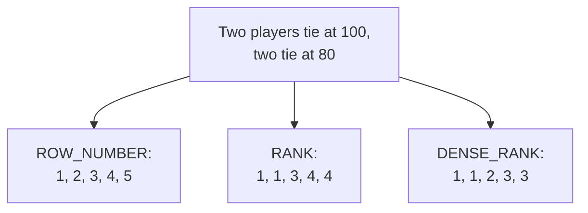

A huge family of analytical questions is about **position**: "the top 3
products per category", "each customer's first order", "the runner-up in
each region." All of them rank rows *within* a window and then act on that
rank. This page covers the three ranking functions and the per-group
top-N pattern they unlock. Because ranking is foundational and the
RANK/DENSE_RANK distinction trips people up, there are extra questions at
the end.

## Numbering rows with `ROW_NUMBER`

`ROW_NUMBER()` assigns 1, 2, 3, ... to rows in the order you specify. It
*requires* an `ORDER BY` inside `OVER`, because numbering only makes sense
once you have decided the order.

<SqlCodeBlock
  dialect="duckdb"
  title="Number orders from biggest to smallest"
  initSql={`CREATE TABLE orders (
  id INTEGER, region TEXT, amount DECIMAL(8,2)
);
INSERT INTO orders VALUES
  (1,'West',120),(2,'East',80),(3,'West',45),
  (4,'East',200),(5,'North',60),(6,'West',95);`}
  starterCode={`SELECT
  id,
  amount,
  ROW_NUMBER() OVER (ORDER BY amount DESC) AS rn
FROM orders
ORDER BY rn;`}
/>

The biggest order is `rn = 1`, the next `rn = 2`, and so on — a clean
sequential rank over the whole table.

## Ranking *within* groups with `PARTITION BY`

Add `PARTITION BY` and the numbering **restarts** in each group. This is
how you ask "rank within each region" — every region gets its own 1, 2,
3.

<SqlCodeBlock
  dialect="duckdb"
  title="Rank orders within each region"
  initSql={`CREATE TABLE orders (
  id INTEGER, region TEXT, amount DECIMAL(8,2)
);
INSERT INTO orders VALUES
  (1,'West',120),(2,'East',80),(3,'West',45),
  (4,'East',200),(5,'North',60),(6,'West',95);`}
  starterCode={`SELECT
  region,
  id,
  amount,
  ROW_NUMBER() OVER (
    PARTITION BY region
    ORDER BY amount DESC
  ) AS rank_in_region
FROM orders
ORDER BY region, rank_in_region;`}
/>

## Per-group top-N: the pattern to memorize

The most common use of ranking is **top-N per group**: keep only the rows
whose rank is at or below N. Because you cannot filter on a window
function in `WHERE` (it is computed too late), DuckDB gives you
**`QUALIFY`**, a `WHERE`-like clause that filters *after* window functions
run.

<SqlCodeBlock
  dialect="duckdb"
  title="Top 2 orders per region with QUALIFY"
  initSql={`CREATE TABLE orders (
  id INTEGER, region TEXT, amount DECIMAL(8,2)
);
INSERT INTO orders VALUES
  (1,'West',120),(2,'East',80),(3,'West',45),
  (4,'East',200),(5,'North',60),(6,'West',95),(7,'East',150);`}
  starterCode={`SELECT
  region,
  id,
  amount
FROM orders
QUALIFY ROW_NUMBER() OVER (
          PARTITION BY region
          ORDER BY amount DESC
        ) <= 2
ORDER BY region, amount DESC;`}
/>

This is the canonical "best N per category" shape: **partition** by the
category, **order** by the measure, **rank** with `ROW_NUMBER`, and
**keep** ranks ≤ N with `QUALIFY`. Internalize it — you will use it
constantly.

## `ROW_NUMBER` vs `RANK` vs `DENSE_RANK`

The three ranking functions differ only in how they handle **ties** (rows
with equal `ORDER BY` values). The difference matters and is a frequent
source of confusion.

- **`ROW_NUMBER`** — always distinct: 1, 2, 3, 4. Ties are broken
  arbitrarily; no two rows share a number.
- **`RANK`** — ties share a number, then it **skips**: 1, 1, 3, 4. (Two
  golds, no silver.)
- **`DENSE_RANK`** — ties share a number, **no skip**: 1, 1, 2, 3.

<SqlCodeBlock
  dialect="duckdb"
  title="See how the three handle ties"
  initSql={`CREATE TABLE scores (
  player TEXT, points INTEGER
);
INSERT INTO scores VALUES
  ('Ada',100),('Bo',100),('Cy',90),('Di',80),('Eli',80);`}
  starterCode={`SELECT
  player,
  points,
  ROW_NUMBER()  OVER (ORDER BY points DESC) AS row_number,
  RANK()        OVER (ORDER BY points DESC) AS rank,
  DENSE_RANK()  OVER (ORDER BY points DESC) AS dense_rank
FROM scores
ORDER BY points DESC, player;`}
/>

Choosing between them:

- Use **`ROW_NUMBER`** when you need a unique number per row (e.g. "exactly
  one top row per group").
- Use **`RANK`** when ties should share a place and you want gaps to
  reflect how many tied (competition-style standings).
- Use **`DENSE_RANK`** when ties share a place but you want consecutive
  rank numbers (e.g. "the top 3 *distinct* scores").

## Check your understanding

<MultipleChoice
  markdown={`Why must a \`ROW_NUMBER() OVER (...)\` include an \`ORDER BY\` inside the \`OVER\`?

- Because \`ROW_NUMBER\` cannot be used with \`PARTITION BY\`.
  > It works with \`PARTITION BY\`; the requirement is about ordering, which defines the numbering.
- [o] Numbering rows 1, 2, 3 only makes sense once an order is defined, so the window needs an \`ORDER BY\`.
  > Without an order there is no basis for which row is "1", so \`ROW_NUMBER\` needs \`ORDER BY\` in the window.
- Because \`ORDER BY\` sorts the final output.
  > The window's \`ORDER BY\` controls the numbering, not the final result order (which is the outer \`ORDER BY\`).
- It does not — \`ORDER BY\` is optional for \`ROW_NUMBER\`.
  > A meaningful row number requires an ordering; omitting it makes the numbers arbitrary or invalid.

\`ROW_NUMBER\` numbers rows in a defined order, so the window must specify
that order.`}
/>

<MultipleChoice
  markdown={`Players score 100, 100, 90. What does \`RANK()\` (ordering by score descending) assign?

- 1, 2, 3
  > That is \`ROW_NUMBER\` behavior; \`RANK\` lets the two 100s tie.
- [o] 1, 1, 3 — the tied 100s both get rank 1, and the next rank skips to 3.
  > \`RANK\` gives equal values the same rank and then skips the consumed positions.
- 1, 1, 2
  > That is \`DENSE_RANK\`, which does not skip; \`RANK\` skips to 3.
- 1, 2, 2
  > The ties are at the top (the two 100s), not at 90; and \`RANK\` would not produce this.

\`RANK\` shares the rank for ties and then skips, giving 1, 1, 3.`}
/>

<MultipleChoice
  markdown={`You want the **single highest-paid employee per department**, exactly one row each even if salaries tie. Which function fits best?

- \`RANK\`, because ties should share the top spot.
  > \`RANK\` would return *all* tied top earners (multiple rows), not exactly one per department.
- [o] \`ROW_NUMBER\`, because it gives a unique number per row so you can keep just \`= 1\`.
  > \`ROW_NUMBER\` never ties, so filtering to rank 1 yields exactly one row per department.
- \`DENSE_RANK\`, because it never skips numbers.
  > \`DENSE_RANK\` also ties, so a salary tie would return more than one rank-1 row.
- \`COUNT\`, because it counts employees.
  > \`COUNT\` does not rank rows and cannot pick the top earner.

When you need exactly one row per group, \`ROW_NUMBER\` is the safe choice
because it breaks ties.`}
/>

<MultipleChoice
  markdown={`Why does the top-N-per-group pattern use \`QUALIFY\` instead of \`WHERE\` to filter on the rank?

- Because \`WHERE\` cannot compare numbers.
  > \`WHERE\` compares numbers fine; the issue is timing relative to window functions.
- [o] Window functions are computed after \`WHERE\` runs, so you cannot filter on a window result in \`WHERE\`; \`QUALIFY\` filters after windows are computed.
  > \`QUALIFY\` is to window functions what \`HAVING\` is to aggregates — a filter applied once the window values exist.
- Because \`QUALIFY\` sorts the rows.
  > \`QUALIFY\` filters; it does not sort.
- Because \`WHERE\` only works on the first partition.
  > \`WHERE\` works across all rows; it simply runs before window functions are available.

\`QUALIFY\` filters on window-function results that \`WHERE\` is too early to
see.`}
/>

<MultipleChoice
  markdown={`What does \`PARTITION BY category\` change about \`ROW_NUMBER() OVER (PARTITION BY category ORDER BY price DESC)\`?

- It numbers all rows 1..N across the whole table ignoring category.
  > Without partitioning it would do that; \`PARTITION BY\` restarts numbering per category.
- [o] The numbering restarts at 1 within each category, ranking rows separately per group.
  > Partitioning scopes the ranking so each category gets its own 1, 2, 3 by price.
- It removes the category column.
  > The column remains; partitioning only scopes the ranking.
- It sorts categories alphabetically.
  > \`PARTITION BY\` groups for the window; it does not alphabetize categories.

\`PARTITION BY\` makes the rank restart within each group.`}
/>

Ranking answers "where does this row stand?" The next page answers a
different positional question — "how does this row's value accumulate or
compare over time?" — with running totals and moving averages.
