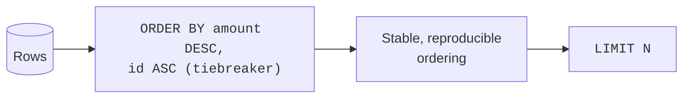

"Which are the biggest? The worst? The most recent?" An enormous share of
analytical questions are really **top-N** questions, and they all reduce
to *sort, then look at the head*. This page treats `ORDER BY` not as
presentation but as a way to **find the rows that matter**, and introduces
the per-group top-N pattern analysts use constantly.

<svg
  viewBox="0 0 640 235"
  role="img"
  aria-label="Loose dots pour into a vessel and settle into layers sorted by size, while a yellow ladle skims the three biggest green dots off the top — and an equally large red dot left in the layer below hints at the tie that almost made the cut"
  style={{ display: "block", width: "100%", maxWidth: "640px", height: "auto", margin: "2.5rem auto" }}
>
  <g fill="currentColor" opacity="0.3">
    <circle cx="62" cy="44" r="5" />
    <circle cx="96" cy="28" r="7" />
    <circle cx="128" cy="52" r="4" />
    <circle cx="158" cy="30" r="6" />
    <circle cx="118" cy="84" r="3.5" />
  </g>
  <g fill="currentColor" opacity="0.18">
    <circle cx="184" cy="62" r="3" />
    <circle cx="208" cy="84" r="3" />
    <circle cx="228" cy="108" r="3" />
  </g>
  <g fill="currentColor" opacity="0.07">
    <rect x="244" y="84" width="252" height="124" rx="16" />
  </g>
  <g style={{ color: "var(--ds-yellow-500)" }} fill="currentColor">
    <path d="M 252 58 Q 370 86 488 58 L 488 68 Q 370 96 252 68 Z" fillOpacity="0.55" />
    <rect x="488" y="50" width="64" height="10" rx="5" fillOpacity="0.55" />
  </g>
  <g style={{ color: "var(--ds-green-500)" }} fill="currentColor">
    <circle cx="306" cy="42" r="10" />
    <circle cx="370" cy="48" r="10" />
    <circle cx="434" cy="42" r="10" />
  </g>
  <g style={{ color: "var(--ds-blue-500)" }} fill="currentColor">
    <circle cx="294" cy="110" r="7" fillOpacity="0.6" />
    <circle cx="350" cy="110" r="7" fillOpacity="0.6" />
    <circle cx="462" cy="110" r="7" fillOpacity="0.6" />
    <circle cx="286" cy="140" r="5.5" fillOpacity="0.45" />
    <circle cx="330" cy="140" r="5.5" fillOpacity="0.45" />
    <circle cx="374" cy="140" r="5.5" fillOpacity="0.45" />
    <circle cx="418" cy="140" r="5.5" fillOpacity="0.45" />
    <circle cx="460" cy="140" r="5.5" fillOpacity="0.45" />
    <circle cx="280" cy="166" r="4" fillOpacity="0.3" />
    <circle cx="316" cy="166" r="4" fillOpacity="0.3" />
    <circle cx="352" cy="166" r="4" fillOpacity="0.3" />
    <circle cx="388" cy="166" r="4" fillOpacity="0.3" />
    <circle cx="424" cy="166" r="4" fillOpacity="0.3" />
    <circle cx="460" cy="166" r="4" fillOpacity="0.3" />
    <circle cx="276" cy="190" r="3" fillOpacity="0.18" />
    <circle cx="308" cy="190" r="3" fillOpacity="0.18" />
    <circle cx="340" cy="190" r="3" fillOpacity="0.18" />
    <circle cx="372" cy="190" r="3" fillOpacity="0.18" />
    <circle cx="404" cy="190" r="3" fillOpacity="0.18" />
    <circle cx="436" cy="190" r="3" fillOpacity="0.18" />
    <circle cx="466" cy="190" r="3" fillOpacity="0.18" />
  </g>
  <g style={{ color: "var(--ds-red-500)" }} fill="currentColor">
    <circle cx="406" cy="110" r="9.5" fillOpacity="0.85" />
  </g>
  <g fill="currentColor" opacity="0.2">
    <circle cx="560" cy="120" r="3" />
    <circle cx="586" cy="160" r="3" />
  </g>
</svg>

## Sorting surfaces the extremes

The fastest way to learn something about a dataset is to look at its
biggest and smallest values. `ORDER BY ... DESC` brings the largest to the
top; `LIMIT` lets you read just those.

<SqlCodeBlock
  dialect="duckdb"
  title="The five biggest orders"
  initSql={`CREATE TABLE orders AS
SELECT
  i AS id,
  ['West', 'East', 'North'] [(i % 3) + 1] AS region,
  (i * 37) % 500 + 10 AS amount
FROM
  range(1, 201) t (i);`}
  starterCode={`SELECT
  id,
  region,
  amount
FROM
  orders
ORDER BY
  amount DESC
LIMIT
  5;`}
/>

Flip `DESC` to `ASC` (or drop it — ascending is the default) to find the
*smallest*. The "top 5 / bottom 5" glance is often the very first thing an
analyst does after slicing.

## Sorting by more than one key

When the first sort key ties, a second key breaks the tie. Analysts use
this to organize a result meaningfully — e.g. newest-first within each
region.

<SqlCodeBlock
  dialect="duckdb"
  title="Within each region, biggest orders first"
  initSql={`CREATE TABLE orders AS
SELECT
  i AS id,
  ['West', 'East', 'North'] [(i % 3) + 1] AS region,
  (i * 37) % 500 + 10 AS amount
FROM
  range(1, 31) t (i);`}
  starterCode={`SELECT
  region,
  id,
  amount
FROM
  orders
ORDER BY
  region ASC,
  amount DESC;`}
/>

Read it as "group the eye by region, and within each, descend by amount."
The result reads like a small report.

## Sorting by a computed measure

You can sort by an expression that is not even in the table — a derived
measure. "Most efficient", "best value", "highest rate" are all
`ORDER BY <expression>`.

<SqlCodeBlock
  dialect="duckdb"
  title="Best value: lowest price per gram"
  initSql={`CREATE TABLE snacks (name TEXT, price DECIMAL(6, 2), grams INTEGER);

INSERT INTO
  snacks
VALUES
  ('Almonds', 6.00, 200),
  ('Chips', 3.50, 150),
  ('Trail Mix', 8.00, 400),
  ('Pretzels', 2.00, 100),
  ('Jerky', 9.00, 90);`}
  starterCode={`SELECT
  name,
  ROUND(price / grams, 4) AS price_per_gram
FROM
  snacks
ORDER BY
  price_per_gram ASC;

-- cheapest per gram first`}
/>

## Be careful: `NULL`s and ties

Two subtleties that quietly trip up analysts:

- **`NULL`s have to go somewhere.** In DuckDB, `NULL`s sort *last* by
  default in `ASC` and you can control this with `NULLS FIRST` / `NULLS
  LAST`. If your "smallest" query is returning blanks at the top, this is
  why.
- **Ties are arbitrary unless you break them.** If ten rows share the top
  `amount`, `LIMIT 5` returns *some* five of them, unpredictably. Add a
  tiebreaker column to `ORDER BY` to make results stable and reproducible —
  which matters for analysis you intend to repeat.

## Per-group top-N with `QUALIFY`

"Top 5 orders overall" is easy. "Top 2 orders *per region*" is the
question analysts actually ask — and a plain `LIMIT` cannot do it, because
`LIMIT` caps the whole result, not each group. The clean DuckDB answer
pairs a window function (which you will meet properly soon) with
**`QUALIFY`**, a filter on the window result.

<SqlCodeBlock
  dialect="duckdb"
  title="Top 2 orders within each region"
  initSql={`CREATE TABLE orders AS
SELECT
  i AS id,
  ['West', 'East', 'North'] [(i % 3) + 1] AS region,
  (i * 37) % 500 + 10 AS amount
FROM
  range(1, 31) t (i);`}
  starterCode={`SELECT
  region,
  id,
  amount
FROM
  orders
QUALIFY
  ROW_NUMBER() OVER (
    PARTITION BY
      region
    ORDER BY
      amount DESC
  ) <= 2
ORDER BY
  region,
  amount DESC;`}
/>

Do not worry about the `OVER (...)` mechanics yet — the Window Functions
section explains them in full. For now, note the *shape* of the question:
**rank within each group, then keep the top of each**. It is one of the
most common analytical patterns there is, and `QUALIFY` expresses it
without an extra subquery.

<svg
  viewBox="0 0 640 195"
  role="img"
  aria-label="Three vertical lanes of dots sorted by size, each with a translucent green band hugging its own two largest — top-N applied within every group instead of once across the whole result"
  style={{ display: "block", width: "100%", maxWidth: "560px", height: "auto", margin: "2.5rem auto" }}
>
  <g fill="currentColor" opacity="0.06">
    <rect x="98" y="24" width="92" height="156" rx="16" />
    <rect x="274" y="24" width="92" height="156" rx="16" />
    <rect x="450" y="24" width="92" height="156" rx="16" />
  </g>
  <g style={{ color: "var(--ds-green-500)" }} fill="currentColor">
    <rect x="106" y="34" width="76" height="68" rx="13" fillOpacity="0.16" />
    <rect x="282" y="34" width="76" height="62" rx="13" fillOpacity="0.16" />
    <rect x="458" y="34" width="76" height="74" rx="13" fillOpacity="0.16" />
    <circle cx="144" cy="54" r="10" />
    <circle cx="144" cy="84" r="8" />
    <circle cx="320" cy="52" r="9" />
    <circle cx="320" cy="80" r="7.5" />
    <circle cx="496" cy="56" r="11" />
    <circle cx="496" cy="90" r="8.5" />
  </g>
  <g style={{ color: "var(--ds-blue-500)" }} fill="currentColor">
    <circle cx="144" cy="116" r="6" fillOpacity="0.4" />
    <circle cx="144" cy="142" r="4.5" fillOpacity="0.28" />
    <circle cx="144" cy="163" r="3.5" fillOpacity="0.18" />
    <circle cx="320" cy="108" r="6" fillOpacity="0.4" />
    <circle cx="320" cy="134" r="4.5" fillOpacity="0.28" />
    <circle cx="320" cy="156" r="3.5" fillOpacity="0.18" />
    <circle cx="496" cy="122" r="6" fillOpacity="0.4" />
    <circle cx="496" cy="148" r="4.5" fillOpacity="0.28" />
    <circle cx="496" cy="168" r="3.5" fillOpacity="0.18" />
  </g>
</svg>

## Check your understanding

<MultipleChoice
  markdown={`What is the most analytical reason to use \`ORDER BY ... DESC LIMIT 10\`?

- To permanently store the table in sorted order.
  > \`ORDER BY\` sorts the query result, not the stored table.
- [o] To surface the ten largest values — answering a "top 10" question.
  > Sorting descending and limiting is exactly how analysts find the biggest or worst rows.
- To delete all but ten rows.
  > \`LIMIT\` restricts what the query returns; it deletes nothing.
- To shuffle rows randomly before display.
  > \`ORDER BY\` is deterministic sorting, not shuffling.

"Sort descending, take the top N" is the canonical top-N pattern.`}
/>

<MultipleChoice
  markdown={`Why can a tie in the sort column make \`ORDER BY amount DESC LIMIT 5\` give **unstable** results?

- Because \`LIMIT\` randomly deletes rows from the table.
  > \`LIMIT\` does not delete table rows; the instability comes from undecided ordering among tied rows.
- [o] When several rows share the same \`amount\`, their relative order is undefined, so which five appear can vary unless you add a tiebreaker.
  > Without a secondary sort key, tied rows have no guaranteed order, making the top-5 non-reproducible.
- Because DuckDB cannot sort decimal columns.
  > DuckDB sorts decimals fine; the issue is ties, not the data type.
- Because \`DESC\` is not a valid keyword.
  > \`DESC\` is valid; the instability is purely about unbroken ties.

Add a tiebreaker column to \`ORDER BY\` to make top-N results stable and
reproducible.`}
/>

<MultipleChoice
  markdown={`You need the **top 2 orders within each region**. Why does a plain \`ORDER BY amount DESC LIMIT 2\` fail?

- It works perfectly for per-region top-N.
  > It does not: \`LIMIT 2\` caps the *entire* result at two rows, not two per region.
- [o] \`LIMIT\` restricts the whole result to 2 rows total, not 2 per group; you need per-group ranking (e.g. \`ROW_NUMBER\` + \`QUALIFY\`).
  > Per-group top-N requires ranking within each partition and filtering on that rank, which \`LIMIT\` alone cannot express.
- Because \`ORDER BY\` cannot be combined with \`LIMIT\`.
  > They combine fine; the limitation is that \`LIMIT\` is global, not per-group.
- Because regions cannot be sorted.
  > Regions sort fine; the problem is the global nature of \`LIMIT\`.

Per-group top-N needs a window-function rank filtered with \`QUALIFY\`, not a
global \`LIMIT\`.`}
/>

You have now finished the exploration toolkit: profile, slice, sort. The
real analytical power, though, comes from **summarizing** — turning many
rows into a few meaningful numbers. That is the next section.
