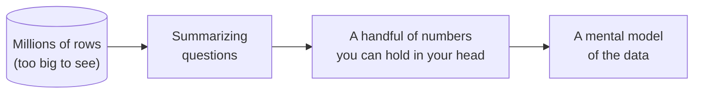
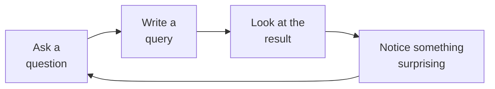
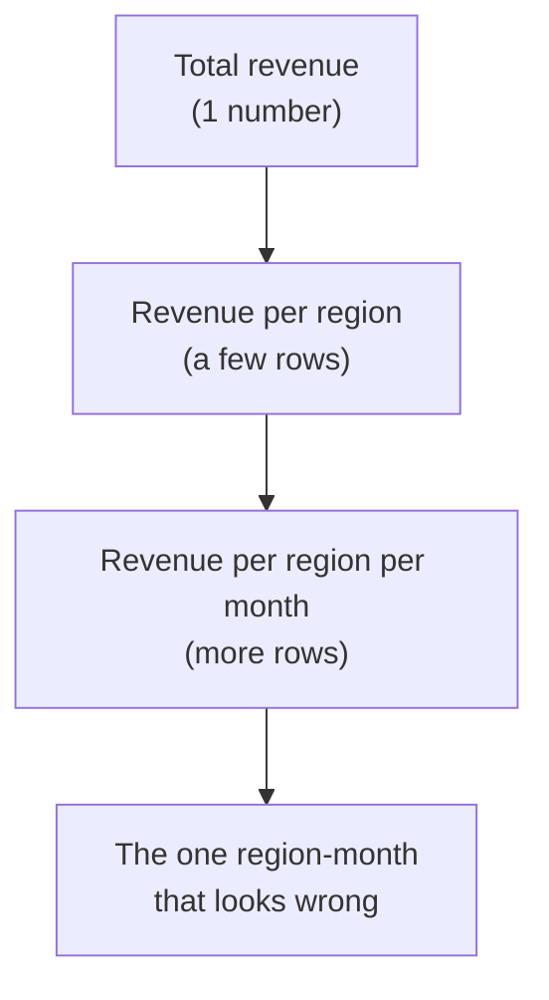

An application developer usually knows exactly which row they want before
they write a query. An analyst almost never does. Faced with a table of a
million rows, you cannot eyeball it — you have to **reason about its
shape** through summaries. This page is about that mindset: how to think
when the data is too big to see, and how SQL becomes your instrument for
"looking."

<svg
  viewBox="0 0 640 230"
  role="img"
  aria-label="A vast sea of faint dots runs past the edges of the frame, one red dot hiding in it, while a thought bubble above holds just four crisp summary chips — a dataset too big to see, held in mind as a handful of numbers"
  style={{ display: "block", width: "100%", maxWidth: "640px", height: "auto", margin: "2.5rem auto" }}
>
  <g fill="currentColor">
    <circle cx="8" cy="138" r="3" opacity="0.1" />
    <circle cx="34" cy="156" r="3" opacity="0.16" />
    <circle cx="58" cy="132" r="3" opacity="0.2" />
    <circle cx="84" cy="170" r="3" opacity="0.22" />
    <circle cx="108" cy="146" r="3" opacity="0.25" />
    <circle cx="132" cy="186" r="3" opacity="0.2" />
    <circle cx="150" cy="128" r="3" opacity="0.26" />
    <circle cx="176" cy="160" r="3" opacity="0.28" />
    <circle cx="198" cy="196" r="3" opacity="0.22" />
    <circle cx="214" cy="138" r="3" opacity="0.3" />
    <circle cx="244" cy="172" r="3" opacity="0.28" />
    <circle cx="262" cy="208" r="3" opacity="0.18" />
    <circle cx="282" cy="146" r="3" opacity="0.3" />
    <circle cx="306" cy="184" r="3" opacity="0.26" />
    <circle cx="330" cy="132" r="3" opacity="0.3" />
    <circle cx="352" cy="166" r="3" opacity="0.3" />
    <circle cx="376" cy="202" r="3" opacity="0.24" />
    <circle cx="396" cy="142" r="3" opacity="0.3" />
    <circle cx="420" cy="178" r="3" opacity="0.26" />
    <circle cx="448" cy="208" r="3" opacity="0.2" />
    <circle cx="462" cy="136" r="3" opacity="0.26" />
    <circle cx="488" cy="168" r="3" opacity="0.24" />
    <circle cx="512" cy="198" r="3" opacity="0.18" />
    <circle cx="530" cy="142" r="3" opacity="0.2" />
    <circle cx="556" cy="176" r="3" opacity="0.16" />
    <circle cx="582" cy="150" r="3" opacity="0.12" />
    <circle cx="608" cy="186" r="3" opacity="0.1" />
    <circle cx="632" cy="158" r="3" opacity="0.08" />
  </g>
  <g style={{ color: "var(--ds-red-500)" }} fill="currentColor">
    <circle cx="430" cy="152" r="4.5" />
  </g>
  <g fill="currentColor" opacity="0.09">
    <ellipse cx="320" cy="58" rx="150" ry="44" />
  </g>
  <g fill="currentColor" opacity="0.18">
    <circle cx="252" cy="112" r="7" />
    <circle cx="226" cy="130" r="4" />
  </g>
  <g style={{ color: "var(--ds-blue-500)" }} fill="currentColor">
    <rect x="216" y="46" width="74" height="16" rx="8" fillOpacity="0.85" />
  </g>
  <g style={{ color: "var(--ds-green-500)" }} fill="currentColor">
    <circle cx="330" cy="54" r="11" />
  </g>
  <g style={{ color: "var(--ds-yellow-500)" }} fill="currentColor">
    <rect x="362" y="46" width="42" height="16" rx="8" fillOpacity="0.9" />
  </g>
  <g fill="currentColor" opacity="0.35">
    <rect x="222" y="70" width="36" height="6" rx="3" />
    <rect x="266" y="70" width="24" height="6" rx="3" />
    <rect x="318" y="70" width="30" height="6" rx="3" />
    <rect x="362" y="70" width="20" height="6" rx="3" />
  </g>
</svg>

## You cannot see a million rows — so you summarize

Imagine someone hands you a spreadsheet with 2 million sales. Scrolling
is hopeless. Instead, an analyst asks *summarizing* questions that shrink
the data to something a human can hold in mind:

- *How many rows are there?* (the size)
- *What date range does it cover?* (the span)
- *How many distinct products / regions / customers?* (the cardinality)
- *What does a typical value look like — and the extremes?* (the
  distribution)

Each answer is a single number or a short list. Stacked together, they
form a **mental picture** of a dataset you will never see row-by-row.

This is the core analytical skill, and it has a name: **exploratory data
analysis (EDA)**. You explore before you conclude.

## The loop: question → query → look → next question

Analysis is rarely a straight line from question to answer. It is a
**loop**. You ask a rough question, write a query, look at the result,
and the result almost always suggests a sharper question.

Say you compute revenue per region and notice one region is oddly low.
That *surprise* drives the next query: is it fewer orders, or smaller
ones? Then the next: which products? Each step narrows the mystery. SQL
is fast enough that this loop can spin many times per minute — which is
why analysts prefer it to hand-editing spreadsheets.

## Drilling down: from coarse to fine

A common pattern within the loop is **drill-down**: start with the
coarsest possible summary, then add detail only where it is interesting.

You do **not** dump all the detail at once — that just recreates the
unreadable million-row spreadsheet. You add a dimension at a time, follow
the surprises, and stop when the picture is clear.

Run this and notice how three small queries build a mental model of a
dataset you never scrolled through:

<SqlCodeBlock
  dialect="duckdb"
  title="Building a mental picture in three questions"
  initSql={`CREATE TABLE events AS
SELECT
  i AS id,
  DATE '2024-01-01' + (i % 120) AS day,
  ['signup', 'login', 'purchase', 'refund'] [(i % 4) + 1] AS kind,
  (i * 17) % 200 AS value
FROM
  range(1, 4001) t (i);`}
  starterCode={`-- Question 1: how big, and what does it span?
SELECT
  COUNT(*) AS rows,
  MIN(day) AS first_day,
  MAX(day) AS last_day,
  COUNT(DISTINCT kind) AS kinds
FROM
  events;`}
/>

Now sharpen the question — *what kinds of events, and how common is each?*

<SqlCodeBlock
  dialect="duckdb"
  title="Drill down: the mix of event kinds"
  initSql={`CREATE TABLE events AS
SELECT
  i AS id,
  DATE '2024-01-01' + (i % 120) AS day,
  ['signup', 'login', 'purchase', 'refund'] [(i % 4) + 1] AS kind,
  (i * 17) % 200 AS value
FROM
  range(1, 4001) t (i);`}
  starterCode={`SELECT
  kind,
  COUNT(*) AS n,
  ROUND(100.0 * COUNT(*) / SUM(COUNT(*)) OVER (), 1) AS pct
FROM
  events
GROUP BY
  kind
ORDER BY
  n DESC;`}
/>

You just turned 4,000 invisible rows into a four-line story — without
ever reading a single individual event. That is thinking in datasets.

## Three habits worth keeping

- **Summarize before you conclude.** Never trust a hunch about big data
  until a query confirms its shape.
- **Follow the surprises.** The most valuable next query is usually
  prompted by something unexpected in the last result.
- **Add detail gradually.** Coarse first, then drill down. Detail is
  cheap to add and expensive to read all at once.

## Check your understanding

<MultipleChoice
  markdown={`Why do analysts rely on **summaries** when working with large datasets?

- Because SQL is unable to return individual rows.
  > SQL can return individual rows; analysts choose summaries because raw rows are too numerous to comprehend.
- [o] Because a dataset of millions of rows is too large to read directly, so summaries reveal its shape.
  > Counts, ranges, and averages compress an unreadable table into a few numbers a human can reason about.
- Because summaries are the only queries databases can run quickly.
  > Databases run many kinds of queries; summarizing is a choice driven by human comprehension, not the only fast option.
- Because individual rows are always inaccurate.
  > Individual rows are not inherently inaccurate; they are simply too many to inspect one by one.

You summarize because you cannot see a million rows at once — the summary
*is* how you "see" the data.`}
/>

<MultipleChoice
  markdown={`Which best describes the **exploratory analysis loop**?

- Write one perfect query at the start and never change it.
  > Analysis is iterative; you rarely know the final query up front. A single fixed query is more typical of application code.
- [o] Ask a question, run a query, inspect the result, and let what you find shape the next question.
  > This question to query to look to next-question cycle is the heart of exploratory data analysis.
- Insert data, then immediately delete it.
  > That is not analysis at all; it describes data manipulation with no insight produced.
- Export everything to a spreadsheet and scroll through it.
  > Scrolling through millions of rows is exactly what the loop avoids by summarizing instead.

Exploration is a loop: each result suggests the next, sharper question.`}
/>

<MultipleChoice
  markdown={`What is **drill-down** in analysis?

- Deleting rows until the table is small enough to read.
  > Drill-down adds detail to summaries; it does not delete data.
- [o] Starting from a coarse summary and progressively adding detail where something looks interesting.
  > You begin with the big picture (e.g. total revenue), then add dimensions like region, then month, following the surprises.
- Running the same query repeatedly until it gets faster.
  > Repetition does not add analytical detail; drill-down is about adding dimensions, not speed.
- Joining every table in the database at once.
  > Joining everything indiscriminately is not drill-down; drill-down is a measured, one-dimension-at-a-time refinement.

Drill-down means going from coarse to fine, one dimension at a time,
guided by what looks worth investigating.`}
/>

You now have the analyst's mindset. Next, let us meet the tool this
course uses to practice it — and understand *why DuckDB* in particular.
