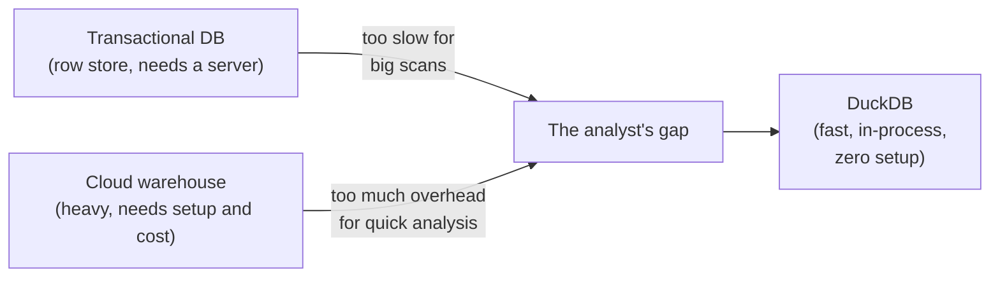
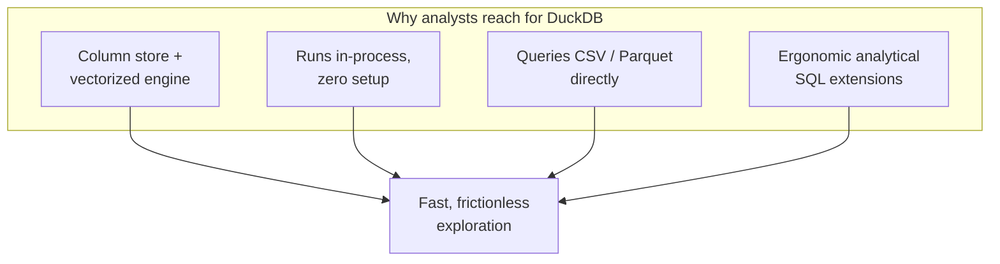
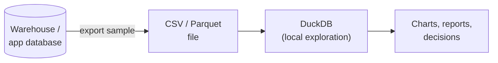

Every page so far has hinted at it: analytical work has different needs
from application work, and those needs reward a different kind of
database. **DuckDB** is that kind of database — purpose-built for
analysis. This page explains, concisely, *why it exists* and *why it has
become so popular*, so the tool you are about to use stops feeling like a
black box.

## The problem DuckDB solves

Organizations now generate **enormous** amounts of data almost by
accident — every click, order, sensor reading, and log line is recorded.
Analysts want to explore that data, but their two traditional options
each hurt:

- A **transactional database** (like a typical app's PostgreSQL or MySQL)
  is row-oriented and tuned for many small writes. Big analytical scans
  are possible but not its strength, and you must run a server.
- A **data warehouse** (a big cloud analytics system) is powerful but
  heavy: accounts, clusters, credentials, cost, and network latency just
  to answer "what was last month's revenue?"

For a single analyst poking at a few gigabytes on a laptop, both are
overkill. DuckDB fills exactly that gap.

## What makes DuckDB different

A few design choices, taken together, make DuckDB feel made for the
exploratory loop you learned about.

- **Column-oriented and vectorized.** Like the analytical engines in the
  last lesson, DuckDB stores data by column and processes it in batches,
  so summary queries over many rows fly.
- **In-process, no server.** DuckDB runs *inside* your program (or, here,
  inside your browser tab). There is no server to start, no port, no
  login. You open it and query.
- **Single-file or in-memory.** A whole database can be one file you copy
  around like a spreadsheet — or live entirely in memory for a quick
  analysis.
- **Reads files directly.** DuckDB can query CSV and Parquet files *in
  place*, without a separate "load" step, which suits ad-hoc analysis.
- **Analyst-friendly SQL.** Conveniences like `GROUP BY ALL`,
  `SELECT * EXCLUDE (...)`, `SUMMARIZE`, and friendly list/struct types
  cut the ceremony out of common analytical queries.

People sometimes call DuckDB *"SQLite for analytics."* SQLite gave
everyone a tiny, embedded **transactional** database with no server;
DuckDB does the same for **analytical** work. Same spirit — opposite
workload.

## Where it fits in a modern workflow

DuckDB rarely replaces the cloud warehouse or the app's database. It sits
*beside* them as the analyst's fast scratchpad:

- Pull a sample or an export (a CSV or Parquet file) and explore it
  locally at full speed.
- Prototype an analytical query on your laptop before running it on the
  big warehouse.
- Use it as the engine inside notebooks and data pipelines for
  transformation steps.

The important point for this course: DuckDB lets you practice *real
analytical SQL* with **zero friction**. The same engine runs right here
in your browser, so every example is live.

<SqlCodeBlock
  dialect="duckdb"
  title="A taste of analyst-friendly DuckDB SQL"
  initSql={`CREATE TABLE sales AS
SELECT
  i                                AS id,
  ['West','East','North','South'][(i % 4) + 1] AS region,
  ['Widget','Gadget','Gizmo'][(i % 3) + 1]     AS product,
  (i * 29) % 400 + 20              AS amount
FROM range(1, 1001) t(i);`}
  initialCode={`-- GROUP BY ALL: group by every non-aggregated column automatically.
-- SUMMARIZE-style ergonomics with no extra ceremony.
SELECT
  region,
  product,
  COUNT(*)            AS orders,
  SUM(amount)         AS revenue
FROM sales
GROUP BY ALL
ORDER BY revenue DESC
LIMIT 5;`}
/>

Notice `GROUP BY ALL` — you did not have to restate `region, product`. In
a traditional database you would list every grouping column twice. Small
conveniences like this are exactly what make DuckDB pleasant for the rapid
question-query-look loop.

## Check your understanding

<MultipleChoice
  markdown={`DuckDB is often described as **"SQLite for analytics."** What does that capture?

- DuckDB is a fork of SQLite that adds a web server.
  > DuckDB is not a SQLite fork, and it adds no server; the analogy is about *style*, not lineage.
- [o] Like SQLite, it is a tiny, embedded, zero-setup database — but tuned for analytical (OLAP) work instead of transactions.
  > Both run in-process with no server; SQLite targets transactional use, DuckDB targets analytical scans.
- It can only store the same amount of data as SQLite.
  > The analogy is about embedding and ease of use, not a storage-size limit.
- It requires the same cloud account as a data warehouse.
  > DuckDB needs no account or cloud setup at all; that is part of its appeal.

The analogy means "embedded and frictionless like SQLite, but built for
analytics rather than transactions."`}
/>

<MultipleChoice
  markdown={`Which property makes DuckDB well-suited to **fast analytical queries**?

- It stores data row-by-row to speed up single-row lookups.
  > Row storage favors transactional point lookups; DuckDB is column-oriented, which favors analytical scans.
- [o] It is column-oriented and vectorized, so summary queries over many rows read only the needed columns, in batches.
  > Column storage plus batch processing is precisely what accelerates "scan many rows, summarize a few columns" workloads.
- It refuses to run aggregate queries.
  > Aggregates are central to what DuckDB does well, not something it refuses.
- It requires a dedicated server cluster.
  > DuckDB runs in-process with no server; needing a cluster would be the opposite of its design.

Column-oriented, vectorized execution is the engine behind DuckDB's
analytical speed.`}
/>

<MultipleChoice
  markdown={`In a modern data workflow, DuckDB most often serves as...

- A replacement for every cloud data warehouse in production.
  > DuckDB usually complements warehouses rather than replacing large-scale production systems.
- [o] A fast, local scratchpad for exploring samples and prototyping analytical queries with zero setup.
  > Its in-process, file-reading design makes it ideal for quick local exploration alongside heavier systems.
- The transactional database behind a high-traffic web application.
  > High-concurrency transactional serving is an OLTP job; DuckDB targets analytical workloads.
- A tool exclusively for database administration tasks like replication.
  > Administration and replication are outside DuckDB's analytical focus.

DuckDB shines as the analyst's frictionless local engine for exploration
and prototyping.`}
/>

You now understand *why* analytical SQL, *why* the OLAP workload, and
*why* DuckDB. Time to stop talking about analysis and start doing it —
let us write your first analytical query.
