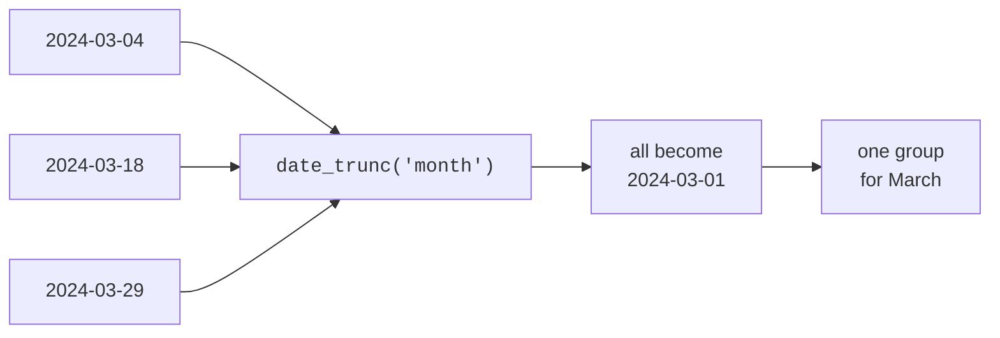

Almost every analytical question has a time dimension: revenue *per
month*, signups *this week*, growth *year over year*. Dates are also where
beginners stumble, because "group by month" is not as simple as it sounds.
This page builds the date toolkit analysts use daily — truncating,
extracting, and computing with dates — and shows how to assemble a proper
time series.

## The core move: truncate to a period

To summarize "by month", you do **not** group by the raw date — that would
give one group per *day*. You first **truncate** each date down to the
first of its month, so every day in March collapses to `2024-03-01`. The
tool is `date_trunc('month', d)`.

<SqlCodeBlock
  dialect="duckdb"
  title="Revenue per month with date_trunc"
  initSql={`CREATE TABLE orders AS
SELECT
  DATE '2024-01-01' + (i * 5) AS order_date,
  (i * 17) % 200 + 20 AS amount
FROM
  range(0, 40) t (i);`}
  starterCode={`SELECT
  date_trunc('month', order_date) AS month,
  COUNT(*) AS orders,
  SUM(amount) AS revenue
FROM
  orders
GROUP BY
  month
ORDER BY
  month;`}
/>

`date_trunc` is the backbone of every "by week / by month / by quarter"
report. Change the first argument to `'week'`, `'quarter'`, or `'year'`
and the same query re-buckets accordingly.

## Extract a part with `EXTRACT` / `date_part`

Sometimes you want a *component* — the year, the month number, the day of
week — rather than a truncated date. `EXTRACT(part FROM d)` (or
`date_part`) pulls it out. This is how you answer "which weekday is
busiest?" by grouping across all weeks.

<SqlCodeBlock
  dialect="duckdb"
  title="Which day of week sees the most orders?"
  initSql={`CREATE TABLE orders AS
SELECT
  DATE '2024-01-01' + i AS order_date
FROM
  range(0, 60) t (i);`}
  starterCode={`SELECT
  EXTRACT (
    dow
    FROM
      order_date
  ) AS weekday, -- 0 = Sunday
  dayname(order_date) AS name,
  COUNT(*) AS orders
FROM
  orders
GROUP BY
  weekday,
  name
ORDER BY
  weekday;`}
/>

<Callout type="info" title="Truncate vs. extract">
**Truncate** keeps a date but flattens it to a period start — use it for
trends over time (Jan, Feb, Mar...). **Extract** pulls out a number like
the month or weekday — use it to compare *across* periods (all Mondays,
every January). They answer different questions.
</Callout>

## Date arithmetic and intervals

Dates support subtraction (giving a number of days) and addition of
`INTERVAL`s. This powers "age", "days since", and "rolling last 30 days"
calculations.

<SqlCodeBlock
  dialect="duckdb"
  title="Days since each signup, and a 30-day cutoff"
  initSql={`CREATE TABLE users (id INTEGER, signup_date DATE);

INSERT INTO
  users
VALUES
  (1, DATE '2024-05-01'),
  (2, DATE '2024-05-20'),
  (3, DATE '2024-04-10'),
  (4, DATE '2024-05-28');`}
  starterCode={`SELECT
  id,
  signup_date,
  DATE '2024-05-30' - signup_date AS days_ago,
  signup_date >= DATE '2024-05-30' - INTERVAL 30 DAY AS in_last_30_days
FROM
  users
ORDER BY
  signup_date;`}
/>

## Filling gaps: a complete time series

A subtle analytical trap: if no orders happened on some day, that day is
simply **missing** from a grouped result — which makes a chart lie by
skipping the gap. The fix is to generate a complete spine of dates with
`generate_series` (or `range`) and `LEFT JOIN` the data onto it, so empty
periods show up as zero.

<SqlCodeBlock
  dialect="duckdb"
  title="Every day present, even the empty ones"
  initSql={`CREATE TABLE orders (order_date DATE, amount INTEGER);

INSERT INTO
  orders
VALUES
  (DATE '2024-03-01', 100),
  (DATE '2024-03-01', 50),
  (DATE '2024-03-03', 80),
  (DATE '2024-03-05', 120);`}
  starterCode={`-- Build a continuous spine of dates, then attach revenue.
SELECT
  d::DATE AS day,
  COALESCE(SUM(o.amount), 0) AS revenue
FROM
  generate_series(
    DATE '2024-03-01',
    DATE '2024-03-05',
    INTERVAL 1 DAY
  ) AS s (d)
  LEFT JOIN orders o ON o.order_date = d::DATE
GROUP BY
  day
ORDER BY
  day;`}
/>

March 2 and 4 had no orders, yet they appear with `revenue = 0` — a
correct, gap-free series ready to chart. Skipping this step is one of the
most common ways an analyst's trend chart misleads.

## Check your understanding

<MultipleChoice
  markdown={`To report **revenue per month**, why group by \`date_trunc('month', order_date)\` instead of \`order_date\`?

- Because \`order_date\` cannot be used in \`GROUP BY\`.
  > It can be grouped; the problem is that grouping by the raw date gives one group per *day*, not per month.
- [o] Grouping by the raw date makes one group per day; truncating to the month collapses all of a month's days into one group.
  > \`date_trunc('month', ...)\` maps every day of a month to the same value, producing one row per month.
- \`date_trunc\` sorts the rows.
  > It buckets dates to a period start; sorting is still done by \`ORDER BY\`.
- \`date_trunc\` deletes days with no orders.
  > It does not delete anything; gap-filling is a separate concern handled by a date spine.

Truncating dates to the month is what makes per-month grouping work.`}
/>

<MultipleChoice
  markdown={`When would you use \`EXTRACT(dow FROM d)\` (day of week) rather than \`date_trunc\`?

- To produce a continuous monthly trend line.
  > A trend over time uses \`date_trunc\`; extracting the weekday compares *across* time instead.
- [o] To compare activity **across** periods — e.g. which weekday is busiest, pooling all weeks together.
  > \`EXTRACT\` pulls a component so you can group all Mondays, all Tuesdays, etc., regardless of week.
- To keep each date unique.
  > \`EXTRACT(dow ...)\` collapses many dates to the same weekday number; it does not keep them unique.
- To add 7 days to a date.
  > Adding days uses interval arithmetic, not \`EXTRACT\`.

Extract pulls a component (like weekday) to compare across periods;
truncate flattens dates for trends over time.`}
/>

<MultipleChoice
  markdown={`A daily revenue chart skips days that had no sales. What is the standard fix?

- Insert fake orders into the table.
  > You should not corrupt the data; generate a date spine at query time instead.
- [o] Generate a complete series of dates and \`LEFT JOIN\` the data onto it, using \`COALESCE\` to show 0 for empty days.
  > A date spine guarantees every period appears; the left join attaches revenue and missing days become 0.
- Use \`date_trunc\` to fill the gaps automatically.
  > \`date_trunc\` buckets existing rows; it cannot invent rows for days that have no data.
- Switch from \`SUM\` to \`AVG\`.
  > Changing the aggregate does not create the missing days; the gap remains.

A generated date spine plus a left join produces a gap-free time series.`}
/>

Dates handled, the last transformation skill is **reshaping** — turning
long data into wide and back. That is the next page.
