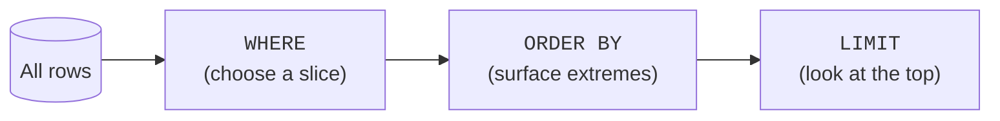

You know `SELECT`, `WHERE`, and `ORDER BY` already. This page is not about
new syntax — it is about *re-seeing* those familiar tools through an
analyst's eyes. The same `SELECT` that fetches a record in an app becomes,
with a shift in intent, the first move of an exploration.

## Reading a table is the analyst's "hello world"

Before summarizing anything, an analyst usually takes a quick look at a
few rows just to learn the columns and their flavor. `LIMIT` makes this
cheap even on a huge table — you peek, you do not pull everything.

<SqlCodeBlock
  dialect="duckdb"
  title="Peek at the shape of the data"
  initSql={`CREATE TABLE trips (
  id INTEGER,
  city TEXT,
  rider TEXT,
  minutes INTEGER,
  fare DECIMAL(6, 2)
);

INSERT INTO
  trips
VALUES
  (1, 'Seattle', 'Ada', 12, 9.50),
  (2, 'Seattle', 'Bo', 25, 18.00),
  (3, 'Portland', 'Cy', 8, 6.25),
  (4, 'Seattle', 'Ada', 31, 22.75),
  (5, 'Portland', 'Di', 14, 11.00),
  (6, 'Boise', 'Eli', 19, 13.50),
  (7, 'Seattle', 'Bo', 6, 5.00),
  (8, 'Portland', 'Cy', 22, 16.25);`}
  starterCode={`-- Always start by *looking*. LIMIT keeps it cheap.
SELECT
  *
FROM
  trips
LIMIT
  5;`}
/>

That single `SELECT *` answers "what columns exist and what do typical
values look like?" — the very first question of any exploration.

## `WHERE` as a slice, not a search

In an application, `WHERE id = 4` finds one specific row. In analysis,
`WHERE` usually carves out a **slice** of the data you want to study —
*Seattle trips*, *long trips*, *this month*. You are not hunting a needle;
you are choosing a subset to summarize.

<SqlCodeBlock
  dialect="duckdb"
  title="Slice: only the long Seattle trips"
  initSql={`CREATE TABLE trips (
  id INTEGER,
  city TEXT,
  rider TEXT,
  minutes INTEGER,
  fare DECIMAL(6, 2)
);

INSERT INTO
  trips
VALUES
  (1, 'Seattle', 'Ada', 12, 9.50),
  (2, 'Seattle', 'Bo', 25, 18.00),
  (3, 'Portland', 'Cy', 8, 6.25),
  (4, 'Seattle', 'Ada', 31, 22.75),
  (5, 'Portland', 'Di', 14, 11.00),
  (6, 'Boise', 'Eli', 19, 13.50),
  (7, 'Seattle', 'Bo', 6, 5.00),
  (8, 'Portland', 'Cy', 22, 16.25);`}
  starterCode={`SELECT
  rider,
  minutes,
  fare
FROM
  trips
WHERE
  city = 'Seattle'
  AND minutes >= 20
ORDER BY
  minutes DESC;`}
/>

The mental phrasing is *"narrow the data to the part I care about, then
look."* `WHERE` is how an analyst zooms in.

## `ORDER BY` to surface the interesting rows

Sorting is not cosmetic in analysis — it is how you bring the **extremes**
to the top. "Longest trips", "biggest spenders", "slowest pages": every
one is an `ORDER BY` followed by a glance at the head of the result.

This three-step rhythm — **slice, sort, peek** — is the analyst's
equivalent of a first glance. It answers "what stands out?" before you
commit to heavier summarizing.

<SqlCodeBlock
  dialect="duckdb"
  title="Slice, sort, peek: the three biggest fares overall"
  initSql={`CREATE TABLE trips (
  id INTEGER,
  city TEXT,
  rider TEXT,
  minutes INTEGER,
  fare DECIMAL(6, 2)
);

INSERT INTO
  trips
VALUES
  (1, 'Seattle', 'Ada', 12, 9.50),
  (2, 'Seattle', 'Bo', 25, 18.00),
  (3, 'Portland', 'Cy', 8, 6.25),
  (4, 'Seattle', 'Ada', 31, 22.75),
  (5, 'Portland', 'Di', 14, 11.00),
  (6, 'Boise', 'Eli', 19, 13.50),
  (7, 'Seattle', 'Bo', 6, 5.00),
  (8, 'Portland', 'Cy', 22, 16.25);`}
  starterCode={`SELECT
  city,
  rider,
  fare
FROM
  trips
ORDER BY
  fare DESC
LIMIT
  3;`}
/>

## Computed columns: asking a new question of each row

Analysts constantly invent columns that are not stored. "Fare per
minute", "price with tax", "is this a long trip?" — all computed on the
fly. This is where `SELECT` stops *retrieving* and starts *deriving*.

<SqlCodeBlock
  dialect="duckdb"
  title="Derive a new measure: fare per minute"
  initSql={`CREATE TABLE trips (
  id INTEGER,
  city TEXT,
  rider TEXT,
  minutes INTEGER,
  fare DECIMAL(6, 2)
);

INSERT INTO
  trips
VALUES
  (1, 'Seattle', 'Ada', 12, 9.50),
  (2, 'Seattle', 'Bo', 25, 18.00),
  (3, 'Portland', 'Cy', 8, 6.25),
  (4, 'Seattle', 'Ada', 31, 22.75),
  (5, 'Portland', 'Di', 14, 11.00),
  (6, 'Boise', 'Eli', 19, 13.50),
  (7, 'Seattle', 'Bo', 6, 5.00),
  (8, 'Portland', 'Cy', 22, 16.25);`}
  starterCode={`SELECT
  rider,
  minutes,
  fare,
  ROUND(fare / minutes, 2) AS fare_per_min
FROM
  trips
ORDER BY
  fare_per_min DESC;`}
/>

The column `fare_per_min` exists only inside this query — it is a
*question*, not stored data. Inventing measures like this is most of what
analytical `SELECT` lists are for.

## The same keywords, a new purpose

| Keyword | Application meaning | Analytical meaning |
| --- | --- | --- |
| `SELECT` | Fetch stored columns to display | Derive measures and pick dimensions |
| `WHERE` | Find a specific record | Carve out a slice to study |
| `ORDER BY` | Present rows in a tidy order | Surface the extremes worth noticing |
| `LIMIT` | Paginate results for a UI | Peek cheaply without pulling everything |

Nothing here is new SQL. What is new is the *intent* — and intent is what
separates analytical queries from application ones.

## Check your understanding

<MultipleChoice
  markdown={`In analytical SQL, what is the most common purpose of \`WHERE\`?

- To find one specific row by its primary key for display.
  > That is the application use of \`WHERE\`. Analysts more often use it to choose a subset to study.
- [o] To carve out a slice of the data — a subset to explore or summarize.
  > Analysts use \`WHERE\` to zoom into "Seattle trips" or "last month" before summarizing.
- To permanently delete rows that do not match.
  > \`WHERE\` in a \`SELECT\` filters the result; it does not delete anything.
- To create new columns.
  > New columns come from expressions in the \`SELECT\` list, not from \`WHERE\`.

For an analyst, \`WHERE\` chooses which slice of the data to look at.`}
/>

<MultipleChoice
  markdown={`Why do analysts pair \`ORDER BY\` with \`LIMIT\` so often during exploration?

- Because DuckDB requires \`LIMIT\` on every query.
  > \`LIMIT\` is optional; this pairing is a deliberate exploration technique, not a requirement.
- [o] To surface the most extreme rows (largest, smallest) and peek at just the top without pulling everything.
  > Sorting brings the extremes to the top, and \`LIMIT\` lets you glance at them cheaply.
- To randomly shuffle the rows.
  > \`ORDER BY\` sorts deterministically; it does not shuffle.
- To permanently sort the stored table.
  > \`ORDER BY\` affects the query result, not how the table is stored.

"Sort to surface extremes, limit to peek" is a core exploratory move.`}
/>

<MultipleChoice
  markdown={`A query includes \`ROUND(fare / minutes, 2) AS fare_per_min\`. What is \`fare_per_min\`?

- A column physically stored in the \`trips\` table.
  > It is computed in the query; nothing about it is stored in the table.
- [o] A derived column that exists only in this query's result — a measure the analyst invented.
  > Analysts routinely compute new measures on the fly; \`fare_per_min\` lives only in the result set.
- A new permanent table.
  > It is a single column in a result, not a table.
- An error, because you cannot divide two columns.
  > Dividing columns is perfectly valid; this produces a useful per-row measure.

Derived columns let analysts ask new questions of each row without
changing the stored data.`}
/>

You can now *look* like an analyst. Next: how to get data *into* DuckDB —
and how to conjure test data out of thin air with `range()`.
