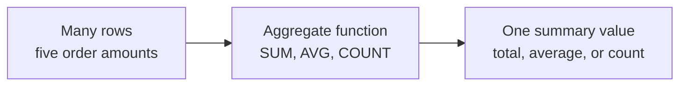
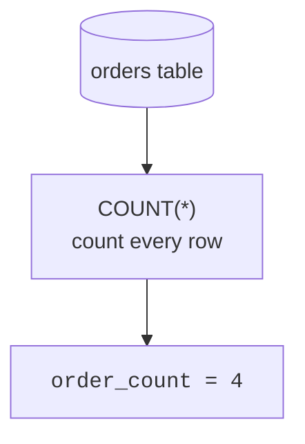
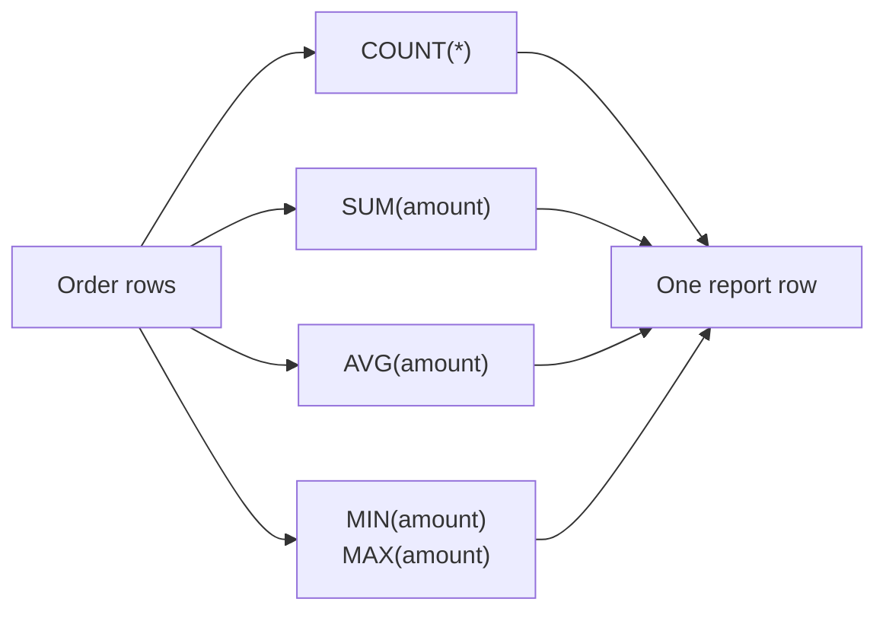
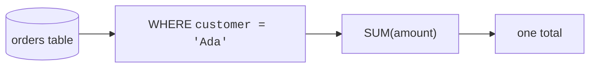

So far, many of your queries have shown one result row for each row in a table. That is useful when you want details.

But many everyday questions are not detail questions. They are summary questions:

- How many orders did we receive?
- What is the total amount sold?
- What is the average rating?
- What was the smallest or largest value?

**Aggregate functions** answer questions like these by reading many rows and returning one summary value.

## From many rows to one answer

Think of an aggregate as a tiny summarizing machine. Many rows go in. One value comes out.

The five core aggregate functions are:

| Function | Question it answers | Example |
| --- | --- | --- |
| `COUNT(*)` | How many rows are there? | number of orders |
| `SUM(column)` | What is the total? | total dollars sold |
| `AVG(column)` | What is the average? | average score |
| `MIN(column)` | What is the smallest value? | lowest price |
| `MAX(column)` | What is the largest value? | highest price |

## Counting rows with COUNT(*)

`COUNT(*)` counts rows. It does not care what values are inside those rows. It simply answers: "How many rows are in this result?"

<SqlCodeBlock
  dialect="sqlite"
  title="Count all orders"
  initSql={`CREATE TABLE orders (
  id INTEGER PRIMARY KEY,
  customer TEXT,
  amount REAL
);
INSERT INTO orders (customer, amount) VALUES
  ('Ada', 24.50),
  ('Grace', 18.00),
  ('Linus', 42.75),
  ('Maya', 16.25);`}
  starterCode={`SELECT
  COUNT(*) AS order_count
FROM
  orders;`}
/>

The table has four order rows, so the answer is one row containing the number `4`.

## Adding values with SUM

`SUM(column)` adds the non-`NULL` values in a column. This is how you answer total questions.

<SqlCodeBlock
  dialect="sqlite"
  title="Total order amount"
  initSql={`CREATE TABLE orders (
  id INTEGER PRIMARY KEY,
  customer TEXT,
  amount REAL
);
INSERT INTO orders (customer, amount) VALUES
  ('Ada', 24.50),
  ('Grace', 18.00),
  ('Linus', 42.75),
  ('Maya', 16.25);`}
  starterCode={`SELECT
  SUM(amount) AS total_sales
FROM
  orders;`}
/>

SQLite reads the `amount` values and adds them into one total.

## Finding an average with AVG

`AVG(column)` finds the average of the non-`NULL` values in a column. You can use `ROUND` when you want a friendlier number.

<SqlCodeBlock
  dialect="sqlite"
  title="Average order amount"
  initSql={`CREATE TABLE orders (
  id INTEGER PRIMARY KEY,
  customer TEXT,
  amount REAL
);
INSERT INTO orders (customer, amount) VALUES
  ('Ada', 24.50),
  ('Grace', 18.00),
  ('Linus', 42.75),
  ('Maya', 16.25);`}
  starterCode={`SELECT
  ROUND(AVG(amount), 2) AS average_order
FROM
  orders;`}
/>

The `2` in `ROUND(..., 2)` means "show two digits after the decimal point."

<MultipleChoice
  markdown={`What does an aggregate function do?

- It shows every row exactly as it appears in the table.
  > That is a regular query without aggregation.
- [o] It combines many rows into a smaller summary, often one value.
  > Aggregate functions summarize rows into values like counts, totals, and averages.
- It changes the table's column names permanently.
  > Aliases can rename output columns temporarily, but aggregates do not change the table definition.
- It always sorts rows alphabetically.
  > Sorting is handled by \`ORDER BY\`, not by aggregate functions.

Aggregates are for summary questions, not row-by-row detail questions.`}
/>

## Finding the smallest and largest values

`MIN(column)` returns the smallest value. `MAX(column)` returns the largest value.

<SqlCodeBlock
  dialect="sqlite"
  title="Lowest and highest order amounts"
  initSql={`CREATE TABLE orders (
  id INTEGER PRIMARY KEY,
  customer TEXT,
  amount REAL
);
INSERT INTO orders (customer, amount) VALUES
  ('Ada', 24.50),
  ('Grace', 18.00),
  ('Linus', 42.75),
  ('Maya', 16.25);`}
  starterCode={`SELECT
  MIN(amount) AS smallest_order,
  MAX(amount) AS largest_order
FROM
  orders;`}
/>

These functions are useful for "best," "worst," "earliest," "latest," "cheapest," and "most expensive" questions.

## Building a one-row report

You can use several aggregates in the same query. Each aggregate looks at the same set of rows and produces its own summary value.

<SqlCodeBlock
  dialect="sqlite"
  title="A one-row sales report"
  initSql={`CREATE TABLE orders (
  id INTEGER PRIMARY KEY,
  customer TEXT,
  amount REAL
);
INSERT INTO orders (customer, amount) VALUES
  ('Ada', 24.50),
  ('Grace', 18.00),
  ('Linus', 42.75),
  ('Maya', 16.25);`}
  starterCode={`SELECT
  COUNT(*) AS order_count,
  SUM(amount) AS total_sales,
  ROUND(AVG(amount), 2) AS average_order,
  MIN(amount) AS smallest_order,
  MAX(amount) AS largest_order
FROM
  orders;`}
/>

One query gives you a compact report: count, total, average, smallest, and largest.

## Aggregates respect WHERE

`WHERE` filters rows first. Then the aggregate summarizes only the rows that survived the filter.

<SqlCodeBlock
  dialect="sqlite"
  title="Total for one customer"
  initSql={`CREATE TABLE orders (
  id INTEGER PRIMARY KEY,
  customer TEXT,
  amount REAL
);
INSERT INTO orders (customer, amount) VALUES
  ('Ada', 24.50),
  ('Grace', 18.00),
  ('Ada', 42.75),
  ('Maya', 16.25);`}
  starterCode={`SELECT
  SUM(amount) AS ada_total
FROM
  orders
WHERE
  customer = 'Ada';`}
/>

Read this as: "Keep only Ada's rows, then add their amounts."

## NULL values are skipped by most aggregates

`NULL` means a value is missing or unknown. Most aggregate functions skip `NULL` values:

- `SUM(column)` skips `NULL`
- `AVG(column)` skips `NULL`
- `MIN(column)` skips `NULL`
- `MAX(column)` skips `NULL`
- `COUNT(column)` skips `NULL`

The big exception is `COUNT(*)`, which counts rows whether they contain `NULL` or not.

<SqlCodeBlock
  dialect="sqlite"
  title="COUNT(*) versus COUNT(column)"
  initSql={`CREATE TABLE customers (
  id INTEGER PRIMARY KEY,
  name TEXT,
  phone TEXT
);
INSERT INTO customers (name, phone) VALUES
  ('Ada', '555-0101'),
  ('Grace', NULL),
  ('Linus', '555-0102'),
  ('Maya', NULL);`}
  starterCode={`SELECT
  COUNT(*) AS total_customers,
  COUNT(phone) AS customers_with_phone
FROM
  customers;`}
/>

There are four customers, but only two have phone numbers. `COUNT(*)` returns `4`; `COUNT(phone)` returns `2`.

## NULL and averages

Skipping `NULL` usually gives a better answer than treating unknown values as zero.

<SqlCodeBlock
  dialect="sqlite"
  title="Average ignores missing ratings"
  initSql={`CREATE TABLE reviews (
  id INTEGER PRIMARY KEY,
  product TEXT,
  rating INTEGER
);
INSERT INTO reviews (product, rating) VALUES
  ('Notebook', 5),
  ('Notebook', 4),
  ('Notebook', NULL),
  ('Notebook', 3);`}
  starterCode={`SELECT
  COUNT(*) AS total_reviews,
  COUNT(rating) AS reviews_with_rating,
  AVG(rating) AS average_rating
FROM
  reviews;`}
/>

The average is based on the three known ratings: `5`, `4`, and `3`. The missing rating is not counted as zero.

<Callout type="info" title="A helpful habit">
Use `COUNT(*)` when you mean "How many rows?" Use `COUNT(column)` when you mean "How many rows have a value in this column?"
</Callout>

## Check your understanding

<MultipleChoice
  markdown={`Which function answers "How many rows are in this result?"

- [o] \`COUNT(*)\`
  > \`COUNT(*)\` counts rows, including rows that contain missing values.
- \`SUM(*)\`
  > \`SUM\` adds values from a specific column; \`SUM(*)\` is not the row-counting pattern.
- \`AVG(*)\`
  > \`AVG\` averages values from a column, not whole rows.
- \`MAX(*)\`
  > \`MAX\` finds the largest value in a column.

Use \`COUNT(*)\` for row counts.`}
/>

<MultipleChoice
  markdown={`A table has 5 rows. The \`email\` column is \`NULL\` in 2 rows. What will \`COUNT(email)\` return?

- 5
  > That would be \`COUNT(*)\`, which counts every row.
- [o] 3
  > \`COUNT(email)\` counts only rows where \`email\` is not \`NULL\`.
- 2
  > That is the number of missing emails, not the number of present emails.
- 0
  > Three rows still have email values.

\`COUNT(column)\` skips missing values in that column.`}
/>

<MultipleChoice
  markdown={`Why does \`AVG(rating)\` skip \`NULL\` ratings?

- Because SQLite cannot store missing values.
  > SQLite can store \`NULL\`; aggregate functions simply treat it as missing information.
- [o] Because \`NULL\` means unknown, and unknown values should not be averaged as if they were real numbers.
  > Skipping missing ratings keeps the average based on ratings that actually exist.
- Because \`AVG\` only works on text.
  > \`AVG\` is for numeric values.
- Because \`NULL\` is always the same as zero.
  > \`NULL\` means missing or unknown; it is not the same as zero.

Most aggregates skip \`NULL\` so missing data does not distort the summary.`}
/>

<MultipleChoice
  markdown={`What does this query return: \`SELECT MIN(price), MAX(price) FROM products;\`?

- One row for every product.
  > Aggregate functions collapse many rows into summary values.
- [o] One row containing the smallest price and the largest price.
  > \`MIN\` and \`MAX\` each produce one summary value over the table.
- A sorted list of all prices.
  > Sorting requires \`ORDER BY\`; \`MIN\` and \`MAX\` summarize.
- Only products with missing prices.
  > \`MIN\` and \`MAX\` skip \`NULL\` values and report extremes among known values.

\`MIN\` and \`MAX\` are aggregate functions for finding extremes.`}
/>
