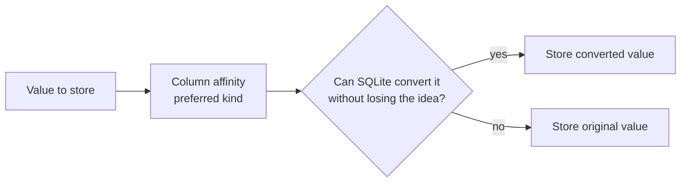
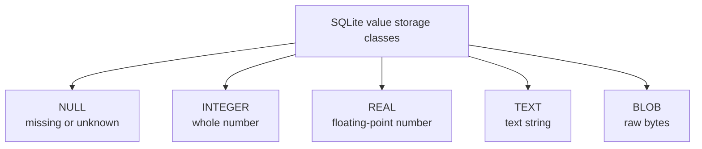
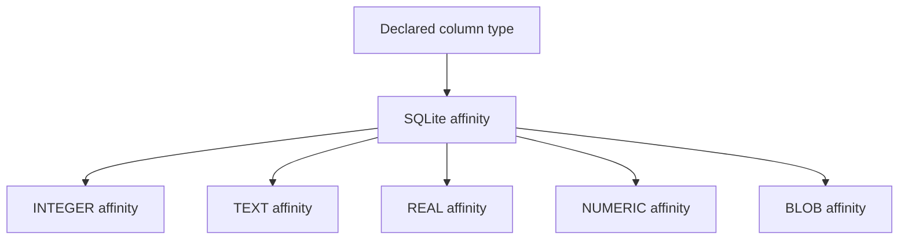
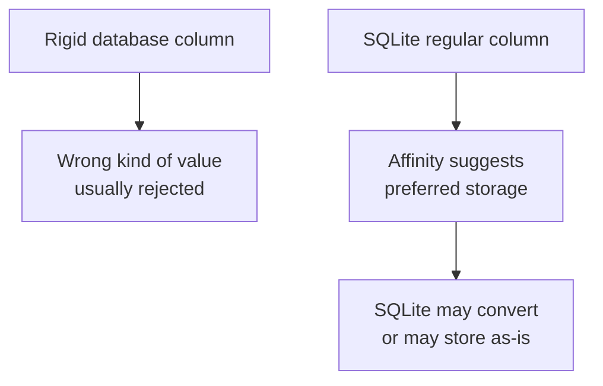
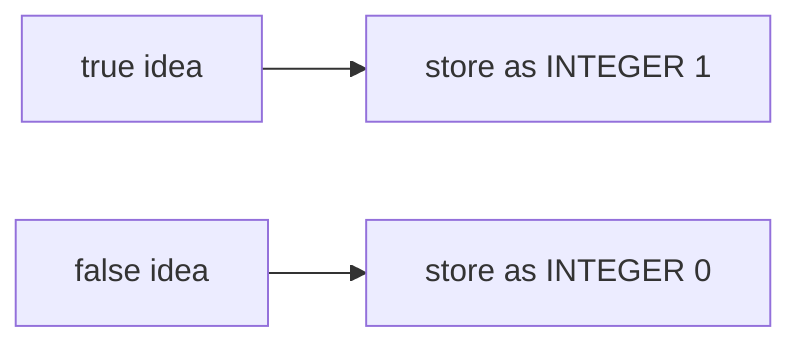
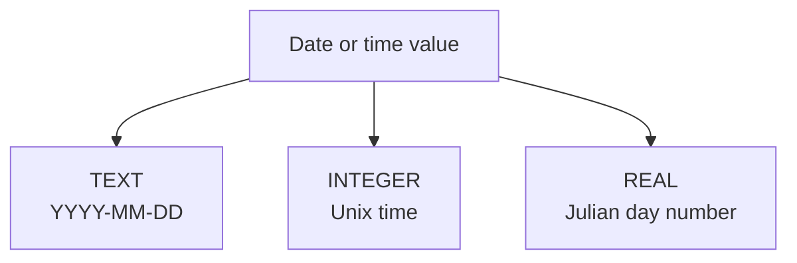

Every value in SQLite has a **storage class**: the kind of value SQLite is actually storing. Every column can also have a declared type, which gives the column a **type affinity**.

That sounds technical, but the beginner idea is simple:

> In SQLite, the value itself has the strongest type. The column's declared type is a helpful preference, not always a strict wall.

<svg
  viewBox="0 0 640 230"
  role="img"
  aria-label="Five pantry jars on a shelf hold SQLite's storage classes — whole-number dots, decimal dot pairs, text bars, one raw blob, and a jar holding nothing at all — while one stray text bar leans inside the number jar, because SQLite's typing is a preference, not a wall"
  style={{ display: "block", width: "100%", maxWidth: "640px", height: "auto", margin: "2.5rem auto" }}
>
  <g fill="currentColor" opacity="0.14">
    <rect x="40" y="190" width="560" height="8" rx="4" />
  </g>
  <g fill="currentColor" opacity="0.08">
    <rect x="62" y="94" width="92" height="96" rx="12" />
    <rect x="172" y="94" width="92" height="96" rx="12" />
    <rect x="282" y="94" width="92" height="96" rx="12" />
    <rect x="392" y="94" width="92" height="96" rx="12" />
    <rect x="502" y="94" width="92" height="96" rx="12" />
  </g>
  <g style={{ color: "var(--ds-blue-500)" }} fill="currentColor">
    <rect x="72" y="80" width="72" height="15" rx="7" fillOpacity="0.9" />
    <circle cx="88" cy="166" r="9" fillOpacity="0.85" />
    <circle cx="112" cy="172" r="9" fillOpacity="0.6" />
    <circle cx="134" cy="162" r="9" fillOpacity="0.75" />
    <circle cx="98" cy="142" r="9" fillOpacity="0.5" />
  </g>
  <g style={{ color: "var(--ds-yellow-500)" }} fill="currentColor">
    <rect x="116" y="118" width="34" height="9" rx="4.5" transform="rotate(24 133 122)" fillOpacity="0.85" />
  </g>
  <g style={{ color: "var(--ds-green-500)" }} fill="currentColor">
    <rect x="182" y="80" width="72" height="15" rx="7" fillOpacity="0.9" />
    <circle cx="202" cy="164" r="9" fillOpacity="0.8" />
    <circle cx="215" cy="174" r="3.5" fillOpacity="0.8" />
    <circle cx="234" cy="148" r="9" fillOpacity="0.55" />
    <circle cx="247" cy="158" r="3.5" fillOpacity="0.55" />
  </g>
  <g style={{ color: "var(--ds-yellow-500)" }} fill="currentColor">
    <rect x="292" y="80" width="72" height="15" rx="7" fillOpacity="0.9" />
    <rect x="296" y="166" width="56" height="9" rx="4.5" fillOpacity="0.8" />
    <rect x="304" y="150" width="40" height="9" rx="4.5" fillOpacity="0.6" />
    <rect x="298" y="134" width="48" height="9" rx="4.5" fillOpacity="0.4" />
  </g>
  <g style={{ color: "var(--ds-red-500)" }} fill="currentColor">
    <rect x="402" y="80" width="72" height="15" rx="7" fillOpacity="0.9" />
    <path d="M 414 168 Q 408 144 430 138 Q 454 132 462 150 Q 470 170 448 176 Q 424 182 414 168 Z" fillOpacity="0.7" />
  </g>
  <g fill="currentColor" opacity="0.35">
    <rect x="512" y="80" width="72" height="15" rx="7" />
  </g>
  <g fill="currentColor" opacity="0.2">
    <circle cx="532" cy="156" r="3" />
    <circle cx="548" cy="146" r="3" />
    <circle cx="564" cy="156" r="3" />
    <circle cx="548" cy="166" r="3" />
  </g>
</svg>

## SQLite is the odd one out — on purpose

Almost every other SQL database is rigidly typed: declare a column
as a number, and any value that is not a number gets rejected at
the door. PostgreSQL, MySQL, and SQL Server all work this way, and
most SQL books simply assume it.

SQLite made a different and deliberate choice. It uses **dynamic
typing**: the type belongs to the *value*, not to the column. A
column declaration gives SQLite a preference, called **affinity**,
but SQLite may still store a value of another kind. This is not an
oversight — the SQLite documentation describes flexible typing as
a feature, and it fits the project's history: SQLite began life as
an extension for the Tcl scripting language, a world where values
flow freely between representations. The design made SQLite
forgiving in exactly the situations where small applications live.

If you ever want the strict behavior other databases give you,
modern SQLite has it as an opt-in: tables created with the
`STRICT` keyword (added in 2021) reject values that do not match
the declared type. For this course, we work with ordinary flexible
tables, because understanding them is understanding SQLite.



This flexibility is convenient, but it also means you should be thoughtful. If a column is meant to hold ages, you should still insert ages, not random words.

<Callout type="info" title="Affinity is not the same as strict validation">
A declared type in a regular SQLite table is a strong hint about how values should be stored. It is not the same as a strict rule that rejects every mismatched value.
</Callout>

## The five storage classes

SQLite stores values using five storage classes:



| Storage class | Holds | Examples |
| --- | --- | --- |
| `NULL` | Missing or unknown value | `NULL` |
| `INTEGER` | Whole numbers | `0`, `42`, `-7` |
| `REAL` | Floating-point numbers | `3.14`, `19.99` |
| `TEXT` | Text strings | `'Ada'`, `'2026-03-14'` |
| `BLOB` | Raw bytes | Images or binary data |

Most beginner tables use `INTEGER`, `TEXT`, `REAL`, and sometimes `NUMERIC` as declared column types. `NULL` is a value state, not a declared column type you usually choose.

## Declared types become affinities

When you write a column type, SQLite maps it to an affinity. Affinity is the column's preferred storage behavior.



Here is a beginner-friendly summary:

| Declared type you might write | Affinity | Common use |
| --- | --- | --- |
| `INTEGER` | `INTEGER` | ids, counts, whole numbers |
| `TEXT` | `TEXT` | names, emails, labels, dates as text |
| `REAL` | `REAL` | measurements and approximate decimals |
| `NUMERIC` | `NUMERIC` | numbers that may be integer or decimal, including 0/1 flags |
| `BLOB` | `BLOB` | raw binary data |

SQLite's full mapping rules look at words inside the declared type. For beginners, use clear names like `INTEGER`, `TEXT`, `REAL`, and `NUMERIC`.

## `typeof()` shows the storage class

SQLite has a helpful function named `typeof()` that reports how a value is actually stored.

<SqlCodeBlock
  dialect="sqlite"
  title="Inspect stored value types with typeof"
  initSql={`CREATE TABLE examples (
  id INTEGER PRIMARY KEY,
  label TEXT,
  value NUMERIC
);

INSERT INTO examples (label, value) VALUES
  ('whole number text', '42'),
  ('decimal text', '3.14'),
  ('word text', 'banana'),
  ('missing value', NULL);`}
  starterCode={`SELECT
  label,
  value,
  typeof(value) AS storage_class
FROM
  examples
ORDER BY
  id;`}
/>

A `NUMERIC` affinity column tries to store numeric-looking text as numbers. So `'42'` may become an integer, and `'3.14'` may become real. But `'banana'` cannot sensibly become a number, so SQLite stores it as text.

<MultipleChoice
  markdown={`In a regular SQLite table, what does a column's declared type mainly provide?

- A paint color for the column.
  > Declared types affect storage behavior, not display colors.
- [o] A type affinity, which is SQLite's preferred way to store values in that column.
  > Affinity guides conversions, but regular SQLite tables remain flexibly typed.
- A guarantee that no other storage class can ever appear.
  > Regular SQLite typing is dynamic; mismatched values may still be stored.
- A rule that every value becomes \`NULL\`.
  > Values do not automatically become \`NULL\` just because a type is declared.`}
/>

## SQLite compared with rigid type systems

Think of a rigid system as a locked door and SQLite affinity as a helpful sign.



This does **not** mean types do not matter in SQLite. They still matter because they help:

- document what the column is for,
- make numeric-looking values behave like numbers,
- make your table easier for people to understand,
- support predictable queries when you store consistent values.

## NULL means missing or unknown

`NULL` means the value is missing, unknown, or not applicable. It is not the same as zero, an empty string, or the word `'NULL'`.

<svg
  viewBox="0 0 640 170"
  role="img"
  aria-label="Three display pedestals: one holds the number zero, one holds a real but empty text ribbon, and the third holds only a faint dotted ghost — zero and empty string are known values, NULL is the absence of a value"
  style={{ display: "block", width: "100%", maxWidth: "480px", height: "auto", margin: "2.5rem auto" }}
>
  <g fill="currentColor" opacity="0.16">
    <rect x="120" y="118" width="90" height="14" rx="5" />
    <rect x="138" y="132" width="54" height="20" rx="4" />
    <rect x="276" y="118" width="90" height="14" rx="5" />
    <rect x="294" y="132" width="54" height="20" rx="4" />
    <rect x="432" y="118" width="90" height="14" rx="5" />
    <rect x="450" y="132" width="54" height="20" rx="4" />
  </g>
  <g style={{ color: "var(--ds-blue-500)" }} fill="currentColor">
    <path fillRule="evenodd" d="M 165 56 A 26 26 0 1 0 165 108 A 26 26 0 1 0 165 56 Z M 165 70 A 12 12 0 1 1 165 94 A 12 12 0 1 1 165 70 Z" />
  </g>
  <g style={{ color: "var(--ds-green-500)" }} fill="currentColor">
    <rect x="289" y="92" width="64" height="14" rx="7" fillOpacity="0.4" />
    <rect x="297" y="78" width="10" height="14" rx="4" fillOpacity="0.9" />
    <rect x="335" y="78" width="10" height="14" rx="4" fillOpacity="0.9" />
  </g>
  <g fill="currentColor" opacity="0.22">
    <circle cx="477" cy="66" r="3" />
    <circle cx="491" cy="70" r="3" />
    <circle cx="499" cy="82" r="3" />
    <circle cx="495" cy="96" r="3" />
    <circle cx="483" cy="103" r="3" />
    <circle cx="469" cy="100" r="3" />
    <circle cx="460" cy="89" r="3" />
    <circle cx="463" cy="74" r="3" />
  </g>
  <g fill="currentColor" opacity="0.4">
    <text x="478" y="92" textAnchor="middle" fontFamily="var(--font-mono), ui-monospace, monospace" fontSize="18" fontWeight="600">?</text>
  </g>
</svg>

| Value | Meaning |
| --- | --- |
| `0` | A known number: zero |
| `''` | A known text value: the empty string |
| `NULL` | An unknown or missing value |

For example, if you do not know a customer's phone number yet, `NULL` is better than making up a fake value.

## Booleans in SQLite

SQLite does not have a separate boolean storage class. Store true/false values as integers:

- `1` for true
- `0` for false



Example column:

```sql
is_active INTEGER
```

Then query it like this:

```sql
SELECT name
FROM users
WHERE is_active = 1;
```

## Dates and times in SQLite

SQLite does not have a separate date or timestamp storage class. Common choices are:



For beginners, storing dates as `TEXT` in ISO format is easiest:

```sql
created_on TEXT
```

Example values:

- `'2026-03-14'`
- `'2026-03-14 09:30:00'`

The `YYYY-MM-DD` format sorts naturally as text when every date uses the same format.

## See flexible typing in action

This example stores values in columns with different affinities and uses `typeof()` to show what SQLite actually stored.

<SqlCodeBlock
  dialect="sqlite"
  title="SQLite affinity and typeof"
  initSql={`CREATE TABLE type_demo (
  id INTEGER PRIMARY KEY,
  as_integer INTEGER,
  as_text TEXT,
  as_real REAL,
  as_numeric NUMERIC,
  is_active INTEGER,
  created_on TEXT
);

INSERT INTO type_demo (as_integer, as_text, as_real, as_numeric, is_active, created_on) VALUES
  ('42', 42, '3.5', '19.99', 1, '2026-03-14'),
  ('not a number', 99, '8', 'banana', 0, NULL);`}
  starterCode={`SELECT
  id,
  as_integer,
  typeof(as_integer) AS integer_type,
  as_text,
  typeof(as_text) AS text_type,
  as_real,
  typeof(as_real) AS real_type,
  as_numeric,
  typeof(as_numeric) AS numeric_type,
  is_active,
  created_on
FROM
  type_demo
ORDER BY
  id;`}
/>

Look closely at the output. SQLite converts some values based on affinity, but not every value. That is the key idea.

## Choosing types as a beginner

Use this simple guide:

| Need to store | Beginner SQLite choice |
| --- | --- |
| id or count | `INTEGER` |
| name, email, category, date text | `TEXT` |
| measurement with decimals | `REAL` |
| money-like amount in simple examples | `NUMERIC` |
| true or false | `INTEGER` with `0` or `1` |
| unknown value | `NULL` value in the cell |

<Callout type="warning" title="Consistency is your responsibility">
SQLite's flexibility is friendly, but it will not always stop messy data. If a column is meant for prices, store prices consistently.
</Callout>

## Check your understanding

<MultipleChoice
  markdown={`Which list contains SQLite's five storage classes?

- \`INTEGER\`, \`TEXT\`, \`REAL\`, \`NUMERIC\`, \`BOOLEAN\`.
  > \`NUMERIC\` is an affinity and SQLite has no separate boolean storage class.
- [o] \`NULL\`, \`INTEGER\`, \`REAL\`, \`TEXT\`, \`BLOB\`.
  > These are the five storage classes SQLite uses for values.
- \`SERIAL\`, \`DATE\`, \`MONEY\`, \`TEXT\`, \`JSON\`.
  > These are not SQLite's five storage classes.
- \`ROW\`, \`COLUMN\`, \`TABLE\`, \`CELL\`, \`SCHEMA\`.
  > Those are table concepts, not value storage classes.`}
/>

<MultipleChoice
  markdown={`What does \`typeof(value)\` report in SQLite?

- The name of the table that contains the value.
  > \`typeof()\` looks at a value, not the table name.
- [o] The storage class of the value SQLite is actually holding.
  > \`typeof()\` can return results such as \`integer\`, \`real\`, \`text\`, \`blob\`, or \`null\`.
- The number of rows in the table.
  > Row counts use aggregate functions such as \`COUNT(*)\`.
- Whether the column is a primary key.
  > Primary key status is schema information, not what \`typeof()\` reports.`}
/>

<MultipleChoice
  markdown={`How should beginners usually store true/false values in SQLite?

- As a separate \`BOOLEAN\` storage class.
  > SQLite does not have a separate boolean storage class.
- [o] As \`INTEGER\` values, commonly \`1\` for true and \`0\` for false.
  > This is the common SQLite pattern for boolean-style data.
- As table names.
  > Table names do not store per-row true/false values.
- As random words like \`maybe\` and \`sometimes\`.
  > Inconsistent text makes filtering unreliable.`}
/>

<MultipleChoice
  markdown={`Which date storage choice is simplest for beginners in SQLite?

- Store dates as many different text formats, such as \`March 14\` and \`14/03/26\`.
  > Mixed formats are hard to sort and compare reliably.
- [o] Store dates as \`TEXT\` using a consistent format like \`'2026-03-14'\`.
  > ISO-style date text is readable and sorts well when consistently formatted.
- Store dates as a primary key in every table.
  > A primary key identifies rows; it is not the general place to store all dates.
- Store dates only as column names.
  > Dates are usually values in rows, not column names.`}
/>

<MultipleChoice
  markdown={`A \`NUMERIC\` affinity column receives the text value \`'42'\`. What is SQLite likely to do?

- Delete the table immediately.
  > SQLite does not delete a table because a value can be converted.
- [o] Convert and store it as a numeric value, commonly an integer.
  > NUMERIC affinity tries to convert numeric-looking text into a numeric storage class.
- Always store it as a BLOB.
  > A plain numeric-looking text value is not automatically a BLOB.
- Refuse every quoted value no matter what it contains.
  > SQLite may convert quoted numeric-looking text when column affinity calls for it.`}
/>
