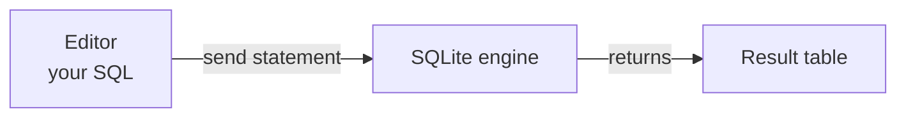
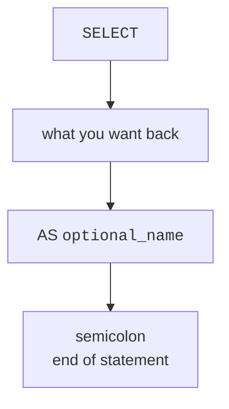
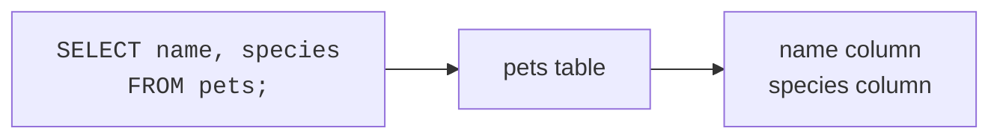

Welcome to your first hands-on SQLite page. You do not need to install anything yet: every runnable block on this page runs in your browser.

One important habit: each block is **independent**. If one block creates a table, the next block does not remember it. When a block needs a table that is already prepared for you, the hidden setup lives in `initSql`; the query you see is the part you practice.

## SQL can give back a value

The keyword `SELECT` means: *compute something and show me the result.* You can use it even before you have any tables.

<SqlCodeBlock
  dialect="sqlite"
  title="Select one literal value"
  starterCode={`SELECT
  'Hello, SQLite!' AS message;`}
/>

The result is a tiny table: one row and one column. The value is text, so it is wrapped in single quotes.



## SQLite can do simple arithmetic

SQLite can also act like a calculator. Arithmetic expressions go after `SELECT`.

<SqlCodeBlock
  dialect="sqlite"
  title="SELECT as a calculator"
  starterCode={`SELECT
  2 + 2 AS sum,
  10 - 3 AS difference,
  6 * 7 AS product,
  20 / 5 AS quotient;`}
/>

Read that statement as: *select four computed values, and label the output columns `sum`, `difference`, `product`, and `quotient`.*

<MultipleChoice
  markdown={`In \`SELECT 2 + 2 AS sum;\`, what does \`AS sum\` do?

- It changes the arithmetic answer.
  > \`AS\` does not change the value; \`2 + 2\` still evaluates to 4.
- [o] It gives the result column a friendly name.
  > \`AS sum\` labels the output column so the result is easier to read.
- It creates a table named \`sum\`.
  > Creating a table uses \`CREATE TABLE\`, not \`AS\` in this query.

Column aliases name what you see in the result table; they do not store data anywhere.`}
/>

## How to read a simple statement

A SQL statement is one complete instruction. We end statements with a semicolon `;` so SQLite knows the instruction is finished.



For now, the most common shape is:

```sql
SELECT value_or_column AS output_name;
```

Later, when you read stored data, you add `FROM table_name` to say where the rows come from.

<SqlCodeBlock
  dialect="sqlite"
  title="Several values in one result row"
  starterCode={`SELECT
  'Ada' AS first_name,
  'Lovelace' AS last_name,
  1843 AS important_year;`}
/>

## Create a tiny table and read it back

Tables are where databases become useful. A table is like a labeled grid: columns describe what each piece of data means, and rows hold individual records.

This block creates a small table, inserts two rows, and reads the rows back.

<SqlCodeBlock
  dialect="sqlite"
  title="Create, insert, and select"
  starterCode={`CREATE TABLE pets (name TEXT, species TEXT);

INSERT INTO
  pets (name, species)
VALUES
  ('Mochi', 'cat'),
  ('Biscuit', 'dog');

SELECT
  name,
  species
FROM
  pets;`}
/>

Read the final query like a sentence: *select the `name` and `species` columns from the `pets` table.*



## Reading from a prepared table

Sometimes the setup is hidden so you can focus on the query. The block below starts with a fresh `snacks` table each time you run it.

<SqlCodeBlock
  dialect="sqlite"
  title="Read selected columns"
  initSql={`CREATE TABLE snacks (
  name TEXT,
  kind TEXT,
  calories INTEGER
);
INSERT INTO snacks (name, kind, calories) VALUES
  ('Apple', 'fruit', 95),
  ('Pretzels', 'snack', 110),
  ('Yogurt', 'dairy', 150);`}
  starterCode={`SELECT
  name,
  calories
FROM
  snacks;`}
/>

Try replacing `name, calories` with `*`. In SQL, `*` means "all columns."

<SqlCodeBlock
  dialect="sqlite"
  title="Use star to read every column"
  initSql={`CREATE TABLE snacks (
  name TEXT,
  kind TEXT,
  calories INTEGER
);
INSERT INTO snacks (name, kind, calories) VALUES
  ('Apple', 'fruit', 95),
  ('Pretzels', 'snack', 110),
  ('Yogurt', 'dairy', 150);`}
  starterCode={`SELECT
  *
FROM
  snacks;`}
/>

<MultipleChoice
  markdown={`Which part of \`SELECT name, calories FROM snacks;\` tells SQLite which table to read?

- \`SELECT\`
  > \`SELECT\` names the columns you want back.
- [o] \`FROM snacks\`
  > \`FROM snacks\` tells SQLite that the rows come from the \`snacks\` table.
- \`name, calories\`
  > Those are column names, not the source table.
- The semicolon
  > The semicolon ends the statement; it does not choose a table.

\`FROM\` is the "where should SQLite read from?" part of a query.`}
/>

## Check your understanding

<MultipleChoice
  markdown={`What does \`SELECT\` do in these beginner queries?

- It permanently saves new rows.
  > Saving new rows is done with \`INSERT\`.
- [o] It asks SQLite to return values, calculations, or columns.
  > \`SELECT\` is the part of SQL that says what you want to see in the result.
- It deletes a table.
  > Deleting a table uses \`DROP TABLE\`.
- It turns text into numbers automatically.
  > SQLite may convert values in some situations, but that is not what \`SELECT\` means.

\`SELECT\` is your main tool for reading and computing results.`}
/>

<MultipleChoice
  markdown={`Why do we usually put a semicolon at the end of a SQL statement?

- It makes the result table sort itself.
  > Sorting requires \`ORDER BY\`, not a semicolon.
- It changes text into a column name.
  > Column names and aliases are separate from the semicolon.
- [o] It marks the end of one complete instruction.
  > The semicolon tells SQLite where the statement stops.
- It is only used in one database system.
  > SQLite accepts semicolons too, and they are a good habit.

A semicolon is like a period at the end of a SQL sentence.`}
/>

<MultipleChoice
  markdown={`In this course, why can one runnable block not rely on a table created in a previous block?

- [o] Each block runs independently with its own fresh setup.
  > A later block starts from its own SQL setup, so it does not remember earlier blocks.
- SQLite does not support tables.
  > SQLite absolutely supports tables; the independence is a course feature.
- \`SELECT\` removes tables after it runs.
  > \`SELECT\` only reads or computes data.
- Text values prevent tables from being reused.
  > Text values are normal table data and are not the reason blocks are separate.

Independent blocks let you experiment freely without breaking later examples.`}
/>
