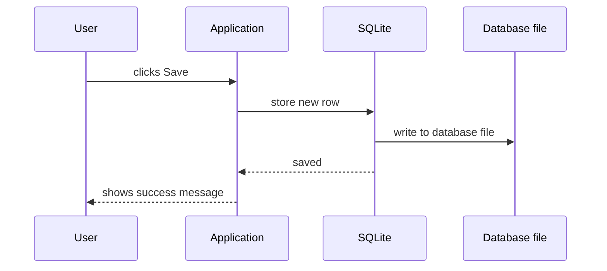
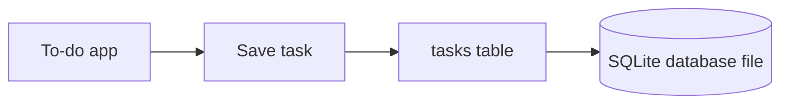
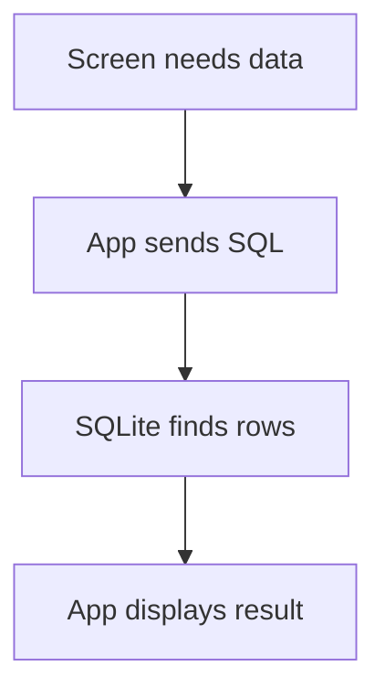
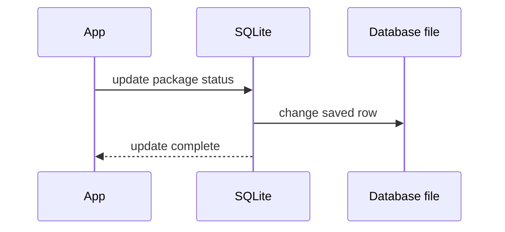
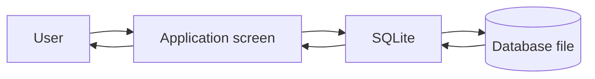
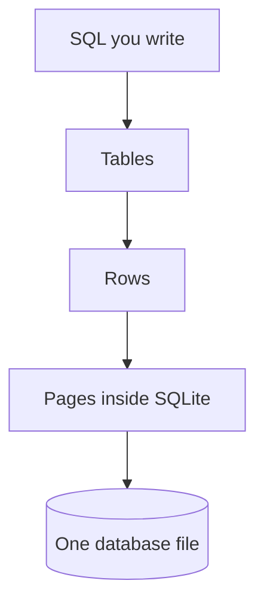
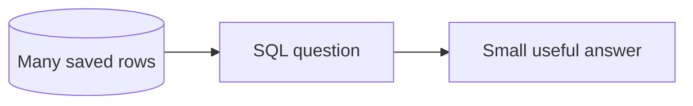

An application is the software a person uses.

A website, mobile app, desktop program, game, checkout system, school portal, and banking app are all applications.

Applications use databases when they need to remember information after a screen changes, a program closes, or a device restarts.

With SQLite, that remembered information usually lives in a single ordinary database file on disk.

## The basic app and database loop

Most application database work follows a simple loop:

1. A person does something in the application.
2. The application sends a request to SQLite.
3. SQLite reads or changes stored data.
4. SQLite returns a result.
5. The application shows something to the person.



This loop happens constantly.

When you log in, send a message, like a photo, buy a ticket, or mark a task complete, an application is usually reading from or writing to a database.

## Saving information

Suppose you write a new task in a to-do app and click Save.

The application may collect facts like this:

```text
title: Buy milk
done: 0
due_date: 2026-04-15
```

SQLite stores those facts as a row in a table.



Later, the app can ask for your unfinished tasks and show them again.

<SqlCodeBlock
  dialect="sqlite"
  title="Save facts as rows"
  initSql={`CREATE TABLE tasks (
  id INTEGER PRIMARY KEY,
  title TEXT,
  done INTEGER,
  due_date TEXT
);
INSERT INTO tasks (title, done, due_date) VALUES
  ('Buy milk', 0, '2026-04-15'),
  ('Submit form', 1, '2026-04-10'),
  ('Water plants', 0, '2026-04-11');`}
  starterCode={`SELECT title, due_date
FROM tasks
WHERE done = 0;`}
/>

## Reading information

Reading means asking the database for facts that already exist.

Examples:

- A music app asks for your playlists.
- A bank app asks for your account balance.
- A store asks for products in stock.
- A school portal asks for your grades.

The application does not need to know every detail of how SQLite stores information inside the file. It asks a structured question and receives structured results.



<MultipleChoice
  markdown={`In the basic application-database loop, what usually happens after SQLite reads or changes stored data?

- The user manually edits the database file
  > In normal applications, users interact with the app, not raw database bytes.
- [o] SQLite sends a result back to the application
  > The application uses that result to decide what to show next.
- The application forgets the result immediately
  > Applications usually use the result to update the screen or continue work.
- SQLite turns into a spreadsheet
  > SQLite remains a database engine.`}
/>

## Changing information

Information changes because the real world changes.

Examples:

- A package changes from "processing" to "shipped."
- A user changes their email address.
- A student submits an assignment.
- A payment changes from "pending" to "paid."

The application sends the change to SQLite so future screens and future sessions see the updated fact.



## The database is not the screen

Beginners sometimes imagine the database as the thing the user sees.

Usually, it is not.

The application owns the buttons, forms, pages, images, and interactions.

The database owns the stored facts.



A database may be invisible to the user, but it is often the reason the application can remember anything.

## How rows become a file

A database does not store information as one giant paragraph.

In a relational database, information is organized into **tables**, **rows**, and **columns**.

```text
tasks

id | title        | done | due_date
-- | ------------ | ---- | ----------
1  | Buy milk     | 0    | 2026-04-15
2  | Submit form  | 1    | 2026-04-10
```

A **table** stores one kind of thing. A **row** is one record. A **column** is one piece of information every row is expected to have.

SQLite then stores the database on disk in one ordinary file.



You usually do not edit this file by hand. SQLite manages it for you.

## A database request is usually small

Applications rarely ask for "everything."

Instead, they ask for what one screen or task needs.

Examples:

- "Give me the 10 newest messages."
- "Save this new shipping address."
- "Mark this invoice as paid."
- "Find products under $50."



This is one reason databases matter: they help applications work with the relevant slice of information.

## The main idea

Applications use databases as dependable memory.

The user clicks, types, searches, or pays. The application turns that action into a database request. SQLite reads or changes rows in a database file and sends a result back.

## Check your understanding

<MultipleChoice
  markdown={`What is the application's job in a typical database-backed app?

- To store raw disk pages without showing anything to the user
  > The database handles low-level storage; the application handles the user-facing screens.
- [o] To show screens and send database requests when needed
  > The application handles user interaction and asks the database to store or find facts.
- To replace all stored data with colors
  > Colors may be part of the screen, but they are not the database's stored facts.
- To make saved data disappear when the app closes
  > The database helps information survive beyond one app session.`}
/>

<MultipleChoice
  markdown={`What is SQLite's job in this loop?

- Draw every button on the screen
  > The application draws the interface.
- Decide what the user wants without a request
  > The application sends requests; SQLite does not read minds.
- [o] Store, read, and change facts safely
  > SQLite manages stored information for the application.
- Replace the user's device
  > SQLite is software, not a device replacement.`}
/>

<MultipleChoice
  markdown={`What is a key SQLite idea about storage?

- Every table must be a separate server computer
  > SQLite does not require a separate database server.
- [o] An entire SQLite database is commonly stored in one ordinary file on disk
  > SQLite manages tables and rows inside a single database file.
- SQLite can only store data in memory
  > SQLite can store durable data on disk.
- Users must edit the file bytes by hand
  > Applications use SQLite rather than hand-editing the database file.`}
/>

<MultipleChoice
  markdown={`Why do applications usually ask for a small slice of data?

- Because databases cannot store more than one row
  > Databases can store many rows.
- [o] Because one screen or action usually needs only specific facts
  > Asking for relevant data keeps applications focused and efficient.
- Because users must write every database file by hand
  > Users normally interact with the application, not database files.
- Because SQL forbids questions
  > SQL is a language for asking database questions.`}
/>
