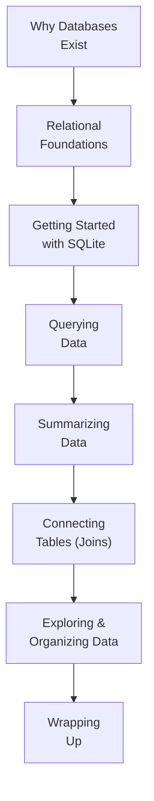

Welcome to **SQLite for Beginners**. If the words *database*,
*query*, and *table* feel vague — or if the only place you have
ever organized information is a spreadsheet — you are in exactly
the right place.

This course assumes **no programming experience, no database
experience, and no SQL experience.** We start from the most basic
question of all — *what is a database, really?* — and build up,
one small idea at a time, until you can read and write real SQL
queries with confidence.

<Callout type="info" title="Nothing to install">
Every SQL example on every page runs **inside your browser** on a
real SQLite engine (the official `@sqlite.org/sqlite-wasm` build —
SQLite compiled to WebAssembly). There is no server, no signup, and
nothing to install. Edit the query, click *Run*, and the results
appear right below the editor.
</Callout>

## Who this course is for

You will feel at home here if any of these sound like you:

- You have heard colleagues talk about "the database" or "writing a
  query" and quietly wondered what they actually mean.
- You keep information in spreadsheets, but they have started to
  feel slow, fragile, or hard to keep consistent.
- You are curious about data roles — analyst, engineer, scientist —
  and you want to understand the foundation everyone builds on.
- You tried a SQL tutorial once and bounced off a wall of syntax
  with no explanation of *why* any of it exists.

You do **not** need:

- Any prior coding experience.
- Any prior database or SQL experience.
- Any math beyond everyday arithmetic.
- Anything installed on your computer.

## What you will be able to do

By the end of the course you will be able to:

- Explain what a database is and *why* software needs one.
- Describe how relational databases organize information into
  **tables** that relate to one another.
- Read and write SQL queries to **select**, **filter**, **sort**,
  and **summarize** data.
- Combine data from multiple tables using **joins**.
- Reason about **primary keys**, **foreign keys**, and
  **relationships** between tables.
- Explore an unfamiliar dataset and organize your own data sensibly.
- Think analytically about data — the skill that outlasts any
  particular tool.

## What this course is *not*

This is a **foundations** course about SQL and relational thinking.
It deliberately spends **little or no time** on database
administration topics such as production deployment, high
availability, replication, multi-user tuning, query-planner
optimization, security hardening, cloud infrastructure, ORMs, or
backend frameworks. Those are important — but they are not the
foundation, and they make far more sense *after* you understand the
ideas taught here.

## How the course is organized

We start with **ideas, not syntax**. The first section answers the
questions most tutorials skip: what a database is, why it exists,
how applications store information, and why SQL and SQLite became
so widely used. Only once those ideas are solid do we start writing
queries — and from then on, every new piece of SQL is introduced to
answer a question you already understand.

## The three kinds of interactive widgets

You will meet three kinds of interactive elements:

1. **Runnable SQL blocks.** A live SQLite editor. Most blocks
   pre-load sample tables for you; edit the query, click *Run*, and
   inspect the result table.
2. **Challenge cards.** Small problems with hidden tests — write a
   query, run the tests, and see which ones pass.
3. **Multiple-choice questions.** Quick conceptual checks, with an
   explanation for every choice, so you can confirm an idea has
   landed before moving on.

<Callout type="info" title="Each SQL block is independent">
Tables you create in one runnable block are **not** visible to the
next block, even on the same page — every block that needs data
sets it up itself. If you want a single long-lived workspace to
experiment in, open the
[SQLite Playground](/playground/sqlite) in a new tab.
</Callout>

## A first taste

You do not need to understand this yet. Just click *Run* and notice
that, in a few lines, we created a table, put some rows in it, and
asked a question of the data.

<SqlCodeBlock
  dialect="sqlite"
  title="Your very first query"
  initSql={`CREATE TABLE pets (
  name    TEXT,
  species TEXT,
  age     INTEGER
);
INSERT INTO pets (name, species, age) VALUES
  ('Mochi', 'cat', 3),
  ('Pixel', 'dog', 5),
  ('Sunny', 'cat', 2),
  ('Rex',   'dog', 8);`}
  starterCode={`SELECT name, species, age
FROM pets
WHERE species = 'cat'
ORDER BY age DESC;`}
/>

That query says, in almost plain English: *"Show me the name,
species, and age from the pets table, but only the cats, sorted
from oldest to youngest."* By the time you finish the **Querying
Data** section, reading and writing queries like this will feel
natural.
