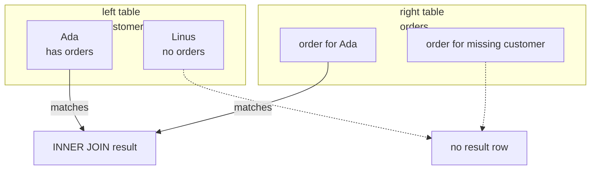
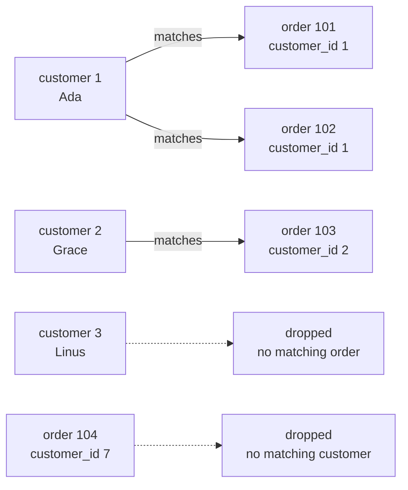
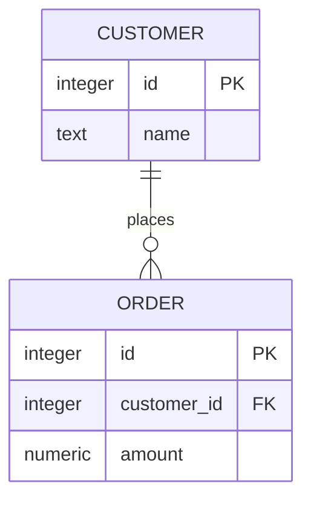

An **inner join** keeps only rows that match on both sides. If a row has no partner, it disappears from the result.

In SQLite, `JOIN` by itself means `INNER JOIN`.



## Only matches survive

This data includes two unmatched things:

- Linus is a customer with no order.
- Order `104` points to customer `7`, who is not in the customers table.

<SqlCodeBlock
  dialect="sqlite"
  title="INNER JOIN keeps only matching rows"
  initSql={`CREATE TABLE customers (
  id INTEGER PRIMARY KEY,
  name TEXT
);
CREATE TABLE orders (
  id INTEGER PRIMARY KEY,
  customer_id INTEGER,
  amount NUMERIC
);
INSERT INTO customers (id, name) VALUES
  (1, 'Ada'),
  (2, 'Grace'),
  (3, 'Linus');
INSERT INTO orders (id, customer_id, amount) VALUES
  (101, 1, 42),
  (102, 1, 18),
  (103, 2, 99),
  (104, 7, 55);`}
  starterCode={`SELECT
  c.name,
  o.id AS order_id,
  o.amount
FROM
  customers c
  INNER JOIN orders o ON o.customer_id = c.id
ORDER BY
  c.name,
  o.id;`}
/>

Ada and Grace appear because they have matching orders. Linus disappears because no order matches him. Order `104` disappears because customer `7` does not exist.



<MultipleChoice
  markdown={`What happens to Linus in the query above?

- He appears with zero for the order amount.
  > An inner join does not invent a zero-valued order.
- [o] He is left out because he has no matching order.
  > Inner joins keep only rows with matching partners.
- He appears with the last order in the table.
  > Joins never borrow another row's values.
- The query fails because one customer has no order.
  > Unmatched rows are normal; they are simply omitted by an inner join.

An inner join drops rows that do not satisfy the matching condition.`}
/>

## `JOIN` and `INNER JOIN` mean the same thing

Most people write just `JOIN` because inner join is the default.

<SqlCodeBlock
  dialect="sqlite"
  title="JOIN is shorthand for INNER JOIN"
  initSql={`CREATE TABLE customers (id INTEGER PRIMARY KEY, name TEXT);
CREATE TABLE orders (id INTEGER PRIMARY KEY, customer_id INTEGER, amount NUMERIC);
INSERT INTO customers (id, name) VALUES (1, 'Ada'), (2, 'Grace'), (3, 'Linus');
INSERT INTO orders (id, customer_id, amount) VALUES (101, 1, 42), (102, 2, 99);`}
  starterCode={`SELECT
  c.name,
  o.amount
FROM
  customers c
  JOIN orders o ON o.customer_id = c.id
ORDER BY
  c.name;`}
/>

You can write `INNER JOIN` when you want to be extra clear, especially near outer joins.

## Choosing the matching columns

The most common inner join condition is:

```sql
child_table.foreign_key = parent_table.primary_key
```



<SqlCodeBlock
  dialect="sqlite"
  title="Match foreign key to primary key"
  initSql={`CREATE TABLE authors (id INTEGER PRIMARY KEY, name TEXT);
CREATE TABLE books (id INTEGER PRIMARY KEY, author_id INTEGER, title TEXT);
INSERT INTO authors (id, name) VALUES (1, 'Octavia'), (2, 'Ursula'), (3, 'James');
INSERT INTO books (id, author_id, title) VALUES
  (10, 1, 'Kindred'),
  (11, 2, 'A Wizard of Earthsea'),
  (12, 1, 'Parable of the Sower');`}
  starterCode={`SELECT
  a.name AS author,
  b.title
FROM
  authors a
  JOIN books b ON b.author_id = a.id
ORDER BY
  a.name,
  b.title;`}
/>

The query keeps author-book pairs where the book's `author_id` points to the author's `id`.

## Aliases and column prefixes

Aliases make inner joins readable. Prefixing columns with aliases also avoids confusion when both tables have columns named `id`.

<SqlCodeBlock
  dialect="sqlite"
  title="Use aliases to keep the query clear"
  initSql={`CREATE TABLE customers (id INTEGER PRIMARY KEY, name TEXT);
CREATE TABLE orders (id INTEGER PRIMARY KEY, customer_id INTEGER, amount NUMERIC);
INSERT INTO customers (id, name) VALUES (1, 'Ada'), (2, 'Grace');
INSERT INTO orders (id, customer_id, amount) VALUES (101, 1, 42), (102, 1, 18), (103, 2, 99);`}
  starterCode={`SELECT
  c.id AS customer_id,
  c.name,
  o.id AS order_id,
  o.amount
FROM
  customers AS c
  JOIN orders AS o ON o.customer_id = c.id
ORDER BY
  c.id,
  o.id;`}
/>

`AS` is optional for table aliases in SQLite, but it can make beginner queries easier to read.

## Joining more than two tables

You can chain inner joins. Each `JOIN ... ON ...` adds another table and another matching rule.


<SqlCodeBlock
  dialect="sqlite"
  title="A three-table inner join"
  initSql={`CREATE TABLE customers (id INTEGER PRIMARY KEY, name TEXT);
CREATE TABLE products (id INTEGER PRIMARY KEY, title TEXT, price NUMERIC);
CREATE TABLE orders (id INTEGER PRIMARY KEY, customer_id INTEGER, product_id INTEGER);
INSERT INTO customers (id, name) VALUES (1, 'Ada'), (2, 'Grace');
INSERT INTO products (id, title, price) VALUES (10, 'Book', 20), (11, 'Pen', 3);
INSERT INTO orders (id, customer_id, product_id) VALUES
  (101, 1, 10),
  (102, 1, 11),
  (103, 2, 10);`}
  starterCode={`SELECT
  c.name,
  p.title,
  p.price
FROM
  orders o
  JOIN customers c ON c.id = o.customer_id
  JOIN products p ON p.id = o.product_id
ORDER BY
  c.name,
  p.title;`}
/>

The `orders` table sits in the middle: it points to both the customer and the product.

## When inner joins are the right tool

Use an inner join when your question means **with a matching partner**:

- orders with their customers
- books with their authors
- students with their enrolled courses
- products that have actually sold

## Check your understanding

<MultipleChoice
  markdown={`What rows does an inner join return?

- Every row from the left table, matched or not.
  > That describes a left join.
- [o] Only rows where the join condition finds a match in both tables.
  > Inner joins keep matched pairs and drop unmatched rows.
- Every row from both tables, with blanks for missing values.
  > That describes an outer join family, not an inner join.
- Only rows with NULL values.
  > Inner joins are based on matching conditions, not on requiring NULLs.

An inner join is the "only matching pairs" join.`}
/>

<MultipleChoice
  markdown={`Which two SQLite keywords are equivalent here for a normal matching join?

- \`LEFT JOIN\` and \`INNER JOIN\`
  > A left join keeps unmatched left rows, so it is different.
- [o] \`JOIN\` and \`INNER JOIN\`
  > In SQLite, plain \`JOIN\` means an inner join.
- \`WHERE\` and \`JOIN\`
  > \`WHERE\` filters rows; it is not the join keyword.
- \`ORDER BY\` and \`INNER JOIN\`
  > \`ORDER BY\` sorts the result.

Plain \`JOIN\` is shorthand for \`INNER JOIN\`.`}
/>

<MultipleChoice
  markdown={`You want "products that have been sold." Which join is a natural fit?

- A query from products only.
  > Products alone cannot tell which ones were sold.
- [o] An inner join from products to order rows, keeping products with matching sales.
  > "Have been sold" means a matching order exists.
- A left join that keeps all unsold products too.
  > That would answer a different question, such as all products and any sales.
- A join with no matching condition.
  > Without the intended match, the result will not represent real sales.

Use an inner join when the question requires existing matches.`}
/>

<MultipleChoice
  markdown={`Why prefix columns like \`c.id\` and \`o.id\` in a join?

- SQLite refuses all unprefixed columns.
  > Unambiguous unprefixed columns can work, but prefixes are clearer.
- [o] Prefixes tell SQLite and the reader which table's column you mean.
  > Joined tables often share column names such as \`id\`.
- Prefixes turn ids into foreign keys.
  > Foreign keys are part of table design, not alias syntax.
- Prefixes sort the output.
  > Sorting is controlled by \`ORDER BY\`.

Aliases and prefixes keep joined queries understandable.`}
/>
