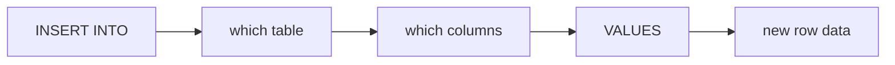
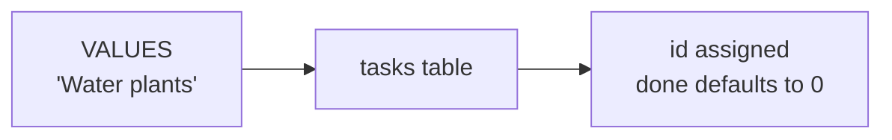
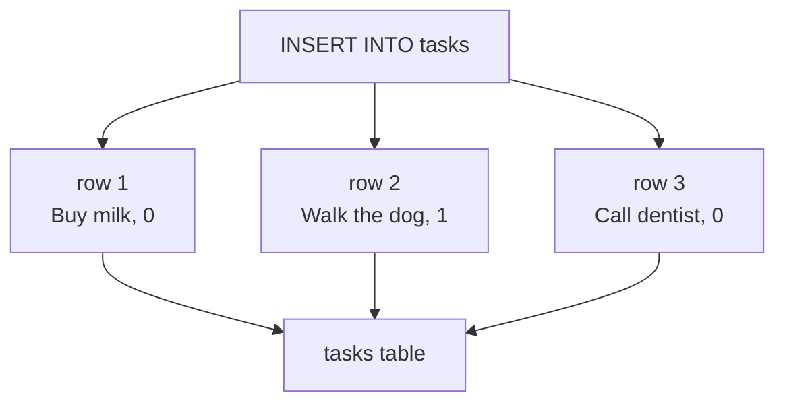
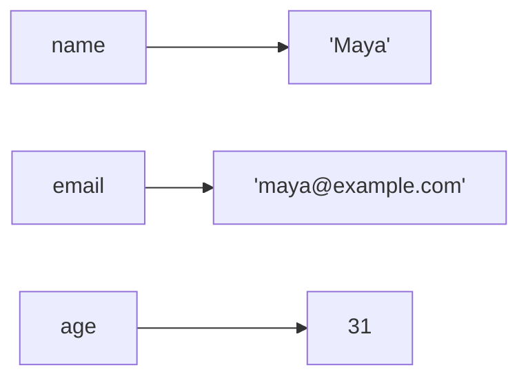

A table's structure is only the beginning. To make a table useful, you add rows.

The SQL statement for adding rows is `INSERT INTO`.

## INSERT adds rows

An `INSERT` statement names the table, names the columns you are filling, and supplies matching values.

Here is a complete example: create a table, insert one row, then read it back.

<SqlCodeBlock
  dialect="sqlite"
  title="Insert one row"
  starterCode={`CREATE TABLE tasks (
  id INTEGER PRIMARY KEY,
  title TEXT NOT NULL,
  done INTEGER DEFAULT 0
);

INSERT INTO
  tasks (title, done)
VALUES
  ('Buy milk', 0);

SELECT
  *
FROM
  tasks
ORDER BY
  id;`}
/>

SQLite does not have a separate `BOOLEAN` type. In beginner examples, we often use `INTEGER` values `0` and `1` for yes/no data: `0` means false or no, and `1` means true or yes.

## Omit the auto id column

When a table has `id INTEGER PRIMARY KEY`, you usually leave `id` out of the insert. SQLite assigns it for you.

<SqlCodeBlock
  dialect="sqlite"
  title="Leave out the id"
  starterCode={`CREATE TABLE tasks (
  id INTEGER PRIMARY KEY,
  title TEXT NOT NULL,
  done INTEGER DEFAULT 0
);

INSERT INTO
  tasks (title)
VALUES
  ('Water plants');

SELECT
  *
FROM
  tasks
ORDER BY
  id;`}
/>

The insert only gave `title`. SQLite supplied `id`, and `DEFAULT 0` supplied `done`.

<MultipleChoice
  markdown={`Why can the insert omit \`id\` in a table with \`id INTEGER PRIMARY KEY\`?

- SQLite does not store ids.
  > SQLite stores the id; the point is that it can assign one for you.
- [o] SQLite can automatically assign the id value.
  > An \`INTEGER PRIMARY KEY\` column is the usual SQLite pattern for auto-assigned ids.
- The id column becomes text instead.
  > The column is still an integer primary key.
- The row is inserted without any columns.
  > The row still has columns; omitted columns may be assigned or defaulted.

Leaving out an auto id keeps inserts shorter and avoids manual numbering mistakes.`}
/>

## Insert several rows at once

You can add multiple rows with one `INSERT` by separating value groups with commas.

<SqlCodeBlock
  dialect="sqlite"
  title="Insert multiple rows"
  starterCode={`CREATE TABLE tasks (
  id INTEGER PRIMARY KEY,
  title TEXT NOT NULL,
  done INTEGER DEFAULT 0
);

INSERT INTO
  tasks (title, done)
VALUES
  ('Buy milk', 0),
  ('Walk the dog', 1),
  ('Call dentist', 0);

SELECT
  *
FROM
  tasks
ORDER BY
  id;`}
/>

Each parenthesized group becomes one new row.

## Column order matters

The column list and values match by position. The first value goes into the first named column, the second value goes into the second named column, and so on.

<SqlCodeBlock
  dialect="sqlite"
  title="Match columns to values"
  starterCode={`CREATE TABLE contacts (
  id INTEGER PRIMARY KEY,
  name TEXT NOT NULL,
  email TEXT,
  age INTEGER
);

INSERT INTO
  contacts (name, email, age)
VALUES
  ('Maya', 'maya@example.com', 31),
  ('Noah', 'noah@example.com', 28);

SELECT
  name,
  email,
  age
FROM
  contacts
ORDER BY
  id;`}
/>

<MultipleChoice
  markdown={`In \`INSERT INTO contacts (name, email, age) VALUES ('Maya', 'maya@example.com', 31);\`, where does \`31\` go?

- Into \`name\`
  > \`name\` gets the first value, \`'Maya'\`.
- Into \`email\`
  > \`email\` gets the second value, \`'maya@example.com'\`.
- [o] Into \`age\`
  > \`age\` is the third named column, and \`31\` is the third value.
- Into \`id\`
  > \`id\` is not listed in the column list, so SQLite assigns it separately.

Values line up with columns from left to right.`}
/>

## Insert with explicit columns

You do not have to fill every column every time. Name the columns you are providing, and let defaults or empty values handle the rest.

<SqlCodeBlock
  dialect="sqlite"
  title="Provide only some columns"
  starterCode={`CREATE TABLE books (
  id INTEGER PRIMARY KEY,
  title TEXT NOT NULL,
  author TEXT,
  pages INTEGER DEFAULT 0
);

INSERT INTO
  books (title, author)
VALUES
  ('Kindred', 'Octavia E. Butler');

INSERT INTO
  books (title, pages)
VALUES
  ('A Short Book', 120);

SELECT
  *
FROM
  books
ORDER BY
  id;`}
/>

The first row has no page count, so `pages` uses its default `0`. The second row has no author, so that value is empty in the result.

## Practice challenge

<SqlChallengeCard
  dialect="sqlite"
  title="Insert two pantry items"
  instructions={`The \`pantry\` table is already created. Insert two rows:

- \`'Rice'\` with quantity \`3\`
- \`'Beans'\` with quantity \`5\`

Then select \`name\` and \`quantity\` from \`pantry\` ordered by \`id\`.`}
  initSql={`CREATE TABLE pantry (
  id INTEGER PRIMARY KEY,
  name TEXT NOT NULL,
  quantity INTEGER DEFAULT 0
);`}
  starterCode={`-- Insert the two rows here:
-- Then read them:`}
  solutionSql={`INSERT INTO
  pantry (name, quantity)
VALUES
  ('Rice', 3),
  ('Beans', 5);

SELECT
  name,
  quantity
FROM
  pantry
ORDER BY
  id;`}
  tests={[
    { id: "columns", name: "Returns the requested columns", description: "The result should include name and quantity.", expectedColumns: ["name", "quantity"] },
    { id: "rows", name: "Returns Rice and Beans", description: "The rows should be inserted in order.", expectedRows: { columns: ["name", "quantity"], ordered: true, values: [["Rice", 3], ["Beans", 5]] } },
  ]}
/>

## Check your understanding

<MultipleChoice
  markdown={`What does \`INSERT INTO\` do?

- It reads rows from a table.
  > Reading rows is done with \`SELECT\`.
- [o] It adds new rows to a table.
  > \`INSERT INTO\` is the statement for putting new data into a table.
- It deletes a table's structure.
  > Removing a table uses \`DROP TABLE\`.
- It renames every column.
  > Renaming columns is a different kind of table change.

\`INSERT\` is how rows get into a table.`}
/>

<MultipleChoice
  markdown={`How do you insert multiple rows in one \`INSERT\` statement?

- Write several table names after \`INSERT INTO\`.
  > One \`INSERT\` targets one table.
- Put every value in one long quoted string.
  > Quoted strings are text values, not row separators.
- [o] Add several parenthesized value groups separated by commas.
  > Each \`(...)\` group supplies one row.
- Use \`SELECT *\` before \`VALUES\`.
  > \`SELECT\` reads data; it is not how multiple value groups are listed.

Multiple value groups make bulk inserts easier to read and write.`}
/>

<MultipleChoice
  markdown={`In this course's SQLite examples, what do \`0\` and \`1\` often represent in yes/no columns?

- Table names and column names.
  > Names are written as identifiers, not usually as 0 and 1 values.
- [o] False/no and true/yes values.
  > SQLite has no separate boolean storage class, so 0 and 1 are common for yes/no data.
- Text and dates.
  > Text is written in quotes, and dates are often stored as text strings.
- Primary keys only.
  > Primary keys can be integers, but 0 and 1 are also commonly used for yes/no flags.

Using 0 and 1 is a simple SQLite-friendly way to represent boolean-like data.`}
/>
