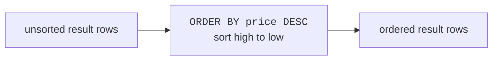
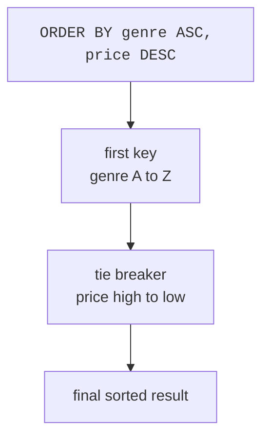
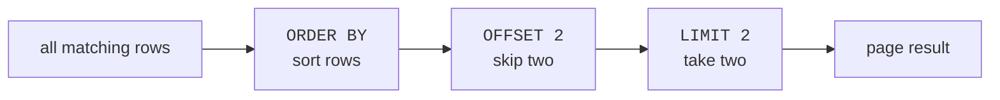
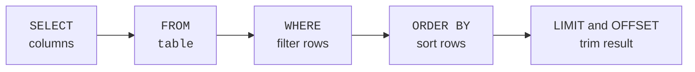

Tables do not have a natural reading order. Even if rows seem to come
back in the same order today, you should not rely on that. If order
matters, say so with `ORDER BY`.

After the rows are ordered, `LIMIT` and `OFFSET` let you take a smaller
piece of the result. Together, they answer questions like "which books
are cheapest?" and "show the next page."

<svg
  viewBox="0 0 640 260"
  role="img"
  aria-label="A jumbled top shelf of books, one leaning at an angle, is rearranged on the lower shelf from shortest to tallest, where an L-shaped bookend stops after the first three and the rest fade — ORDER BY lines rows up and LIMIT keeps just the front of the line"
  style={{ display: "block", width: "100%", maxWidth: "560px", height: "auto", margin: "2.5rem auto" }}
>
  <g fill="currentColor" opacity="0.16">
    <rect x="100" y="106" width="440" height="8" rx="4" />
    <rect x="100" y="232" width="440" height="8" rx="4" />
  </g>
  <g style={{ color: "var(--ds-blue-500)" }} fill="currentColor">
    <rect x="128" y="50" width="26" height="56" rx="4" fillOpacity="0.85" />
    <rect x="288" y="58" width="26" height="48" rx="4" fillOpacity="0.6" />
  </g>
  <g style={{ color: "var(--ds-yellow-500)" }} fill="currentColor">
    <rect x="162" y="68" width="26" height="38" rx="4" fillOpacity="0.85" />
  </g>
  <g style={{ color: "var(--ds-green-500)" }} fill="currentColor">
    <rect x="206" y="46" width="26" height="64" rx="4" transform="rotate(9 219 78)" fillOpacity="0.85" />
  </g>
  <g style={{ color: "var(--ds-red-500)" }} fill="currentColor">
    <rect x="252" y="76" width="26" height="30" rx="4" fillOpacity="0.85" />
  </g>
  <g fill="currentColor" opacity="0.28">
    <circle cx="404" cy="128" r="2.5" />
    <circle cx="384" cy="142" r="2.5" />
    <circle cx="364" cy="156" r="2.5" />
    <circle cx="344" cy="170" r="2.5" />
  </g>
  <g style={{ color: "var(--ds-red-500)" }} fill="currentColor">
    <rect x="128" y="202" width="26" height="30" rx="4" />
  </g>
  <g style={{ color: "var(--ds-yellow-500)" }} fill="currentColor">
    <rect x="162" y="194" width="26" height="38" rx="4" />
  </g>
  <g style={{ color: "var(--ds-blue-500)" }} fill="currentColor">
    <rect x="196" y="184" width="26" height="48" rx="4" />
  </g>
  <g fill="currentColor" opacity="0.45">
    <path d="M 236 232 L 236 178 L 248 178 L 248 220 L 274 220 L 274 232 Z" />
  </g>
  <g style={{ color: "var(--ds-blue-500)" }} fill="currentColor">
    <rect x="288" y="176" width="26" height="56" rx="4" fillOpacity="0.25" />
  </g>
  <g style={{ color: "var(--ds-green-500)" }} fill="currentColor">
    <rect x="322" y="168" width="26" height="64" rx="4" fillOpacity="0.25" />
  </g>
</svg>

## ORDER BY sorts rows

`ORDER BY` sorts the result by a column. Use `ASC` for ascending order
(low to high, A to Z) or `DESC` for descending order (high to low, Z to
A). `ASC` is the default.

<SqlCodeBlock
  dialect="sqlite"
  title="Cheapest books first"
  initSql={`CREATE TABLE books (
  id INTEGER PRIMARY KEY,
  title TEXT,
  author TEXT,
  genre TEXT,
  price NUMERIC,
  pages INTEGER
);
INSERT INTO books (title, author, genre, price, pages) VALUES
  ('The Solar Bakery', 'Mina Park', 'Fiction', 12.99, 240),
  ('Data Garden', 'Owen Lee', 'Technology', 29.50, 410),
  ('Pocket Rivers', 'Lena Ortiz', 'Travel', 16.00, 180),
  ('SQL Street', 'Mina Park', 'Technology', 24.00, 320),
  ('Cloud Recipes', 'Ava Stone', 'Fiction', 18.25, 275);`}
  starterCode={`SELECT
  title,
  price
FROM
  books
ORDER BY
  price ASC;`}
/>

<SqlCodeBlock
  dialect="sqlite"
  title="Most expensive books first"
  initSql={`CREATE TABLE books (
  id INTEGER PRIMARY KEY,
  title TEXT,
  author TEXT,
  genre TEXT,
  price NUMERIC,
  pages INTEGER
);
INSERT INTO books (title, author, genre, price, pages) VALUES
  ('The Solar Bakery', 'Mina Park', 'Fiction', 12.99, 240),
  ('Data Garden', 'Owen Lee', 'Technology', 29.50, 410),
  ('Pocket Rivers', 'Lena Ortiz', 'Travel', 16.00, 180),
  ('SQL Street', 'Mina Park', 'Technology', 24.00, 320),
  ('Cloud Recipes', 'Ava Stone', 'Fiction', 18.25, 275);`}
  starterCode={`SELECT
  title,
  price
FROM
  books
ORDER BY
  price DESC;`}
/>

Text can be sorted too. For ordinary text, ascending order is
alphabetical.

<SqlCodeBlock
  dialect="sqlite"
  title="Alphabetical titles"
  initSql={`CREATE TABLE books (
  id INTEGER PRIMARY KEY,
  title TEXT,
  author TEXT,
  genre TEXT,
  price NUMERIC,
  pages INTEGER
);
INSERT INTO books (title, author, genre, price, pages) VALUES
  ('The Solar Bakery', 'Mina Park', 'Fiction', 12.99, 240),
  ('Data Garden', 'Owen Lee', 'Technology', 29.50, 410),
  ('Pocket Rivers', 'Lena Ortiz', 'Travel', 16.00, 180),
  ('SQL Street', 'Mina Park', 'Technology', 24.00, 320),
  ('Cloud Recipes', 'Ava Stone', 'Fiction', 18.25, 275);`}
  starterCode={`SELECT
  title,
  author
FROM
  books
ORDER BY
  title;`}
/>

## Sort by more than one column

You can give SQLite a first sort key, then a second sort key for ties.
Think of sorting books by genre first, and then by price inside each
genre.

<SqlCodeBlock
  dialect="sqlite"
  title="Genre first, price within genre"
  initSql={`CREATE TABLE books (
  id INTEGER PRIMARY KEY,
  title TEXT,
  author TEXT,
  genre TEXT,
  price NUMERIC,
  pages INTEGER
);
INSERT INTO books (title, author, genre, price, pages) VALUES
  ('The Solar Bakery', 'Mina Park', 'Fiction', 12.99, 240),
  ('Data Garden', 'Owen Lee', 'Technology', 29.50, 410),
  ('Pocket Rivers', 'Lena Ortiz', 'Travel', 16.00, 180),
  ('SQL Street', 'Mina Park', 'Technology', 24.00, 320),
  ('Cloud Recipes', 'Ava Stone', 'Fiction', 18.25, 275);`}
  starterCode={`SELECT
  genre,
  title,
  price
FROM
  books
ORDER BY
  genre ASC,
  price DESC;`}
/>

The order of columns in `ORDER BY` sets priority. The first column is
the main sort. Later columns break ties.

## LIMIT keeps the first rows of the sorted result

`LIMIT n` keeps only the first `n` rows. When you use it with
`ORDER BY`, you can ask for "top N" or "bottom N" lists.

<SqlCodeBlock
  dialect="sqlite"
  title="Three cheapest books"
  initSql={`CREATE TABLE books (
  id INTEGER PRIMARY KEY,
  title TEXT,
  author TEXT,
  genre TEXT,
  price NUMERIC,
  pages INTEGER
);
INSERT INTO books (title, author, genre, price, pages) VALUES
  ('The Solar Bakery', 'Mina Park', 'Fiction', 12.99, 240),
  ('Data Garden', 'Owen Lee', 'Technology', 29.50, 410),
  ('Pocket Rivers', 'Lena Ortiz', 'Travel', 16.00, 180),
  ('SQL Street', 'Mina Park', 'Technology', 24.00, 320),
  ('Cloud Recipes', 'Ava Stone', 'Fiction', 18.25, 275);`}
  starterCode={`SELECT
  title,
  price
FROM
  books
ORDER BY
  price ASC
LIMIT
  3;`}
/>

<Callout type="warning" title="LIMIT needs order when meaning matters">
`LIMIT 3` without `ORDER BY` means "some three rows." If you mean the
cheapest three, newest three, or first three alphabetically, sort first.
</Callout>

## OFFSET skips rows

`OFFSET n` skips the first `n` rows before returning results. Combined
with `LIMIT`, it is how websites make pages of results.

<SqlCodeBlock
  dialect="sqlite"
  title="Second page of two books"
  initSql={`CREATE TABLE books (
  id INTEGER PRIMARY KEY,
  title TEXT,
  author TEXT,
  genre TEXT,
  price NUMERIC,
  pages INTEGER
);
INSERT INTO books (title, author, genre, price, pages) VALUES
  ('The Solar Bakery', 'Mina Park', 'Fiction', 12.99, 240),
  ('Data Garden', 'Owen Lee', 'Technology', 29.50, 410),
  ('Pocket Rivers', 'Lena Ortiz', 'Travel', 16.00, 180),
  ('SQL Street', 'Mina Park', 'Technology', 24.00, 320),
  ('Cloud Recipes', 'Ava Stone', 'Fiction', 18.25, 275);`}
  starterCode={`SELECT
  title,
  price
FROM
  books
ORDER BY
  price ASC
LIMIT
  2
OFFSET
  2;`}
/>

This orders all books by price, skips the two cheapest, then returns the
next two.

## Clause order

When these clauses appear together, write them in this order:

You can leave out `WHERE`, `ORDER BY`, `LIMIT`, or `OFFSET` when you do
not need them. But if you include them, keep the order shown above.

<SqlCodeBlock
  dialect="sqlite"
  title="Filter, sort, and limit together"
  initSql={`CREATE TABLE books (
  id INTEGER PRIMARY KEY,
  title TEXT,
  author TEXT,
  genre TEXT,
  price NUMERIC,
  pages INTEGER
);
INSERT INTO books (title, author, genre, price, pages) VALUES
  ('The Solar Bakery', 'Mina Park', 'Fiction', 12.99, 240),
  ('Data Garden', 'Owen Lee', 'Technology', 29.50, 410),
  ('Pocket Rivers', 'Lena Ortiz', 'Travel', 16.00, 180),
  ('SQL Street', 'Mina Park', 'Technology', 24.00, 320),
  ('Cloud Recipes', 'Ava Stone', 'Fiction', 18.25, 275);`}
  starterCode={`SELECT
  title,
  genre,
  price
FROM
  books
WHERE
  price < 25
ORDER BY
  price DESC
LIMIT
  2;`}
/>

## Practice challenge

A classic "top N" question: sort, then trim. The table is loaded
for you.

<SqlChallengeCard
  dialect="sqlite"
  title="The two longest books"
  instructions={`The \`books\` table is preloaded. Return the \`title\` and \`pages\` columns (in that order) for the **two** books with the most pages, longest first. Sort by \`pages\` descending and use \`LIMIT\`.`}
  initSql={`CREATE TABLE books (
  id INTEGER PRIMARY KEY,
  title TEXT,
  author TEXT,
  genre TEXT,
  price NUMERIC,
  pages INTEGER
);
INSERT INTO books (title, author, genre, price, pages) VALUES
  ('The Solar Bakery', 'Mina Park', 'Fiction', 12.99, 240),
  ('Data Garden', 'Owen Lee', 'Technology', 29.50, 410),
  ('Pocket Rivers', 'Lena Ortiz', 'Travel', 16.00, 180),
  ('SQL Street', 'Mina Park', 'Technology', 24.00, 320),
  ('Cloud Recipes', 'Ava Stone', 'Fiction', 18.25, 275);`}
  starterCode={`SELECT
  title,
  pages
FROM
  books;`}
  solutionSql={`SELECT
  title,
  pages
FROM
  books
ORDER BY
  pages DESC
LIMIT
  2;`}
  tests={[
    {
      id: "columns",
      name: "Has title and pages columns",
      description: "In that exact order",
      expectedColumns: ["title", "pages"],
    },
    {
      id: "row_count",
      name: "Returns 2 rows",
      description: "LIMIT 2 keeps only the top two",
      expectedRowCount: 2,
    },
    {
      id: "rows",
      name: "Longest book first",
      description: "Data Garden (410 pages), then SQL Street (320 pages)",
      expectedRows: {
        columns: ["title", "pages"],
        ordered: true,
        values: [
          ["Data Garden", 410],
          ["SQL Street", 320],
        ],
      },
    },
  ]}
/>

## Check your understanding

<MultipleChoice
  markdown={`Which clause sorts query results into a deliberate order?

- WHERE
  > WHERE filters rows; it does not sort them.
- [o] ORDER BY
  > ORDER BY arranges result rows by one or more columns.
- LIMIT
  > LIMIT controls how many rows are returned.
- SELECT
  > SELECT chooses columns, not row order.`}
/>

<MultipleChoice
  markdown={`Why is LIMIT usually paired with ORDER BY?

- LIMIT cannot run without ORDER BY.
  > SQLite allows LIMIT without ORDER BY, but the meaning is weak.
- [o] Rows have no reliable natural order, so sorting makes the chosen rows meaningful.
  > ORDER BY defines which rows count as first, cheapest, newest, or top.
- ORDER BY deletes extra rows.
  > LIMIT trims the result; ORDER BY only sorts it.
- LIMIT changes ascending order into descending order.
  > ASC and DESC control sort direction.`}
/>

<MultipleChoice
  markdown={`What does LIMIT 2 OFFSET 2 do after results have been sorted?

- Returns the first four rows.
  > LIMIT 2 returns only two rows.
- [o] Skips the first two rows and returns the next two.
  > OFFSET skips rows before LIMIT takes rows.
- Skips the first four rows.
  > OFFSET 2 skips two, not four.
- Returns every row except the first two.
  > LIMIT 2 still caps the result at two rows.`}
/>

<MultipleChoice
  markdown={`In ORDER BY genre ASC, price DESC, what is the first priority?

- price descending
  > Price is the second key, so it breaks ties within a genre.
- [o] genre ascending
  > The first expression in ORDER BY is the primary sort key.
- title alphabetical
  > Title is not listed in the ORDER BY clause.
- row insertion order
  > ORDER BY replaces any reliance on insertion order.`}
/>
