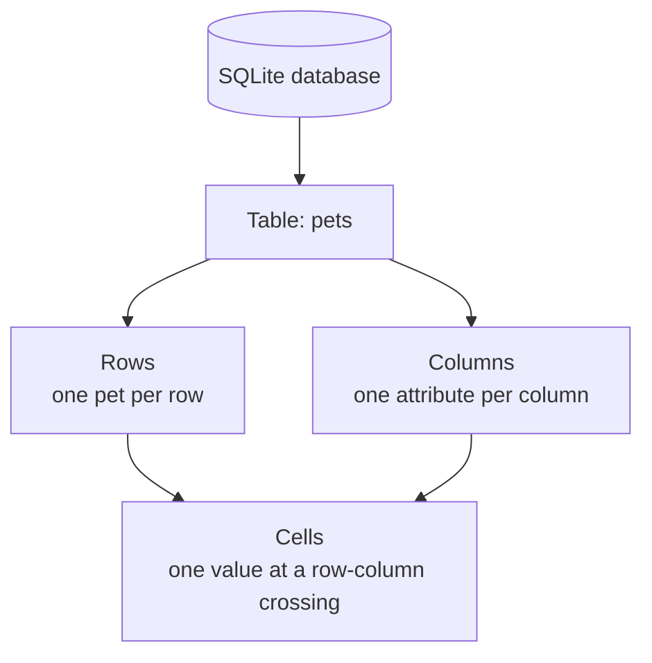
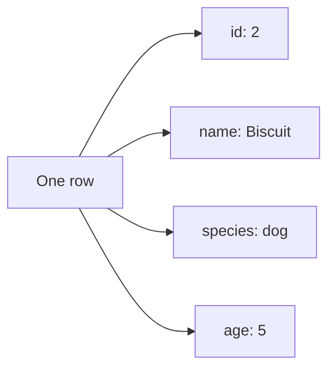
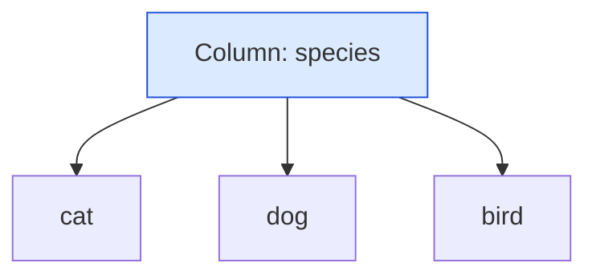
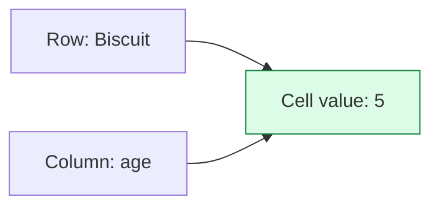
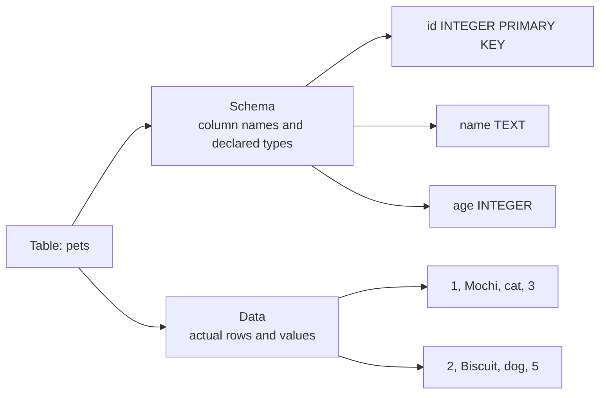
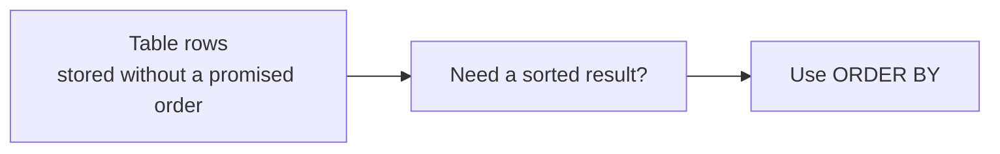

A SQLite database stores information in **tables**. A table looks a lot like a spreadsheet grid, but it has a stronger purpose: it stores facts about **one kind of thing** in a predictable structure.

If tables, rows, and columns make sense, the rest of SQL starts to feel much less mysterious.

## The big picture



A **table** is a named grid. Each table has:

- **Rows**: individual records, running left to right.
- **Columns**: named attributes, running top to bottom.
- **Cells**: the values where a row and a column meet.
- **A schema**: the table's structure, such as column names and declared types.
- **Data**: the actual values stored in the rows.

## A table is a grid of facts

Here is a small `pets` table:

| id | name | species | age |
| --- | --- | --- | --- |
| 1 | Mochi | cat | 3 |
| 2 | Biscuit | dog | 5 |
| 3 | Sunny | bird | 1 |

Read one row as a sentence:

> Pet `1` is named `Mochi`, has species `cat`, and is age `3`.

That sentence works because the table is organized around one kind of thing: pets.

## Rows are records

A **row** is one complete record. In the `pets` table, one row means one pet.



Rows answer the question: **which one?**

- Which pet? Mochi.
- Which pet? Biscuit.
- Which pet? Sunny.

A row should describe one specific thing, event, or fact.

## Columns are fields or attributes

A **column** is one attribute that every row can have. In the `pets` table, `name` is a column and `age` is a column.



Columns answer the question: **what about it?**

- What is the pet's name?
- What species is the pet?
- What age is the pet?

A column should hold one kind of value. Do not put ages in the `name` column or names in the `age` column.

<MultipleChoice
  markdown={`In a table called \`books\`, what should one row most naturally represent?

- A column heading like \`title\`.
  > A heading names an attribute; it is not a complete record.
- [o] One specific book, with values such as title, author, and page count.
  > A row is one complete record about the kind of thing the table stores.
- Every book title joined into one long piece of text.
  > A table stores separate records, not one giant combined value.
- The database file itself.
  > The database can contain many tables; a row is much smaller than the whole database.`}
/>

## Cells are single values

A **cell** is the value at one row-column crossing.



The cell shown above means: Biscuit's age is `5`.

A cell should usually hold one value, not a list of values. For example, store `cat`, not `cat, dog, bird` in one cell.

## Schema versus data

A table has both **structure** and **contents**.



The **schema** says what shape the table has. The **data** is what fills that shape.

For `pets`, the schema might say:

| Column | Declared type | Meaning |
| --- | --- | --- |
| `id` | `INTEGER PRIMARY KEY` | Unique identifier for each pet |
| `name` | `TEXT` | Pet's name |
| `species` | `TEXT` | Kind of animal |
| `age` | `INTEGER` | Age in whole years |

The rows are the data:

| id | name | species | age |
| --- | --- | --- | --- |
| 1 | Mochi | cat | 3 |
| 2 | Biscuit | dog | 5 |
| 3 | Sunny | bird | 1 |

## Row order is not guaranteed

A table is not a numbered list. SQLite may return rows in any order unless you ask for an order.



When order matters, use `ORDER BY`. Otherwise, do not assume the first row you see will always appear first.

## See it in SQLite

Run this example and connect each result part to the words you learned: table, row, column, and cell.

<SqlCodeBlock
  dialect="sqlite"
  title="Create and read a simple table"
  initSql={`CREATE TABLE pets (
  id INTEGER PRIMARY KEY,
  name TEXT,
  species TEXT,
  age INTEGER
);

INSERT INTO pets (name, species, age) VALUES
  ('Mochi', 'cat', 3),
  ('Biscuit', 'dog', 5),
  ('Sunny', 'bird', 1);`}
  starterCode={`SELECT
  id,
  name,
  species,
  age
FROM
  pets
ORDER BY
  id;`}
/>

Try changing the query to:

```sql
SELECT name, species
FROM pets;
```

That asks SQLite for two columns instead of all four.

## Check your understanding

<MultipleChoice
  markdown={`Which statement best describes a **table**?

- A single value, like \`'Mochi'\`.
  > A single value is a cell, not a whole table.
- [o] A named grid of rows and columns that stores facts about one kind of thing.
  > A table organizes related records using a shared structure.
- A command that always changes data.
  > SQL commands can read or change data, but a table is where data is stored.
- A guarantee that rows are sorted alphabetically.
  > Tables do not guarantee row order by themselves.`}
/>

<MultipleChoice
  markdown={`In the \`pets\` table, what is the column \`species\`?

- One specific pet.
  > One specific pet is a row.
- [o] An attribute that can be recorded for every pet row.
  > A column is one named attribute shared by the rows in the table.
- The whole database.
  > A database can contain many tables; a column is only one part of one table.
- The order in which rows are displayed.
  > Display order is controlled with queries such as \`ORDER BY\`.`}
/>

<MultipleChoice
  markdown={`What is the difference between a table's **schema** and its **data**?

- The schema is the first row, and the data is every row after it.
  > Column headings are not stored as the first data row.
- [o] The schema is the structure; the data is the actual stored values.
  > Schema describes columns and declared types, while data is the rows inside that structure.
- The schema is only for text values, and the data is only for numbers.
  > Both text and numbers can appear in data, and schema can describe many kinds of columns.
- There is no difference in SQLite.
  > SQLite tables still have structure and contents, even though SQLite has flexible typing.`}
/>

<MultipleChoice
  markdown={`If you need rows returned from oldest pet to youngest pet, what should you do?

- Trust SQLite to return rows in the order you inserted them.
  > Without an explicit sort, row order is not guaranteed.
- Put the age inside the table name.
  > A table name does not sort rows.
- [o] Use an \`ORDER BY\` clause on the age column.
  > \`ORDER BY\` is how you request a specific result order.
- Store all pets in one cell.
  > Combining records into one cell destroys the row structure.`}
/>
