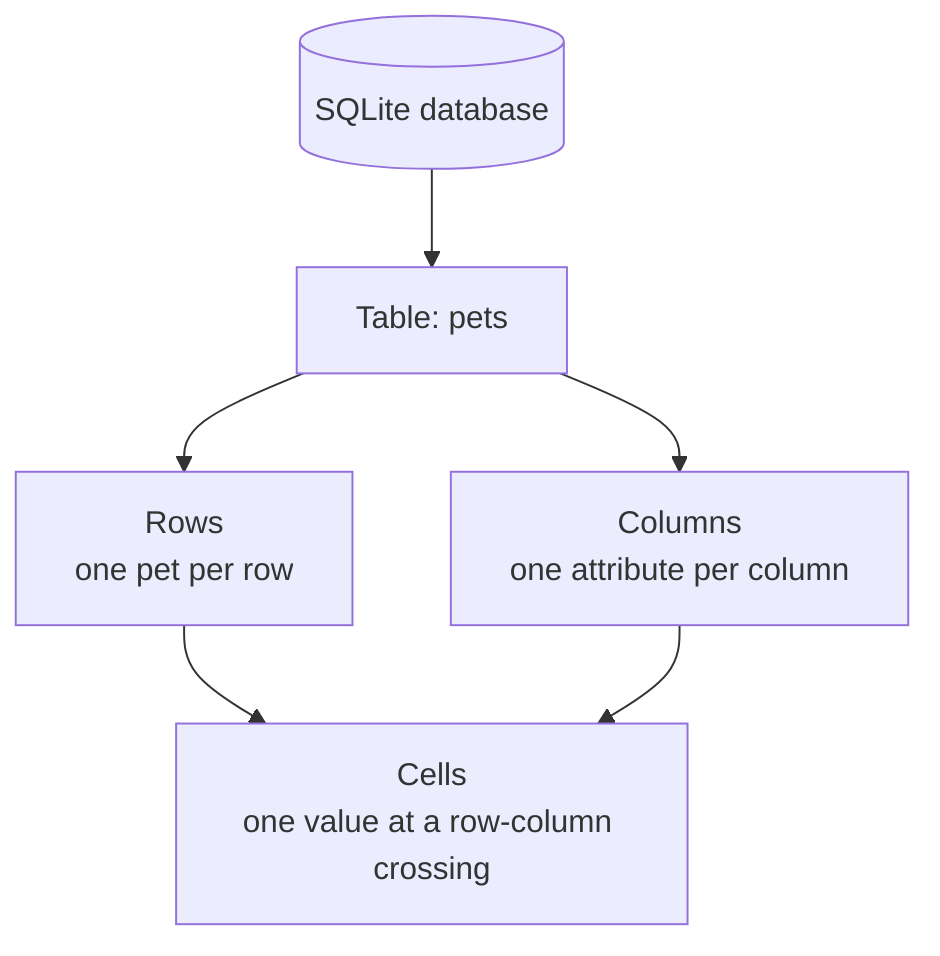
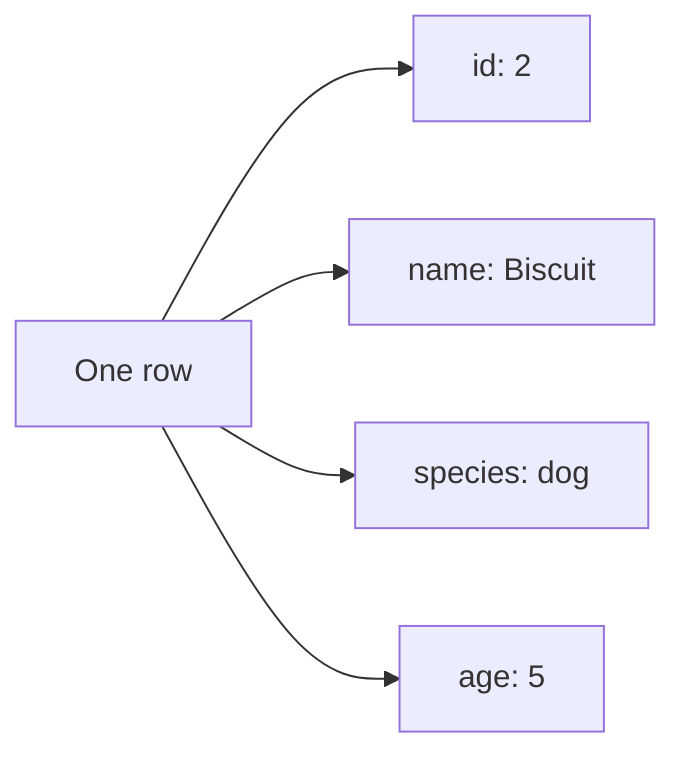
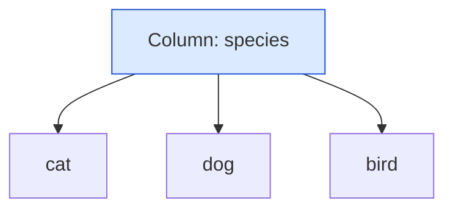
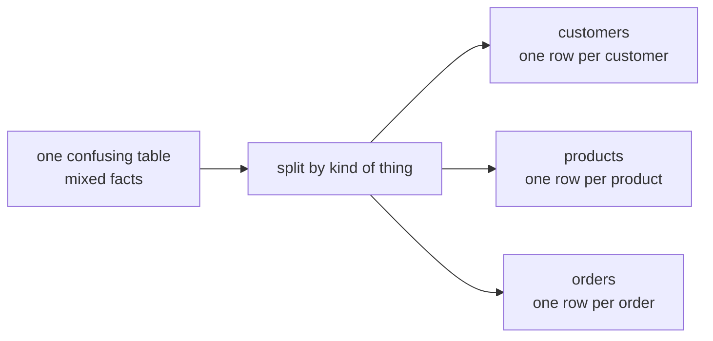
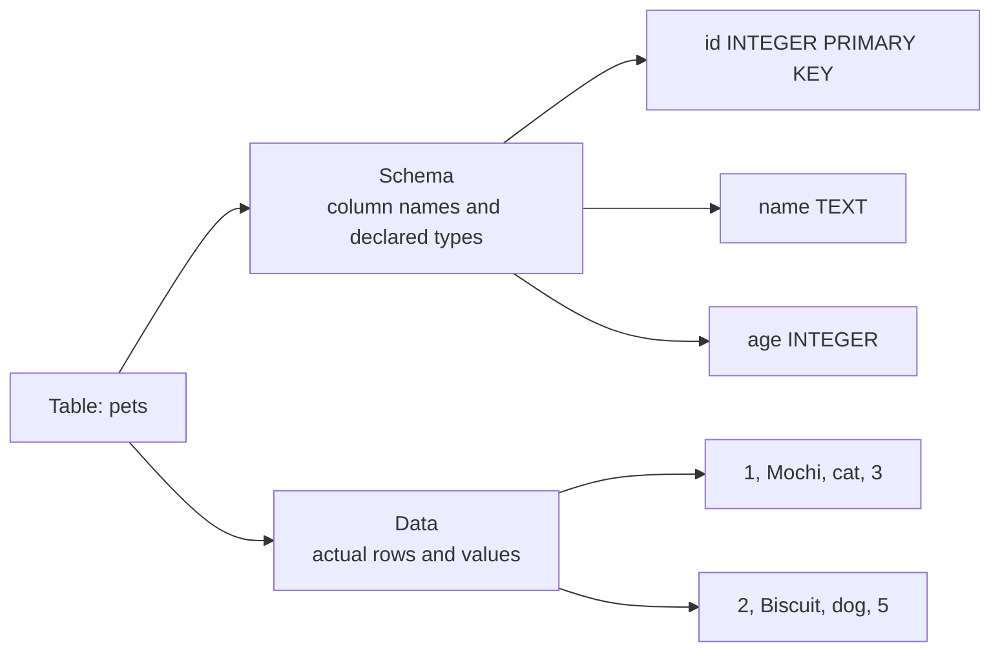
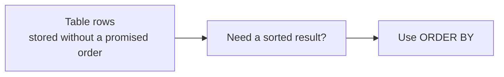

A SQLite database stores information in **tables**. A table looks
a lot like a spreadsheet grid, but it has a stronger purpose: it
stores facts about **one kind of thing** in a predictable
structure. If tables, rows, and columns make sense, the rest of
SQL starts to feel much less mysterious — every query you will
ever write is just a way of asking questions about this grid.

## The big picture

A **table** is a named grid. Each table has:

- **Rows**: individual records, running left to right.
- **Columns**: named attributes, running top to bottom.
- **Cells**: the values where a row and a column meet.
- **A schema**: the table's structure, such as column names and declared types.
- **Data**: the actual values stored in the rows.

## A table is a grid of facts

Here is a small `pets` table:

| id | name | species | age |
| --- | --- | --- | --- |
| 1 | Mochi | cat | 3 |
| 2 | Biscuit | dog | 5 |
| 3 | Sunny | bird | 1 |

Read one row as a sentence:

> Pet `1` is named `Mochi`, has species `cat`, and is age `3`.

That sentence works because the table is organized around one kind
of thing: pets.

<svg
  viewBox="0 0 640 230"
  role="img"
  aria-label="One row slides out of a soft grid like a tray, and a speech bubble above repeats its four values in order — a single row is one complete record that reads like a sentence about one pet"
  style={{ display: "block", width: "100%", maxWidth: "560px", height: "auto", margin: "2.5rem auto" }}
>
  <g fill="currentColor" opacity="0.09">
    <rect x="100" y="86" width="64" height="34" rx="5" />
    <rect x="170" y="86" width="110" height="34" rx="5" />
    <rect x="286" y="86" width="86" height="34" rx="5" />
    <rect x="378" y="86" width="64" height="34" rx="5" />
    <rect x="100" y="168" width="64" height="34" rx="5" />
    <rect x="170" y="168" width="110" height="34" rx="5" />
    <rect x="286" y="168" width="86" height="34" rx="5" />
    <rect x="378" y="168" width="64" height="34" rx="5" />
  </g>
  <g fill="currentColor" opacity="0.16">
    <rect x="132" y="127" width="64" height="34" rx="5" />
    <rect x="202" y="127" width="110" height="34" rx="5" />
    <rect x="318" y="127" width="86" height="34" rx="5" />
    <rect x="410" y="127" width="64" height="34" rx="5" />
    <path d="M 484 136 L 504 144 L 484 152 Z" />
  </g>
  <g style={{ color: "var(--ds-blue-500)" }} fill="currentColor">
    <circle cx="164" cy="144" r="9" />
  </g>
  <g style={{ color: "var(--ds-green-500)" }} fill="currentColor">
    <rect x="222" y="138" width="70" height="12" rx="6" />
  </g>
  <g style={{ color: "var(--ds-yellow-500)" }} fill="currentColor">
    <circle cx="361" cy="144" r="9" />
  </g>
  <g style={{ color: "var(--ds-red-500)" }} fill="currentColor">
    <circle cx="442" cy="144" r="9" />
  </g>
  <g fill="currentColor" opacity="0.12">
    <path d="M 150 18 Q 150 8 160 8 L 480 8 Q 490 8 490 18 L 490 52 Q 490 62 480 62 L 250 62 L 226 80 L 232 62 L 160 62 Q 150 62 150 52 Z" />
  </g>
  <g style={{ color: "var(--ds-blue-500)" }} fill="currentColor">
    <circle cx="186" cy="35" r="7" />
  </g>
  <g style={{ color: "var(--ds-green-500)" }} fill="currentColor">
    <rect x="208" y="30" width="56" height="10" rx="5" />
  </g>
  <g style={{ color: "var(--ds-yellow-500)" }} fill="currentColor">
    <circle cx="292" cy="35" r="7" />
  </g>
  <g style={{ color: "var(--ds-red-500)" }} fill="currentColor">
    <circle cx="322" cy="35" r="7" />
  </g>
  <g fill="currentColor" opacity="0.35">
    <circle cx="352" cy="42" r="2.5" />
  </g>
</svg>

## Rows are records

A **row** is one complete record. In the `pets` table, one row
means one pet.

Rows answer the question: **which one?** Which pet? Mochi. Which
pet? Biscuit. A row should describe one specific thing, event, or
fact — never a pile of several.

## Columns are attributes

A **column** is one attribute that every row can have. In the
`pets` table, `name` is a column and `age` is a column.

Columns answer the question: **what about it?** What is the pet's
name? What species? What age?

A column should hold one kind of value, and a cell — the crossing
of one row and one column — should usually hold exactly one value.
Store `cat`, not `cat, dog, bird`, in a single cell. A column
named `misc` that holds phone numbers, dates, and notes is a
warning sign that the table has lost track of what it is about.

<MultipleChoice
  markdown={`In a table called \`books\`, what should one row most naturally represent?

- A column heading like \`title\`.
  > A heading names an attribute; it is not a complete record.
- [o] One specific book, with values such as title, author, and page count.
  > A row is one complete record about the kind of thing the table stores.
- Every book title joined into one long piece of text.
  > A table stores separate records, not one giant combined value.
- The database file itself.
  > The database can contain many tables; a row is much smaller than the whole database.`}
/>

## The grain: what does one row mean?

Here is the single most useful question in all of database design,
and it costs nothing to ask:

> **Each row in this table is one *what*?**

The answer is called the table's **grain**. A well-shaped table
has a grain you can say out loud in one breath:

| Table | Grain sentence |
| --- | --- |
| `students` | Each row is one student. |
| `orders` | Each row is one order. |
| `products` | Each row is one product. |

If you cannot finish the sentence — or the honest answer is
"sometimes a customer, sometimes an order, sometimes a note" —
the table is trying to store too many kinds of facts at once.
Watch what that looks like:

| product_name | product_price | customer_name | customer_phone | order_date |
| --- | --- | --- | --- | --- |
| Notebook | 3.50 | Ada | 555-0101 | 2026-02-01 |
| Notebook | 3.50 | Ada | 555-0101 | 2026-02-10 |

Is one row a product? A customer? An order? It is a little of
each, and the cost shows immediately: the notebook's price and
Ada's phone number are copied into both rows. When Ada's number
changes, someone must find and fix every copy — miss one, and the
table disagrees with itself. The cure is to give each kind of
thing its own table and connect them, which is exactly where this
course is heading over the next few pages.

<MultipleChoice
  markdown={`What does the **grain** of a table describe?

- The color used to display the table.
  > Grain is about meaning, not visual style.
- [o] What one row in the table represents.
  > Grain answers the question, "Each row is one what?"
- The number of columns in the table.
  > Column count is part of structure, but grain is the row-level meaning.
- Whether the table is stored on disk or in memory.
  > Storage location is separate from the table's grain.`}
/>

## Schema versus data

A table has both **structure** and **contents**.

The **schema** says what shape the table has. The **data** is what
fills that shape. For `pets`, the schema might say:

| Column | Declared type | Meaning |
| --- | --- | --- |
| `id` | `INTEGER PRIMARY KEY` | Unique identifier for each pet |
| `name` | `TEXT` | Pet's name |
| `species` | `TEXT` | Kind of animal |
| `age` | `INTEGER` | Age in whole years |

The schema is a promise about the future: every row that ever
lands in this table will have these named slots. That promise is
what lets one query reason about a million rows at once.

## Row order is not guaranteed

A table is not a numbered list. SQLite may return rows in any
order unless you ask for an order.

When order matters, use `ORDER BY`. Otherwise, do not assume the
first row you see will always appear first.

## See it in SQLite

Run this example and connect each result part to the words you
learned: table, row, column, cell — and notice the grain: each row
is one pet.

<SqlCodeBlock
  dialect="sqlite"
  title="Create and read a simple table"
  initSql={`CREATE TABLE pets (
  id INTEGER PRIMARY KEY,
  name TEXT,
  species TEXT,
  age INTEGER
);

INSERT INTO pets (name, species, age) VALUES
  ('Mochi', 'cat', 3),
  ('Biscuit', 'dog', 5),
  ('Sunny', 'bird', 1);`}
  starterCode={`SELECT
  id,
  name,
  species,
  age
FROM
  pets
ORDER BY
  id;`}
/>

Try changing the query to `SELECT name, species FROM pets;` — that
asks SQLite for two columns instead of all four. The stored table
does not change; you are simply choosing which attributes to look
at.

## Check your understanding

<MultipleChoice
  markdown={`Which statement best describes a **table**?

- A single value, like \`'Mochi'\`.
  > A single value is a cell, not a whole table.
- [o] A named grid of rows and columns that stores facts about one kind of thing.
  > A table organizes related records using a shared structure.
- A command that always changes data.
  > SQL commands can read or change data, but a table is where data is stored.
- A guarantee that rows are sorted alphabetically.
  > Tables do not guarantee row order by themselves.`}
/>

<MultipleChoice
  markdown={`What is the difference between a table's **schema** and its **data**?

- The schema is the first row, and the data is every row after it.
  > Column headings are not stored as the first data row.
- [o] The schema is the structure; the data is the actual stored values.
  > Schema describes columns and declared types, while data is the rows inside that structure.
- The schema is only for text values, and the data is only for numbers.
  > Both text and numbers can appear in data, and schema can describe many kinds of columns.
- There is no difference in SQLite.
  > SQLite tables still have structure and contents, even though SQLite has flexible typing.`}
/>

<MultipleChoice
  markdown={`A table named \`orders\` turns out to have one row for each order *item*, not each order. What should you notice first?

- The table automatically becomes invalid SQLite.
  > SQLite can store the table; the issue is whether people understand what one row means.
- [o] The table's grain is different from what its name suggests, and queries must account for that.
  > Knowing what one row represents prevents wrong assumptions and wrong counts.
- The table cannot contain numbers.
  > Row grain does not determine whether numbers can be stored.
- Every row must be deleted.
  > The data may be useful; the issue is understanding or redesigning the structure.`}
/>

<MultipleChoice
  markdown={`What is a good sign that a table may need to be split?

- Every row has the same columns.
  > Shared columns are normal for a table.
- [o] The same customer phone number is copied into many order rows.
  > Repeated facts often belong in their own table and should be referenced instead of copied.
- The table has a primary key.
  > A primary key is usually a good thing.
- The table stores one kind of thing.
  > One kind of thing is the goal, not a warning sign.`}
/>

Next: if two rows can look identical — two customers named John
Smith in Springfield — how does the database tell them apart? That
is the job of the **primary key**.
