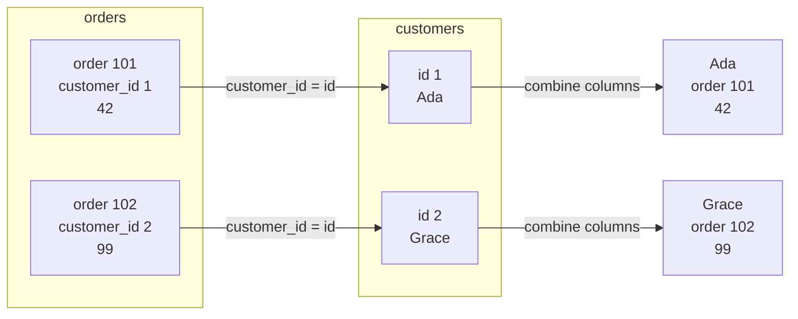
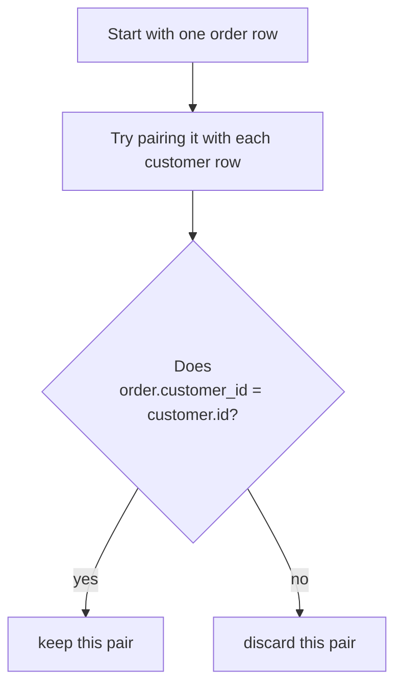
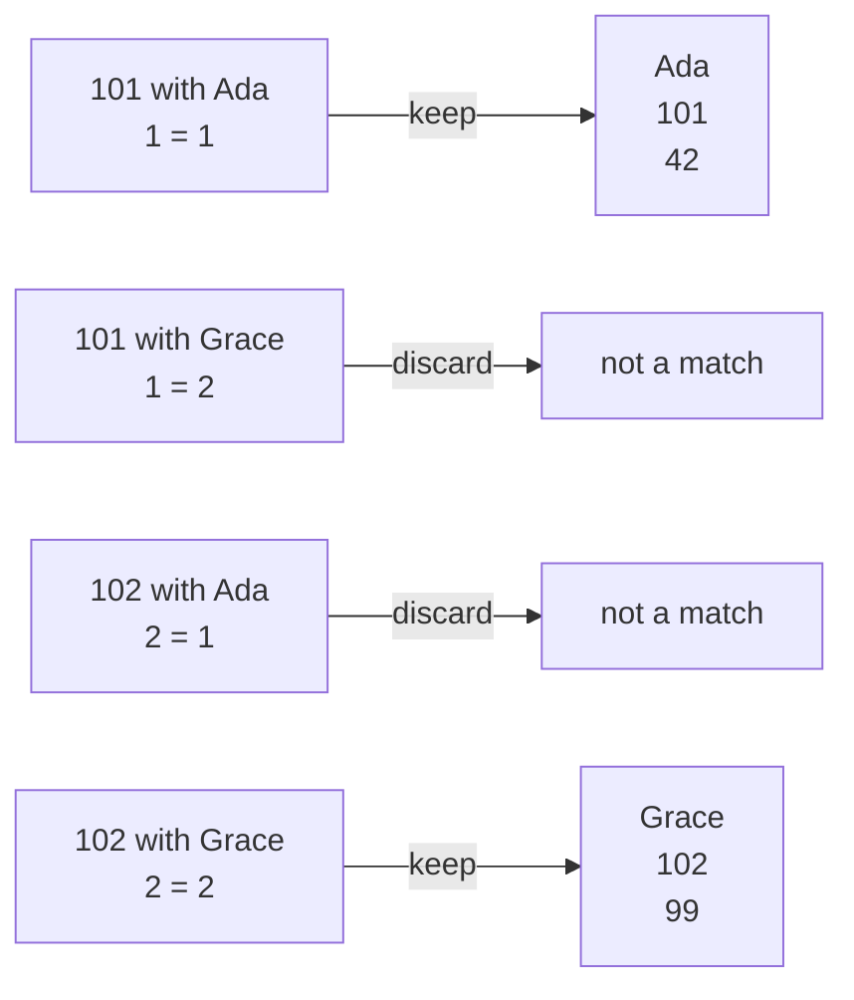
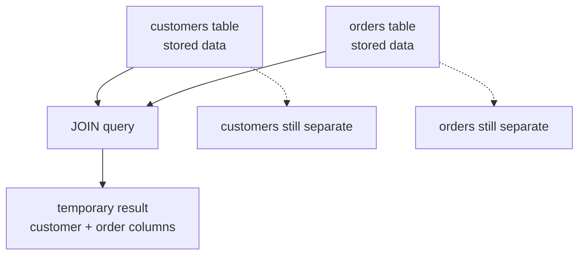
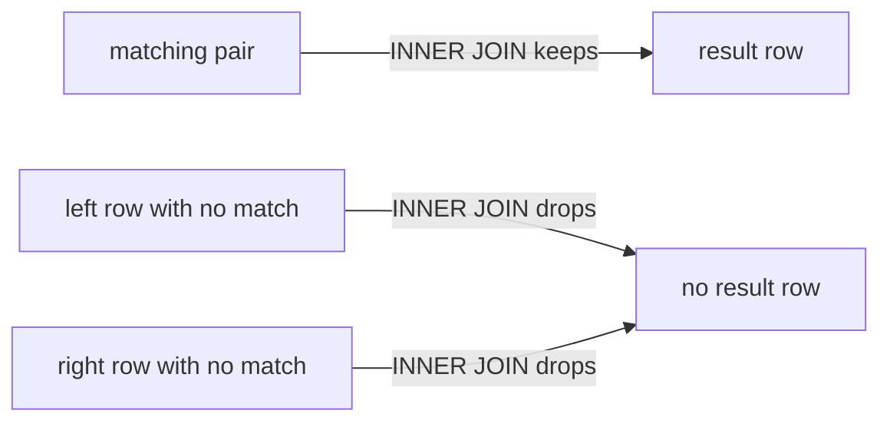

A **join** combines rows from two tables into one result. You use it when one table has part of the answer and another table has the rest.

For example, `orders` knows the amount. `customers` knows the name. A join lets you ask: "show each order with the customer's name."

## The basic shape

A join appears in the `FROM` part of a query. The `ON` clause says how rows match.

<SqlCodeBlock
  dialect="sqlite"
  title="Your first SQLite join"
  initSql={`CREATE TABLE customers (
  id INTEGER PRIMARY KEY,
  name TEXT
);
CREATE TABLE orders (
  id INTEGER PRIMARY KEY,
  customer_id INTEGER,
  amount NUMERIC
);
INSERT INTO customers (id, name) VALUES
  (1, 'Ada'),
  (2, 'Grace');
INSERT INTO orders (id, customer_id, amount) VALUES
  (101, 1, 42),
  (102, 2, 99);`}
  starterCode={`SELECT
  orders.id AS order_id,
  customers.name AS customer,
  orders.amount
FROM orders
JOIN customers
  ON orders.customer_id = customers.id;`}
/>

Read the `ON` line as: "match an order to a customer when the order's `customer_id` equals the customer's `id`."

## The row-matching picture

A useful beginner mental model is **cartesian then filter**:

1. Imagine every order paired with every customer.
2. Test each pair with the `ON` condition.
3. Keep only the pairs where the condition is true.

You do not write a loop. SQLite chooses an efficient plan. But conceptually, `ON` is the test that decides which pairings become result rows.

<SqlCodeBlock
  dialect="sqlite"
  title="See all possible pairs before filtering"
  initSql={`CREATE TABLE customers (id INTEGER PRIMARY KEY, name TEXT);
CREATE TABLE orders (id INTEGER PRIMARY KEY, customer_id INTEGER, amount NUMERIC);
INSERT INTO customers (id, name) VALUES (1, 'Ada'), (2, 'Grace'), (3, 'Linus');
INSERT INTO orders (id, customer_id, amount) VALUES (101, 1, 42), (102, 2, 99);`}
  starterCode={`SELECT
  o.id AS order_id,
  o.customer_id,
  c.id AS customer_id,
  c.name
FROM orders o
CROSS JOIN customers c
ORDER BY o.id, c.id;`}
/>

That result shows every possible pairing. A normal join keeps only the rows where the ids line up.

<SqlCodeBlock
  dialect="sqlite"
  title="Now keep only matching pairs"
  initSql={`CREATE TABLE customers (id INTEGER PRIMARY KEY, name TEXT);
CREATE TABLE orders (id INTEGER PRIMARY KEY, customer_id INTEGER, amount NUMERIC);
INSERT INTO customers (id, name) VALUES (1, 'Ada'), (2, 'Grace'), (3, 'Linus');
INSERT INTO orders (id, customer_id, amount) VALUES (101, 1, 42), (102, 2, 99);`}
  starterCode={`SELECT
  o.id AS order_id,
  c.name,
  o.amount
FROM orders o
JOIN customers c ON o.customer_id = c.id
ORDER BY o.id;`}
/>

<MultipleChoice
  markdown={`What is the job of the \`ON\` clause in a join?

- It chooses the final column names only.
  > Column names are chosen in the \`SELECT\` list.
- [o] It states the condition for deciding which rows from the tables match.
  > The \`ON\` clause is the matching rule for row pairings.
- It permanently connects the two tables.
  > A join result is produced by one query; it does not change the table definitions.
- It sorts the final result.
  > Sorting is done with \`ORDER BY\`.

The \`ON\` clause tells SQLite which row combinations belong together.`}
/>

## Table aliases make joins readable

Aliases are short names you give tables inside one query. They make joined queries easier to read.

<SqlCodeBlock
  dialect="sqlite"
  title="The same join with aliases"
  initSql={`CREATE TABLE customers (id INTEGER PRIMARY KEY, name TEXT);
CREATE TABLE orders (id INTEGER PRIMARY KEY, customer_id INTEGER, amount NUMERIC);
INSERT INTO customers (id, name) VALUES (1, 'Ada'), (2, 'Grace');
INSERT INTO orders (id, customer_id, amount) VALUES (101, 1, 42), (102, 2, 99);`}
  starterCode={`SELECT o.id AS order_id, c.name AS customer, o.amount
FROM orders o
JOIN customers c ON o.customer_id = c.id
ORDER BY o.id;`}
/>

`orders o` means "use `o` as a short name for `orders` in this query." Prefixes also solve ambiguity: both tables may have a column named `id`, so `o.id` and `c.id` say exactly which one you mean.

## Joins do not change your stored tables

A join creates a result table for the query. The original tables stay separate.

<SqlCodeBlock
  dialect="sqlite"
  title="A join result is just the answer"
  initSql={`CREATE TABLE customers (id INTEGER PRIMARY KEY, name TEXT);
CREATE TABLE orders (id INTEGER PRIMARY KEY, customer_id INTEGER, amount NUMERIC);
INSERT INTO customers (id, name) VALUES (1, 'Ada'), (2, 'Grace');
INSERT INTO orders (id, customer_id, amount) VALUES (101, 1, 42), (102, 2, 99), (103, 1, 18);`}
  starterCode={`SELECT c.name, COUNT(o.id) AS order_count
FROM customers c
JOIN orders o ON o.customer_id = c.id
GROUP BY c.id, c.name
ORDER BY c.name;`}
/>

## What if a row has no match?

The kind of join determines what happens. A regular `JOIN` is an inner join: it keeps only matches. Later, a `LEFT JOIN` will keep unmatched rows from one side too.

<MultipleChoice
  markdown={`A join query returns a combined result. What happens to the original tables?

- They are merged permanently.
  > A \`SELECT\` join does not rewrite your stored tables.
- [o] They stay separate; the join result exists as the query's answer.
  > Joins combine data for the result without changing the source tables.
- The right table is deleted.
  > A join reads tables; it does not delete them.
- The primary keys are removed.
  > Keys in the source tables remain as defined.

A join is a way to read related data, not a table-merging operation.`}
/>

## Check your understanding

<MultipleChoice
  markdown={`What does a join do?

- It stacks two tables vertically even when their columns are unrelated.
  > Stacking rows is a different idea; joins match rows side by side.
- [o] It combines rows from tables by matching them with a condition.
  > A join uses a condition such as \`orders.customer_id = customers.id\` to form result rows.
- It turns every text value into a number.
  > Joins are about relationships between rows, not type conversion.
- It creates a primary key automatically.
  > Primary keys are defined in table structure, not by ordinary join queries.

Joins let normalized tables be recombined for questions.`}
/>

<MultipleChoice
  markdown={`In \`FROM orders o JOIN customers c ON o.customer_id = c.id\`, what are \`o\` and \`c\`?

- Permanent new table names.
  > Aliases last only for this query.
- [o] Short aliases for the two tables inside this query.
  > Aliases make column references shorter and clearer.
- Column values copied from the database.
  > They are names used in the SQL text, not stored values.
- Required SQLite keywords.
  > You choose alias names yourself.

Aliases are temporary nicknames for tables in a query.`}
/>

<MultipleChoice
  markdown={`Which condition correctly matches orders to their customers?

- \`orders.id = customers.id\`
  > The order's id identifies the order, not the customer it belongs to.
- [o] \`orders.customer_id = customers.id\`
  > The foreign key in orders should match the primary key in customers.
- \`orders.amount = customers.id\`
  > An order amount is not a customer identity.
- \`orders.customer_id = customers.name\`
  > The foreign key stores an id value, not the customer's name.

The usual match is foreign key equals primary key.`}
/>

<MultipleChoice
  markdown={`Why is "cartesian then filter" a helpful mental model?

- It means you should always write \`CROSS JOIN\` in real queries.
  > It is a teaching picture; normal joins usually write the match directly with \`ON\`.
- [o] It shows that SQLite considers possible row pairings and keeps the ones where the \`ON\` condition is true.
  > The model makes the matching process visible.
- It proves joins can only use two-row tables.
  > Joins work on tables of many sizes.
- It replaces the need for foreign keys.
  > Foreign keys describe relationships; joins query through them.

The mental model helps you predict which pairings become result rows.`}
/>
