A table is more than a grid. A good table is a clear statement:

> Each row in this table is one kind of thing.

That sentence is one of the most important habits in database design. Before you worry about SQL syntax, learn to ask: **what does one row mean?**

## One table, one kind of thing

A well-shaped table stores facts about one kind of thing: one customer, one pet, one book, one order, one city.

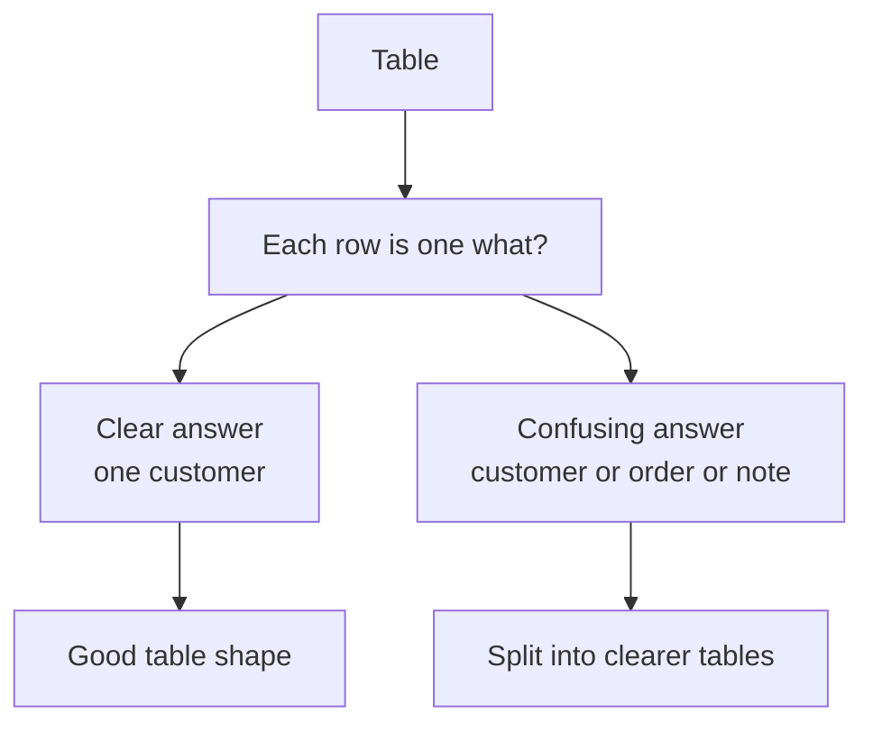

For example, a `students` table should have one row per student:

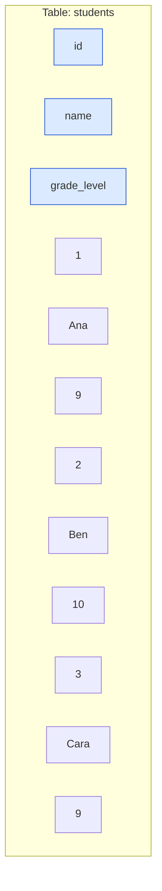

Every row answers: **which student?**

## The grain of a table

The **grain** of a table means what one row represents.

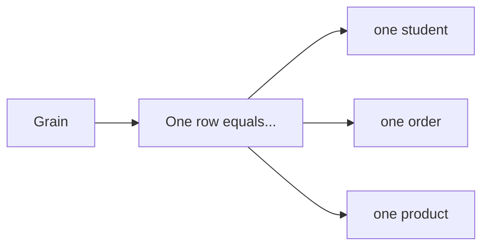

A table's grain should be easy to say out loud:

| Table | Good grain sentence |
| --- | --- |
| `students` | Each row is one student. |
| `orders` | Each row is one order. |
| `products` | Each row is one product. |
| `cities` | Each row is one city. |

If you cannot finish the sentence, the table may be trying to store too many kinds of facts.

<MultipleChoice
  markdown={`What does the **grain** of a table describe?

- The color used to display the table.
  > Grain is about meaning, not visual style.
- [o] What one row in the table represents.
  > Grain answers the question, "Each row is one what?"
- The number of columns in the table.
  > Column count is part of structure, but grain is the row-level meaning.
- Whether the table is stored on disk or in memory.
  > Storage location is separate from the table's grain.`}
/>

## A good single-purpose table

Here is a focused `products` table. Every row is one product. Every column describes that product.

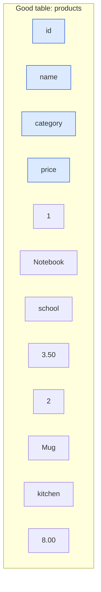

This table is easy to understand because the columns all fit the same subject.

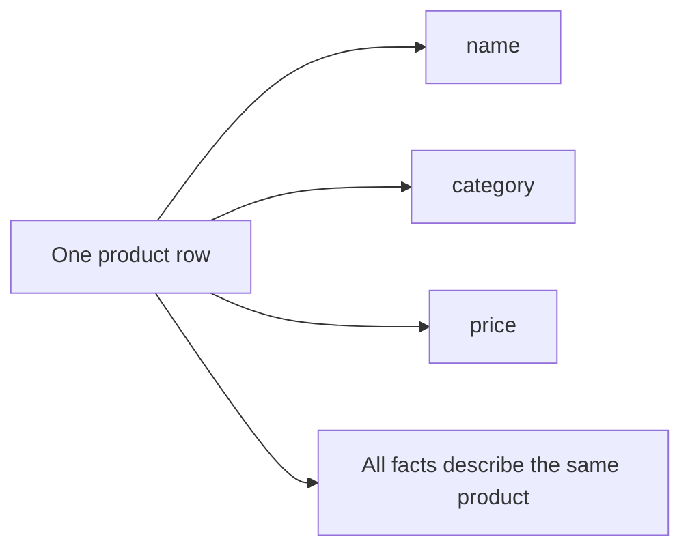

## A messy mixed table

Now compare that with a table that mixes products, customers, and order facts into one place.

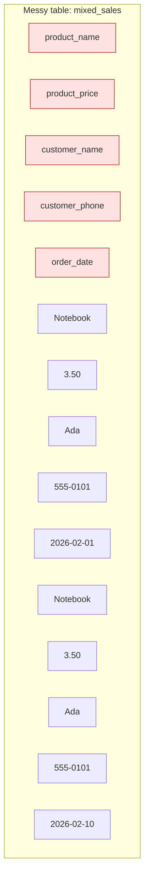

This table has problems:

- Product facts repeat when the same product is ordered again.
- Customer facts repeat when the same customer places another order.
- Updating Ada's phone number might require changing many rows.
- One row is not clearly one thing. Is it a product, a customer, or an order?

## Split mixed facts into clearer tables

A better design gives each kind of thing its own table.

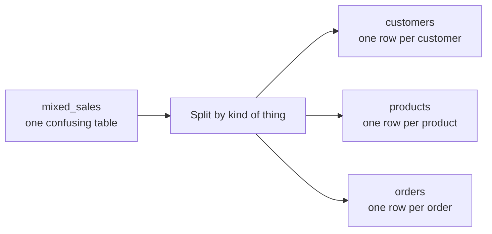

In a relational database, related tables can still work together. You do not lose the connection; you make the connection cleaner.

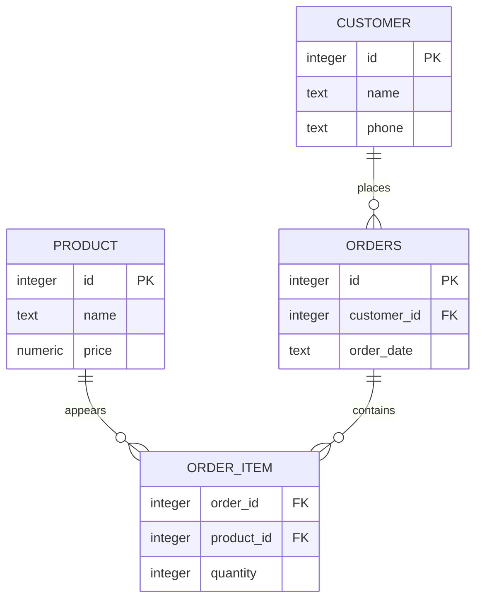

You will learn these relationship patterns later. For now, focus on the modeling habit: keep one kind of thing in one table.

## Columns should hold one kind of value

A column should have a clear meaning. If the column is called `price`, every value should be a price. If the column is called `email`, every value should be an email address or empty when unknown.

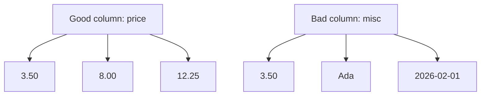

A column like `misc` is a warning sign. It usually means the table's purpose is unclear.

<MultipleChoice
  markdown={`Which column design is usually clearest?

- A \`misc\` column that stores phone numbers, dates, and notes.
  > Mixing unrelated value kinds makes the column hard to query and understand.
- [o] A \`phone\` column that stores one phone number value for each row.
  > One column should have one clear meaning and one kind of value.
- A \`name_and_price\` column that stores both facts together.
  > Combining separate facts makes filtering and sorting harder.
- A column with no name.
  > Columns need names so queries can refer to them clearly.`}
/>

## Rows should hold one entity

A row should describe one entity or event, not a pile of several things.

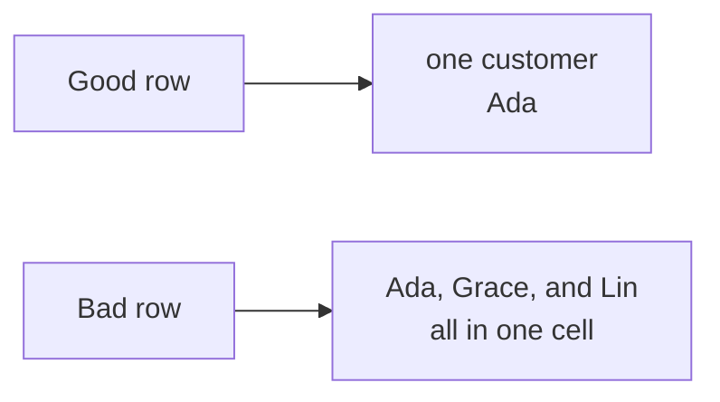

If you find yourself putting several names, several products, or several dates into one cell, pause. That often means you need more rows or another table.

## A quick table-design checklist

Before creating a table, ask:

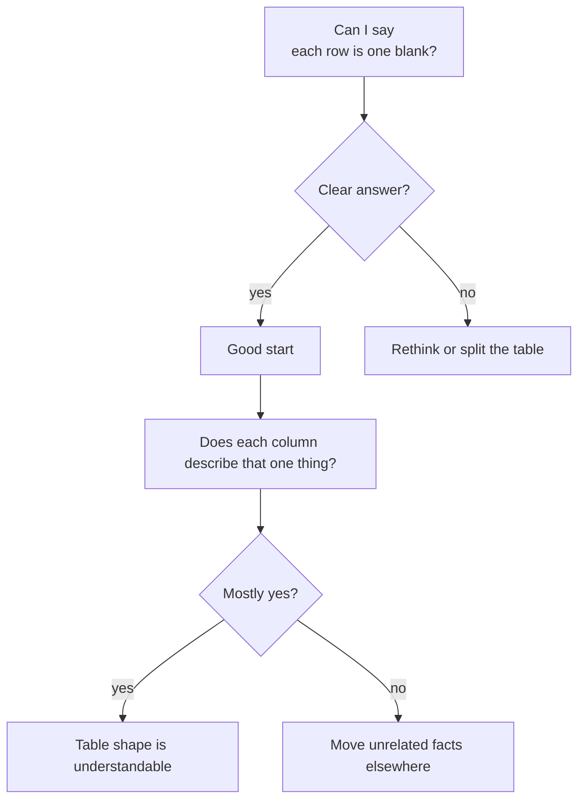

This habit prevents many beginner database problems before they happen.

## Check your understanding

<MultipleChoice
  markdown={`Which table has the clearest purpose?

- \`everything\`, where rows can be customers, products, orders, or notes.
  > A table with many row meanings is hard to query and maintain.
- [o] \`customers\`, where each row is one customer.
  > A clear grain makes the table easier to understand and use.
- \`random_values\`, where each cell can mean anything.
  > Unclear cell meaning makes the data unreliable.
- \`today\`, where the meaning changes every week.
  > A table's purpose should stay stable over time.`}
/>

<MultipleChoice
  markdown={`Why is a mixed table like \`mixed_sales\` often a problem?

- SQLite refuses to create any table with more than two columns.
  > SQLite can create tables with many columns; the problem is meaning and duplication.
- [o] It repeats facts and mixes different kinds of entities in the same row.
  > Mixed tables often duplicate data and make one row's meaning unclear.
- It always runs faster than separate tables.
  > Speed is not the reason to mix unrelated facts, and messy tables can make queries harder.
- It prevents you from storing text.
  > Text can be stored in SQLite; the design problem is unrelated to text storage.`}
/>

<MultipleChoice
  markdown={`A table named \`orders\` has one row for each order item, not each order. What should you notice first?

- The table automatically becomes invalid SQLite.
  > SQLite can store the table; the issue is whether people understand what one row means.
- [o] The table's grain should be stated clearly before writing queries.
  > Understanding what one row represents prevents wrong assumptions.
- The table cannot contain numbers.
  > Row grain does not determine whether numbers can be stored.
- Every row must be deleted.
  > The data may be useful; the issue is understanding or redesigning the structure.`}
/>

<MultipleChoice
  markdown={`What is a good sign that a table may need to be split?

- Every row has the same columns.
  > Shared columns are normal for a table.
- [o] The same customer phone number is copied into many order rows.
  > Repeated facts often belong in their own table and should be referenced instead of copied.
- The table has a primary key.
  > A primary key is usually a good thing.
- The table stores one kind of thing.
  > One kind of thing is the goal, not a warning sign.`}
/>
